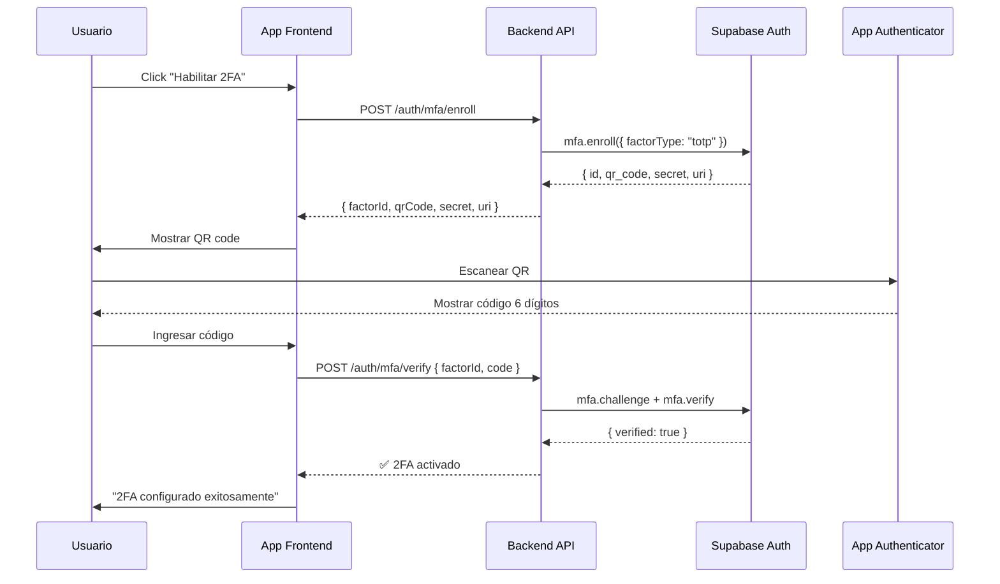
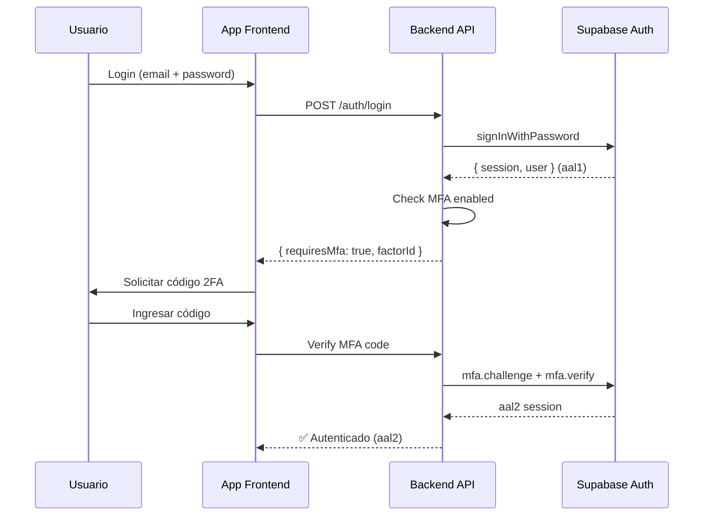

# Walkthrough - Implementación MFA (Multi-Factor Authentication)

**Fecha**: 5 de febrero de 2026  
**Módulo**: Multi-Factor Authentication (2FA)  
**Tipo**: Funcionalidad Bonus

---

## 🎯 Objetivos Completados

### Funcionalidad MFA ✅

1. ✅ Servicio MFA con integración Supabase Auth
2. ✅ Controller con 5 endpoints de 2FA
3. ✅ Soporte TOTP (Time-based One-Time Password)
4. ✅ Enrolamiento y verificación de factores
5. ✅ Gestión de sesiones AAL (Authenticator Assurance Level)
6. ✅ Swagger completamente documentado

---

## 📋 Descripción

El módulo MFA implementa autenticación de dos factores (2FA) usando el estándar TOTP. Los usuarios pueden configurar una app de autenticación (Google Authenticator, Authy, etc.) para añadir una capa adicional de seguridad a sus cuentas.

### Características Principales

- **TOTP Support**: Códigos de 6 dígitos basados en tiempo
- **QR Code Generation**: Generación automática para apps de autenticación
- **Multiple Factors**: Soporte para múltiples factores MFA por usuario
- **AAL Levels**: Tracking de niveles de autenticación (aal1 vs aal2)
- **Factor Management**: Enrolar, verificar y eliminar factores

---

## 📁 Archivos Implementados

### 1. [src/common/services/mfa.service.ts](file:///Users/abner/Documents/dev/sacdia/sacdia-backend/src/common/services/mfa.service.ts)

**Métodos principales**:

#### `enrollMfa(accessToken: string)`

Inicia el proceso de enrolamiento de 2FA.

**Retorna**:

```typescript
{
  factorId: string; // ID único del factor
  qrCode: string; // QR code en base64 para escanear
  secret: string; // Secret para configuración manual
  uri: string; // URI para apps de autenticación
}
```

**Flujo**:

1. Establece sesión con access token
2. Enrola nuevo factor TOTP
3. Genera QR code y secret
4. Retorna datos para configurar app de autenticación

#### `verifyAndActivateMfa(accessToken, factorId, code)`

Verifica el código TOTP y activa 2FA.

**Parámetros**:

- `accessToken`: JWT del usuario
- `factorId`: ID del factor a activar
- `code`: Código TOTP de 6 dígitos

**Flujo**:

1. Crea challenge de verificación
2. Verifica código TOTP
3. Activa factor si el código es válido

#### `listFactors(accessToken: string)`

Obtiene todos los factores MFA configurados.

**Retorna**:

```typescript
[
  {
    id: string;
    friendlyName: string;    // "SACDIA Authenticator"
    factorType: string;      // "totp"
    status: string;          // "verified" | "unverified"
    createdAt: string;
  }
]
```

#### `unenrollFactor(accessToken, factorId)`

Elimina un factor MFA (deshabilita 2FA).

#### `hasMfaEnabled(accessToken: string)`

Verifica si el usuario tiene al menos un factor MFA activo.

#### `getAuthenticatorAssuranceLevel(accessToken)`

Obtiene el nivel de autenticación actual.

**Retorna**:

```typescript
{
  currentLevel: "aal1" | "aal2"; // aal1 = password, aal2 = password + MFA
  nextLevel: "aal2" | null;
}
```

---

### 2. [src/auth/mfa.controller.ts](file:///Users/abner/Documents/dev/sacdia/sacdia-backend/src/auth/mfa.controller.ts)

**Endpoints implementados**:

| Método | Ruta                 | Auth | Descripción                 |
| ------ | -------------------- | ---- | --------------------------- |
| POST   | `/auth/mfa/enroll`   | ✅   | Iniciar enrolamiento de 2FA |
| POST   | `/auth/mfa/verify`   | ✅   | Verificar y activar 2FA     |
| GET    | `/auth/mfa/factors`  | ✅   | Listar factores MFA         |
| DELETE | `/auth/mfa/unenroll` | ✅   | Deshabilitar 2FA            |
| GET    | `/auth/mfa/status`   | ✅   | Verificar estado de 2FA     |

**Todos los endpoints requieren autenticación JWT** (`@UseGuards(JwtAuthGuard)`)

---

### 3. [src/auth/dto/mfa.dto.ts](file:///Users/abner/Documents/dev/sacdia/sacdia-backend/src/auth/dto/mfa.dto.ts)

**DTOs definidos**:

#### `VerifyMfaDto`

```typescript
{
  factorId: string; // ID del factor a verificar
  code: string; // Código TOTP de 6 dígitos
}
```

**Validaciones**:

- `code`: Must be exactly 6 digits

#### `UnenrollMfaDto`

```typescript
{
  factorId: string; // ID del factor a eliminar
}
```

---

## 🔄 Flujo de Trabajo

### 1. Configurar 2FA (Primera vez)



### 2. Login con 2FA Habilitado



---

## 🧪 Ejemplos de Uso

### 1. Enrolar 2FA

**Request**:

```bash
curl -X POST http://localhost:3000/auth/mfa/enroll \
  -H "Authorization: Bearer <access-token>" \
  -H "Content-Type: application/json"
```

**Response**:

```json
{
  "factorId": "a1b2c3d4-e5f6-7890-abcd-ef1234567890",
  "qrCode": "data:image/svg+xml;base64,...",
  "secret": "JBSWY3DPEHPK3PXP",
  "uri": "otpauth://totp/SACDIA:user@example.com?secret=JBSWY3DPEHPK3PXP&issuer=SACDIA"
}
```

**Uso del QR Code**:

- Mostrar imagen usando `qrCode` (base64)
- O mostrar `secret` para configuración manual
- O usar `uri` para deep link a apps de autenticación

---

### 2. Verificar y Activar 2FA

**Request**:

```bash
curl -X POST http://localhost:3000/auth/mfa/verify \
  -H "Authorization: Bearer <access-token>" \
  -H "Content-Type: application/json" \
  -d '{
    "factorId": "a1b2c3d4-e5f6-7890-abcd-ef1234567890",
    "code": "123456"
  }'
```

**Response (éxito)**:

```json
{
  "verified": true
}
```

**Response (error)**:

```json
{
  "statusCode": 401,
  "message": "Invalid MFA code"
}
```

---

### 3. Listar Factores MFA

**Request**:

```bash
curl -X GET http://localhost:3000/auth/mfa/factors \
  -H "Authorization: Bearer <access-token>"
```

**Response**:

```json
[
  {
    "id": "a1b2c3d4-e5f6-7890-abcd-ef1234567890",
    "friendlyName": "SACDIA Authenticator",
    "factorType": "totp",
    "status": "verified",
    "createdAt": "2026-02-05T12:00:00.000Z"
  }
]
```

---

### 4. Obtener Estado de 2FA

**Request**:

```bash
curl -X GET http://localhost:3000/auth/mfa/status \
  -H "Authorization: Bearer <access-token>"
```

**Response (2FA habilitado)**:

```json
{
  "mfaEnabled": true,
  "currentLevel": "aal2",
  "nextLevel": null,
  "factors": [
    {
      "id": "a1b2c3d4-e5f6-7890-abcd-ef1234567890",
      "friendlyName": "SACDIA Authenticator",
      "factorType": "totp",
      "status": "verified",
      "createdAt": "2026-02-05T12:00:00.000Z"
    }
  ]
}
```

**Response (2FA deshabilitado)**:

```json
{
  "mfaEnabled": false,
  "currentLevel": "aal1",
  "nextLevel": "aal2",
  "factors": []
}
```

---

### 5. Deshabilitar 2FA

**Request**:

```bash
curl -X DELETE http://localhost:3000/auth/mfa/unenroll \
  -H "Authorization: Bearer <access-token>" \
  -H "Content-Type: application/json" \
  -d '{
    "factorId": "a1b2c3d4-e5f6-7890-abcd-ef1234567890"
  }'
```

**Response**:

```json
{
  "success": true,
  "message": "2FA disabled successfully"
}
```

---

## 🔐 Niveles de Autenticación (AAL)

### AAL1 (Authenticator Assurance Level 1)

- Usuario autenticado solo con password
- Acceso básico a la aplicación
- **Nivel actual después de login tradicional**

### AAL2 (Authenticator Assurance Level 2)

- Usuario autenticado con password + MFA
- Máxima seguridad
- **Requerido para operaciones sensibles** (futuro: cambiar email, eliminar cuenta, etc.)

---

## 📊 Estadísticas de Implementación

| Métrica             | Valor                         |
| ------------------- | ----------------------------- |
| **Endpoints**       | 5                             |
| **Métodos Service** | 7                             |
| **DTOs**            | 2                             |
| **Validaciones**    | Automáticas (class-validator) |
| **Integración**     | Supabase Auth MFA API         |
| **Tipo de MFA**     | TOTP (RFC 6238)               |

---

## 🎯 Casos de Uso

### 1. **Configuración Inicial de 2FA**

Usuario nuevo que quiere habilitar 2FA por primera vez.

### 2. **Verificación en Login**

Usuario con 2FA habilitado debe proporcionar código TOTP al iniciar sesión.

### 3. **Gestión de Factores**

Usuario revisa qué dispositivos tienen 2FA configurado.

### 4. **Deshabilitar 2FA**

Usuario desea desactivar temporalmente la autenticación de dos factores.

### 5. **Recuperación de Cuenta**

Usuario pierde acceso a su app de autenticación (requiere soporte manual).

---

## ⚠️ Consideraciones Importantes

### Seguridad

1. **Recovery Codes**: ⚠️ Implementar códigos de recuperación backup
2. **Factor Limit**: Supabase permite múltiples factores, pero UI debería limitar a 1-2
3. **Session Elevation**: Considerar requerir AAL2 para operaciones críticas
4. **Backup Methods**: SMS o email backup no implementado actualmente

### UX

1. **QR Code Display**: Mostrar QR prominentemente
2. **Manual Entry**: Siempre mostrar `secret` para entrada manual
3. **Verification Attempts**: Supabase rate-limita intentos fallidos
4. **Time Sync**: TOTP depende de sincronización de reloj del dispositivo

### Limitaciones Actuales

- ❌ No hay códigos de recuperación backup
- ❌ Solo TOTP (no SMS, no email)
- ❌ No hay forced MFA para ciertos roles
- ❌ No hay step-up authentication (requerir AAL2 para ciertas acciones)

---

## 🚀 Mejoras Futuras

1. **Recovery Codes** - Generar 10 códigos de un solo uso como backup
2. **SMS Backup** - Segundo factor vía SMS (requiere Twilio/similar)
3. **Forced MFA** - Requerir MFA para roles admin
4. **Step-up Auth** - Requerir AAL2 para acciones sensibles
5. **Remember Device** - Opción para recordar dispositivo por 30 días
6. **Audit Log** - Registrar todos los eventos de MFA

---

## 📖 Swagger Documentation

**Base Path**: `/auth/mfa`  
**Tag**: `auth`

Todos los endpoints están completamente documentados en Swagger:

- Request schemas
- Response schemas
- Error codes
- Bearer token requirements

**Acceder**: http://localhost:3000/api#/auth

---

## ✅ Checklist de Implementación

### Core Functionality

- [x] MFA Service con integración Supabase
- [x] TOTP enrollment endpoint
- [x] TOTP verification endpoint
- [x] List factors endpoint
- [x] Unenroll endpoint
- [x] Status endpoint
- [x] DTOs con validaciones
- [x] Swagger documentation
- [x] AuthGuard en todos los endpoints

### Security

- [x] JWT validation
- [x] AAL level tracking
- [x] Factor ID validation
- [ ] Recovery codes (futuro)
- [ ] Rate limiting (futuro)

---

**Status**: ✅ **COMPLETADO E IMPLEMENTADO**

El módulo MFA está completamente funcional y listo para:

- Enrolar nuevos factores TOTP
- Verificar códigos de autenticación
- Gestionar múltiples factores
- Rastrear niveles de autenticación (AAL1/AAL2)
- Deshabilitar 2FA cuando sea necesario

**Integración**: Totalmente integrado con Supabase Auth MFA API
