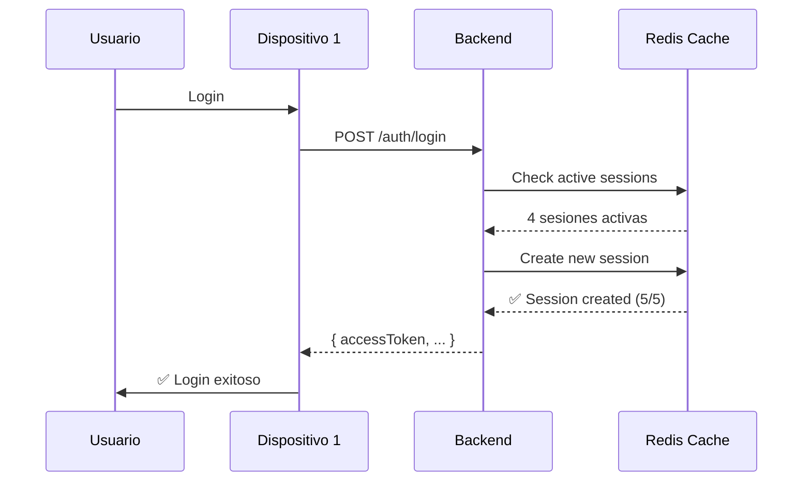
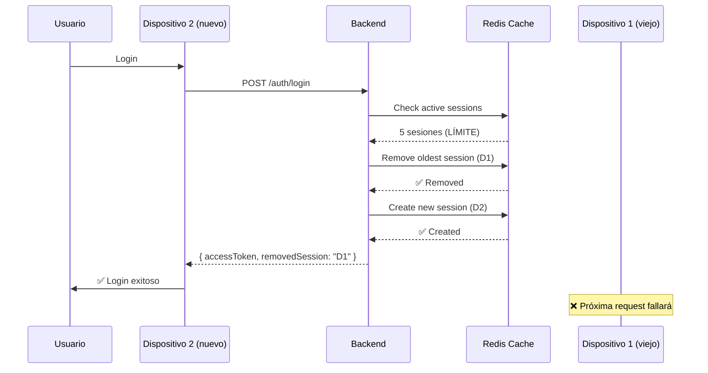
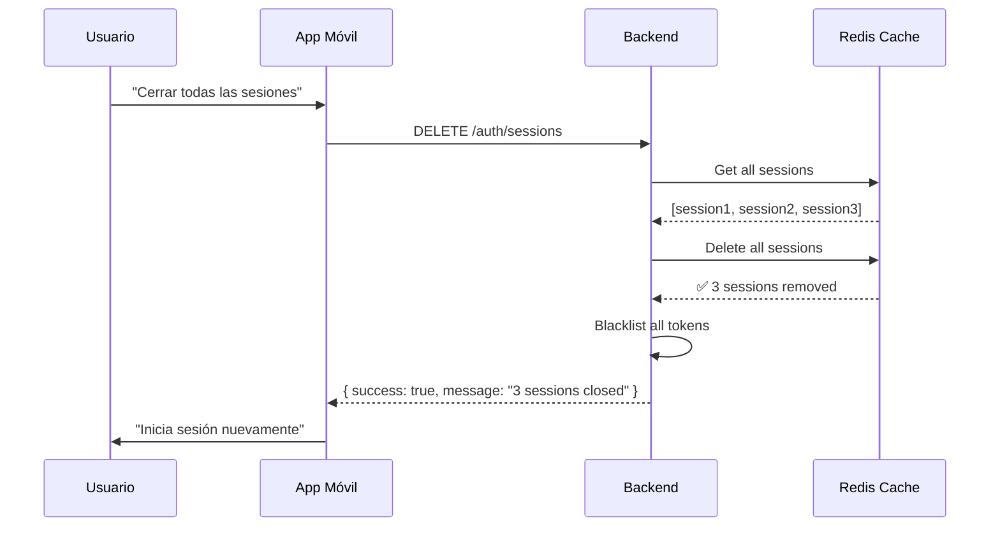

# Walkthrough - Implementación Sessions Management

**Fecha**: 5 de febrero de 2026  
**Módulo**: Session Management  
**Tipo**: Funcionalidad Bonus

---

## 🎯 Objetivos Completados

### Funcionalidad Sessions ✅

1. ✅ Servicio de gestión de sesiones concurrentes
2. ✅ Controller con 3 endpoints
3. ✅ Límite de sesiones activas por usuario (máx 5)
4. ✅ Tracking de dispositivos e IP addresses
5. ✅ Integración con Redis (Upstash) para cache
6. ✅ Cierre de sesiones remotas
7. ✅ Swagger completamente documentado

---

## 📋 Descripción

El módulo Sessions implementa gestión de sesiones concurrentes por usuario. Permite limitar el número de dispositivos que pueden estar autenticados simultáneamente y proporciona control para cerrar sesiones en otros dispositivos.

### Características Principales

- **Concurrent Session Limit**: Máximo 5 sesiones por usuario
- **Device Tracking**: Información de dispositivo y user-agent
- **IP Tracking**: Dirección IP de cada sesión
- **Auto-cleanup**: Elimina sesiones más antiguas al exceder límite
- **Remote Logout**: Cerrar sesiones en otros dispositivos
- **Session Stats**: Estadísticas de sesiones activas

---

## 📁 Archivos Implementados

### 1. [src/common/services/session-management.service.ts](file:///Users/abner/Documents/dev/sacdia/sacdia-backend/src/common/services/session-management.service.ts)

**Configuración**:

```typescript
private readonly MAX_SESSIONS = 5;         // Máximo de sesiones por usuario
private readonly SESSION_TTL = 86400;      // 24 horas en segundos
private readonly SESSION_PREFIX = 'session:';
```

**Métodos principales**:

#### `createSession(userId, sessionId, deviceInfo, ipAddress)`

Registra una nueva sesión. Si se excede el límite, elimina la sesión más antigua automáticamente.

**Parámetros**:

- `userId`: ID del usuario
- `sessionId`: ID único de la sesión (generalmente JWT ID)
- `deviceInfo`: User-agent o información del dispositivo
- `ipAddress`: IP del cliente

**Retorna**:

```typescript
{
  created: boolean;
  removedSession?: string;  // ID de sesión eliminada si se excedió límite
}
```

**Flujo**:

1. Obtiene sesiones actuales del usuario
2. Si hay ≥ 5 sesiones, elimina la más antigua
3. Crea nueva sesión
4. Almacena en Redis con TTL de 24h

---

#### `getUserSessions(userId: string)`

Obtiene todas las sesiones activas de un usuario.

**Retorna**:

```typescript
[
  {
    sessionId: string;
    userId: string;
    deviceInfo: string;      // User-agent
    ipAddress: string;
    createdAt: Date;
    lastActivity: Date;
  }
]
```

---

#### `updateSessionActivity(userId, sessionId)`

Actualiza el timestamp de última actividad de una sesión. Útil para implementar "session keep-alive".

---

#### `isValidSession(userId, sessionId)`

Verifica si una sesión específica sigue siendo válida.

**Retorna**: `boolean`

---

#### `removeSession(userId, sessionId)`

Elimina una sesión específica (logout de un dispositivo).

---

#### `removeAllSessions(userId: string)`

Cierra todas las sesiones de un usuario (logout masivo).

**Retorna**: `number` (cantidad de sesiones cerradas)

**Uso típico**:

- "Logout de todos los dispositivos"
- Respuesta a compromiso de cuenta
- Cambio de contraseña forzado

---

#### `getSessionStats(userId: string)`

Obtiene estadísticas de sesiones del usuario.

**Retorna**:

```typescript
{
  activeSessions: number;      // Cantidad actual
  maxSessions: number;         // Límite (5)
  sessions: UserSession[];     // Lista detallada
}
```

---

### 2. [src/auth/sessions.controller.ts](file:///Users/abner/Documents/dev/sacdia/sacdia-backend/src/auth/sessions.controller.ts)

**Endpoints implementados**:

| Método | Ruta                        | Auth | Descripción                  |
| ------ | --------------------------- | ---- | ---------------------------- |
| GET    | `/auth/sessions`            | ✅   | Listar sesiones activas      |
| DELETE | `/auth/sessions/:sessionId` | ✅   | Cerrar una sesión específica |
| DELETE | `/auth/sessions`            | ✅   | Cerrar todas las sesiones    |

**Todos los endpoints requieren autenticación JWT** (`@UseGuards(JwtAuthGuard)`)

---

### 3. Integración con Token Blacklist

El controller usa `TokenBlacklistService` para invalidar tokens cuando se cierran sesiones:

```typescript
// En closeAllSessions()
await this.tokenBlacklistService.blacklistAllUserTokens(userId);
await this.sessionService.removeAllSessions(userId);
```

Esto garantiza que los tokens existentes no puedan ser usados después de cerrar sesiones.

---

## 🔄 Flujo de Trabajo

### 1. Usuario Inicia Sesión en Nuevo Dispositivo



### 2. Usuario Excede Límite de Sesiones (6ta sesión)



### 3. Usuario Cierra Sesiones en Otros Dispositivos



---

## 🧪 Ejemplos de Uso

### 1. Listar Sesiones Activas

**Request**:

```bash
curl -X GET http://localhost:3000/auth/sessions \
  -H "Authorization: Bearer <access-token>"
```

**Response**:

```json
{
  "activeSessions": 3,
  "maxSessions": 5,
  "sessions": [
    {
      "sessionId": "a1b2c3d4-e5f6-7890-abcd-ef1234567890",
      "deviceInfo": "Mozilla/5.0 (iPhone; CPU iPhone OS 15_0 like Mac OS X)",
      "ipAddress": "192.168.1.100",
      "createdAt": "2026-02-05T10:00:00.000Z",
      "lastActivity": "2026-02-05T12:30:00.000Z"
    },
    {
      "sessionId": "b2c3d4e5-f6a7-8901-bcde-f12345678901",
      "deviceInfo": "Mozilla/5.0 (Windows NT 10.0; Win64; x64) Chrome/119.0",
      "ipAddress": "192.168.1.101",
      "createdAt": "2026-02-04T08:00:00.000Z",
      "lastActivity": "2026-02-05T11:00:00.000Z"
    },
    {
      "sessionId": "c3d4e5f6-a7b8-9012-cdef-123456789012",
      "deviceInfo": "Mozilla/5.0 (Macintosh; Intel Mac OS X 10_15_7) Safari/605.1",
      "ipAddress": "192.168.1.102",
      "createdAt": "2026-02-03T14:00:00.000Z",
      "lastActivity": "2026-02-05T09:00:00.000Z"
    }
  ]
}
```

**UI Recomendado**:

```
📱 Dispositivos Conectados (3/5)

┌─────────────────────────────────────────────┐
│ 📱 iPhone 15                                │
│ Última actividad: Hace 10 minutos          │
│ IP: 192.168.1.100                          │
│ [Esta sesión] ━━━━━━━━━━━━━━━━━━━━        │
└─────────────────────────────────────────────┘

┌─────────────────────────────────────────────┐
│ 💻 Windows PC                               │
│ Última actividad: Hace 1 hora              │
│ IP: 192.168.1.101                          │
│ [Cerrar sesión] ━━━━━━━━━━━━━━━━━━━━      │
└─────────────────────────────────────────────┘

┌─────────────────────────────────────────────┐
│ 🖥️ MacBook Pro                             │
│ Última actividad: Hace 3 horas             │
│ IP: 192.168.1.102                          │
│ [Cerrar sesión] ━━━━━━━━━━━━━━━━━━━━      │
└─────────────────────────────────────────────┘

[Cerrar todas las demás sesiones]
```

---

### 2. Cerrar Sesión en Dispositivo Específico

**Request**:

```bash
curl -X DELETE http://localhost:3000/auth/sessions/b2c3d4e5-f6a7-8901-bcde-f12345678901 \
  -H "Authorization: Bearer <access-token>"
```

**Response**:

```json
{
  "success": true,
  "message": "Session closed"
}
```

**Efecto**:

- Sesión eliminada de Redis
- Próxima request desde ese dispositivo será rechazada
- Usuario deberá hacer login nuevamente en ese dispositivo

---

### 3. Cerrar Todas las Sesiones (Logout Masivo)

**Request**:

```bash
curl -X DELETE http://localhost:3000/auth/sessions \
  -H "Authorization: Bearer <access-token>"
```

**Response**:

```json
{
  "success": true,
  "message": "3 sessions closed. Please login again."
}
```

**Efecto**:

- Todas las sesiones eliminadas
- Todos los tokens del usuario blacklisteados
- Usuario debe hacer login nuevamente en TODOS los dispositivos
- Útil para respuesta a incidente de seguridad

---

## 🏗️ Arquitectura

### Storage: Redis (Upstash)

**Keys Structure**:

```
session:{userId}:{sessionId}          → Session data (JSON)
session:list:{userId}                 → List of session IDs (JSON array)
```

**TTL**:

- 24 horas por defecto
- Se renueva en cada actividad (futuro)

**Ejemplo de datos**:

```json
// Key: session:auth0|123:a1b2c3d4-e5f6-7890
{
  "sessionId": "a1b2c3d4-e5f6-7890-abcd-ef1234567890",
  "userId": "auth0|1234567890",
  "deviceInfo": "Mozilla/5.0 (iPhone; CPU iPhone OS 15_0 like Mac OS X)",
  "ipAddress": "192.168.1.100",
  "createdAt": "2026-02-05T10:00:00.000Z",
  "lastActivity": "2026-02-05T12:30:00.000Z"
}
```

---

## 📊 Estadísticas de Implementación

| Métrica               | Valor           |
| --------------------- | --------------- |
| **Endpoints**         | 3               |
| **Métodos Service**   | 10              |
| **Max Sessions/User** | 5               |
| **Session TTL**       | 24h             |
| **Storage**           | Redis (Upstash) |
| **Auto-cleanup**      | ✅ Sí           |

---

## 🎯 Casos de Uso

### 1. **Dispositivos Múltiples**

Usuario normal con móvil, tablet, laptop, y desktop. Puede tener todos conectados.

### 2. **Logout Remoto**

Usuario pierde su teléfono y quiere cerrar esa sesión desde otro dispositivo.

### 3. **Compromiso de Cuenta**

Usuario detecta actividad sospechosa y cierra todas las sesiones inmediatamente.

### 4. **Límite de Dispositivos**

Prevenir compartir cuentas: usuario intenta login en 6to dispositivo.

### 5. **Monitoreo de Actividad**

Usuario revisa qué dispositivos están conectados y cuándo fue la última actividad.

---

## ⚠️ Consideraciones Importantes

### Seguridad

1. **Session Hijacking**:
   - ⚠️ Implementar fingerprinting de dispositivo (futuro)
   - ⚠️ Alertar al usuario de nuevas sesiones desde IPs desconocidas

2. **Token Invalidation**:
   - ✅ Tokens se blacklistean al cerrar sesiones
   - ✅ Integrado con `TokenBlacklistService`

3. **Rate Limiting**:
   - ⚠️ Limitar intentos de login para prevenir ataques de fuerza bruta

### Performance

1. **Redis Latency**:
   - Upstash tiene baja latencia (<10ms típicamente)
   - Sesiones se cachean, no afecta DB principal

2. **Memory Usage**:
   - ~200 bytes por sesión
   - 5 sesiones/usuario = 1KB
   - 10,000 usuarios = ~10MB en Redis

### UX

1. **Notificaciones**:
   - ⚠️ Notificar al usuario cuando se elimina sesión antigua
   - ⚠️ Alertar de nueva sesión desde dispositivo desconocido

2. **Nombres Amigables**:
   - Parsear `deviceInfo` para mostrar nombres legibles
   - Ejemplo: "iPhone 15" vs "Mozilla/5.0..."

---

## 🚀 Mejoras Futuras

1. **Device Fingerprinting** - Detectar mismo dispositivo más confiablemente
2. **Geolocation** - Mostrar ubicación aproximada de cada sesión
3. **Session Naming** - Permitir al usuario nombrar dispositivos
4. **Activity Tracking** - Registrar última endpoint accedido
5. **Session Alerts** - Notificar nuevas sesiones via push/email
6. **Extended Sessions** - Opción "Recordarme" con TTL de 30 días
7. **Suspicious Activity** - Detectar y alertar logins desde países inusuales

---

## 🔗 Integración con Otros Módulos

### Auth Module

```typescript
// En auth.service.ts (login)
const sessionId = crypto.randomUUID();
await this.sessionService.createSession(
  userId,
  sessionId,
  req.headers["user-agent"],
  req.ip,
);
```

### Token Blacklist

```typescript
// En sessions.controller.ts
await this.tokenBlacklistService.blacklistAllUserTokens(userId);
await this.sessionService.removeAllSessions(userId);
```

### WebSocket Gateway (futuro)

```typescript
// Notificar en tiempo real cuando se cierra sesión
this.wsGateway.emit(`user:${userId}:session:closed`, {
  sessionId,
  timestamp: new Date(),
});
```

---

## 📖 Swagger Documentation

**Base Path**: `/auth/sessions`  
**Tag**: `auth`

Todos los endpoints están completamente documentados en Swagger:

- Request schemas
- Response schemas con session objects
- Bearer token requirements
- Descripciones detalladas

**Acceder**: http://localhost:3000/api#/auth

---

## ✅ Checklist de Implementación

### Core Functionality

- [x] SessionManagementService implementado
- [x] Integración con Redis (Upstash)
- [x] Límite de 5 sesiones por usuario
- [x] Auto-cleanup de sesiones antiguas
- [x] List sessions endpoint
- [x] Close specific session endpoint
- [x] Close all sessions endpoint
- [x] Swagger documentation
- [x] AuthGuard en todos los endpoints

### Tracking

- [x] Device info (user-agent)
- [x] IP address
- [x] Created timestamp
- [x] Last activity timestamp
- [x] Session TTL (24h)

### Security

- [x] JWT validation
- [x] Token blacklisting integration
- [ ] Device fingerprinting (futuro)
- [ ] Geolocation tracking (futuro)
- [ ] Suspicious activity detection (futuro)

---

## 🔄 Relación con MFA

Sessions y MFA trabajan juntos para seguridad completa:

| Escenario           | Sessions                   | MFA                        |
| ------------------- | -------------------------- | -------------------------- |
| **Login Normal**    | Crea nueva sesión          | Verifica AAL1              |
| **Login con 2FA**   | Crea nueva sesión AAL2     | Requiere código TOTP       |
| **Logout**          | Elimina sesión             | N/A                        |
| **Logout Masivo**   | Elimina todas las sesiones | N/A                        |
| **Cambio Password** | Cierra todas las sesiones  | Re-enrolar MFA recomendado |
| **Compromiso**      | Cerrar todas + blacklist   | Deshabilitar + re-enrolar  |

---

**Status**: ✅ **COMPLETADO E IMPLEMENTADO**

El módulo Sessions está completamente funcional y listo para:

- Rastrear sesiones concurrentes por usuario
- Limitar dispositivos conectados (max 5)
- Cerrar sesiones remotamente
- Prevenir compartir cuentas
- Responder a incidentes de seguridad

**Integración**: Redis (Upstash) + Token Blacklist Service
