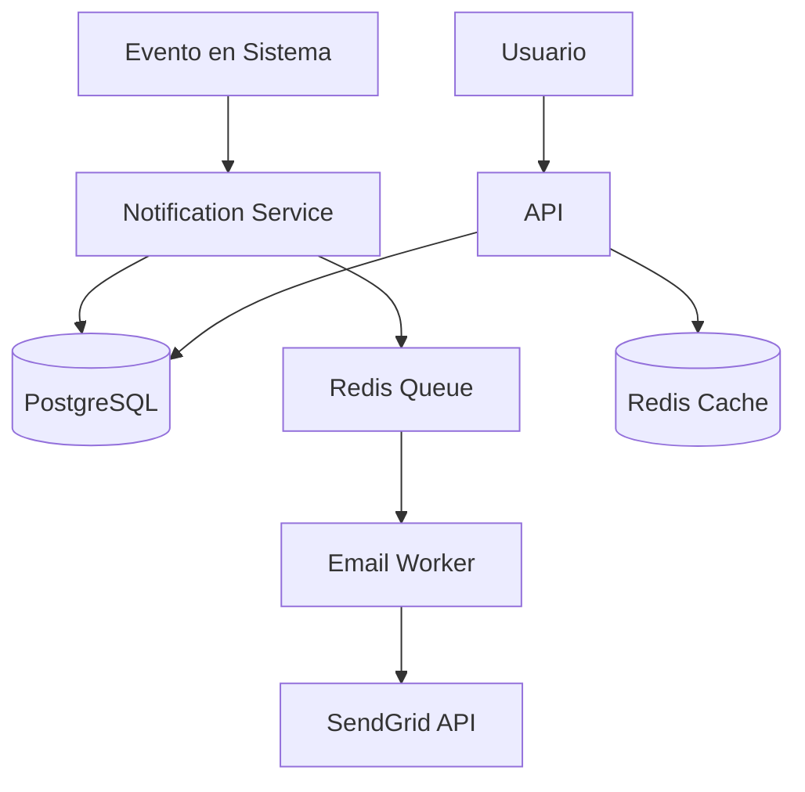

# Design - Sistema de Notificaciones

> **Fase**: Design  
> **Vinculado a**: [requirements.md](./requirements.md)

## Arquitectura



## Base de Datos

### Tabla: notifications

```sql
CREATE TABLE notifications (
    id UUID PRIMARY KEY DEFAULT gen_random_uuid(),
    user_id UUID NOT NULL REFERENCES users(id),
    type VARCHAR(50) NOT NULL,
    title VARCHAR(255) NOT NULL,
    message TEXT,
    resource_type VARCHAR(50),
    resource_id UUID,
    read_at TIMESTAMP,
    created_at TIMESTAMP DEFAULT NOW()
);

CREATE INDEX idx_notifications_user_id ON notifications(user_id);
CREATE INDEX idx_notifications_created_at ON notifications(created_at DESC);
CREATE INDEX idx_notifications_unread ON notifications(user_id, read_at) WHERE read_at IS NULL;
```

### Tabla: notification_preferences

```sql
CREATE TABLE notification_preferences (
    id UUID PRIMARY KEY DEFAULT gen_random_uuid(),
    user_id UUID NOT NULL REFERENCES users(id),
    notification_type VARCHAR(50) NOT NULL,
    email_enabled BOOLEAN DEFAULT true,
    UNIQUE(user_id, notification_type)
);
```

## API Endpoints

### GET /api/v1/notifications

**Response 200**:
```json
{
  "data": [
    {
      "id": "uuid",
      "type": "new_order",
      "title": "Nueva orden creada",
      "message": "Tu orden #123 ha sido creada",
      "resourceType": "order",
      "resourceId": "order-uuid",
      "readAt": null,
      "createdAt": "2026-01-09T14:00:00Z"
    }
  ],
  "meta": {
    "page": 1,
    "limit": 50,
    "total": 120,
    "unreadCount": 5
  }
}
```

### PATCH /api/v1/notifications/{id}/read

Marca como leída.

### GET /api/v1/notification-preferences

### PUT /api/v1/notification-preferences

**Request**:
```json
{
  "preferences": [
    { "type": "new_order", "emailEnabled": true },
    { "type": "order_update", "emailEnabled": false }
  ]
}
```

## Lógica de Negocio

### Creación de Notificación

```typescript
async function createNotification(data: NotificationData) {
  // 1. Crear en DB
  const notification = await db.notification.create(data);
  
  // 2. Verificar preferencias
  const pref = await getUserPreference(data.userId, data.type);
  
  // 3. Si email habilitado, encolar
  if (pref.emailEnabled) {
    await queue.add('send-email', {
      notificationId: notification.id,
      userId: data.userId
    });
  }
  
  return notification;
}
```

## Decisiones Técnicas

**Por qué polling en lugar de WebSockets**: Simplicidad para MVP. WebSockets requiere infraestructura adicional. Polling cada 30s es suficiente para v1.

**Por qué Redis Queue**: Separa el envío de emails del flujo principal. Si SendGrid está lento/caído, no afecta la creación de notificaciones.

---

Vinculado a: [tasks.md](./tasks.md)
