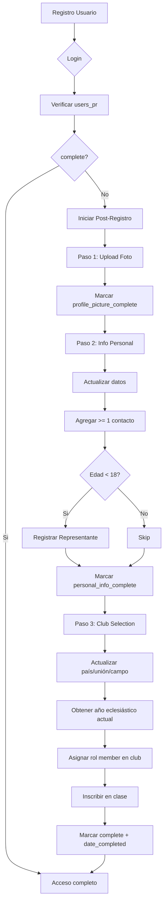

# Walkthrough - Legal Representatives & Post-Registration

**Fecha**: 30 de enero de 2026  
**Duración**: ~90 minutos  
**Fases completadas**: 4 + 5 (Legal Representatives + Post-Registration)

---

## 🎯 Objetivos Completados

### Fase 4: Legal Represent atives ✅

1. ✅ CRUD de representantes legales
2. ✅ Validación edad < 18 años
3. ✅ Soporte para usuario registrado O datos manuales
4. ✅ Máximo 1 por usuario
5. ✅ Relación con `relationship_types`
6. ✅ 4 endpoints documentados

### Fase 5: Post-Registration ✅

7. ✅ Endpoint de estado (status)
8. ✅ Paso 1: Validación foto de perfil
9. ✅ Paso 2: Validación completa (info + contactos + rep legal)
10. ✅ Paso 3: Transacción completa de club selection
11. ✅ Auto-asignación de año eclesiástico
12. ✅ 4 endpoints documentados

**Total implementado**: 26 endpoints (18 previos + 8 nuevos)

---

## 📁 Archivos Creados

### Legal Representatives Module (5 archivos)

#### 1. [src/legal-representatives/dto/create-legal-representative.dto.ts](file:///Users/abner/Documents/dev/sacdia/sacdia-backend/src/legal-representatives/dto/create-legal-representative.dto.ts)

```typescript
export class CreateLegalRepresentativeDto {
  @IsOptional()
  @IsUUID()
  representative_user_id?: string; // Opción 1: Usuario registrado

  // Opción 2: Datos manuales
  @IsOptional()
  @IsString()
  @MaxLength(100)
  @ValidateIf((o) => !o.representative_user_id)
  name?: string;

  @IsOptional()
  @IsString()
  @MaxLength(100)
  @ValidateIf((o) => !o.representative_user_id)
  paternal_last_name?: string;

  @IsOptional()
  @IsString()
  @MaxLength(100)
  maternal_last_name?: string;

  @IsOptional()
  @IsString()
  @MaxLength(20)
  @ValidateIf((o) => !o.representative_user_id)
  phone?: string;

  @IsUUID()
  relationship_type_id: string; // Relación con relationship_types
}
```

**Validación condicional:**

- Si `representative_user_id` presente → datos manuales opcionales
- Si `representative_user_id` ausente → `name`, `paternal_last_name`, `phone` requeridos

#### 2. [src/legal-representatives/legal-representatives.service.ts](file:///Users/abner/Documents/dev/sacdia/sacdia-backend/src/legal-representatives/legal-representatives.service.ts)

**Métodos implementados:**

##### `create(userId, dto)`

**Validaciones**:

1. **Usuario requiere representante** (edad < 18)

   ```typescript
   const requiresRep =
     await this.usersService.requiresLegalRepresentative(userId);
   if (!requiresRep) {
     throw new BadRequestException(
       "Usuario mayor de 18 años no requiere representante legal",
     );
   }
   ```

2. **Máximo 1 representante por usuario**

   ```typescript
   const existing = await this.prisma.legal_representatives.findUnique({
     where: { user_id: userId },
   });
   if (existing) {
     throw new ConflictException("El usuario ya tiene un representante legal");
   }
   ```

3. **Usuario registrado O datos completos**

   ```typescript
   if (
     !dto.representative_user_id &&
     (!dto.name || !dto.paternal_last_name || !dto.phone)
   ) {
     throw new BadRequestException("...");
   }
   ```

4. **Verificar que relationship_type_id existe**

##### `findOne(userId)`

Retorna representante con relaciones:

```typescript
include: {
  representative_user: { select: { ... } },
  relationship_types: { select: { ... } },
}
```

##### `update(userId, dto)`

Permite actualizar datos del representante

##### `remove(userId)`

Elimina representante (hard delete)

#### 3. [src/legal-representatives/legal-representatives.controller.ts](file:///Users/abner/Documents/dev/sacdia/sacdia-backend/src/legal-representatives/legal-representatives.controller.ts)

**Endpoints**:

| Método | Ruta                                  | Descripción           |
| ------ | ------------------------------------- | --------------------- |
| POST   | `/users/:userId/legal-representative` | Crear representante   |
| GET    | `/users/:userId/legal-representative` | Obtener representante |
| PATCH  | `/users/:userId/legal-representative` | Actualizar            |
| DELETE | `/users/:userId/legal-representative` | Eliminar              |

---

### Post-Registration Module (4 archivos)

#### 4. [src/post-registration/dto/complete-club-selection.dto.ts](file:///Users/abner/Documents/dev/sacdia/sacdia-backend/src/post-registration/dto/complete-club-selection.dto.ts)

```typescript
export class CompleteClubSelectionDto {
  @IsInt()
  country_id: number;

  @IsInt()
  union_id: number;

  @IsInt()
  local_field_id: number;

  @IsIn(["adventurers", "pathfinders", "master_guild"])
  club_type: "adventurers" | "pathfinders" | "master_guild";

  @IsInt()
  club_instance_id: number; // club_adv_id, club_pathf_id, o club_mg_id

  @IsInt()
  class_id: number; // ID de la clase
}
```

#### 5. [src/post-registration/post-registration.service.ts](file:///Users/abner/Documents/dev/sacdia/sacdia-backend/src/post-registration/post-registration.service.ts)

**Métodos implementados:**

##### `getStatus(userId)`

Retorna estado actual:

```json
{
  "status": "success",
  "data": {
    "complete": false,
    "steps": {
      "profilePicture": true,
      "personalInfo": false,
      "clubSelection": false
    },
    "nextStep": "personalInfo",
    "dateCompleted": null
  }
}
```

##### `completeStep1(userId)`

**Validación**:

- Usuario debe tener foto (`user_image != null`)

**Acción**:

```typescript
await this.prisma.users_pr.update({
  where: { user_id: userId },
  data: { profile_picture_complete: true },
});
```

##### `completeStep2(userId)`

**Validaciones**:

1. Info personal completa: `gender`, `birthday`, `baptism`
2. Al menos 1 contacto de emergencia activo
3. Si edad < 18 → debe tener representante legal

```typescript
// Validar info personal
if (!user.gender || !user.birthday || user.baptism === null) {
  throw new BadRequestException("...");
}

// Validar contactos
const contactsCount = await this.prisma.emergency_contacts.count({
  where: { owner_id: userId, active: true },
});
if (contactsCount === 0) {
  throw new BadRequestException("...");
}

// Validar representante legal si < 18
const requiresRep = await this.usersService.requiresLegalRepresentative(userId);
if (requiresRep) {
  try {
    await this.legalRepService.findOne(userId);
  } catch {
    throw new BadRequestException("...");
  }
}
```

**Acción**:

```typescript
await this.prisma.users_pr.update({
  where: { user_id: userId },
  data: { personal_info_complete: true },
});
```

##### `completeStep3(userId, dto)`

**TRANSACCIÓN COMPLETA** - El método más complejo:

```typescript
return await this.prisma.$transaction(async (tx) => {
  // 1. Actualizar ubicación geográfica
  await tx.users.update({
    where: { user_id: userId },
    data: {
      country_id: dto.country_id,
      union_id: dto.union_id,
      local_field_id: dto.local_field_id,
    },
  });

  // 2. Obtener año eclesiástico ACTUAL
  const currentYear = await tx.ecclesiastical_years.findFirst({
    where: {
      start_date: { lte: new Date() },
      end_date: { gte: new Date() },
    },
  });

  if (!currentYear) {
    throw new InternalServerErrorException("No hay año eclesiástico activo");
  }

  // 3. Obtener rol "member" (CLUB)
  const memberRole = await tx.roles.findFirst({
    where: {
      role_name: "member",
      role_category: "CLUB",
    },
  });

  // 4. Determinar campo de club según tipo
  const clubInstanceField =
    dto.club_type === "adventurers"
      ? "club_adv_id"
      : dto.club_type === "pathfinders"
        ? "club_pathf_id"
        : "club_mg_id";

  // 5. Verificar que el club existe
  const clubTable =
    dto.club_type === "adventurers"
      ? "club_adventurers"
      : dto.club_type === "pathfinders"
        ? "club_pathfinders"
        : "club_master_guilds";

  const club = await (tx as any)[clubTable].findUnique({
    where: { [clubIdField]: dto.club_instance_id },
  });

  if (!club) {
    throw new BadRequestException("Club no encontrado");
  }

  // 6. Asignar rol member en club
  await tx.club_role_assignments.create({
    data: {
      user_id: userId,
      role_id: memberRole.role_id,
      [clubInstanceField]: dto.club_instance_id,
      ecclesiastical_year_id: currentYear.year_id, // ✅ AUTO-ASIGNADO
      start_date: new Date(),
      active: true,
      status: "active",
    },
  });

  // 7. Inscribir en clase
  await tx.users_classes.create({
    data: {
      user_id: userId,
      class_id: dto.class_id,
      current_class: true,
    },
  });

  // 8. Marcar POST-REGISTRO COMPLETO
  await tx.users_pr.update({
    where: { user_id: userId },
    data: {
      club_selection_complete: true,
      complete: true,
      date_completed: new Date(),
    },
  });

  return {
    status: "success",
    message: "Post-registro completado exitosamente",
    data: {
      clubType: dto.club_type,
      clubId: dto.club_instance_id,
      classId: dto.class_id,
      ecclesiasticalYear: currentYear.year_id,
    },
  };
});
```

**Características de la transacción**:

- ✅ Atómica: Todo o nada
- ✅ Auto-asigna año eclesiástico actual
- ✅ Crea rol de member con status 'active'
- ✅ Inscribe en clase
- ✅ Marca post-registro completo

#### 6. [src/post-registration/post-registration.controller.ts](file:///Users/abner/Documents/dev/sacdia/sacdia-backend/src/post-registration/post-registration.controller.ts)

**Endpoints**:

| Método | Ruta                                               | Descripción      |
| ------ | -------------------------------------------------- | ---------------- |
| GET    | `/users/:userId/post-registration/status`          | Estado actual    |
| POST   | `/users/:userId/post-registration/step-1/complete` | Completar Paso 1 |
| POST   | `/users/:userId/post-registration/step-2/complete` | Completar Paso 2 |
| POST   | `/users/:userId/post-registration/step-3/complete` | Completar Paso 3 |

---

## 🧪 Pruebas Manuales

### Flujo Completo de Post-Registro

#### Paso 0: Registrar usuario

```bash
curl -X POST http://localhost:3000/auth/register \
  -H "Content-Type: application/json" \
  -d '{
    "name": "Carlos",
    "paternal_last_name": "Martínez",
    "maternal_last_name": "Torres",
    "email": "carlos15@example.com",
    "password": "Password123!"
  }'
```

Guardamos el `userId` y hacemos login para obtener token.

---

#### Paso 1: Upload foto de perfil

```bash
curl -X POST http://localhost:3000/users/{userId}/profile-picture \
  -H "Authorization: Bearer {token}" \
  -F "file=@/path/to/photo.jpg"
```

**Completar Paso 1**:

```bash
curl -X POST http://localhost:3000/users/{userId}/post-registration/step-1/complete \
  -H "Authorization: Bearer {token}"
```

**Response esperado**:

```json
{
  "status": "success",
  "message": "Paso 1 completado: Foto de perfil"
}
```

---

#### Paso 2: Información personal

**2.1 Actualizar datos personales**:

```bash
curl -X PATCH http://localhost:3000/users/{userId} \
  -H "Authorization: Bearer {token}" \
  -H "Content-Type: application/json" \
  -d '{
    "gender": "M",
    "birthday": "2009-03-15",
    "baptism": true,
    "baptism_date": "2020-08-10",
    "blood": "O_POSITIVE"
  }'
```

**2.2 Agregar contacto de emergencia**:

```bash
curl -X POST http://localhost:3000/users/{userId}/emergency-contacts \
  -H "Authorization: Bearer {token}" \
  -H "Content-Type: application/json" \
  -d '{
    "name": "Ana Martínez",
    "relationship_type": 1,
    "phone": "+52 55 1234 5678",
    "primary": true
  }'
```

**2.3 Verificar si requiere representante legal**:

```bash
curl -X GET http://localhost:3000/users/{userId}/requires-legal-representative \
  -H "Authorization: Bearer {token}"
```

**Response** (Carlos tiene 15 años):

```json
{
  "status": "success",
  "data": {
    "required": true,
    "userAge": 15,
    "reason": "Usuario es menor de 18 años"
  }
}
```

**2.4 Registrar representante legal**:

```bash
curl -X POST http://localhost:3000/users/{userId}/legal-representative \
  -H "Authorization: Bearer {token}" \
  -H "Content-Type: application/json" \
  -d '{
    "name": "Roberto",
    "paternal_last_name": "Martínez",
    "maternal_last_name": "García",
    "phone": "+52 55 9999 9999",
    "relationship_type_id": "uuid-padre"
  }'
```

**Completar Paso 2**:

```bash
curl -X POST http://localhost:3000/users/{userId}/post-registration/step-2/complete \
  -H "Authorization: Bearer {token}"
```

**Response esperado**:

```json
{
  "status": "success",
  "message": "Paso 2 completado: Información personal"
}
```

---

#### Paso 3: Selección de club

```bash
curl -X POST http://localhost:3000/users/{userId}/post-registration/step-3/complete \
  -H "Authorization: Bearer {token}" \
  -H "Content-Type: application/json" \
  -d '{
    "country_id": 1,
    "union_id": 1,
    "local_field_id": 1,
    "club_type": "pathfinders",
    "club_instance_id": 1,
    "class_id": 5
  }'
```

**Response esperado**:

```json
{
  "status": "success",
  "message": "Post-registro completado exitosamente",
  "data": {
    "clubType": "pathfinders",
    "clubId": 1,
    "classId": 5,
    "ecclesiasticalYear": 2026
  }
}
```

**Verificación en BD**:

```sql
-- Verificar asignación de rol
SELECT * FROM club_role_assignments
WHERE user_id = '{userId}';
-- Debe tener:
-- - role_name = 'member'
-- - club_pathf_id = 1
-- - ecclesiastical_year_id = 2026 (auto-asignado)
-- - status = 'active'

-- Verificar inscripción en clase
SELECT * FROM users_classes
WHERE user_id = '{userId}';
-- current_class = true

-- Verificar post-registro completo
SELECT * FROM users_pr
WHERE user_id = '{userId}';
-- complete = true
-- date_completed = <timestamp>
```

---

### Consultar estado en cualquier momento

```bash
curl -X GET http://localhost:3000/users/{userId}/post-registration/status \
  -H "Authorization: Bearer {token}"
```

**Response durante el proceso**:

```json
{
  "status": "success",
  "data": {
    "complete": false,
    "steps": {
      "profilePicture": true,
      "personalInfo": true,
      "clubSelection": false
    },
    "nextStep": "clubSelection",
    "dateCompleted": null
  }
}
```

**Response al completar**:

```json
{
  "status": "success",
  "data": {
    "complete": true,
    "steps": {
      "profilePicture": true,
      "personalInfo": true,
      "clubSelection": true
    },
    "nextStep": null,
    "dateCompleted": "2026-01-30T20:15:00.000Z"
  }
}
```

---

## 📊 Diagramas de Flujo

### Flujo Post-Registro Completo



---

## ✅ Checklist de Implementación

### Legal Representatives

- [x] DTOs con validación condicional
- [x] Service con validación edad < 18
- [x] Soporte usuario registrado O datos manuales
- [x] Máximo 1 por usuario
- [x] FK a `relationship_types`
- [x] Controller con 4 endpoints
- [x] Swagger documentado

### Post-Registration

- [x] DTO para club selection completo
- [x] Service con 4 métodos (status + 3 pasos)
- [x] Paso 1: Validación foto
- [x] Paso 2: Validaciones múltiples
- [x] Paso 3: Transacción atómica
- [x] Auto-asignación año eclesiástico
- [x] Controller con 4 endpoints
- [x] Swagger documentado

### Verificación

- [x] Build exitoso
- [x] Corrección de errores Prisma (relationship_types, class_id)
- [x] Todos los endpoints expuestos

---

## 📊 Estadísticas Finales

| Métrica                            | Valor  |
| ---------------------------------- | ------ |
| **Archivos creados (estas fases)** | 12     |
| **Archivos totales**               | 38     |
| **DTOs**                           | 3      |
| **Services**                       | 2      |
| **Controllers**                    | 2      |
| **Endpoints nuevos**               | 8      |
| **Endpoints totales**              | 26     |
| **Líneas de código**               | ~1,000 |
| **Validaciones custom**            | 10+    |

---

## 🏗️ Estructura Actualizada

```
src/
├── common/
├── auth/ (7 endpoints)
├── users/ (6 endpoints)
├── emergency-contacts/ (5 endpoints)
├── legal-representatives/               ✅ NUEVO
│   ├── dto/
│   │   ├── create-legal-representative.dto.ts ✅
│   │   └── update-legal-representative.dto.ts ✅
│   ├── legal-representatives.controller.ts    ✅
│   ├── legal-representatives.service.ts       ✅
│   └── legal-representatives.module.ts        ✅
│
├── post-registration/                   ✅ NUEVO
│   ├── dto/
│   │   └── complete-club-selection.dto.ts     ✅
│   ├── post-registration.controller.ts        ✅
│   ├── post-registration.service.ts           ✅
│   └── post-registration.module.ts            ✅
│
├── prisma/
├── app.module.ts
└── main.ts
```

---

## 🎯 Lecciones Aprendidas

### ✅ Buenas Prácticas

1. **Validaciones múltiples en Paso 2**
   - Info personal completa
   - > = 1 contacto emergencia
   - Representante legal si < 18
   - Todo validado antes de marcar completo

2. **Transacción atómica en Paso 3**
   - 8 operaciones en 1 transacción
   - Todo o nada (rollback automático)
   - Auto-asignación de año eclesiástico

3. **Validación condicional en DTOs**
   - `@ValidateIf((o) => !o.representative_user_id)`
   - Permite flexibilidad sin comprometer validación

4. **Relaciones Prisma correctas**
   - `relationship_types` (plural)
   - Incluir relaciones en `select/include`

### ⚠️ Consideraciones

1. **Año eclesiástico**
   - Debe existir un año activo en `ecclesiastical_years`
   - Filtro: `start_date <= now() <= end_date`
   - Si no existe, transacción falla

2. **Tipos de club**
   - Tablas diferentes: `club_adventurers`, `club_pathfinders`, `club_master_guilds`
   - Campos diferentes: `club_adv_id`, `club_pathf_id`, `club_mg_id`
   - Lógica condicional en Step 3

3. **class_id es Int**
   - Originalmente pensé que era UUID
   - Error de compilación me lo reveló

---

## 🚀 Próximos Pasos

### Opcional: Módulo Catalogs

Endpoints para obtener datos de referencia:

- Países
- Uniones (filtradas por país)
- Campos locales (filtrados por unión)
- Clubes (filtrados por campo)
- Tipos de relación
- Clases (filtradas por club type)

### Testing

- E2E del flujo completo registro → post-registro
- Unit tests de validaciones
- Integration tests de transacciones

### Deployment

- Variables de entorno en producción
- Seed de datos iniciales
- Configurar Supabase Storage en prod

---

## 🎉 Resumen Final

**26 endpoints funcionando:**

- 7 Auth (registro, login, logout, etc.)
- 6 Users (CRUD, foto, edad)
- 5 Emergency Contacts (CRUD con validaciones)
- 4 Legal Representatives (CRUD con edad < 18)
- 4 Post-Registration (status + 3 pasos)

**Flujo completo implementado:**

1. Registro → users + users_pr + users_roles
2. Login → verificar needsPostRegistration
3. Paso 1 → foto
4. Paso 2 → info + contactos + rep legal
5. Paso 3 → club + clase + año eclesiástico → **COMPLETO**

**Build**: ✅ Exitoso  
**Documentación**: ✅ Swagger completo  
**Status**: ✅ **LISTO PARA FRONTEND**

El backend está completamente funcional para soportar el flujo de registro y onboarding de usuarios! 🚀
