# Overview - SACDIA

**Sistema de Administración de Clubes del Ministerio Juvenil Adventista**

---

## ¿Qué es SACDIA?

SACDIA es una plataforma integral para la administración de clubes del Ministerio Juvenil Adventista (Aventureros, Conquistadores y Guías Mayores). El sistema permite:

- **Registro y gestión de miembros** con validación de identidad
- **Sistema de clases progresivas** (Amigo, Compañero, Explorador, etc.)
- **Gestión de especialidades (honores)** con certificaciones
- **Control de actividades** y asistencia
- **Gestión financiera** por club
- **Inventarios** de equipo y materiales
- **Camporees** y eventos especiales
- **Panel administrativo** para directores y coordinadores

---

## Stack Tecnológico

### Backend
- **Framework**: NestJS 10.x
- **Lenguaje**: TypeScript 5.x
- **ORM**: Prisma 6.x
- **Database**: PostgreSQL 15.x (Supabase)
- **Auth**: Supabase Auth (JWT)
- **Storage**: Supabase Storage
- **Deploy**: Vercel Serverless
- **Cache**: Redis (Upstash)

### Mobile App
- **Framework**: Flutter 3.x
- **Lenguaje**: Dart 3.x
- **Arquitectura**: Clean Architecture
- **State Management**: Riverpod
- **HTTP Client**: Dio
- **Local Storage**: Hive + flutter_secure_storage
- **Features**: Offline mode, real-time sync, geolocation, camera

### Admin Panel
- **Framework**: Next.js 14 (App Router)
- **Lenguaje**: TypeScript 5.x
- **UI**: shadcn/ui + TailwindCSS
- **Forms**: React Hook Form + Zod
- **Data Fetching**: TanStack Query
- **Deploy**: Vercel

---

## Arquitectura General

```mermaid
graph TB
    subgraph "Clients"
        APP[📱 App Móvil<br/>Flutter]
        WEB[💻 Panel Admin<br/>Next.js]
    end
    
    subgraph "API Layer"
        GATEWAY[🚪 API Gateway<br/>Vercel Edge]
        API[⚙️ REST API<br/>NestJS]
    end
    
    subgraph "Data Layer"
        PRISMA[Prisma ORM]
        CACHE[Redis Cache<br/>Upstash]
    end
    
    subgraph "Supabase"
        AUTH[🔐 Auth]
        STORAGE[📁 Storage]
        DB[(🗄️ PostgreSQL)]
    end
    
    APP --> GATEWAY
    WEB --> GATEWAY
    GATEWAY --> API
    API --> PRISMA
    API --> CACHE
    API --> AUTH
    API --> STORAGE
    PRISMA --> DB
```



---

## Módulos Principales del Sistema

### 1. Authentication & Authorization
- Registro con Supabase Auth
- Login con JWT tokens
- Sistema RBAC con roles globales y de club
- Permisos granulares por módulo

**Ver**: [api/ARCHITECTURE-DECISIONS.md](api/ARCHITECTURE-DECISIONS.md#adr-002-sistema-rbac)

---

### 2. Post-Registro (Onboarding)
Flujo de 3 pasos tras registro inicial:
1. **Fotografía de perfil** (comprimida, formato cuadrado)
2. **Información personal** (género, fecha nacimiento, contactos emergencia, alergias/enfermedades)
3. **Selección de club** (cascading: país → unión → campo → club → tipo → clase)

**Ver**: [02-PROCESSES.md](02-PROCESSES.md#módulo-post-registro)

---

### 3. Clubs & Memberships
- **Club contenedor**: Iglesia tiene 1 club principal
- **Instancias por tipo**: Aventureros, Conquistadores, Guías Mayores
- **Roles de club**: Director, Subdirector, Secretario, Tesorero, Consejero, Miembro
- **Asignaciones por año eclesiástico**: Tracking anual de membresías

**Ver**: [database/SCHEMA-REFERENCE.md](database/SCHEMA-REFERENCE.md#relaciones-de-clubes)

---

### 4. Classes & Honors
- **Clases progresivas**: Amigo, Compañero, Explorador, Pionero, etc.
- **Especialidades (Honores)**: Categorías (Naturaleza, Habilidades, etc.)
- **Progreso por módulos/secciones**: Tracking detallado
- **Validación de investiduras**: Workflow de aprobación

---

### 5. Activities & Events
- Planificación de actividades por club
- Registro de asistencia
- Camporees locales y de unión
- Campos participantes

---

### 6. Finances
- Ingresos y egresos por club
- Categorías financieras
- Reportes por año eclesiástico

---

### 7. Inventory
- Gestión de equipo y materiales
- Categorías de inventario
- Asignación a clubes

---

## Sistema de Roles y Permisos

### Roles Globales (tabla: `users_roles`)
Aplican a nivel sistema, sin restricción de club:
- **super_admin**: Acceso total al sistema
- **admin**: Administrador de campo local
- **coordinator**: Coordinador de unión/asociación
- **user**: Usuario estándar (asignado en registro)

### Roles de Club (tabla: `club_role_assignments`)
Aplican solo a instancias específicas de club:
- **director**: Director del club
- **subdirector**: Subdirector
- **secretary**: Secretario
- **treasurer**: Tesorero
- **counselor**: Consejero
- **member**: Miembro regular (asignado en post-registro)

**Ver**: [api/ARCHITECTURE-DECISIONS.md](api/ARCHITECTURE-DECISIONS.md#adr-002-sistema-rbac)

---

## Flujo de Datos

### Registro de Nuevo Usuario


### Post-Registro Paso 3 (Selección Club)

```mermaid
sequenceDiagram
    participant App
    participant API
    participant DB
    
    App->>API: POST /users/:id/post-registration/complete-step-3
    API->>DB: UPDATE users (country, union, local_field)
    API->>DB: GET ecclesiastical_year WHERE active
    API->>DB: INSERT club_role_assignments (member + year)
    API->>DB: INSERT users_classes (inscripción a clase)
    API->>DB: UPDATE users_pr (complete = true)
    API-->>App: { success: true }
```


---

## Jerarquía Organizacional

```
Country (País)
└── Union (Unión)
    └── Local Field (Campo Local / Asociación)
        └── District (Distrito)
            └── Church (Iglesia)
                └── Club (Club Principal)
                    ├── Club Adventurers Instance
                    ├── Club Pathfinders Instance
                    └── Club Master Guild Instance
                        └── Members (via club_role_assignments)
```

---

## Próximos Pasos

1. **Backend Developer**: Continúa con [database/README.md](database/README.md)
2. **Mobile Developer**: Ve a [02-PROCESSES.md](02-PROCESSES.md)
3. **Arquitectura detallada**: Consulta [api/API-SPECIFICATION.md](api/API-SPECIFICATION.md)

---

**Ver también**:
- [Implementation Roadmap](03-IMPLEMENTATION-ROADMAP.md)
- [Database Schema Reference](database/SCHEMA-REFERENCE.md)
- [API Specification](api/API-SPECIFICATION.md)
