# Guía de Testing - SACDIA Backend API

**Última actualización**: 5 de febrero de 2026
**Estado**: Backend completado (17/17 módulos)

---

## 🎯 Estrategia de Testing

### Niveles de Testing

```mermaid
graph TD
    A[Tests Unitarios] --> B[Tests de Integración]
    B --> C[Tests E2E]
    C --> D[Tests de Carga]
    D --> E[Smoke Tests Producción]
```



---

## 📋 Checklist de Testing por Módulo

### ✅ Módulos Core (Completados)

#### 1. Auth Module
- [x] Login con email/password
- [x] OAuth Google/Apple
- [x] JWT token validation
- [x] Refresh token flow
- [x] RBAC authorization
- [x] Club role assignments

#### 2. Users Module
- [x] Profile registration flow
- [x] Emergency contacts CRUD
- [x] Medical information
- [x] Club assignments
- [x] Role assignments

#### 3. Clubs Module
- [x] Multi-instance support (Adv, Pathf, MG)
- [x] Club creation and management
- [x] Role assignments
- [x] Member listing

---

### 🆕 Módulos Nuevos (Requieren Testing)

#### 4. Certifications Module

**Endpoints a probar**:

```bash
# Listar certificaciones disponibles
GET /certifications

# Obtener detalle de certificación
GET /certifications/:id

# Inscribir usuario a certificación
POST /users/:userId/certifications/enroll
Body: { certificationId: number }

# Listar certificaciones del usuario
GET /users/:userId/certifications

# Ver progreso de certificación
GET /users/:userId/certifications/:certificationId/progress

# Actualizar progreso de sección
PATCH /users/:userId/certifications/:certificationId/progress
Body: { sectionId: number, moduleId: number, completed: boolean }

# Cancelar inscripción
DELETE /users/:userId/certifications/:certificationId
```

**Casos de prueba prioritarios**:

1. **Validación de investiture**:
   ```json
   // Usuario SIN investidura de Guía Mayor
   POST /users/USER_ID/certifications/enroll
   Body: { "certificationId": 1 }
   Expected: 400 Bad Request - "User must be invested as Master Guide"
   ```

2. **Inscripción exitosa**:
   ```json
   // Usuario CON investidura
   POST /users/USER_ID/certifications/enroll
   Body: { "certificationId": 1 }
   Expected: 201 Created
   Response: { enrollmentId, certificationId, enrollmentDate, ... }
   ```

3. **Progreso cascading**:
   ```json
   // Completar sección
   PATCH /users/USER_ID/certifications/1/progress
   Body: { "sectionId": 1, "moduleId": 1, "completed": true }
   Expected: 200 OK
   // Verificar que módulo se marca completo automáticamente si todas las secciones están completas
   ```

4. **Múltiples certificaciones concurrentes**:
   ```bash
   # Inscribirse a 3 certificaciones diferentes
   POST /users/USER_ID/certifications/enroll (cert 1)
   POST /users/USER_ID/certifications/enroll (cert 2)
   POST /users/USER_ID/certifications/enroll (cert 3)

   # Verificar que todas aparecen en el listado
   GET /users/USER_ID/certifications
   Expected: Array con 3 certificaciones
   ```

---

#### 5. Folders Module

**Endpoints a probar**:

```bash
# Listar carpetas disponibles
GET /folders

# Obtener detalle de carpeta (template)
GET /folders/:id

# Asignar carpeta a usuario
POST /users/:userId/folders/:folderId/enroll

# Listar carpetas asignadas al usuario
GET /users/:userId/folders

# Ver progreso de carpeta
GET /users/:userId/folders/:folderId/progress

# Actualizar progreso de sección
PATCH /users/:userId/folders/:folderId/modules/:moduleId/sections/:sectionId
Body: { points: number, evidences: object }

# Eliminar asignación de carpeta
DELETE /users/:userId/folders/:folderId
```

**Casos de prueba prioritarios**:

1. **Validación de club type**:
   ```json
   // Usuario de Conquistadores intentando carpeta de Aventureros
   POST /users/USER_ID/folders/FOLDER_ADV_ID/enroll
   Expected: 400 Bad Request - "User does not belong to required club type"
   ```

2. **Asignación exitosa**:
   ```json
   // Usuario pertenece al club correcto
   POST /users/USER_ID/folders/1/enroll
   Expected: 201 Created
   Response: { assignmentId, folderId, userId, status: "IN_PROGRESS", ... }
   ```

3. **Sistema de puntos**:
   ```json
   // Actualizar sección con puntos
   PATCH /users/USER_ID/folders/1/modules/1/sections/1
   Body: { "points": 50, "evidences": { "photos": [...], "description": "..." } }
   Expected: 200 OK

   // Verificar validación de puntos máximos
   PATCH /users/USER_ID/folders/1/modules/1/sections/1
   Body: { "points": 999999 }
   Expected: 400 Bad Request - "Points exceed section maximum"
   ```

4. **Progreso por club (arquitectura)**:
   ```bash
   # IMPORTANTE: Los records son por club, no por usuario individual
   # Verificar que usuarios del mismo club ven el mismo progreso

   # Usuario 1 del Club A actualiza sección
   PATCH /users/USER1/folders/1/modules/1/sections/1
   Body: { "points": 50 }

   # Usuario 2 del mismo Club A ve el progreso
   GET /users/USER2/folders/1/progress
   Expected: Debe ver los 50 puntos registrados por USER1
   ```

5. **Completitud de carpeta**:
   ```json
   // Verificar que carpeta se marca completa al alcanzar minimum_points
   // Carpeta tiene minimum_points: 100

   PATCH .../sections/1  → points: 50
   PATCH .../sections/2  → points: 60
   Total: 110 >= 100

   GET /users/USER_ID/folders/1/progress
   Expected: { status: "COMPLETED", completionDate: "2026-02-05..." }
   ```

---

#### 6. Inventory Module

**Endpoints a probar**:

```bash
# Listar inventario de un club
GET /clubs/:clubId/inventory

# Obtener detalle de item
GET /inventory/:id

# Crear item de inventario
POST /clubs/:clubId/inventory
Body: { name, description, quantity, categoryId, ... }

# Actualizar item
PATCH /inventory/:id
Body: { quantity, location, ... }

# Eliminar item
DELETE /inventory/:id

# Listar categorías de inventario
GET /catalogs/inventory-categories
```

**Casos de prueba prioritarios**:

1. **Separación por tipo de club**:
   ```bash
   # Crear item para Club Aventureros
   POST /clubs/CLUB_ADV_1/inventory
   Body: { "name": "Uniforme Aventurero", "quantity": 10 }

   # Verificar que NO aparece en inventario de Conquistadores
   GET /clubs/CLUB_PATHF_1/inventory
   Expected: No debe incluir "Uniforme Aventurero"
   ```

2. **Validación de categoría**:
   ```json
   POST /clubs/1/inventory
   Body: { "name": "Item", "categoryId": 99999 }
   Expected: 400 Bad Request - "Invalid inventory category"
   ```

3. **CRUD completo**:
   ```bash
   # Create
   POST /clubs/1/inventory → item_id: 123

   # Read
   GET /inventory/123

   # Update
   PATCH /inventory/123
   Body: { "quantity": 5 }

   # Delete
   DELETE /inventory/123

   # Verify deleted
   GET /inventory/123
   Expected: 404 Not Found
   ```

---

## 🧪 Scripts de Testing

### Setup de Testing

```bash
# Instalar dependencias de testing
pnpm install --save-dev @nestjs/testing jest supertest

# Configurar base de datos de testing
cp .env .env.test
# Editar DATABASE_URL con DB de testing
```

### Tests Unitarios

**Certifications Service**:

```typescript
// src/certifications/certifications.service.spec.ts
describe('CertificationsService', () => {
  describe('enrollUserInCertification', () => {
    it('should throw error if user is not invested as Master Guide', async () => {
      // Arrange
      const userId = 'user-without-investiture';
      const certificationId = 1;

      // Act & Assert
      await expect(
        service.enrollUserInCertification(userId, certificationId)
      ).rejects.toThrow('User must be invested as Master Guide');
    });

    it('should create enrollment for invested user', async () => {
      // Arrange
      const userId = 'user-with-investiture';
      const certificationId = 1;

      // Act
      const result = await service.enrollUserInCertification(userId, certificationId);

      // Assert
      expect(result).toHaveProperty('enrollment_id');
      expect(result.completion_status).toBe(false);
    });
  });

  describe('updateProgress', () => {
    it('should add score field when creating section progress', async () => {
      // Este test verifica el fix de schema
      const dto = { sectionId: 1, moduleId: 1, completed: true };

      const result = await service.updateProgress(userId, certId, dto);

      // Verificar que Prisma no falla por campo 'score' faltante
      expect(result).toBeDefined();
    });
  });
});
```

**Folders Service**:

```typescript
// src/folders/folders.service.spec.ts
describe('FoldersService', () => {
  describe('assignFolderToUser', () => {
    it('should validate club type match', async () => {
      // Usuario de Conquistadores, carpeta de Aventureros
      const userId = 'pathfinder-user';
      const folderId = 1; // club_type = 1 (Aventureros)

      await expect(
        service.assignFolderToUser(userId, folderId)
      ).rejects.toThrow('User does not belong to required club type');
    });
  });

  describe('updateSectionProgress', () => {
    it('should use club IDs instead of user ID', async () => {
      // Este test verifica el cambio arquitectónico
      const spy = jest.spyOn(prismaService.folders_section_records, 'findFirst');

      await service.updateSectionProgress(userId, folderId, moduleId, sectionId, dto);

      // Verificar que query usa club IDs
      expect(spy).toHaveBeenCalledWith(
        expect.objectContaining({
          where: expect.objectContaining({
            OR: expect.arrayContaining([
              expect.objectContaining({ club_adv_id: expect.any(Number) })
            ])
          })
        })
      );
    });
  });
});
```

### Tests E2E

```typescript
// test/certifications.e2e-spec.ts
describe('Certifications (e2e)', () => {
  let app: INestApplication;
  let authToken: string;

  beforeAll(async () => {
    // Setup app y obtener token de auth
  });

  it('/certifications (GET)', () => {
    return request(app.getHttpServer())
      .get('/certifications')
      .set('Authorization', `Bearer ${authToken}`)
      .expect(200)
      .expect((res) => {
        expect(Array.isArray(res.body)).toBe(true);
      });
  });

  it('/users/:userId/certifications/enroll (POST)', () => {
    return request(app.getHttpServer())
      .post('/users/USER_ID/certifications/enroll')
      .set('Authorization', `Bearer ${authToken}`)
      .send({ certificationId: 1 })
      .expect(201)
      .expect((res) => {
        expect(res.body).toHaveProperty('enrollment_id');
      });
  });
});
```

### Tests de Carga

```javascript
// scripts/load-test-certifications.js
import autocannon from 'autocannon';

const result = await autocannon({
  url: 'http://localhost:3000',
  connections: 50,
  duration: 30,
  requests: [
    {
      method: 'GET',
      path: '/certifications',
      headers: {
        'Authorization': 'Bearer TOKEN'
      }
    },
    {
      method: 'GET',
      path: '/users/USER_ID/certifications',
      headers: {
        'Authorization': 'Bearer TOKEN'
      }
    }
  ]
});

console.log(autocannon.printResult(result));
```

---

## 📊 Métricas de Calidad

### Coverage Targets

- **Statements**: >= 80%
- **Branches**: >= 75%
- **Functions**: >= 80%
- **Lines**: >= 80%

### Comandos

```bash
# Ejecutar tests con coverage
pnpm test:cov

# Ver reporte HTML
open coverage/lcov-report/index.html
```

---

## 🔍 Testing Manual con Postman/Insomnia

### Colección Postman

Ver archivo: `docs/postman/SACDIA-Backend-v2.2.json`

**Carpetas importantes**:
- `Auth` - Login, OAuth, tokens
- `Certifications` - Todos los endpoints de certificaciones
- `Folders` - Todos los endpoints de carpetas
- `Inventory` - Gestión de inventario

### Variables de entorno

```json
{
  "base_url": "http://localhost:3000",
  "auth_token": "{{JWT_TOKEN}}",
  "user_id": "{{TEST_USER_ID}}",
  "certification_id": "1",
  "folder_id": "1",
  "club_id": "1"
}
```

---

## ✅ Checklist Pre-Deploy

Antes de desplegar a producción, verificar:

- [ ] Todos los tests unitarios pasan
- [ ] Tests E2E de módulos críticos pasan
- [ ] Coverage >= 80%
- [ ] No hay warnings de TypeScript
- [ ] Prisma Client actualizado (`prisma generate`)
- [ ] Migraciones aplicadas en staging
- [ ] Variables de entorno configuradas
- [ ] Health check endpoint responde
- [ ] Load tests ejecutados exitosamente
- [ ] Logs de errores monitoreados (Sentry)

---

## 🐛 Debugging Tips

### Errores comunes después de fixes

1. **Campo 'score' faltante**:
   ```
   Error: Invalid `prisma.certification_section_progress.create()` invocation:
   Argument `score` is missing.
   ```
   **Fix**: Ya corregido en commit `791d059`

2. **Campo 'user_id' no existe en folders_section_records**:
   ```
   Error: Unknown arg `user_id` in where.user_id
   ```
   **Fix**: Ya corregido - ahora usa club IDs

3. **Unique constraint no existe**:
   ```
   Error: Unknown arg `user_id_section_id` in where.user_id_section_id
   ```
   **Fix**: Ya corregido - usa findFirst + update

---

## 📝 Reportar Bugs

Si encuentras bugs durante testing:

1. Crear issue en GitHub con template:
   ```markdown
   ### Bug Description
   [Descripción clara del bug]

   ### Steps to Reproduce
   1. ...
   2. ...

   ### Expected Behavior
   [Qué debería pasar]

   ### Actual Behavior
   [Qué pasó realmente]

   ### Environment
   - Branch: development
   - Commit: 791d059
   - Node version: X.X.X
   ```

2. Etiquetar con:
   - `bug` - Para errores funcionales
   - `schema-mismatch` - Para problemas de schema
   - `performance` - Para problemas de rendimiento

---

**Próxima actualización**: Después de implementar tests unitarios
