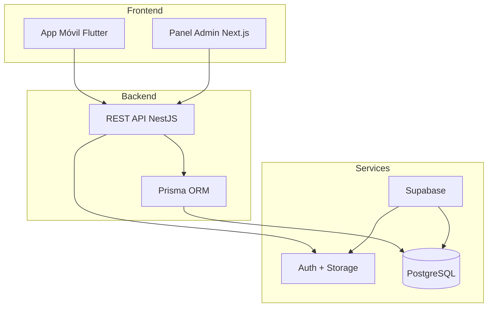

# Documentación SACDIA

**Sistema de Administración de Clubes del Ministerio Juvenil Adventista**

---

## 🎯 Por Dónde Empezar

### Backend Developer
1. Lee [Overview](01-OVERVIEW.md) para entender la arquitectura
2. Revisa [Database Guide](database/README.md) para el schema
3. Consulta [API Guide](api/README.md) para endpoints
4. Sigue [Implementation Roadmap](03-IMPLEMENTATION-ROADMAP.md)

### Mobile Developer
1. Lee [Overview](01-OVERVIEW.md) para el contexto
2. Revisa [Processes](02-PROCESSES.md) para flujos de usuario
3. Consulta [API Specification](api/API-SPECIFICATION.md) para endpoints
4. Revisa [Endpoints Reference](api/ENDPOINTS-REFERENCE.md) para integraciones

### Frontend/Admin Developer
1. Lee [Overview](01-OVERVIEW.md)
2. Revisa [API Specification](api/API-SPECIFICATION.md)
3. Consulta sistema RBAC en [Architecture Decisions](api/ARCHITECTURE-DECISIONS.md)

---

## 📚 Índice de Documentación

### Documentos Principales

| Documento | Descripción |
|-----------|-------------|
| [01-OVERVIEW.md](01-OVERVIEW.md) | Visión general del proyecto, stack tecnológico y arquitectura |
| [02-PROCESSES.md](02-PROCESSES.md) | Procesos de negocio detallados (Auth, Post-registro, etc.) |
| [03-IMPLEMENTATION-ROADMAP.md](03-IMPLEMENTATION-ROADMAP.md) | Roadmap de implementación por fases |

### Base de Datos

| Documento | Descripción |
|-----------|-------------|
| [database/README.md](database/README.md) | Guía de base de datos |
| [database/schema.prisma](database/schema.prisma) | Schema Prisma definitivo |
| [database/SCHEMA-REFERENCE.md](database/SCHEMA-REFERENCE.md) | Referencia completa del schema (tablas, relaciones, naming) |
| [database/migrations/](database/migrations/) | Scripts de migración SQL |

### REST API

| Documento | Descripción |
|-----------|-------------|
| [api/README.md](api/README.md) | Guía de la REST API |
| [api/API-SPECIFICATION.md](api/API-SPECIFICATION.md) | Especificación técnica completa v2.0 |
| [api/ENDPOINTS-REFERENCE.md](api/ENDPOINTS-REFERENCE.md) | Referencia de endpoints por proceso |
| [api/ARCHITECTURE-DECISIONS.md](api/ARCHITECTURE-DECISIONS.md) | Decisiones arquitectónicas (ADRs) |
| [api/walkthrough-backend-init.md](api/walkthrough-backend-init.md) | Walkthrough de inicialización del backend |

---

## 🏗️ Arquitectura General

---

## 🔗 Links Rápidos

### Stack Tecnológico
- **Backend**: NestJS 10.x + TypeScript + Prisma
- **Database**: PostgreSQL 15.x (Supabase)
- **Auth**: Supabase Auth (JWT)
- **Mobile**: Flutter + Riverpod + Clean Architecture
- **Admin**: Next.js 14 + shadcn/ui + TailwindCSS
- **Deploy**: Vercel Serverless

### Recursos Externos
- [Supabase Dashboard](https://supabase.com)
- [Prisma Docs](https://prisma.io/docs)
- [NestJS Docs](https://docs.nestjs.com)

---

## 📖 Glosario de Términos

- **SACDIA**: Sistema de Administración de Clubes del Ministerio Juvenil Adventista
- **RBAC**: Role-Based Access Control (sistema de permisos por roles)
- **Post-registro**: Proceso de completar perfil tras registro inicial
- **Club Instance**: Instancia específica de un tipo de club (Aventureros, Conquistadores, Guías Mayores)
- **Ecclesiastical Year**: Año eclesiástico para rastrear membresías anuales

## Ver También

- [Documentation Structure](DOCUMENTATION-STRUCTURE.md) - Estructura completa de la documentación

---

**Última actualización**: 2026-01-30  
**Mantenido por**: Equipo SACDIA
