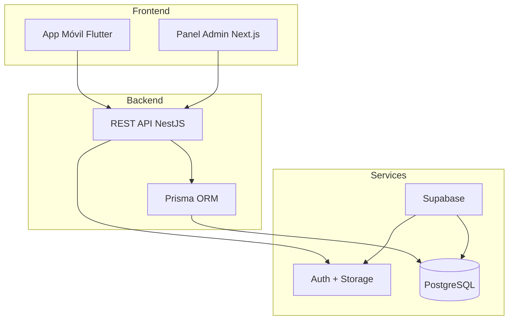

# Documentación SACDIA

**Sistema de Administración de Clubes del Ministerio Juvenil Adventista**

---

## 🎯 Por Dónde Empezar

### Backend Developer

1. Lee [Overview](01-OVERVIEW.md) para entender la arquitectura
2. Consulta [Database Reference](03-DATABASE/README.md)
3. Revisa [API Specification](02-API/API-SPECIFICATION.md)
4. Explora [Features](01-FEATURES/) para implementación específica

### Mobile Developer

1. Lee [Overview](01-OVERVIEW.md)
2. Revisa [Processes](02-PROCESSES.md) para flujos
3. Consulta [Features](01-FEATURES/) para detalles de cada módulo
4. Revisa [Endpoints Reference](02-API/ENDPOINTS-REFERENCE.md)

### Frontend/Admin Developer

1. Lee [Overview](01-OVERVIEW.md)
2. Consulta [Features](01-FEATURES/)
3. Revisa sistema RBAC en [Architecture Decisions](02-API/ARCHITECTURE-DECISIONS.md)

---

## 📚 Índice de Documentación Consolidada

### 00-STEERING (Estándares)

Guías rectoras del proyecto.

- [Product Vision](00-STEERING/product.md)
- [Tech Stack](00-STEERING/tech.md)
- [Coding Standards](00-STEERING/coding-standards.md)
- [Project Structure](00-STEERING/structure.md)

### 01-FEATURES (Módulos)

Documentación funcional y walkthroughs de implementación.

- **Auth & Users**: [Features/Auth](01-FEATURES/auth/)
- **Finanzas**: [Features/Finanzas](01-FEATURES/finanzas/)
- **Actividades**: [Features/Actividades](01-FEATURES/actividades/)
- **Certificaciones**: [Features/Certificaciones](01-FEATURES/certificaciones-guias-mayores/)
- **Infraestructura**: [Features/Infrastructure](01-FEATURES/infrastructure/)

### 02-API (Referencia Técnica)

- [API Specification](02-API/API-SPECIFICATION.md)
- [Endpoints Reference](02-API/ENDPOINTS-REFERENCE.md)
- [Testing Guide](02-API/TESTING-GUIDE.md)

### 03-DATABASE (Datos)

- [Schema Reference](03-DATABASE/SCHEMA-REFERENCE.md)
- [Migrations](03-DATABASE/migrations/)

### GUIDES (Guías Generales)

- [Spec-Driven Development](guides/spec-driven-development.md)
- [Deployment Guide](guides/deployment.md)

---

## 🏗️ Arquitectura General

---

## 🔗 Links Rápidos

### Stack Tecnológico

- **Backend**: NestJS 10.x + TypeScript + Prisma
- **Database**: PostgreSQL 15.x (Supabase)
- **Auth**: Supabase Auth (JWT)
- **Mobile**: Flutter + Riverpod + Clean Architecture
- **Admin**: Next.js 14 + shadcn/ui + TailwindCSS
- **Deploy**: Vercel Serverless

### Recursos Externos

- [Supabase Dashboard](https://supabase.com)
- [Prisma Docs](https://prisma.io/docs)
- [NestJS Docs](https://docs.nestjs.com)

---

## 📖 Glosario de Términos

- **SACDIA**: Sistema de Administración de Clubes del Ministerio Juvenil Adventista
- **RBAC**: Role-Based Access Control (sistema de permisos por roles)
- **Post-registro**: Proceso de completar perfil tras registro inicial
- **Club Instance**: Instancia específica de un tipo de club (Aventureros, Conquistadores, Guías Mayores)
- **Ecclesiastical Year**: Año eclesiástico para rastrear membresías anuales

## Ver También

- [Documentation Structure](DOCUMENTATION-STRUCTURE.md) - Estructura completa de la documentación

---

**Última actualización**: 2026-01-30  
**Mantenido por**: Equipo SACDIA
