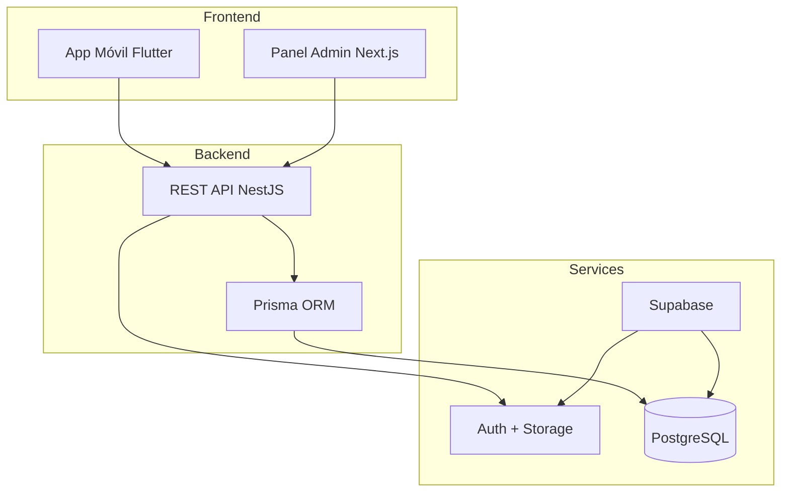

# Documentación SACDIA

**Sistema de Administración de Clubes del Ministerio Juvenil Adventista**
> [!IMPORTANT]
> Este directorio (`/docs` en el repositorio padre) es la fuente de verdad de documentación del proyecto.
> Si se actualiza backend, este índice y los documentos afectados deben sincronizarse aquí primero.

---

## 🎯 Por Dónde Empezar

### Backend Developer

1. Lee [Overview](01-OVERVIEW.md) para entender la arquitectura
2. Consulta [Database Reference](03-DATABASE/README.md)
3. Revisa [Live Endpoints Reference](02-API/ENDPOINTS-LIVE-REFERENCE.md) para contrato runtime
4. Usa [API Specification](02-API/API-SPECIFICATION.md) para decisiones técnicas/arquitectura

### Mobile Developer

1. Lee [Overview](01-OVERVIEW.md)
2. Revisa [Processes](02-PROCESSES.md) para flujos
3. Consulta [Features](01-FEATURES/) para detalles de cada módulo
4. Revisa [Live Endpoints Reference](02-API/ENDPOINTS-LIVE-REFERENCE.md)

### Frontend/Admin Developer

1. Lee [Overview](01-OVERVIEW.md)
2. Consulta [Features](01-FEATURES/)
3. Revisa [Live Endpoints Reference](02-API/ENDPOINTS-LIVE-REFERENCE.md)
4. Revisa sistema RBAC en [Architecture Decisions](02-API/ARCHITECTURE-DECISIONS.md)

---

## 📚 Índice de Documentación Consolidada

### 00-STEERING (Estándares)

Guías rectoras del proyecto.

- [Product Vision](00-STEERING/product.md)
- [Tech Stack](00-STEERING/tech.md)
- [Coding Standards](00-STEERING/coding-standards.md)
- [Project Structure](00-STEERING/structure.md)

### 01-FEATURES (Módulos)

Documentación funcional y walkthroughs de implementación.

- [Auth](01-FEATURES/auth/)
- [Actividades + Camporees](01-FEATURES/actividades/)
- [Catálogos](01-FEATURES/catalogos/)
- [Certificaciones / Guías Mayores](01-FEATURES/certificaciones-guias-mayores/)
- [Clases Progresivas](01-FEATURES/clases-progresivas/)
- [Comunicaciones (Push/Notificaciones)](01-FEATURES/communications/)
- [Finanzas](01-FEATURES/finanzas/)
- [Gestión de Clubs + Post-registro + Legal Reps](01-FEATURES/gestion-clubs/)
- [Gestión de Seguros](01-FEATURES/gestion-seguros/)
- [Honores](01-FEATURES/honores/)
- [Infrastructure](01-FEATURES/infrastructure/)
- [Inventario](01-FEATURES/inventario/)
- [Validación de Investiduras](01-FEATURES/validacion-investiduras/)

### 02-API (Referencia Técnica)

- [Live Endpoints Reference (Canónico para agentes)](02-API/ENDPOINTS-LIVE-REFERENCE.md)
- [API Specification (diseño técnico)](02-API/API-SPECIFICATION.md)
- [Endpoints Reference (legacy/histórico)](02-API/ENDPOINTS-REFERENCE.md)
- [Complete API Reference (legacy/histórico)](02-API/COMPLETE-API-REFERENCE.md)
- [Testing Guide](02-API/TESTING-GUIDE.md)
- [External Services Integration (actualizado)](02-API/EXTERNAL-SERVICES-INTEGRATION.md)
- [Session: Admin + Notifications Hardening](IMPLEMENTATION-SESSION-2026-02-13-admin-hardening.md)
- [Session: Admin Panel Delivery + QA/UAT](IMPLEMENTATION-SESSION-2026-02-17-admin-panel-delivery.md)

### 03-DATABASE (Datos)

- [Schema Reference](03-DATABASE/SCHEMA-REFERENCE.md)
- [Migrations](03-DATABASE/migrations/)

### GUIDES (Guías Generales)

- [Spec-Driven Development](guides/spec-driven-development.md)
- [Admin Panel Users Scope Integration](guides/ADMIN-PANEL-USERS-SCOPE-INTEGRATION.md)
- [Deployment Guide](DEPLOYMENT-GUIDE.md)

---

## 🏗️ Arquitectura General

```mermaid
graph TB
    subgraph "Frontend"
        MOBILE[App Móvil Flutter]
        ADMIN[Panel Admin Next.js]
    end

    subgraph "Backend"
        API[REST API NestJS]
        PRISMA[Prisma ORM]
    end

    subgraph "Services"
        SUPABASE[Supabase]
        AUTH[Auth + Storage]
        DB[(PostgreSQL)]
    end

    MOBILE --> API
    ADMIN --> API
    API --> PRISMA
    PRISMA --> DB
    API --> AUTH
    SUPABASE --> AUTH
    SUPABASE --> DB
```

---

## 🔗 Links Rápidos

### Stack Tecnológico

- **Backend**: NestJS 11.x + TypeScript + Prisma 7
- **Database**: PostgreSQL 15.x (Supabase)
- **Auth**: Supabase Auth (JWT)
- **Mobile**: Flutter + Riverpod + Clean Architecture
- **Admin**: Next.js 16 + shadcn/ui + TailwindCSS
- **Deploy**: Vercel Serverless

### Recursos Externos

- [Supabase Dashboard](https://supabase.com)
- [Prisma Docs](https://prisma.io/docs)
- [NestJS Docs](https://docs.nestjs.com)

---

## 📖 Glosario de Términos

- **SACDIA**: Sistema de Administración de Clubes del Ministerio Juvenil Adventista
- **RBAC**: Role-Based Access Control (sistema de permisos por roles)
- **Post-registro**: Proceso de completar perfil tras registro inicial
- **Club Instance**: Instancia específica de un tipo de club (Aventureros, Conquistadores, Guías Mayores)
- **Ecclesiastical Year**: Año eclesiástico para rastrear membresías anuales

## Ver También

- [Documentation Structure](DOCUMENTATION-STRUCTURE.md) - Estructura completa de la documentación

---

**Última actualización**: 2026-02-17
**Mantenido por**: Equipo SACDIA
