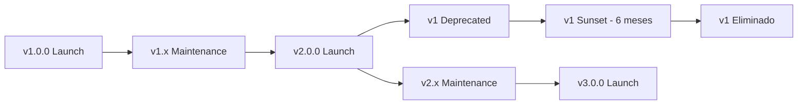

# API Versioning - SACDIA Backend

**Última actualización**: 30 de enero de 2026  
**Versión actual**: v1  
**Tipo de versionamiento**: URI-based

---

## 📋 Tabla de Contenidos

- [Introducción](#introducción)
- [Configuración Actual](#configuración-actual)
- [Estructura de Rutas](#estructura-de-rutas)
- [Cómo Funciona](#cómo-funciona)
- [Evolución a Futuras Versiones](#evolución-a-futuras-versiones)
- [Mejores Prácticas](#mejores-prácticas)
- [Ejemplos de Uso](#ejemplos-de-uso)

---

## Introducción

### ¿Por qué Versionamiento?

El versionamiento de API permite:

1. ✅ **Evolucionar sin romper clientes existentes**: Cambios incompatibles en v2 no afectan v1
2. ✅ **Soporte paralelo de múltiples versiones**: Mantener v1 mientras migramos a v2
3. ✅ **Deprecación controlada**: Anunciar con anticipación la descontinuación de versiones antiguas
4. ✅ **Testing flexible**: Probar v2 sin afectar producción en v1

### Estrategia Elegida: URI Versioning

Después de evaluar las opciones (Header, Query Param, Media Type), se eligió **URI Versioning**:

| ✅ Ventajas                  | ❌ Alternativas Descartadas       |
| ---------------------------- | --------------------------------- |
| Visible y explícito          | Header Versioning (menos visible) |
| Fácil de cachear             | Query Params (fácil de olvidar)   |
| Simple para clientes         | Media Type (complejo)             |
| Bien documentable en Swagger | -                                 |

**Estructura**: `/v{MAJOR}/{recurso}`

**Ejemplo**:

```
/v1/auth/register
/v2/users/:userId
```

---

## Configuración Actual

### NestJS Configuration

**Archivo**: `src/main.ts`

```typescript
import { VersioningType } from "@nestjs/common";

app.enableVersioning({
  type: VersioningType.URI,
  defaultVersion: "1", // ← Todos los endpoints usan v1 por defecto
});
```

### Características

- **Versión por defecto**: `1`
- **Prefijo automático**: Todos los controllers sin `@Version()` usan v1
- **Múltiples versiones**: Soporta v1, v2, v3... simultáneamente
- **Documentación**: Swagger integrado en `/api`

---

## Estructura de Rutas

### Versión 1 (Actual - 26 endpoints)

#### Auth (6)

```
POST   /v1/auth/register
POST   /v1/auth/login
POST   /v1/auth/logout
POST   /v1/auth/password/reset-request
GET    /v1/auth/me
GET    /v1/auth/profile/completion-status
```

#### Users (6)

```
GET    /v1/users/:userId
PATCH  /v1/users/:userId
POST   /v1/users/:userId/profile-picture
DELETE /v1/users/:userId/profile-picture
GET    /v1/users/:userId/age
GET    /v1/users/:userId/requires-legal-representative
```

#### Emergency Contacts (5)

```
POST   /v1/users/:userId/emergency-contacts
GET    /v1/users/:userId/emergency-contacts
GET    /v1/users/:userId/emergency-contacts/:contactId
PATCH  /v1/users/:userId/emergency-contacts/:contactId
DELETE /v1/users/:userId/emergency-contacts/:contactId
```

#### Legal Representatives (4)

```
POST   /v1/users/:userId/legal-representative
GET    /v1/users/:userId/legal-representative
PATCH  /v1/users/:userId/legal-representative
DELETE /v1/users/:userId/legal-representative
```

#### Post-Registration (4)

```
GET    /v1/users/:userId/post-registration/status
POST   /v1/users/:userId/post-registration/step-1/complete
POST   /v1/users/:userId/post-registration/step-2/complete
POST   /v1/users/:userId/post-registration/step-3/complete
```

#### Root (1)

```
GET    /v1/
```

---

## Cómo Funciona

### Comportamiento de Rutas

| URL Solicitada | Resultado        | Status  |
| -------------- | ---------------- | ------- |
| `/v1/auth/me`  | ✅ Funciona      | 200/401 |
| `/auth/me`     | ❌ No existe     | 404     |
| `/v2/auth/me`  | ❌ No existe aún | 404     |

**Importante**:

- ⚠️ **Solo rutas con `/v1/` funcionan**
- ⚠️ **No hay auto-redirect** de `/auth/me` a `/v1/auth/me`
- ⚠️ **Versiones inexistentes** retornan 404

### Testing de Versionamiento

#### ✅ Endpoint Existente (v1)

```bash
# Con autenticación
curl http://localhost:3000/v1/auth/me \
  -H "Authorization: Bearer {token}"

# Sin autenticación (esperado 401)
curl http://localhost:3000/v1/auth/me
# Response: {"message":"Unauthorized","statusCode":401}
```

#### ❌ Sin Versión

```bash
curl http://localhost:3000/auth/me
# Response: {"message":"Cannot GET /auth/me","error":"Not Found","statusCode":404}
```

#### ❌ Versión No Existente

```bash
curl http://localhost:3000/v2/auth/me
# Response: {"message":"Cannot GET /v2/auth/me","error":"Not Found","statusCode":404}
```

---

## Evolución a Futuras Versiones

### Versionado Semántico

Aunque en la URL solo usamos MAJOR version, internamente seguimos semver:

```
v{MAJOR}.{MINOR}.{PATCH}
```

- **MAJOR** (`v1`, `v2`): Breaking changes
- **MINOR**: Nuevas features retrocompatibles
- **PATCH**: Bug fixes

**Ejemplos**:

- `v1.0.0` → `v1.1.0`: Nuevo endpoint en v1 (retrocompatible)
- `v1.1.0` → `v1.1.1`: Fix de bug
- `v1.1.1` → `v2.0.0`: Cambio en estructura de response (breaking)

### Cuándo Crear v2

Crear **v2** cuando:

1. 🔴 **Breaking changes** en response structure
2. 🔴 **Cambios en autenticación** (JWT → OAuth2)
3. 🔴 **Reestructuración de endpoints** jerárquicos
4. 🔴 **Cambios en DTOs** que afectan contratos existentes

**No requiere v2**:

- ✅ Nuevos endpoints
- ✅ Nuevos campos opcionales en responses
- ✅ Bug fixes
- ✅ Mejoras de performance

---

## Implementación de v2

### Opción 1: Controlador Versioned

**Mejor para**: Cambios en endpoints específicos

```typescript
// auth.controller.ts
import { Controller, Get, Post, Version } from "@nestjs/common";

@Controller("auth")
@ApiTags("auth")
export class AuthController {
  // Endpoint en v1
  @Post("register")
  @Version("1")
  @ApiOperation({ summary: "Registro v1" })
  registerV1(@Body() dto: RegisterDtoV1) {
    return { version: "v1", ...data };
  }

  // Endpoint en v2 con cambios
  @Post("register")
  @Version("2")
  @ApiOperation({ summary: "Registro v2 (nueva estructura)" })
  registerV2(@Body() dto: RegisterDtoV2) {
    return {
      meta: { version: "v2" },
      data: { ...data },
    };
  }
}
```

**Resultado**:

```
POST /v1/auth/register → registerV1()
POST /v2/auth/register → registerV2()
```

---

### Opción 2: Controladores Separados

**Mejor para**: Cambios extensos en todo un módulo

```typescript
// auth/v1/auth.controller.v1.ts
@Controller({ path: "auth", version: "1" })
@ApiTags("auth-v1")
export class AuthControllerV1 {
  @Post("register")
  register(@Body() dto: RegisterDtoV1) {
    return { version: "v1", ...data };
  }
}

// auth/v2/auth.controller.v2.ts
@Controller({ path: "auth", version: "2" })
@ApiTags("auth-v2")
export class AuthControllerV2 {
  @Post("register")
  register(@Body() dto: RegisterDtoV2) {
    return {
      meta: { version: "v2" },
      data: { ...data },
    };
  }
}
```

**Estructura de directorios**:

```
src/
├── auth/
│   ├── v1/
│   │   ├── auth.controller.v1.ts
│   │   ├── auth.service.v1.ts
│   │   └── dto/
│   │       └── register.dto.v1.ts
│   ├── v2/
│   │   ├── auth.controller.v2.ts
│   │   ├── auth.service.v2.ts
│   │   └── dto/
│   │       └── register.dto.v2.ts
│   └── auth.module.ts
```

**Módulo**:

```typescript
@Module({
  controllers: [AuthControllerV1, AuthControllerV2],
  providers: [AuthServiceV1, AuthServiceV2, SharedAuthService],
  exports: [AuthServiceV1, AuthServiceV2],
})
export class AuthModule {}
```

---

### Opción 3: Versionado por Módulo Completo

**Mejor para**: Refactorización completa de la API

```typescript
// app.module.ts
@Module({
  imports: [
    AuthModuleV1,
    UsersModuleV1,
    // ...
    AuthModuleV2, // Nueva versión completa
    UsersModuleV2,
  ],
})
export class AppModule {}
```

---

## Swagger Multi-Version

### Documentación Separada por Versión

```typescript
// main.ts
const configV1 = new DocumentBuilder()
  .setTitle("SACDIA API v1")
  .setDescription("API versión 1 - Legacy")
  .setVersion("1.0.0")
  .addBearerAuth()
  .build();

const configV2 = new DocumentBuilder()
  .setTitle("SACDIA API v2")
  .setDescription("API versión 2 - Nueva estructura")
  .setVersion("2.0.0")
  .addBearerAuth()
  .build();

const documentV1 = SwaggerModule.createDocument(app, configV1, {
  include: [AuthModuleV1, UsersModuleV1],
});

const documentV2 = SwaggerModule.createDocument(app, configV2, {
  include: [AuthModuleV2, UsersModuleV2],
});

SwaggerModule.setup("api/v1", app, documentV1);
SwaggerModule.setup("api/v2", app, documentV2);
```

**URLs**:

- `http://localhost:3000/api/v1` → Docs V1
- `http://localhost:3000/api/v2` → Docs V2
- `http://localhost:3000/api` → Docs actual (todos)

---

## Mejores Prácticas

### 1. Política de Deprecación

```typescript
// Marcar endpoint como deprecated en v1
@Post('old-endpoint')
@Version('1')
@ApiOperation({
  summary: 'Endpoint legacy',
  deprecated: true,
  description: '⚠️ DEPRECATED: Use /v2/new-endpoint. Esta ruta se eliminará en v3.'
})
@ApiHeader({
  name: 'X-Deprecation-Warning',
  description: 'Advertencia de deprecación'
})
async oldEndpoint() {
  // Agregar header de warning
  response.setHeader(
    'X-Deprecation-Warning',
    'This endpoint is deprecated. Migrate to /v2/new-endpoint'
  );
  return data;
}
```

### 2. Header de Versión en Responses

```typescript
// common/interceptors/api-version.interceptor.ts
import {
  Injectable,
  NestInterceptor,
  ExecutionContext,
  CallHandler,
} from "@nestjs/common";
import { Observable } from "rxjs";
import { tap } from "rxjs/operators";

@Injectable()
export class ApiVersionInterceptor implements NestInterceptor {
  intercept(context: ExecutionContext, next: CallHandler): Observable<any> {
    const response = context.switchToHttp().getResponse();
    const request = context.switchToHttp().getRequest();

    // Extraer versión de la URL
    const versionMatch = request.url.match(/\/v(\d+)\//);
    const version = versionMatch ? versionMatch[1] : "1";

    return next.handle().pipe(
      tap(() => {
        response.setHeader("X-API-Version", `${version}.0.0`);
      }),
    );
  }
}

// Aplicar globalmente en main.ts
app.useGlobalInterceptors(new ApiVersionInterceptor());
```

**Resultado**:

```bash
curl -I http://localhost:3000/v1/auth/me
# Headers:
# X-API-Version: 1.0.0
```

### 3. Versionamiento de DTOs

```typescript
// v1/dto/user.dto.v1.ts
export class UserResponseV1 {
  id: string;
  name: string;
  email: string;
}

// v2/dto/user.dto.v2.ts
export class UserResponseV2 {
  meta: {
    version: string;
    timestamp: string;
  };
  data: {
    id: string;
    name: string;
    email: string;
    profile: {
      avatar: string;
      bio: string;
    };
  };
}
```

### 4. Compartir Lógica de Negocio

```typescript
// shared/auth.service.ts
@Injectable()
export class SharedAuthService {
  async authenticateUser(email: string, password: string) {
    // Lógica compartida entre v1 y v2
    return supabase.auth.signInWithPassword({ email, password });
  }
}

// v1/auth.service.v1.ts
@Injectable()
export class AuthServiceV1 {
  constructor(private sharedAuth: SharedAuthService) {}

  async login(dto: LoginDtoV1) {
    const result = await this.sharedAuth.authenticateUser(
      dto.email,
      dto.password,
    );
    return { token: result.access_token }; // Formato v1
  }
}

// v2/auth.service.v2.ts
@Injectable()
export class AuthServiceV2 {
  constructor(private sharedAuth: SharedAuthService) {}

  async login(dto: LoginDtoV2) {
    const result = await this.sharedAuth.authenticateUser(
      dto.email,
      dto.password,
    );
    return {
      meta: { version: "v2" },
      data: {
        accessToken: result.access_token,
        refreshToken: result.refresh_token,
      },
    }; // Formato v2
  }
}
```

### 5. Testing por Versión

```typescript
// e2e/auth.v1.e2e-spec.ts
describe("Auth V1 (e2e)", () => {
  it("/v1/auth/login (POST)", () => {
    return request(app.getHttpServer())
      .post("/v1/auth/login")
      .send({ email: "test@test.com", password: "pass123" })
      .expect(200)
      .expect((res) => {
        expect(res.body).toHaveProperty("token");
        expect(res.headers["x-api-version"]).toBe("1.0.0");
      });
  });
});

// e2e/auth.v2.e2e-spec.ts
describe("Auth V2 (e2e)", () => {
  it("/v2/auth/login (POST)", () => {
    return request(app.getHttpServer())
      .post("/v2/auth/login")
      .send({ email: "test@test.com", password: "pass123" })
      .expect(200)
      .expect((res) => {
        expect(res.body.meta.version).toBe("v2");
        expect(res.body.data).toHaveProperty("accessToken");
        expect(res.headers["x-api-version"]).toBe("2.0.0");
      });
  });
});
```

---

## Política de Soporte de Versiones

### Ciclo de Vida



### Reglas

1. **Soporte paralelo**: Máximo 2 versiones MAJOR simultáneamente
2. **Deprecación**: Avisar 6 meses antes de eliminar una versión
3. **Security patches**: Aplicar a TODAS las versiones soportadas
4. **Breaking changes**: Solo en nuevas versiones MAJOR

### Timeline Ejemplo

```
2026-01 → v1.0.0 lanzado
2026-06 → v1.1.0 (nuevos features)
2027-01 → v2.0.0 lanzado
         → v1.x marcado como "deprecated"
2027-07 → v1.x eliminado (sunset)
         → Solo v2.x soportado
```

---

## Ejemplos de Uso

### Frontend - React/Next.js

```typescript
// lib/api.ts
const API_BASE_URL = process.env.NEXT_PUBLIC_API_URL || "http://localhost:3000";
const API_VERSION = "v1"; // Fácil de cambiar a v2

export const apiClient = axios.create({
  baseURL: `${API_BASE_URL}/${API_VERSION}`,
  headers: {
    "Content-Type": "application/json",
  },
});

// Uso
const login = async (email: string, password: string) => {
  const response = await apiClient.post("/auth/login", { email, password });
  return response.data;
};
```

### Mobile - Flutter

```dart
class ApiService {
  static const String baseUrl = 'http://localhost:3000';
  static const String version = 'v1';

  static String get versionedUrl => '$baseUrl/$version';

  Future<Map<String, dynamic>> login(String email, String password) async {
    final response = await http.post(
      Uri.parse('$versionedUrl/auth/login'),
      body: jsonEncode({'email': email, 'password': password}),
    );
    return jsonDecode(response.body);
  }
}
```

### cURL - Testing

```bash
# Variables
API_URL="http://localhost:3000"
VERSION="v1"
TOKEN="eyJhbGciOiJIUzI1NiIsInR5cCI6IkpXVCJ9..."

# Login
curl -X POST "${API_URL}/${VERSION}/auth/login" \
  -H "Content-Type: application/json" \
  -d '{"email":"test@test.com","password":"pass123"}'

# Get profile
curl "${API_URL}/${VERSION}/auth/me" \
  -H "Authorization: Bearer ${TOKEN}"

# Upload foto
curl -X POST "${API_URL}/${VERSION}/users/123/profile-picture" \
  -H "Authorization: Bearer ${TOKEN}" \
  -F "file=@photo.jpg"
```

---

## Migración a v2 (Futuro)

### Checklist de Migración

Cuando llegue el momento de crear v2:

- [ ] **Planificación**
  - [ ] Documentar todos los breaking changes
  - [ ] Crear RFC (Request for Comments) con equipo
  - [ ] Definir timeline de deprecación de v1

- [ ] **Desarrollo**
  - [ ] Crear carpeta `v2/` en módulos afectados
  - [ ] Implementar nuevos DTOs
  - [ ] Actualizar services con nueva lógica
  - [ ] Crear controllers v2

- [ ] **Testing**
  - [ ] E2E tests para v2
  - [ ] Tests de regresión para v1
  - [ ] Performance tests comparativos

- [ ] **Documentación**
  - [ ] Swagger separado para v2
  - [ ] Migration guide para clientes
  - [ ] Changelog detallado

- [ ] **Deployment**
  - [ ] Deploy v2 en beta
  - [ ] Monitoreo de errores
  - [ ] Gradual rollout a clientes

- [ ] **Deprecación v1**
  - [ ] Agregar headers de warning
  - [ ] Marcar endpoints como `@deprecated` en Swagger
  - [ ] Comunicar a todos los clientes
  - [ ] Establecer fecha de sunset

---

## Troubleshooting

### Problema: 404 en endpoints sin versión

```bash
curl http://localhost:3000/auth/me
# Error: Cannot GET /auth/me
```

**Solución**: Siempre incluir `/v1/`

```bash
curl http://localhost:3000/v1/auth/me
```

---

### Problema: Cliente usa v2 pero no existe

```bash
curl http://localhost:3000/v2/auth/me
# Error: Cannot GET /v2/auth/me
```

**Solución**: Verificar versión soportada en documentación

---

### Problema: Endpoints duplicados en Swagger

**Causa**: Controller tiene `@Version()` y también `defaultVersion`

**Solución**: Remover `@Version()` si quieres usar default:

```typescript
// ❌ Problemático
@Controller({ path: "auth", version: "1" }) // Ya tiene versión
export class AuthController {
  @Get()
  @Version("1") // ← Duplicado
  getProfile() {}
}

// ✅ Correcto
@Controller("auth") // Sin versión = usa default
export class AuthController {
  @Get()
  getProfile() {} // Automáticamente en v1
}
```

---

## Referencias

- [NestJS Versioning Documentation](https://docs.nestjs.com/techniques/versioning)
- [API Versioning Best Practices](https://www.troyhunt.com/your-api-versioning-is-wrong-which-is/)
- [Semantic Versioning](https://semver.org/)
- [Microsoft REST API Guidelines - Versioning](https://github.com/Microsoft/api-guidelines/blob/master/Guidelines.md#12-versioning)

---

## Changelog

### v1.0.0 (Enero 2026)

- ✅ Implementación inicial de versionamiento URI
- ✅ 26 endpoints en v1
- ✅ Swagger configurado
- ✅ Documentación completa

---

**Última revisión**: 30 de enero de 2026  
**Próxima revisión**: Al crear v2
