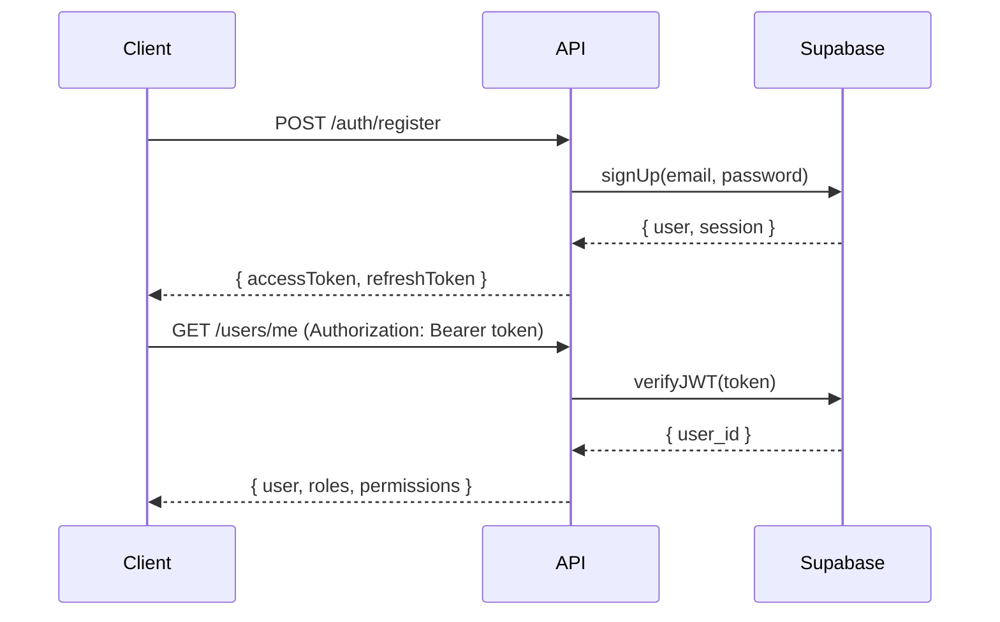

# REST API Documentation - SACDIA

Guía completa de la REST API construida con NestJS.

---

## 📋 Índice

1. [API Overview](#api-overview)
2. [Archivos de Referencia](#archivos-de-referencia)
3. [Autenticación](#autenticación)
4. [Sistema RBAC](#sistema-rbac)
5. [Endpoints Principales](#endpoints-principales)
6. [Cómo Probar la API](#cómo-probar-la-api)

---

## API Overview

### Stack Tecnológico

- **Framework**: NestJS 10.x + TypeScript 5.x
- **ORM**: Prisma 6.x
- **Auth**: Supabase Auth (JWT)
- **Validación**: class-validator + class-transformer
- **Documentación**: Swagger/OpenAPI
- **Seguridad**: Helmet, Throttler, CORS, 2FA, Token Blacklist, Session Limits
- **Deploy**: Vercel Serverless

### Base URL

```
Development:  http://localhost:3000/v1
Production:   https://sacdia-api.vercel.app/v1
```

### Versionado

**Estrategia**: URI-based (`/v1/`)

- Visible y cacheable
- Máximo 2 versiones mayores simultáneas
- Swagger multi-version

📖 **Documentación completa de versionamiento**: [API-VERSIONING.md](API-VERSIONING.md)

**Importante**: Todos los endpoints DEBEN incluir `/v1/` en la URL:

```bash
✅ curl http://localhost:3000/v1/auth/me
❌ curl http://localhost:3000/auth/me     # 404 Not Found
```

---

## Archivos de Referencia

| Documento                                                            | Descripción                                                          |
| -------------------------------------------------------------------- | -------------------------------------------------------------------- |
| [API-SPECIFICATION.md](API-SPECIFICATION.md)                         | **Especificación técnica completa** - DTOs, Guards, módulos          |
| [API-VERSIONING.md](API-VERSIONING.md)                               | **Versionamiento de API** - Configuración, ejemplos, best practices  |
| [SECURITY-GUIDE.md](SECURITY-GUIDE.md)                               | **Guía de seguridad** - 2FA, Token Blacklist, Sessions, IP Whitelist |
| [ENDPOINTS-REFERENCE.md](ENDPOINTS-REFERENCE.md)                     | **Referencia de endpoints** por proceso de negocio                   |
| [ARCHITECTURE-DECISIONS.md](ARCHITECTURE-DECISIONS.md)               | **ADRs** - Decisiones arquitectónicas documentadas                   |
| [walkthrough-backend-init.md](walkthrough-backend-init.md)           | Walkthrough de inicialización del backend                            |
| [walkthrough-users-emergency.md](walkthrough-users-emergency.md)     | Implementación Users + Emergency Contacts                            |
| [walkthrough-legal-rep-postreg.md](walkthrough-legal-rep-postreg.md) | Implementación Legal Reps + Post-Registration                        |
| [walkthrough-security.md](walkthrough-security.md)                   | Walkthrough de mejoras de seguridad (Fases 1-4)                      |

---

## Autenticación

### Flujo de Autenticación



### Endpoints de Auth

```http
POST   /api/v1/auth/register       # Registro
POST   /api/v1/auth/login          # Login
POST   /api/v1/auth/logout         # Logout
GET    /api/v1/auth/me             # Perfil con roles/permisos
POST   /api/v1/auth/password/reset-request
POST   /api/v1/auth/password/reset
```

### Headers Requeridos

```http
Authorization: Bearer {jwt_access_token}
Content-Type: application/json
```

---

## Sistema RBAC

### Categorías de Roles

La API implementa un sistema RBAC de dos niveles:

```typescript
enum RoleCategory {
  GLOBAL = "GLOBAL", // Roles de sistema
  CLUB = "CLUB", // Roles de instancia de club
}
```

### Roles Globales (tabla: `users_roles`)

Aplican a nivel sistema, sin restricción de club:

- **super_admin**: Acceso total
- **admin**: Administrador de campo local
- **coordinator**: Coordinador de unión
- **user**: Usuario estándar (asignado en registro)

### Roles de Club (tabla: `club_role_assignments`)

Aplican solo a instancias específicas de club:

- **director**: Director del club
- **subdirector**: Subdirector
- **secretary**: Secretario
- **treasurer**: Tesorero
- **counselor**: Consejero
- **member**: Miembro regular (asignado en post-registro)

### Guards

```typescript
// Ejemplo de uso en controlador
@Controller('clubs/:clubId/activities')
@UseGuards(SupabaseGuard, RolesGuard)
export class ActivitiesController {

  @Post()
  @Roles('director', 'subdirector')
  @Permissions('CREATE:ACTIVITIES')
  async create() { ... }
}
```

**Ver detalles**: [ARCHITECTURE-DECISIONS.md](ARCHITECTURE-DECISIONS.md#adr-002-sistema-rbac)

---

## Endpoints Principales

### Módulos Disponibles

```
/api/v1/
├── auth/                   # Autenticación
├── users/                  # Gestión de usuarios
│   ├── emergency-contacts/
│   ├── allergies/
│   ├── diseases/
│   ├── users-honors/
│   └── users-classes/
├── clubs/                  # Gestión de clubes
├── classes/                # Clases progresivas
└── catalogs/               # Catálogos maestros
    ├── roles/
    ├── permissions/
    ├── countries/
    ├── unions/
    ├── local-fields/
    ├── districts/
    ├── churches/
    ├── allergies/
    ├── diseases/
    ├── honors/
    └── club-types/
```

### Ejemplos de Uso

#### Registro de Usuario

```bash
curl -X POST http://localhost:3000/api/v1/auth/register \
  -H "Content-Type: application/json" \
  -d '{
    "email": "usuario@example.com",
    "password": "Password123",
    "name": "Juan",
    "paternal_last_name": "Pérez",
    "maternal_last_name": "García"
  }'
```

#### Login

```bash
curl -X POST http://localhost:3000/api/v1/auth/login \
  -H "Content-Type: application/json" \
  -d '{
    "email": "usuario@example.com",
    "password": "Password123"
  }'
```

#### Obtener Perfil

```bash
curl -X GET http://localhost:3000/api/v1/auth/me \
  -H "Authorization: Bearer {tu_access_token}"
```

### Respuestas Estándar

**Success**:

```json
{
  "status": "success",
  "data": {
    /* resource */
  },
  "meta": {
    "timestamp": "2026-01-30T10:00:00Z",
    "version": "1.0.0"
  }
}
```

**Error**:

```json
{
  "status": "error",
  "error": {
    "code": "VALIDATION_ERROR",
    "message": "Validation failed",
    "details": [...]
  }
}
```

**Paginated**:

```json
{
  "status": "success",
  "data": [
    /* items */
  ],
  "meta": {
    "pagination": {
      "page": 1,
      "limit": 20,
      "total": 150
    }
  }
}
```

---

## Cómo Probar la API

### Opción 1: Swagger UI

```bash
# Iniciar servidor
cd sacdia-backend
npm run start:dev

# Abrir Swagger en navegador
open http://localhost:3000/api/docs
```

### Opción 2: Postman/ThunderClient

1. Importa la colección desde Swagger JSON
2. Configura environment variables:
   - `BASE_URL`: `http://localhost:3000/api/v1`
   - `ACCESS_TOKEN`: (obtenido del login)

### Opción 3: cURL

Ver ejemplos en [ENDPOINTS-REFERENCE.md](ENDPOINTS-REFERENCE.md)

### Opción 4: Tests E2E

```bash
# Ejecutar tests
npm run test:e2e

# Con coverage
npm run test:e2e -- --coverage
```

---

## Comandos Útiles

### Desarrollo

```bash
npm run start:dev          # Modo watch
npm run start:debug        # Con debugger
```

### Build

```bash
npm run build              # Compilar TypeScript
npm run start:prod         # Producción
```

### Tests

```bash
npm run test               # Unit tests
npm run test:e2e           # E2E tests
npm run test:cov           # Con coverage
```

### Prisma

```bash
npx prisma studio          # GUI para ver/editar datos
npx prisma migrate dev     # Crear migración
npx prisma generate        # Generar cliente
```

---

## Estructura de Módulos

```
src/
├── modules/
│   ├── auth/              # AuthModule
│   ├── users/             # UsersModule
│   ├── clubs/             # ClubsModule
│   ├── classes/           # ClassesModule
│   └── catalogs/          # CatalogsModule
├── common/
│   ├── guards/            # SupabaseGuard, RolesGuard
│   ├── decorators/        # @Roles(), @Permissions()
│   ├── interceptors/      # Response transformation
│   └── filters/           # Exception handling
└── prisma/
    └── prisma.service.ts
```

---

## Próximos Pasos

1. **Explorar especificación**: Lee [API-SPECIFICATION.md](API-SPECIFICATION.md)
2. **Ver endpoints por proceso**: Consulta [ENDPOINTS-REFERENCE.md](ENDPOINTS-REFERENCE.md)
3. **Entender decisiones**: Revisa [ARCHITECTURE-DECISIONS.md](ARCHITECTURE-DECISIONS.md)
4. **Inicializar backend**: Sigue [walkthrough-backend-init.md](walkthrough-backend-init.md)

---

**Ver también**:

- [Database Schema](../database/SCHEMA-REFERENCE.md) - Modelos Prisma
- [Processes](../02-PROCESSES.md) - Procesos de negocio
- [Implementation Roadmap](../03-IMPLEMENTATION-ROADMAP.md) - Roadmap de desarrollo
