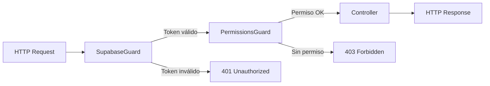

# 📋 Análisis Completo de la REST API - SACDIA

**Fecha de Análisis**: 27 de enero de 2026  
**Versión del Proyecto**: 0.0.1  
**Framework**: NestJS 10.x  
**Base de Datos**: PostgreSQL con Prisma ORM  
**Autenticación**: Supabase Auth con JWT

---

## 📑 Tabla de Contenidos

- [Resumen Ejecutivo](#resumen-ejecutivo)
- [Arquitectura y Tecnologías](#arquitectura-y-tecnologías)
- [Módulos y Controladores](#módulos-y-controladores)
- [Endpoints por Módulo](#endpoints-por-módulo)
  - [1. Authentication (Auth)](#1-authentication-auth)
  - [2. Users](#2-users)
  - [3. Clubs](#3-clubs)
  - [4. Classes](#4-classes)
  - [5. Catalogs](#5-catalogs)
  - [6. File Upload](#6-file-upload)
- [Patrones y Convenciones](#patrones-y-convenciones)
- [Seguridad y Autorización](#seguridad-y-autorización)
- [Respuestas Estándar](#respuestas-estándar)

---

## Resumen Ejecutivo

La REST API de SACDIA es una aplicación construida con **NestJS** que proporciona servicios backend para un sistema de administración de clubes de Conquistadores, Aventureros y Guías Mayores. La API cuenta con:

- **27 controladores** distribuidos en 6 módulos principales
- **150+ endpoints** para operaciones CRUD y funciones especializadas
- **Sistema RBAC** (Role-Based Access Control) avanzado con roles globales y de club
- **Autenticación JWT** mediante Supabase
- **ORM Prisma** para manejo de datos en PostgreSQL
- **Soft deletes** implementados en la mayoría de recursos

### Estadísticas Generales

| Módulo | Controladores | Endpoints Aprox. | Recursos Principales |
|--------|--------------|------------------|---------------------|
| Auth | 1 | 8 | Autenticación, perfiles |
| Users | 6 | 45+ | Usuarios, alergias, enfermedades, honores, clases, contactos |
| Clubs | 1 | 16 | Clubes, instancias, asignaciones de roles |
| Classes | 1 | 5 | Clases progresivas |
| Catalogs | 17 | 90+ | Roles, permisos, países, iglesias, distritos, etc. |
| File Upload | 1 | 1 | Imágenes de perfil |

---

## Arquitectura y Tecnologías

### Stack Tecnológico

```yaml
Backend:
  - Framework: NestJS 10.x
  - Lenguaje: TypeScript 5.x
  - ORM: Prisma 6.x
  - Base de Datos: PostgreSQL
  - Auth: Supabase Auth (JWT)
  - Documentación: Swagger (OpenAPI)

Dependencias Clave:
  - @nestjs/passport, @nestjs/jwt: Autenticación
  - @supabase/supabase-js: Cliente Supabase
  - class-validator, class-transformer: Validación DTOs
  - bcrypt: Hashing de contraseñas
```

### Arquitectura Modular

```
src/
├── modules/
│   ├── auth/                    # Autenticación y autorización
│   ├── users/                   # Gestión de usuarios
│   │   ├── emergency_contact/   
│   │   ├── users-allergies/    
│   │   ├── users-diseases/     
│   │   ├── users-honors/       
│   │   ├── users-classes/      
│   │   └── users.controller.ts
│   ├── clubs/                   # Gestión de clubes
│   ├── classes/                 # Clases progresivas
│   ├── catalogs/                # 17 catálogos
│   │   ├── roles/
│   │   ├── permissions/
│   │   ├── users-roles/
│   │   ├── role-permissions/
│   │   ├── club-role-assignments/
│   │   ├── countries/
│   │   ├── unions/
│   │   ├── local-fields/
│   │   ├── districts/
│   │   ├── churches/
│   │   ├── allergies/
│   │   ├── diseases/
│   │   ├── honors/
│   │   ├── honors-categories/
│   │   ├── master-honors/
│   │   ├── club_types/
│   │   └── relationship_types/
│   └── file_upload/             # Carga de archivos
├── common/
│   ├── guards/                  # SupabaseGuard, PermissionsGuard
│   ├── decorators/              # Decoradores personalizados
│   └── constants/               # Permisos y roles
└── prisma.service.ts
```

### Principios de Diseño

- **Servicio Genérico CRUD**: Reutilización de lógica común
- **Repository Pattern**: Separación de lógica de datos
- **Decoradores Personalizados**: `@Roles()`, `@Permissions()`, `@TransformResponse()`
- **Guards Centralizados**: Validación de JWT y permisos
- **Soft Deletes**: Preservación de datos históricos
- **Paginación por Cursor**: Para grandes conjuntos de datos

---

## Módulos y Controladores

### Mapa Completo de Controladores

```mermaid
graph TD
    API[SACDIA API]
    
    API --> AUTH[Auth Module]
    API --> USERS[Users Module]
    API --> CLUBS[Clubs Module]
    API --> CLASSES[Classes Module]
    API --> CATALOGS[Catalogs Module]
    API --> UPLOAD[File Upload Module]
    
    AUTH --> AUTH_CTRL[AuthController]
    
    USERS --> USERS_CTRL[UsersController]
    USERS --> EMERGENCY[EmergencyContactController]
    USERS --> ALLERGIES[UsersAllergiesController]
    USERS --> DISEASES[UsersDiseasesController]
    USERS --> HONORS[UsersHonorsController]
    USERS --> UCLASSES[UsersClassesController]
    
    CLUBS --> CLUBS_CTRL[ClubsController]
    
    CLASSES --> CLASSES_CTRL[ClassesController]
    
    CATALOGS --> ROLES[RolesController]
    CATALOGS --> PERMS[PermissionsController]
    CATALOGS --> ROLEPERMS[RolePermissionsController]
    CATALOGS --> USERSROLES[UsersRolesController]
    CATALOGS --> CLUBROLES[ClubRoleAssignmentsController]
    CATALOGS --> COUNTRIES[CountriesController]
    CATALOGS --> UNIONS[UnionsController]
    CATALOGS --> LOCALFIELDS[LocalFieldsController]
    CATALOGS --> DISTRICTS[DistrictsController]
    CATALOGS --> CHURCHES[ChurchesController]
    CATALOGS --> ALLERGIES_CAT[AllergiesController]
    CATALOGS --> DISEASES_CAT[DiseasesController]
    CATALOGS --> HONORS_CAT[HonorsController]
    CATALOGS --> HONORSCATS[HonorsCategoriesController]
    CATALOGS --> MASTERHONORS[MasterHonorsController]
    CATALOGS --> CLUBTYPES[ClubTypesController]
    CATALOGS --> RELTYPES[RelationshipTypesController]
    
    UPLOAD --> UPLOAD_CTRL[FileUploadController]
```



---

## Endpoints por Módulo

## 1. Authentication (Auth)

**Base URL**: `/auth`  
**Controlador**: `AuthController`

| Método | Endpoint | Auth | Descripción | Body/Params |
|--------|----------|------|-------------|-------------|
| `POST` | `/auth/signup` | ❌ | Registrar nuevo usuario | `{ email, password, name, p_lastname, m_lastname }` |
| `POST` | `/auth/signin` | ❌ | Iniciar sesión | `{ email, password }` |
| `POST` | `/auth/signout` | ✅ | Cerrar sesión | Bearer Token |
| `POST` | `/auth/request-password-reset` | ❌ | Solicitar reset de contraseña | `{ email }` |
| `POST` | `/auth/password-reset` | ❌ | Resetear contraseña | `{ newPassword }` |
| `POST` | `/auth/pr-check` | ✅ | Verificar si perfil está completo | - |
| `POST` | `/auth/pr-complete` | ✅ | Marcar perfil como completo | - |
| `GET` | `/auth/profile` | ✅ | Obtener perfil con roles y permisos | - |

### Funcionalidades Clave

- **Signup**: Crea usuario en Supabase Auth y en la base de datos
- **Signin**: Retorna JWT tokens (access + refresh)
- **Profile**: Incluye roles globales, roles de club y permisos
- **PR (Profile Registration)**: Sistema de onboarding

---

## 2. Users

### 2.1 Users (Principal)

**Base URL**: `/users`  
**Controlador**: `UsersController`  
**Guards**: `SupabaseGuard`, `PermissionsGuard`

| Método | Endpoint | Permiso | Descripción | Parámetros |
|--------|----------|---------|-------------|------------|
| `GET` | `/users` | `READ_USERS` | Listar usuarios con paginación | `?skip=0&take=10&cursor=&where={}&orderBy={}` |
| `GET` | `/users/:id` | `READ_USERS` | Obtener usuario por ID | `id: UUID` |
| `PATCH` | `/users/:id` | `UPDATE_USERS` | Actualizar usuario | `id: UUID, body: UpdateUserDto` |
| `DELETE` | `/users/:id` | `DELETE_USERS` | Eliminar usuario (soft delete) | `id: UUID` |

### 2.2 Emergency Contacts

**Base URL**: `/users/emergency-contacts`  
**Controlador**: `EmergencyContactController`

| Método | Endpoint | Permiso | Descripción |
|--------|----------|---------|-------------|
| `POST` | `/users/emergency-contacts` | `CREATE:EMERGENCY_CONTACTS` | Crear contacto de emergencia |
| `GET` | `/users/emergency-contacts` | `READ:EMERGENCY_CONTACTS` | Listar contactos |
| `GET` | `/users/emergency-contacts/all?userId=` | `READ:EMERGENCY_CONTACTS` | Contactos por usuario |
| `GET` | `/users/emergency-contacts/:id` | `READ:EMERGENCY_CONTACTS` | Obtener por ID |
| `PATCH` | `/users/emergency-contacts/:id` | `UPDATE:EMERGENCY_CONTACTS` | Actualizar |
| `DELETE` | `/users/emergency-contacts/:id` | `DELETE:EMERGENCY_CONTACTS` | Eliminar (soft) |

### 2.3 Users Allergies

**Base URL**: `/users/allergies`  
**Controlador**: `UsersAllergiesController`

| Método | Endpoint | Permiso | Descripción |
|--------|----------|---------|-------------|
| `POST` | `/users/allergies` | `CREATE:USERS_ALLERGIES` | Asignar alergia a usuario |
| `POST` | `/users/allergies/many` | `CREATE:USERS_ALLERGIES` | Asignar múltiples alergias |
| `POST` | `/users/allergies/assign-allergies` | `CREATE:USERS_ALLERGIES` | Asignar IDs de alergias a usuario |
| `GET` | `/users/allergies` | `READ:USERS_ALLERGIES` | Listar asignaciones |
| `GET` | `/users/allergies/:id` | `READ:USERS_ALLERGIES` | Obtener por ID |
| `GET` | `/users/allergies/by-user/:userId` | `READ:USERS_ALLERGIES` | Alergias de un usuario |
| `GET` | `/users/allergies/by-allergy/:allergyId` | `READ:USERS_ALLERGIES` | Usuarios con alergia |
| `PATCH` | `/users/allergies/:id` | `UPDATE:USERS_ALLERGIES` | Actualizar |
| `DELETE` | `/users/allergies/:id` | `DELETE:USERS_ALLERGIES` | Eliminar |
| `DELETE` | `/users/allergies/by-user/:userId` | `DELETE:USERS_ALLERGIES` | Eliminar todas las alergias del usuario |
| `DELETE` | `/users/allergies/by-user-allergy/:userId/:allergyId` | `DELETE:USERS_ALLERGIES` | Eliminar alergia específica |

### 2.4 Users Diseases

**Base URL**: `/users/diseases`  
**Controlador**: `UsersDiseasesController`

Los endpoints son idénticos a `users-allergies` pero para enfermedades:

- Misma estructura de endpoints
- Permiso: `CREATE/READ/UPDATE/DELETE:USERS_DISEASES`
- Incluye `assign-diseases` para asignar múltiples enfermedades
- Filtros por usuario y por enfermedad

### 2.5 Users Honors

**Base URL**: `/users/users-honors`  
**Controlador**: `UsersHonorsController`

| Método | Endpoint | Permiso | Descripción |
|--------|----------|---------|-------------|
| `POST` | `/users/users-honors` | `CREATE:USER_HONORS` | Asignar honor a usuario |
| `GET` | `/users/users-honors` | `READ:USER_HONORS` | Listar honores asignados |
| `GET` | `/users/users-honors/:id` | `READ:USER_HONORS` | Obtener por ID |
| `GET` | `/users/users-honors/:userId/by-category` | `READ:USER_HONORS` | Honores agrupados por categoría |
| `PATCH` | `/users/users-honors/:id` | `UPDATE:USER_HONORS` | Actualizar |
| `DELETE` | `/users/users-honors/:id` | `DELETE:USER_HONORS` | Eliminar |

**Funcionalidad Especial**: Endpoint para obtener honores agrupados por categoría (facilita visualización en la app).

### 2.6 Users Classes

**Base URL**: `/users/users-classes`  
**Controlador**: `UsersClassesController`

| Método | Endpoint | Permiso | Descripción |
|--------|----------|---------|-------------|
| `POST` | `/users/users-classes/add` | `CREATE:USERS_CLASSES` | Agregar clase a usuario |
| `GET` | `/users/users-classes` | `READ:USERS_CLASSES` | Listar asignaciones |
| `GET` | `/users/users-classes/:id` | `READ:USERS_CLASSES` | Obtener por ID |
| `GET` | `/users/users-classes/by-user/:userId` | `READ:USERS_CLASSES` | Clases de un usuario |
| `GET` | `/users/users-classes/by-class/:classId` | `READ:USERS_CLASSES` | Usuarios en una clase |
| `PATCH` | `/users/users-classes/:id` | `UPDATE:USERS_CLASSES` | Actualizar |
| `DELETE` | `/users/users-classes/:id` | `DELETE:USERS_CLASSES` | Eliminar (soft) |

---

## 3. Clubs

**Base URL**: `/clubs` (custom decorator)  
**Controlador**: `ClubsController`  
**Decorador Personalizado**: `@ClubController('')`

| Método | Endpoint | Permiso | Descripción |
|--------|----------|---------|-------------|
| `POST` | `/clubs` | `CREATE:CLUBS` | Crear club contenedor + instancias |
| `POST` | `/clubs/many` | `CREATE:CLUBS` | Crear múltiples clubes |
| `GET` | `/clubs` | `READ:CLUBS` | Listar clubes con paginación |
| `GET` | `/clubs/:id` | `READ:CLUBS` | Obtener club por ID |
| `GET` | `/clubs/by-district/:districtId` | `READ:CLUBS` | Clubes por distrito |
| `GET` | `/clubs/by-local-field/:localFieldId` | `READ:CLUBS` | Clubes por campo local |
| `GET` | `/clubs/by-church/:churchId` | `READ:CLUBS` | Clubes por iglesia |
| `GET` | `/clubs/search?term=` | `READ:CLUBS` | Buscar clubes |
| `PATCH` | `/clubs/:id` | `UPDATE:CLUBS` | Actualizar club |
| `DELETE` | `/clubs/:id` | `DELETE:CLUBS` | Eliminar club (soft) |
| `POST` | `/clubs/:mainClubId/adventurers` | `CREATE:CLUB_INSTANCES` | Crear instancia de Aventureros |
| `POST` | `/clubs/:mainClubId/pathfinders` | `CREATE:CLUB_INSTANCES` | Crear instancia de Conquistadores |
| `POST` | `/clubs/:mainClubId/master-guides` | `CREATE:CLUB_INSTANCES` | Crear instancia de Guías Mayores |
| `GET` | `/clubs/:id/types` | `READ:CLUBS` | Obtener tipos/instancias del club |
| `POST` | `/clubs/assign-member` | `ASSIGN:CLUB_MEMBERS` | Asignar miembro a club (automático) |
| `POST` | `/clubs/assign-role` | `ASSIGN_CLUB_ROLE` | Asignar rol específico en club |

### Funcionalidades Clave

**Modelo de Club Contenedor**:
- Un club principal puede tener instancias de Aventureros, Conquistadores y Guías Mayores
- Cada instancia tiene su propia configuración y miembros

**Sistema de Asignaciones**:
- **assign-member**: Asigna automáticamente el rol "member" a un usuario en el club
- **assign-role**: Asigna roles específicos (director, secretario, etc.)
- Asignaciones tienen temporalidad: `start_date`, `end_date`, `active`
- Solo uno de los tres tipos de club puede estar asignado por registro

**Búsqueda y Filtrado**:
- Por distrito, campo local, iglesia
- Búsqueda por término (nombre)

---

## 4. Classes

**Base URL**: `/classes`  
**Controlador**: `ClassesController`  
**Decorador**: `@ClassesController('classes')`

| Método | Endpoint | Permiso | Descripción |
|--------|----------|---------|-------------|
| `POST` | `/classes` | `CREATE:CLASSES` | Crear clase progresiva |
| `GET` | `/classes` | `READ:CLASSES` | Listar clases (default take=100) |
| `GET` | `/classes/:id` | `READ:CLASSES` | Obtener clase por ID |
| `PATCH` | `/classes/:id` | `UPDATE:CLASSES` | Actualizar clase |
| `DELETE` | `/classes/:id` | `DELETE:CLASSES` | Eliminar clase (soft) |

**Nota**: Las clases progresivas incluyen Amigo, Compañero, Explorador, Pionero, Excursionista, Guía, etc.

---

## 5. Catalogs

El módulo de catálogos contiene 17 sub-controladores. La mayoría sigue un patrón CRUD estándar.

### Patrón Estándar de Catálogos

Los siguientes catálogos comparten una estructura similar:

```
POST   /catalogs/{resource}              # Crear uno
POST   /catalogs/{resource}/many         # Crear múltiples
GET    /catalogs/{resource}              # Listar (paginado)
GET    /catalogs/{resource}/:id          # Obtener por ID
GET    /catalogs/{resource}/search?term= # Buscar (algunos)
PATCH  /catalogs/{resource}/:id          # Actualizar
DELETE /catalogs/{resource}/:id          # Eliminar (soft)
```

**Decoradores**: `@CatalogController('{resource}')`, `@CreateCatalog()`, `@ReadCatalog()`, etc.

---

### 5.1 Roles

**Base URL**: `/catalogs/roles`  
**Tabla**: `roles`

> Ver documento `endpoints-roles-permisos.md` para detalles completos

| Método | Endpoint | Descripción |
|--------|----------|-------------|
| `POST` | `/catalogs/roles` | Crear rol |
| `POST` | `/catalogs/roles/many` | Crear múltiples roles |
| `GET` | `/catalogs/roles` | Listar roles |
| `GET` | `/catalogs/roles/:id` | Obtener rol por ID |
| `GET` | `/catalogs/roles/search?term=` | Buscar roles |
| `GET` | `/catalogs/roles/user-role` | Obtener ID del rol "user" |
| `PATCH` | `/catalogs/roles/:id` | Actualizar rol |
| `DELETE` | `/catalogs/roles/:id` | Eliminar rol (soft) |

**Campos**: `role_name`, `role_category` (GLOBAL/CLUB), `active`

---

### 5.2 Permissions

**Base URL**: `/catalogs/permissions`  
**Tabla**: `permissions`

| Método | Endpoint | Descripción |
|--------|----------|-------------|
| `POST` | `/catalogs/permissions` | Crear permiso |
| `POST` | `/catalogs/permissions/many` | Crear múltiples permisos |
| `GET` | `/catalogs/permissions` | Listar permisos |
| `GET` | `/catalogs/permissions/names` | Obtener nombres de permisos |
| `GET` | `/catalogs/permissions/:id` | Obtener permiso por ID |
| `GET` | `/catalogs/permissions/search?term=` | Buscar permisos |
| `PUT` | `/catalogs/permissions/:id` | Actualizar permiso |
| `DELETE` | `/catalogs/permissions/:id` | Eliminar permiso |
| `POST` | `/catalogs/permissions/assign-to-roles` | Asignar permisos a múltiples roles |

**Campos**: `permission_name` (ej: "create:users"), `description`, `active`

**Funcionalidad Especial**: `/assign-to-roles` permite asignar los mismos permisos a varios roles en una sola operación.

---

### 5.3 Role Permissions

**Base URL**: `/catalogs/role-permissions`  
**Tabla**: `role_permissions` (tabla pivote)

| Método | Endpoint | Descripción |
|--------|----------|-------------|
| `POST` | `/catalogs/role-permissions` | Crear relación rol-permiso |
| `POST` | `/catalogs/role-permissions/many` | Crear múltiples relaciones |
| `POST` | `/catalogs/role-permissions/assign-permissions` | Asignar permisos a un rol |
| `GET` | `/catalogs/role-permissions` | Listar relaciones |
| `GET` | `/catalogs/role-permissions/:id` | Obtener relación por ID |
| `GET` | `/catalogs/role-permissions/by-role/:roleId` | Permisos de un rol |
| `PATCH` | `/catalogs/role-permissions/:id` | Actualizar relación |
| `DELETE` | `/catalogs/role-permissions/:id` | Eliminar relación |
| `DELETE` | `/catalogs/role-permissions/by-role/:roleId` | Eliminar todos los permisos de un rol |
| `DELETE` | `/catalogs/role-permissions/by-role-permission/:roleId/:permissionId` | Eliminar permiso específico de rol |

---

### 5.4 Users Roles (Roles Globales)

**Base URL**: `/catalogs/users-roles`  
**Tabla**: `users_roles`

| Método | Endpoint | Descripción |
|--------|----------|-------------|
| `POST` | `/catalogs/users-roles` | Asignar rol a usuario |
| `POST` | `/catalogs/users-roles/many` | Múltiples asignaciones |
| `POST` | `/catalogs/users-roles/assign-roles` | Asignar roles a usuario |
| `POST` | `/catalogs/users-roles/assign-users` | Asignar usuarios a rol |
| `GET` | `/catalogs/users-roles` | Listar asignaciones |
| `GET` | `/catalogs/users-roles/:id` | Obtener asignación por ID |
| `GET` | `/catalogs/users-roles/by-user/:userId` | Roles de un usuario |
| `GET` | `/catalogs/users-roles/by-role/:roleId` | Usuarios con un rol |
| `PATCH` | `/catalogs/users-roles/:id` | Actualizar asignación |
| `DELETE` | `/catalogs/users-roles/:id` | Eliminar asignación |
| `DELETE` | `/catalogs/users-roles/by-user/:userId` | Eliminar todos los roles de usuario |
| `DELETE` | `/catalogs/users-roles/by-role/:roleId` | Eliminar todos los usuarios de rol |
| `DELETE` | `/catalogs/users-roles/by-user-role/:userId/:roleId` | Eliminar rol específico de usuario |

---

### 5.5 Club Role Assignments (Roles de Club)

**Base URL**: `/clubs/club-role-assignments`  
**Tabla**: `club_role_assignments`

| Método | Endpoint | Descripción |
|--------|----------|-------------|
| `POST` | `/clubs/club-role-assignments` | Asignar rol de club |
| `GET` | `/clubs/club-role-assignments` | Listar asignaciones de club |
| `GET` | `/clubs/club-role-assignments/:assignment_id` | Obtener asignación por ID |
| `PATCH` | `/clubs/club-role-assignments/:assignment_id` | Actualizar asignación |
| `DELETE` | `/clubs/club-role-assignments/:assignment_id` | Eliminar asignación |

**Query Params para GET**:
- `user_id`: Filtrar por usuario
- `role_id`: Filtrar por rol
- `club_type`: `adventurers`, `pathfinders`, `master_guild`

**Diferencia con Users Roles**:
- `users_roles`: Roles GLOBALES (admin, super_admin, user)
- `club_role_assignments`: Roles dentro de CLUBS específicos (director, secretario, consejero)
- Incluye temporalidad: `start_date`, `end_date`, `is_active`

---

### 5.6 Countries

**Base URL**: `/catalogs/countries`  
**Tabla**: `countries`

| Método | Endpoint | Descripción |
|--------|----------|-------------|
| `POST` | `/catalogs/countries` | Crear país |
| `POST` | `/catalogs/countries/many` | Crear múltiples países |
| `GET` | `/catalogs/countries` | Listar países |
| `GET` | `/catalogs/countries/:id` | Obtener país por ID |
| `GET` | `/catalogs/countries/search?term=` | Buscar países |
| `PATCH` | `/catalogs/countries/:id` | Actualizar país |
| `DELETE` | `/catalogs/countries/:id` | Eliminar país (soft) |

---

### 5.7 Unions

**Base URL**: `/catalogs/unions`  
**Tabla**: `unions`

| Método | Endpoint | Descripción |
|--------|----------|-------------|
| `POST` | `/catalogs/unions` | Crear unión |
| `POST` | `/catalogs/unions/many` | Crear múltiples uniones |
| `GET` | `/catalogs/unions` | Listar uniones |
| `GET` | `/catalogs/unions/:id` | Obtener unión por ID |
| `GET` | `/catalogs/unions/by-country/:countryId` | Uniones por país |
| `GET` | `/catalogs/unions/search?term=` | Buscar uniones |
| `PATCH` | `/catalogs/unions/:id` | Actualizar unión |
| `DELETE` | `/catalogs/unions/:id` | Eliminar unión (soft) |

**Jerarquía**: Country → Union → Local Field → District → Church → Club

---

### 5.8 Local Fields

**Base URL**: `/c/lf` (catalogs/local-fields)  
**Tabla**: `local_fields`

| Método | Endpoint | Descripción |
|--------|----------|-------------|
| `POST` | `/c/lf` | Crear campo local |
| `GET` | `/c/lf` | Listar campos locales |
| `GET` | `/c/lf/:id` | Obtener campo por ID |
| `PATCH` | `/c/lf/:id` | Actualizar campo |
| `DELETE` | `/c/lf/:id?soft=true` | Eliminar campo (soft/hard) |

**Nota**: Implementa validación de parámetros JSON con manejo de errores robusto.

---

### 5.9 Districts

**Base URL**: `/catalogs/districts`  
**Tabla**: `districts`

| Método | Endpoint | Descripción |
|--------|----------|-------------|
| `POST` | `/catalogs/districts` | Crear distrito |
| `POST` | `/catalogs/districts/many` | Crear múltiples distritos |
| `GET` | `/catalogs/districts` | Listar distritos |
| `GET` | `/catalogs/districts/:id` | Obtener distrito por ID |
| `GET` | `/catalogs/districts/by-local-field/:localFieldId` | Distritos por campo local |
| `GET` | `/catalogs/districts/search?term=` | Buscar distritos |
| `PATCH` | `/catalogs/districts/:id` | Actualizar distrito |
| `DELETE` | `/catalogs/districts/:id` | Eliminar distrito (soft) |

---

### 5.10 Churches

**Base URL**: `/catalogs/churches`  
**Tabla**: `churches`

| Método | Endpoint | Descripción |
|--------|----------|-------------|
| `POST` | `/catalogs/churches` | Crear iglesia |
| `GET` | `/catalogs/churches` | Listar iglesias |
| `GET` | `/catalogs/churches/:id` | Obtener iglesia por ID |
| `PATCH` | `/catalogs/churches/:id` | Actualizar iglesia |
| `DELETE` | `/catalogs/churches/:id` | Eliminar iglesia |

---

### 5.11 Allergies

**Base URL**: `/catalogs/allergies`  
**Tabla**: `allergies`

Patrón estándar CRUD:
- POST, GET (list), GET /:id, PATCH /:id, DELETE /:id
- Sin búsqueda ni múltiples creaciones

---

### 5.12 Diseases

**Base URL**: `/catalogs/diseases`  
**Tabla**: `diseases`

| Método | Endpoint | Descripción |
|--------|----------|-------------|
| `POST` | `/catalogs/diseases` | Crear enfermedad |
| `POST` | `/catalogs/diseases/many` | Crear múltiples enfermedades |
| `GET` | `/catalogs/diseases` | Listar enfermedades |
| `GET` | `/catalogs/diseases/:id` | Obtener enfermedad por ID |
| `GET` | `/catalogs/diseases/search?term=` | Buscar enfermedades |
| `PATCH` | `/catalogs/diseases/:id` | Actualizar enfermedad |
| `DELETE` | `/catalogs/diseases/:id` | Eliminar enfermedad (soft) |

---

### 5.13 Honors

**Base URL**: `/catalogs/honors`  
**Tabla**: `honors`

| Método | Endpoint | Descripción |
|--------|----------|-------------|
| `POST` | `/catalogs/honors` | Crear honor |
| `POST` | `/catalogs/honors/many` | Crear múltiples honores |
| `GET` | `/catalogs/honors` | Listar honores |
| `GET` | `/catalogs/honors/:id` | Obtener honor por ID |
| `GET` | `/catalogs/honors/by-category` | Honores agrupados por categoría |
| `GET` | `/catalogs/honors/search?term=` | Buscar honores |
| `PATCH` | `/catalogs/honors/:id` | Actualizar honor |
| `DELETE` | `/catalogs/honors/:id` | Eliminar honor (soft) |

**Funcionalidad Especial**: Endpoint para agrupar honores por categoría.

---

### 5.14 Honors Categories

**Base URL**: `/catalogs/honors-categories`  
**Tabla**: `honors_categories`

| Método | Endpoint | Descripción |
|--------|----------|-------------|
| `POST` | `/catalogs/honors-categories` | Crear categoría |
| `POST` | `/catalogs/honors-categories/many` | Crear múltiples categorías |
| `GET` | `/catalogs/honors-categories` | Listar categorías |
| `GET` | `/catalogs/honors-categories/:id` | Obtener categoría por ID |
| `GET` | `/catalogs/honors-categories/search?term=` | Buscar categorías |
| `PATCH` | `/catalogs/honors-categories/:id` | Actualizar categoría |
| `DELETE` | `/catalogs/honors-categories/:id` | Eliminar categoría (soft) |

---

### 5.15 Master Honors

**Base URL**: `/catalogs/master-honors`  
**Tabla**: `master_honors`

| Método | Endpoint | Descripción |
|--------|----------|-------------|
| `POST` | `/catalogs/master-honors` | Crear honor de Guía Mayor |
| `POST` | `/catalogs/master-honors/many` | Crear múltiples honores |
| `GET` | `/catalogs/master-honors` | Listar honores de GM |
| `GET` | `/catalogs/master-honors/:id` | Obtener honor por ID |
| `GET` | `/catalogs/master-honors/search?term=` | Buscar honores |
| `PATCH` | `/catalogs/master-honors/:id` | Actualizar honor |
| `DELETE` | `/catalogs/master-honors/:id` | Eliminar honor (soft) |

---

### 5.16 Club Types

**Base URL**: `/catalogs/club-types`  
**Tabla**: `club_types`

| Método | Endpoint | Descripción |
|--------|----------|-------------|
| `POST` | `/catalogs/club-types` | Crear tipo de club |
| `POST` | `/catalogs/club-types/many` | Crear múltiples tipos |
| `GET` | `/catalogs/club-types` | Listar tipos |
| `GET` | `/catalogs/club-types/:id` | Obtener tipo por ID |
| `GET` | `/catalogs/club-types/search?term=` | Buscar tipos |
| `PATCH` | `/catalogs/club-types/:id` | Actualizar tipo |
| `DELETE` | `/catalogs/club-types/:id` | Eliminar tipo (soft) |

**Tipos**: Aventureros, Conquistadores, Guías Mayores

---

### 5.17 Relationship Types

**Base URL**: `/catalogs/relationship_types`  
**Tabla**: `relationship_type`

| Método | Endpoint | Descripción |
|--------|----------|-------------|
| `POST` | `/catalogs/relationship_types` | Crear tipo de relación |
| `POST` | `/catalogs/relationship_types/many` | Crear múltiples tipos |
| `GET` | `/catalogs/relationship_types` | Listar tipos |
| `GET` | `/catalogs/relationship_types/:id` | Obtener tipo por ID |
| `GET` | `/catalogs/relationship_types/search?term=` | Buscar tipos |
| `PATCH` | `/catalogs/relationship_types/:id` | Actualizar tipo |
| `DELETE` | `/catalogs/relationship_types/:id` | Eliminar tipo (soft) |

**Uso**: Para contactos de emergencia (padre, madre, tutor, hermano, etc.)

---

## 6. File Upload

**Base URL**: `/fu` (file upload)  
**Controlador**: `FileUploadController`  
**Guard**: `SupabaseGuard`

| Método | Endpoint | Auth | Descripción | Body |
|--------|----------|------|-------------|------|
| `POST` | `/fu/pp/:userId` | ✅ | Subir foto de perfil | `multipart/form-data` con campo `file` |

**Funcionalidad**:
- Acepta archivos con `FileInterceptor('file')`
- Almacena en Supabase Storage
- Actualiza URL de la imagen en el perfil del usuario

**Nota**: `pp` = "profile picture"

---

## Patrones y Convenciones

### Decoradores Personalizados

La API utiliza decoradores personalizados para reducir boilerplate:

```typescript
// Controladores
@CatalogController('roles')      // /catalogs/roles
@ClubController('')              // /clubs
@UsersController('allergies')    // /users/allergies
@ClassesController('classes')    // /classes

// Endpoints con permisos integrados
@CreateCatalog('ROLES')          // POST + permiso CREATE:ROLES
@ReadCatalog('ROLES')            // GET + permiso READ:ROLES
@UpdateCatalog('ROLES')          // PATCH + permiso UPDATE:ROLES
@DeleteCatalog('ROLES')          // DELETE + permiso DELETE:ROLES

// Transformación de respuestas
@TransformResponse()             // Estructura estándar de respuesta
@TransformResponse({ idField: 'role_id' })  // Con cursor personalizado
```

### Parámetros de Paginación

Todos los endpoints `GET` de listado soportan:

```typescript
GET /resource?skip=0&take=10&cursor=uuid&where={}&orderBy={}
```

- **skip**: Número de registros a omitir (default: 0)
- **take**: Número de registros a retornar (default: 10, max varía por recurso)
- **cursor**: UUID o ID para paginación por cursor
- **where**: JSON string con filtros Prisma
- **orderBy**: JSON string con ordenamiento Prisma

**Ejemplo**:
```
GET /catalogs/roles?skip=10&take=20&where={"active":true}&orderBy={"created_at":"desc"}
```

### Soft Deletes

La mayoría de recursos implementan soft delete mediante campo `active`:

```typescript
DELETE /resource/:id  // Marca active = false
```

Algunos recursos ofrecen hard delete mediante query param:
```typescript
DELETE /resource/:id?soft=false  // Eliminación permanente
```

### Búsqueda (Search)

Recursos con endpoint `/search`:
- Roles, Permissions, Countries, Unions, Districts, Diseases, Honors, Honors Categories, Master Honors, Club Types, Relationship Types

```typescript
GET /catalogs/roles/search?term=admin
```

### Creación Múltiple

Recursos con endpoint `/many`:
- Roles, Permissions, Countries, Unions, Districts, Diseases, Honors, Honors Categories, Master Honors, Club Types, Relationship Types, Users Allergies, Users Diseases

```typescript
POST /catalogs/roles/many
Body: [{ role_name: "admin" }, { role_name: "user" }]
```

---

## Seguridad y Autorización

### Sistema de Guards



### Flujo de Autorización

1. **SupabaseGuard**: Valida JWT token de Supabase
2. **PermissionsGuard**: Verifica permisos basados en decoradores `@Roles()` y `@Permissions()`
3. **Ejecución del endpoint** si todos los checks pasan

### Roles y Permisos

**Categorías de Roles**:
- **GLOBAL**: Roles a nivel de sistema (`super_admin`, `admin`, `user`, `auditor`)
- **CLUB**: Roles dentro de clubes (`director_club`, `secretario_club`, `consejero`, `member`)

**Formato de Permisos**:
```
{accion}:{recurso}
```

Ejemplos:
- `create:users`
- `read:clubs`
- `update:honors`
- `delete:roles`
- `assign_club_role`

### Constantes de Roles y Permisos

```typescript
// src/common/constants/roles.ts
export const SUPER_ADMIN = 'super_admin';
export const ADMIN = 'admin';
export const USER = 'user';
export const ALL = [SUPER_ADMIN, ADMIN, USER];

// src/common/constants/permissions.ts
export const CREATE_USERS = 'create:users';
export const READ_USERS = 'read:users';
export const UPDATE_USERS = 'update:users';
export const DELETE_USERS = 'delete:users';
// ... más permisos
```

### Asignación de Roles

**Roles Globales**:
```typescript
POST /catalogs/users-roles/assign-roles
Body: {
  userId: "uuid",
  roleIds: ["uuid-admin", "uuid-auditor"]
}
```

**Roles de Club**:
```typescript
POST /clubs/club-role-assignments
Body: {
  user_id: "uuid",
  role_id: "uuid-director",
  club_adv_id: "uuid-club",
  start_date: "2025-01-01",
  is_active: true
}
```

---

## Respuestas Estándar

### Estructura de Respuesta Exitosa

```json
{
  "status": true,
  "data": { ... } | [...],
  "message": "Operation successful"
}
```

### Respuesta con Paginación

```json
{
  "status": true,
  "data": [...],
  "total": 100,
  "nextCursor": "uuid-next" | 123
}
```

### Respuesta de Error

```json
{
  "statusCode": 400 | 401 | 403 | 404 | 500,
  "message": "Error description",
  "error": "Error type"
}
```

### Códigos de Estado HTTP

| Código | Significado | Uso |
|--------|-------------|-----|
| `200` | OK | Operación exitosa |
| `201` | Created | Recurso creado |
| `400` | Bad Request | Datos inválidos |
| `401` | Unauthorized | Token inválido/faltante |
| `403` | Forbidden | Sin permisos |
| `404` | Not Found | Recurso no existe |
| `500` | Internal Server Error | Error del servidor |

---

## Resumen de Tablas y Endpoints

### Tabla de Recursos Principal

| Recurso | Tabla DB | Base URL | Endpoints | CRUD | Búsqueda | Múltiples | Soft Delete |
|---------|----------|----------|-----------|------|----------|-----------|-------------|
| **Auth** | users (auth.users) | /auth | 8 | Parcial | ❌ | ❌ | ❌ |
| **Users** | users | /users | 4 | ✅ | ❌ | ❌ | ✅ |
| **Emergency Contacts** | emergency_contacts | /users/emergency-contacts | 6 | ✅ | ❌ | ❌ | ✅ |
| **Users Allergies** | users_allergies | /users/allergies | 11 | ✅ | ❌ | ✅ | ✅ |
| **Users Diseases** | users_diseases | /users/diseases | 11 | ✅ | ❌ | ✅ | ✅ |
| **Users Honors** | users_honors | /users/users-honors | 6 | ✅ | ❌ | ❌ | ✅ |
| **Users Classes** | users_classes | /users/users-classes | 7 | ✅ | ❌ | ❌ | ✅ |
| **Clubs** | clubs | /clubs | 16 | ✅ | ✅ | ✅ | ✅ |
| **Classes** | classes | /classes | 5 | ✅ | ❌ | ❌ | ✅ |
| **Roles** | roles | /catalogs/roles | 8 | ✅ | ✅ | ✅ | ✅ |
| **Permissions** | permissions | /catalogs/permissions | 9 | ✅ | ✅ | ✅ | ❌ |
| **Role Permissions** | role_permissions | /catalogs/role-permissions | 10 | ✅ | ❌ | ✅ | ❌ |
| **Users Roles** | users_roles | /catalogs/users-roles | 13 | ✅ | ❌ | ✅ | ❌ |
| **Club Role Assignments** | club_role_assignments | /clubs/club-role-assignments | 5 | ✅ | ❌ | ❌ | ❌ |
| **Countries** | countries | /catalogs/countries | 7 | ✅ | ✅ | ✅ | ✅ |
| **Unions** | unions | /catalogs/unions | 8 | ✅ | ✅ | ✅ | ✅ |
| **Local Fields** | local_fields | /c/lf | 5 | ✅ | ❌ | ❌ | ✅ |
| **Districts** | districts | /catalogs/districts | 8 | ✅ | ✅ | ✅ | ✅ |
| **Churches** | churches | /catalogs/churches | 5 | ✅ | ❌ | ❌ | ❌ |
| **Allergies** | allergies | /catalogs/allergies | 5 | ✅ | ❌ | ❌ | ✅ |
| **Diseases** | diseases | /catalogs/diseases | 7 | ✅ | ✅ | ✅ | ✅ |
| **Honors** | honors | /catalogs/honors | 8 | ✅ | ✅ | ✅ | ✅ |
| **Honors Categories** | honors_categories | /catalogs/honors-categories | 7 | ✅ | ✅ | ✅ | ✅ |
| **Master Honors** | master_honors | /catalogs/master-honors | 7 | ✅ | ✅ | ✅ | ✅ |
| **Club Types** | club_types | /catalogs/club-types | 7 | ✅ | ✅ | ✅ | ✅ |
| **Relationship Types** | relationship_type | /catalogs/relationship_types | 7 | ✅ | ✅ | ✅ | ✅ |
| **File Upload** | - | /fu | 1 | ❌ | ❌ | ❌ | ❌ |

**TOTAL**: 27 controladores, ~170 endpoints

---

## Recomendaciones para Reestructuración

### Tablas que Requieren Nuevos Endpoints

Basado en la lista de tablas en `Visión General.md`, las siguientes tablas **NO** tienen controladores actualmente:

#### Módulo Users
- `contact_emails` - No tiene controlador
- `contact_phones` - No tiene controlador  
- `users_pr` - No tiene controlador

#### Módulo Clubs
- `activities` - No tiene controlador
- `class_section_progress` - No tiene controlador
- `assignments_folders` - No tiene controlador
- `class_module_progress` - No tiene controlador
- `class_modules` - No tiene controlador
- `class_sections` - No tiene controlador
- `club_adventurers` - Parcialmente manejado por ClubsController
- `club_pathfinders` - Parcialmente manejado por ClubsController
- `club_master_guild` - Parcialmente manejado por ClubsController
- `club_ideals` - No tiene controlador
- `club_inventory` - No tiene controlador
- `coordinators` - No tiene controlador
- `finances` - No tiene controlador
- `folders_modules` - No tiene controlador
- `folders` - No tiene controlador
- `folders_modules_records` - No tiene controlador
- `folders_section_records` - No tiene controlador
- `folders_sections` - No tiene controlador
- `unit_members` - No tiene controlador
- `units` - No tiene controlador
- `weekly_records` - No tiene controlador
- `enrollments` - No tiene controlador

#### Módulo Camporees (sin implementar)
- `attending_clubs_camporees`
- `attending_members_camporees`
- `local_camporees`
- `union_camporee_local_fields`
- `union_camporees`
- `judges_camporees`

#### Módulo Catalogs
- `ecclesiastical_year` - No tiene controlador
- `finances_categories` - No tiene controlador
- `inventory_categories` - No tiene controlador
- `error_logs` - No tiene controlador

### Endpoints que Deben Agregarse

1. **Sistema de Contactos**:
   - `/users/contact-emails` (CRUD)
   - `/users/contact-phones` (CRUD)

2. **Sistema de Progresión**:
   - `/classes/modules` (módulos de clases)
   - `/classes/sections` (secciones de clases)
   - `/classes/:classId/progress/:userId` (progreso individual)
   - `/folders` (carpetas de avance)
   - `/folders/:folderId/records` (registros de carpeta)

3. **Sistema de Unidades**:
   - `/clubs/:clubId/units` (unidades dentro de un club)
   - `/clubs/:clubId/units/:unitId/members` (miembros de unidad)

4. **Sistema de Actividades**:
   - `/clubs/:clubId/activities` (actividades del club)
   - `/activities/:activityId/attendance` (asistencia)

5. **Sistema de Finanzas**:
   - `/clubs/:clubId/finances` (finanzas del club)
   - `/catalogs/finances-categories` (categorías)

6. **Sistema de Inventario**:
   - `/clubs/:clubId/inventory` (inventario del club)
   - `/catalogs/inventory-categories` (categorías)

7. **Sistema de Camporees**:
   - `/camporees/local` (camporees locales)
   - `/camporees/union` (camporees de unión)
   - `/camporees/:id/attending-clubs` (clubes participantes)
   - `/camporees/:id/attending-members` (miembros participantes)
   - `/camporees/:id/judges` (jueces)

8. **Sistema de Coordinadores**:
   - `/clubs/:clubId/coordinators` (coordinadores del club)

9. **Sistema de Registros**:
   - `/clubs/:clubId/weekly-records` (registros semanales)

10. **Catálogos Faltantes**:
    - `/catalogs/ecclesiastical-years` (años eclesiásticos)
    - `/catalogs/finances-categories`
    - `/catalogs/inventory-categories`

### Mejoras Sugeridas

1. **Consistencia en Rutas**:
   - Estandarizar prefijos: algunos usan `/c/lf`, otros `/catalogs/...`
   - Recomendación: Unificar todo bajo `/catalogs/`

2. **Versionado de API**:
   - Considerar agregar `/api/v1/` como prefijo global
   - Facilita migraciones futuras

3. **Documentación Swagger**:
   - Agregar tags consistentes
   - Incluir ejemplos de request/response
   - Documentar todos los DTOs

4. **Testing**:
   - Implementar tests E2E para flujos críticos
   - Tests unitarios para servicios complejos

5. **Validación**:
   - Usar DTOs con class-validator en todos los endpoints
   - Validar UUIDs en parámetros de ruta

6. **Caché**:
   - Implementar caché para catálogos que cambian poco
   - Usar Redis o cache-manager

7. **Rate Limiting**:
   - Proteger endpoints públicos (signup, signin)
   - Implementar throttling

---

## Conclusión

La REST API de SACDIA cuenta con una base sólida que cubre:

✅ **Implementado**:
- Autenticación completa con Supabase
- Sistema RBAC robusto (roles globales + roles de club)
- CRUD completo para usuarios y datos relacionados
- Sistema de clubes con múltiples instancias
- 17 catálogos completos
- Upload de archivos básico

⚠️ **Pendiente**:
- Sistema de progresión de clases (módulos, secciones)
- Sistema de carpetas y registros de avance
- Sistema de unidades dentro de clubes
- Sistema de actividades
- Sistema de finanzas e inventario
- Sistema de camporees completo
- Coordinadores y registros semanales

📊 **Estado General**: ~60% implementado

Para la reestructuración de la base de datos, se recomienda:
1. Mantener la estructura actual de tablas ya implementadas
2. Agregar controladores para las 30+ tablas faltantes
3. Seguir los patrones establecidos (decoradores, guards, DTOs)
4. Implementar primero los módulos más críticos (progresión, unidades, actividades)

---

**Documento generado**: 2026-01-27  
**Última actualización**: 2026-01-27  
**Autor**: Análisis automático de código
