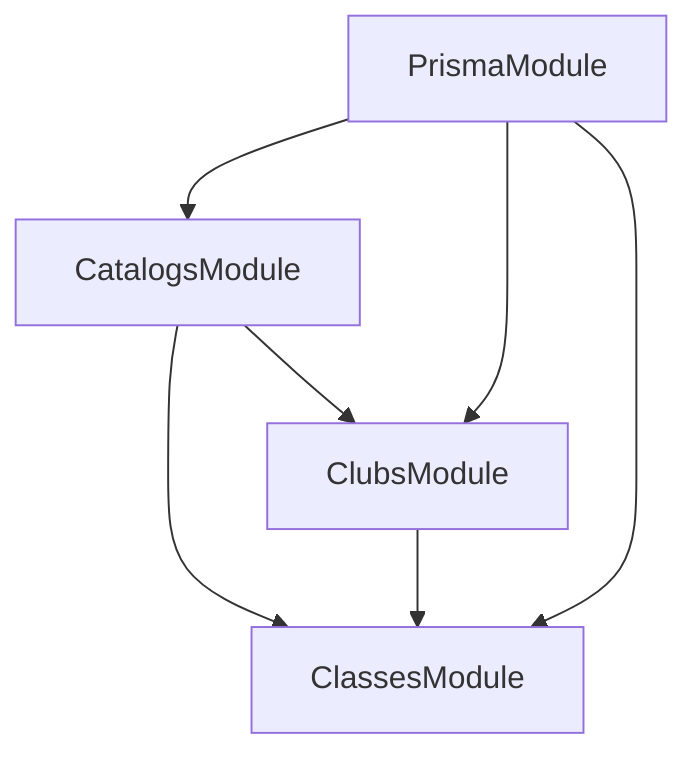

# Walkthrough: Módulos Catalogs, Clubs y Classes

**Fecha**: 31 de enero de 2026  
**Versión**: 1.0

---

## Resumen

Se implementaron tres módulos críticos para el MVP del backend SACDIA:

1. **CatalogsModule** - Endpoints de solo lectura para catálogos
2. **ClubsModule** - Gestión completa de clubs e instancias
3. **ClassesModule** - Clases progresivas y seguimiento de progreso

---

## CatalogsModule

### Archivos

| Archivo    | Ruta                                  |
| ---------- | ------------------------------------- |
| Módulo     | `src/catalogs/catalogs.module.ts`     |
| Controller | `src/catalogs/catalogs.controller.ts` |
| Service    | `src/catalogs/catalogs.service.ts`    |

### Endpoints (10 total)

```http
GET /catalogs/club-types           # Tipos de club
GET /catalogs/countries            # Países
GET /catalogs/unions               # Uniones (filtro: countryId)
GET /catalogs/local-fields         # Campos locales (filtro: unionId)
GET /catalogs/districts            # Distritos (filtro: localFieldId)
GET /catalogs/churches             # Iglesias (filtro: districtId)
GET /catalogs/roles                # Roles (filtro: category=GLOBAL|CLUB)
GET /catalogs/ecclesiastical-years         # Años eclesiásticos
GET /catalogs/ecclesiastical-years/current # Año actual
GET /catalogs/club-ideals          # Ideales de club (filtro: clubTypeId)
```

### Ejemplo de Uso

```bash
# Obtener todos los tipos de club
curl http://localhost:3000/api/v1/catalogs/club-types

# Obtener uniones filtradas por país
curl http://localhost:3000/api/v1/catalogs/unions?countryId=1
```

---

## ClubsModule

### Archivos

| Archivo    | Ruta                            |
| ---------- | ------------------------------- |
| Módulo     | `src/clubs/clubs.module.ts`     |
| Controller | `src/clubs/clubs.controller.ts` |
| Service    | `src/clubs/clubs.service.ts`    |
| DTOs       | `src/clubs/dto/`                |

### Tipos de Instancia

```typescript
enum ClubInstanceType {
  ADVENTURERS = "adventurers", // Aventureros
  PATHFINDERS = "pathfinders", // Conquistadores
  MASTER_GUILDS = "master_guilds", // Guías Mayores
}
```

### Endpoints - ClubsController (9)

```http
GET    /clubs                              # Listar clubs
GET    /clubs/:clubId                      # Obtener club
POST   /clubs                              # Crear club
PATCH  /clubs/:clubId                      # Actualizar club
DELETE /clubs/:clubId                      # Desactivar club

GET    /clubs/:clubId/instances            # Listar instancias
GET    /clubs/:clubId/instances/:type      # Obtener instancia por tipo
POST   /clubs/:clubId/instances            # Crear instancia
PATCH  /clubs/:clubId/instances/:type/:id  # Actualizar instancia

GET    /clubs/:clubId/instances/:type/:id/members  # Listar miembros
POST   /clubs/:clubId/instances/:type/:id/roles    # Asignar rol
```

### Endpoints - ClubRolesController (2)

```http
PATCH  /club-roles/:assignmentId   # Actualizar asignación
DELETE /club-roles/:assignmentId   # Remover rol
```

### Crear Club - Request Body

```typescript
{
  name: string;                // Nombre del club
  description?: string;        // Descripción
  local_field_id: number;      // ID del campo local
  districlub_type_id: number;  // ID del distrito
  church_id: number;           // ID de la iglesia
  address?: string;            // Dirección
  coordinates?: {              // Coordenadas
    lat: number;
    lng: number;
  };
}
```

### Asignar Rol - Request Body

```typescript
{
  user_id: string;                    // UUID del usuario
  role_id: string;                    // UUID del rol a asignar
  instance_type: ClubInstanceType;    // Tipo de instancia
  instance_id: number;                // ID de la instancia
  ecclesiastical_year_id: number;     // ID del año eclesiástico
  start_date: Date;                   // Fecha de inicio
  end_date?: Date;                    // Fecha de fin (opcional)
}
```

---

## ClassesModule

### Archivos

| Archivo    | Ruta                                |
| ---------- | ----------------------------------- |
| Módulo     | `src/classes/classes.module.ts`     |
| Controller | `src/classes/classes.controller.ts` |
| Service    | `src/classes/classes.service.ts`    |
| DTOs       | `src/classes/dto/`                  |

### Endpoints - ClassesController (3)

```http
GET /classes                    # Listar clases (filtro: clubTypeId)
GET /classes/:classId           # Obtener clase con módulos
GET /classes/:classId/modules   # Listar módulos de la clase
```

### Endpoints - UserClassesController (4)

```http
GET   /users/:userId/classes               # Inscripciones del usuario
POST  /users/:userId/classes/enroll        # Inscribir en clase
GET   /users/:userId/classes/:classId/progress   # Obtener progreso
PATCH /users/:userId/classes/:classId/progress   # Actualizar progreso
```

### Estructura de Progreso - Response

```json
{
  "class_id": 1,
  "class_name": "Amigo",
  "total_sections": 25,
  "completed_sections": 10,
  "overall_progress": 40,
  "modules": [
    {
      "module_id": 1,
      "module_name": "Desarrollo Personal",
      "total_sections": 5,
      "completed_sections": 3,
      "progress_percentage": 60,
      "sections": [
        {
          "section_id": 1,
          "section_name": "Requisito Básico",
          "completed": true,
          "score": 85,
          "evidences": null
        }
      ]
    }
  ]
}
```

### Inscribir Usuario - Request Body

```typescript
{
  class_id: number;
  ecclesiastical_year_id: number;
}
```

### Actualizar Progreso - Request Body

```typescript
{
  module_id: number;
  section_id: number;
  score: number;    // 0-100
  evidences?: {     // Opcional
    urls: string[];
    notes: string;
  };
}
```

---

## Resumen de Endpoints

| Módulo           | Endpoints | Autenticación            |
| ---------------- | --------- | ------------------------ |
| `CatalogsModule` | 10        | ❌ Público               |
| `ClubsModule`    | 11        | ✅ JWT                   |
| `ClassesModule`  | 7         | Mixto (3 público, 4 JWT) |
| **Total**        | **28**    |                          |

---

## Dependencias entre Módulos



---

**Creado**: 2026-01-31  
**Próximos pasos**: Implementar permisos por rol y paginación
