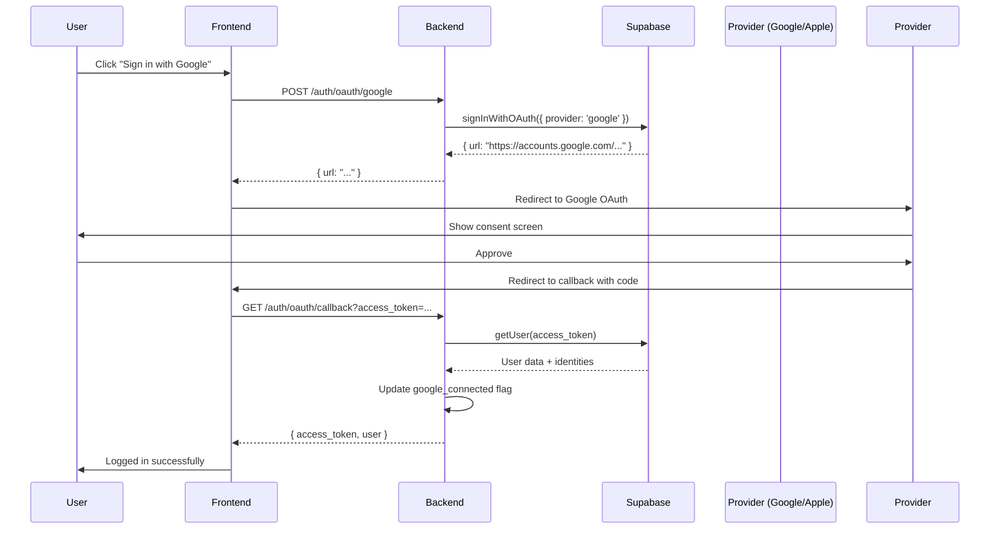

# Walkthrough: OAuth Authentication (Google & Apple)

**Módulo**: OAuth
**Versión API**: 2.2
**Fecha**: 3 de febrero de 2026

---

## 📋 Descripción General

El módulo de **OAuth** permite a los usuarios autenticarse usando sus cuentas de Google o Apple, proporcionando:

- Sign-in con Google (OAuth 2.0)
- Sign-in con Apple (Sign in with Apple)
- Gestión de providers conectados
- Flags en base de datos para tracking
- Integración con Supabase Auth

**Providers Soportados**:
- ✅ Google
- ✅ Apple
- 🔜 Facebook (reservado para futuro)

---

## 🎯 Flujo Completo de OAuth

### Flujo General



---

## 🔐 Configuración Previa

### 1. Configurar Google OAuth

**Google Cloud Console**:

1. Ir a https://console.cloud.google.com/
2. Crear nuevo proyecto o seleccionar existente
3. Habilitar Google+ API
4. Ir a "Credentials" → "Create Credentials" → "OAuth 2.0 Client ID"
5. Configurar pantalla de consentimiento
6. Agregar Authorized redirect URIs:
   ```
   https://your-project.supabase.co/auth/v1/callback
   ```
7. Copiar Client ID y Client Secret

**Supabase Dashboard**:

1. Ir a Authentication → Providers
2. Habilitar Google
3. Pegar Client ID y Client Secret
4. Guardar

### 2. Configurar Apple Sign In

**Apple Developer**:

1. Ir a https://developer.apple.com/account/
2. Crear Service ID
3. Configurar Sign in with Apple
4. Agregar Return URLs:
   ```
   https://your-project.supabase.co/auth/v1/callback
   ```
5. Generar y descargar Private Key (.p8)

**Supabase Dashboard**:

1. Ir a Authentication → Providers
2. Habilitar Apple
3. Configurar Service ID, Team ID y Key ID
4. Pegar contenido del Private Key
5. Guardar

---

## 🚀 Implementación

### 1. Iniciar OAuth Flow con Google

**Endpoint**: `POST /api/v1/auth/oauth/google`
**Autenticación**: No requerida

**Request Body** (opcional):

```json
{
  "redirectUrl": "https://sacdia.app/auth/callback"
}
```

**Request**:

```bash
curl -X POST http://localhost:3000/api/v1/auth/oauth/google \
  -H "Content-Type: application/json" \
  -d '{
    "redirectUrl": "https://sacdia.app/auth/callback"
  }'
```

**Response** (200 OK):

```json
{
  "url": "https://accounts.google.com/o/oauth2/v2/auth?client_id=...&redirect_uri=...&response_type=code&scope=openid%20email%20profile"
}
```

**Frontend debe**:
1. Recibir la URL
2. Abrir en navegador (web) o WebView (móvil)
3. El usuario aprueba permisos en Google
4. Google redirige a la callback URL con el código

---

### 2. Iniciar OAuth Flow con Apple

**Endpoint**: `POST /api/v1/auth/oauth/apple`
**Autenticación**: No requerida

**Request**:

```bash
curl -X POST http://localhost:3000/api/v1/auth/oauth/apple \
  -H "Content-Type: application/json" \
  -d '{
    "redirectUrl": "https://sacdia.app/auth/callback"
  }'
```

**Response** (200 OK):

```json
{
  "url": "https://appleid.apple.com/auth/authorize?client_id=...&redirect_uri=...&response_type=code&scope=name%20email"
}
```

**Flujo similar a Google**:
1. Usuario aprueba en pantalla de Apple
2. Apple redirige a callback con código
3. Frontend captura el código

---

### 3. Manejar el Callback

**Endpoint**: `GET /api/v1/auth/oauth/callback`
**Autenticación**: No requerida (el access_token se proporciona en query params)

**Query Parameters**:
- `access_token` (string): Token JWT de Supabase
- `refresh_token` (string, optional): Token de refresh
- `provider` (string, optional): "google" o "apple"

**Request**:

```bash
curl -X GET "http://localhost:3000/api/v1/auth/oauth/callback?access_token=eyJhbGc...&refresh_token=v1.abc...&provider=google"
```

**Response** (200 OK):

```json
{
  "status": "success",
  "data": {
    "access_token": "eyJhbGciOiJIUzI1NiIsInR5cCI6IkpXVCJ9...",
    "refresh_token": "v1.abc123...",
    "user": {
      "id": "uuid-123",
      "email": "user@gmail.com",
      "name": "Juan",
      "paternal_last_name": "Pérez",
      "maternal_last_name": "González",
      "avatar": "https://lh3.googleusercontent.com/...",
      "google_connected": true,
      "apple_connected": false,
      "fb_connected": false
    },
    "needsPostRegistration": true
  }
}
```

**Lógica del Backend**:

```typescript
async handleCallback(query: OAuthCallbackDto) {
  const { access_token } = query;

  // 1. Obtener usuario de Supabase con el token
  const { data: { user }, error } = await this.supabase.auth.getUser(access_token);

  if (error || !user) {
    throw new UnauthorizedException('Invalid OAuth callback');
  }

  // 2. Verificar si usuario existe en BD
  let dbUser = await this.prisma.users.findUnique({
    where: { id: user.id }
  });

  // 3. Si no existe, crear usuario
  if (!dbUser) {
    dbUser = await this.prisma.users.create({
      data: {
        id: user.id,
        email: user.email,
        name: user.user_metadata.name || user.email.split('@')[0],
        avatar: user.user_metadata.avatar_url
      }
    });

    // Crear users_pr para tracking
    await this.prisma.users_pr.create({
      data: {
        user_id: user.id,
        complete: false,
        profile_picture_complete: false,
        personal_info_complete: false,
        club_selection_complete: false
      }
    });

    // Asignar rol "user"
    const userRole = await this.prisma.roles.findFirst({
      where: { role_name: 'user', role_category: 'GLOBAL' }
    });

    await this.prisma.users_roles.create({
      data: {
        user_id: user.id,
        role_id: userRole.id
      }
    });
  }

  // 4. Actualizar flags de providers conectados
  const identities = user.identities || [];
  const googleConnected = identities.some(i => i.provider === 'google');
  const appleConnected = identities.some(i => i.provider === 'apple');

  await this.prisma.users.update({
    where: { id: user.id },
    data: {
      google_connected: googleConnected,
      apple_connected: appleConnected
    }
  });

  // 5. Verificar si necesita post-registro
  const needsPostReg = await this.checkPostRegistration(user.id);

  return {
    access_token,
    user: {
      ...dbUser,
      google_connected: googleConnected,
      apple_connected: appleConnected
    },
    needsPostRegistration: needsPostReg
  };
}
```

---

### 4. Ver Providers Conectados

**Endpoint**: `GET /api/v1/auth/oauth/providers`
**Autenticación**: Requerida

**Request**:

```bash
curl -X GET http://localhost:3000/api/v1/auth/oauth/providers \
  -H "Authorization: Bearer ${TOKEN}"
```

**Response** (200 OK):

```json
{
  "status": "success",
  "data": {
    "google_connected": true,
    "apple_connected": false,
    "fb_connected": false
  }
}
```

---

### 5. Desconectar un Provider

**Endpoint**: `DELETE /api/v1/auth/oauth/:provider`
**Autenticación**: Requerida
**Parámetros**: `provider` = "google" | "apple" | "fb"

**Request**:

```bash
curl -X DELETE http://localhost:3000/api/v1/auth/oauth/google \
  -H "Authorization: Bearer ${TOKEN}"
```

**Response** (200 OK):

```json
{
  "status": "success",
  "message": "Provider disconnected successfully"
}
```

**Nota**: Esto solo actualiza el flag en la BD local. Supabase no permite desconectar providers directamente desde la API.

---

## 💡 Casos de Uso

### Caso 1: Nuevo Usuario con Google

**Escenario**: Un usuario nuevo quiere registrarse usando su cuenta de Google.

**Flujo**:

1. **Frontend muestra botón "Sign in with Google"**

2. **Usuario hace click**
   ```typescript
   const response = await fetch('/api/v1/auth/oauth/google', {
     method: 'POST',
     headers: { 'Content-Type': 'application/json' },
     body: JSON.stringify({
       redirectUrl: 'https://sacdia.app/auth/callback'
     })
   });

   const { url } = await response.json();
   window.location.href = url;  // Redirigir a Google
   ```

3. **Usuario aprueba en Google**

4. **Google redirige a callback**
   ```
   https://sacdia.app/auth/callback?access_token=eyJ...&provider=google
   ```

5. **Frontend captura el token y llama al backend**
   ```typescript
   const urlParams = new URLSearchParams(window.location.search);
   const accessToken = urlParams.get('access_token');

   const response = await fetch(
     `/api/v1/auth/oauth/callback?access_token=${accessToken}`,
     { method: 'GET' }
   );

   const { data } = await response.json();
   // data.access_token → Guardar en storage
   // data.user → Guardar en estado
   // data.needsPostRegistration → Redirigir a post-registro
   ```

6. **Backend crea usuario automáticamente**
   - Extrae nombre del user_metadata de Google
   - Extrae avatar de Google
   - Crea registro en `users` table
   - Crea registro en `users_pr` con `complete = false`
   - Asigna rol "user"
   - Marca `google_connected = true`

7. **Frontend redirige a post-registro**
   ```typescript
   if (data.needsPostRegistration) {
     router.push('/post-registration');
   } else {
     router.push('/dashboard');
   }
   ```

---

### Caso 2: Usuario Existente Conecta Google

**Escenario**: Un usuario ya registrado con email/password quiere conectar su cuenta de Google.

**Flujo**:

1. **Usuario va a configuración de perfil**

2. **Ve sección "Providers Conectados"**
   ```bash
   GET /api/v1/auth/oauth/providers
   Response: { google_connected: false, apple_connected: false }
   ```

3. **Click en "Conectar Google"**
   ```bash
   POST /api/v1/auth/oauth/google
   Response: { url: "https://accounts.google.com/..." }
   ```

4. **Flujo OAuth estándar**

5. **Backend actualiza flag**
   ```typescript
   await prisma.users.update({
     where: { id: userId },
     data: { google_connected: true }
   });
   ```

6. **Frontend actualiza UI**
   - Muestra checkmark verde ✅
   - Cambia botón a "Desconectar Google"

---

### Caso 3: Sign In con Apple (Móvil)

**Escenario**: Usuario de iOS usa "Sign in with Apple".

**Flujo (Similar a Google)**:

1. **App móvil muestra botón de Apple**

2. **Usuario hace click**
   ```dart
   // Flutter example
   final response = await dio.post('/api/v1/auth/oauth/apple');
   final url = response.data['url'];

   // Abrir en WebView o browser
   await launchUrl(Uri.parse(url));
   ```

3. **Apple maneja autenticación**
   - Face ID / Touch ID en dispositivo
   - Opción de ocultar email (hide my email)

4. **Callback con token**

5. **App captura deeplink**
   ```
   sacdia://auth/callback?access_token=...
   ```

6. **App llama al backend**
   ```dart
   final callbackResponse = await dio.get(
     '/api/v1/auth/oauth/callback',
     queryParameters: { 'access_token': accessToken }
   );
   ```

7. **Backend marca `apple_connected = true`**

---

### Caso 4: Usuario con Email Oculto de Apple

**Escenario**: Usuario usa "Hide My Email" de Apple.

**Flujo**:

1. **Apple genera email relay**
   ```
   abc123xyz@privaterelay.appleid.com
   ```

2. **Supabase crea usuario con email relay**

3. **Backend recibe en callback**
   ```json
   {
     "user": {
       "email": "abc123xyz@privaterelay.appleid.com",
       "user_metadata": {
         "name": "Juan Pérez",  // Si usuario lo compartió
         "email": "abc123xyz@privaterelay.appleid.com"
       }
     }
   }
   ```

4. **Backend crea usuario normal**
   - Email relay funciona igual que email normal
   - Emails enviados a relay son forwardeados al usuario

---

## 🔒 Validaciones y Errores

### Error 1: Token Inválido

**Causa**: El `access_token` del callback es inválido o expirado.

**Response** (401 Unauthorized):

```json
{
  "statusCode": 401,
  "message": "Invalid OAuth callback",
  "error": "Unauthorized"
}
```

**Solución**: Reiniciar el flujo OAuth desde el inicio.

---

### Error 2: Provider No Configurado

**Causa**: El provider (Google/Apple) no está configurado en Supabase.

**Response** (500 Internal Server Error):

```json
{
  "statusCode": 500,
  "message": "OAuth provider not configured",
  "error": "Internal Server Error"
}
```

**Solución**: Configurar el provider en Supabase Dashboard.

---

### Error 3: Usuario Canceló Autorización

**Causa**: Usuario hizo click en "Cancelar" en la pantalla de Google/Apple.

**Comportamiento**:
- Google/Apple redirige a callback con `error=access_denied`
- Frontend debe capturar este error y mostrar mensaje amigable

**Manejo en Frontend**:

```typescript
const urlParams = new URLSearchParams(window.location.search);
const error = urlParams.get('error');

if (error === 'access_denied') {
  showMessage('Autenticación cancelada. Intenta nuevamente.');
  router.push('/login');
}
```

---

### Error 4: Email Ya Registrado con Otro Provider

**Causa**: Usuario intenta registrarse con Google usando email ya registrado con email/password.

**Comportamiento**:
- Supabase **vincula automáticamente** las cuentas
- Usuario puede login con cualquiera de los dos métodos
- Ambos `google_connected` y email/password funcionan

**No hay error** - Es comportamiento esperado de Supabase.

---

## 🔑 Implementación del Backend

### Controller: `oauth.controller.ts`

```typescript
import { Controller, Post, Get, Delete, Body, Query, Param, UseGuards, Request } from '@nestjs/common';
import { OAuthService } from './oauth.service';
import { JwtAuthGuard } from '../guards/jwt-auth.guard';

@Controller('auth/oauth')
export class OAuthController {
  constructor(private readonly oauthService: OAuthService) {}

  @Post('google')
  async googleSignIn(@Body() dto: { redirectUrl?: string }) {
    return await this.oauthService.initiateGoogleSignIn(dto.redirectUrl);
  }

  @Post('apple')
  async appleSignIn(@Body() dto: { redirectUrl?: string }) {
    return await this.oauthService.initiateAppleSignIn(dto.redirectUrl);
  }

  @Get('callback')
  async handleCallback(@Query() query: OAuthCallbackDto) {
    return await this.oauthService.handleCallback(query);
  }

  @Get('providers')
  @UseGuards(JwtAuthGuard)
  async getConnectedProviders(@Request() req) {
    return await this.oauthService.getConnectedProviders(req.user.id);
  }

  @Delete(':provider')
  @UseGuards(JwtAuthGuard)
  async disconnectProvider(
    @Param('provider') provider: string,
    @Request() req
  ) {
    return await this.oauthService.disconnectProvider(req.user.id, provider);
  }
}
```

### Service: `oauth.service.ts`

```typescript
import { Injectable, InternalServerErrorException, UnauthorizedException } from '@nestjs/common';
import { SupabaseService } from '../common/services/supabase.service';
import { PrismaService } from '../common/services/prisma.service';

@Injectable()
export class OAuthService {
  constructor(
    private readonly supabase: SupabaseService,
    private readonly prisma: PrismaService
  ) {}

  async initiateGoogleSignIn(redirectUrl?: string) {
    const { data, error } = await this.supabase.auth.signInWithOAuth({
      provider: 'google',
      options: {
        redirectTo: redirectUrl || 'https://sacdia.app/auth/callback'
      }
    });

    if (error) throw new InternalServerErrorException(error.message);

    return { url: data.url };
  }

  async initiateAppleSignIn(redirectUrl?: string) {
    const { data, error } = await this.supabase.auth.signInWithOAuth({
      provider: 'apple',
      options: {
        redirectTo: redirectUrl || 'https://sacdia.app/auth/callback'
      }
    });

    if (error) throw new InternalServerErrorException(error.message);

    return { url: data.url };
  }

  async handleCallback(query: OAuthCallbackDto) {
    const { access_token } = query;

    // Obtener usuario de Supabase
    const { data: { user }, error } = await this.supabase.auth.getUser(access_token);

    if (error || !user) {
      throw new UnauthorizedException('Invalid OAuth callback');
    }

    // Verificar o crear usuario en BD
    let dbUser = await this.prisma.users.findUnique({
      where: { id: user.id }
    });

    if (!dbUser) {
      // Crear nuevo usuario
      dbUser = await this.createUserFromOAuth(user);
    }

    // Actualizar flags de providers
    const identities = user.identities || [];
    const googleConnected = identities.some(i => i.provider === 'google');
    const appleConnected = identities.some(i => i.provider === 'apple');

    await this.prisma.users.update({
      where: { id: user.id },
      data: {
        google_connected: googleConnected,
        apple_connected: appleConnected
      }
    });

    // Verificar post-registro
    const usersPr = await this.prisma.users_pr.findUnique({
      where: { user_id: user.id }
    });

    return {
      access_token: access_token,
      user: {
        ...dbUser,
        google_connected: googleConnected,
        apple_connected: appleConnected
      },
      needsPostRegistration: !usersPr?.complete
    };
  }

  private async createUserFromOAuth(supabaseUser: any) {
    return await this.prisma.$transaction(async (tx) => {
      // Crear usuario
      const user = await tx.users.create({
        data: {
          id: supabaseUser.id,
          email: supabaseUser.email,
          name: supabaseUser.user_metadata?.name || supabaseUser.email.split('@')[0],
          avatar: supabaseUser.user_metadata?.avatar_url
        }
      });

      // Crear users_pr
      await tx.users_pr.create({
        data: {
          user_id: user.id,
          complete: false,
          profile_picture_complete: false,
          personal_info_complete: false,
          club_selection_complete: false
        }
      });

      // Asignar rol "user"
      const userRole = await tx.roles.findFirst({
        where: { role_name: 'user', role_category: 'GLOBAL' }
      });

      await tx.users_roles.create({
        data: {
          user_id: user.id,
          role_id: userRole.id
        }
      });

      return user;
    });
  }

  async getConnectedProviders(userId: string) {
    const user = await this.prisma.users.findUnique({
      where: { id: userId },
      select: {
        google_connected: true,
        apple_connected: true,
        fb_connected: true
      }
    });

    return user;
  }

  async disconnectProvider(userId: string, provider: string) {
    const field = `${provider}_connected`;

    await this.prisma.users.update({
      where: { id: userId },
      data: { [field]: false }
    });

    return { success: true };
  }
}
```

---

## 📊 Modelos de Base de Datos

### Campos en tabla `users`

```prisma
model users {
  id                String    @id @db.Uuid
  email             String    @unique
  name              String
  paternal_last_name String?
  maternal_last_name String?
  avatar            String?

  // OAuth flags
  google_connected  Boolean   @default(false)
  apple_connected   Boolean   @default(false)
  fb_connected      Boolean   @default(false)

  created_at        DateTime  @default(now())
  updated_at        DateTime  @updatedAt
}
```

---

## 🧪 Testing

### Test E2E: `oauth.e2e-spec.ts`

```typescript
describe('OAuth API (e2e)', () => {
  it('POST /auth/oauth/google - should return OAuth URL', async () => {
    const response = await request(app.getHttpServer())
      .post('/api/v1/auth/oauth/google')
      .send({ redirectUrl: 'https://test.com/callback' })
      .expect(200);

    expect(response.body.url).toContain('accounts.google.com');
  });

  it('POST /auth/oauth/apple - should return OAuth URL', async () => {
    const response = await request(app.getHttpServer())
      .post('/api/v1/auth/oauth/apple')
      .expect(200);

    expect(response.body.url).toContain('appleid.apple.com');
  });

  it('GET /auth/oauth/callback - should create user and return token', async () => {
    // Mock Supabase response
    jest.spyOn(supabaseService.auth, 'getUser').mockResolvedValue({
      data: {
        user: {
          id: 'new-user-id',
          email: 'test@gmail.com',
          user_metadata: {
            name: 'Test User',
            avatar_url: 'https://example.com/avatar.jpg'
          },
          identities: [{ provider: 'google' }]
        }
      },
      error: null
    });

    const response = await request(app.getHttpServer())
      .get('/api/v1/auth/oauth/callback')
      .query({ access_token: 'mock-token' })
      .expect(200);

    expect(response.body.user.google_connected).toBe(true);
    expect(response.body.needsPostRegistration).toBe(true);
  });

  it('GET /auth/oauth/providers - should return connected providers', async () => {
    const response = await request(app.getHttpServer())
      .get('/api/v1/auth/oauth/providers')
      .set('Authorization', `Bearer ${token}`)
      .expect(200);

    expect(response.body).toHaveProperty('google_connected');
    expect(response.body).toHaveProperty('apple_connected');
  });

  it('DELETE /auth/oauth/google - should disconnect provider', async () => {
    await request(app.getHttpServer())
      .delete('/api/v1/auth/oauth/google')
      .set('Authorization', `Bearer ${token}`)
      .expect(200);

    const user = await prisma.users.findUnique({
      where: { id: userId }
    });

    expect(user.google_connected).toBe(false);
  });
});
```

---

## 📝 Notas Importantes

1. **Supabase Maneja el Callback**: Supabase procesa automáticamente el código de autorización de Google/Apple y lo convierte en tokens.

2. **Crear Usuario Automáticamente**: Si un usuario hace OAuth y no existe en la BD, se crea automáticamente con información básica de Google/Apple.

3. **Post-Registro Obligatorio**: Incluso usuarios de OAuth deben completar el post-registro (foto, info personal, club).

4. **Email de Apple Relay**: Los emails relay de Apple funcionan como emails normales para envío de correos.

5. **Vincular Cuentas**: Supabase vincula automáticamente cuentas con el mismo email (OAuth + email/password).

6. **Flags en BD**: Los flags `google_connected`, `apple_connected` son solo para tracking/UI. La autenticación la maneja Supabase.

7. **No Push sin Configuración**: Si Google/Apple OAuth no están configurados en Supabase, el endpoint falla con error 500.

---

## 🔗 Referencias

- [Supabase OAuth Documentation](https://supabase.com/docs/guides/auth/social-login)
- [Google OAuth 2.0 Documentation](https://developers.google.com/identity/protocols/oauth2)
- [Sign in with Apple Documentation](https://developer.apple.com/sign-in-with-apple/)

---

**Documento creado**: 2026-02-03
**Versión**: 1.0
**Autor**: Sistema SACDIA
