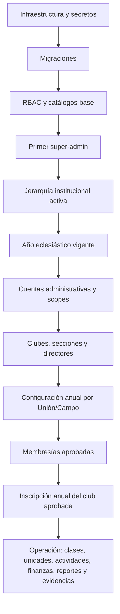

# Preparación para producción, onboarding y operación de SACDIA

**Fecha de corte:** 2026-07-17

**Alcance:** documentación canónica, backend NestJS, panel administrativo Next.js, app Flutter, esquema Prisma efectivo y memorias Engram.

**Criterio:** el código y los contratos runtime vigentes prevalecen sobre auditorías históricas. El seed legacy indicado por el propietario no se utilizó como fuente ni como mecanismo de arranque.

> [!NOTE]
> El contrato del CLI de pilot readiness se mantiene como companion
> [planificado/stack-local](../guides/pilot-readiness-cli-contract.md): no está
> integrado ni desplegado, no habilita GO y no sustituye este dictamen ni la
> evidencia operacional externa.

## 1. Dictamen ejecutivo

**SACDIA todavía no está listo para una salida general a producción ni para capacitar al personal operativo como si el ecosistema estuviera cerrado.**

La consulta directa de `DATABASE_URL` de development corrige el alcance de datos: esa base sí está poblada y ya permite ejecutar una parte importante del ecosistema. Tiene usuarios, clubes, secciones, año vigente y operación real de prueba. Sin embargo, también contiene inconsistencias de jerarquía, roles, clases, especialidades y configuración anual que deben sanearse antes de usarla como ambiente de capacitación final o como fuente para producción.

El modelo de negocio central sí es coherente: la sección del club es la unidad operativa, las asignaciones son contextuales y anuales, existe aprobación de membresía, la jerarquía limita el alcance y se separa el registro de la validación. También existen flujos reales de post-registro, clubes, miembros, clases, unidades, finanzas, inventario, seguros, carpetas, reportes, investiduras, camporees y materiales.

El **NO-GO actual** no se debe a falta de módulos, sino a tres interrupciones de cadena:

1. **La base de producción no tiene un bootstrap reproducible y vigente** para roles, permisos, límites y catálogos base.
2. **La inscripción anual del club no puede ser aprobada desde ninguna interfaz**, aunque esa aprobación habilita carpeta anual y operación anual.
3. **El APK release no recibe la URL de la API**, por lo que usa localhost y falla la protección HTTPS de release.

Además, el sistema captura datos del nuevo usuario, pero **no lo guía para aprender el producto**. Existe post-registro obligatorio y ayuda reactiva, no un onboarding instructivo por rol.

### Qué hacer primero

| Orden | Acción | Resultado esperado |
|---:|---|---|
| 1 | Resolver los tres bloqueos P0 anteriores | El sistema puede arrancar y completar su ciclo anual mínimo |
| 2 | Crear un manifest de datos productivos y una verificación automática de readiness | Se conoce exactamente qué falta antes de habilitar usuarios |
| 3 | Corregir integridad del post-registro, selección de División y ambigüedad del año vigente | El alta no crea relaciones institucionales inválidas |
| 4 | Cargar datos maestros y jerarquía; crear cuentas administrativas con alcance correcto | El panel deja de depender de catálogos vacíos o scopes incompletos |
| 5 | Configurar el año y las políticas anuales | Clubes, carpetas, reportes, ranking e investidura pueden operar |
| 6 | Capacitar primero plataforma, después División/Unión/Campo Local y finalmente clubes | Cada cohorte recibe un sistema ya preparado por la cohorte anterior |
| 7 | Activar módulos avanzados por oleadas | Se evita capacitar de golpe 129 páginas admin y 121 vistas móviles |

## 2. Cadena de activación

**No conviene saltar capas.** Capacitar reportes antes de aprobar la inscripción anual, o capacitar clubes antes de crear directores y scopes, equivale a enseñar una operación que todavía no puede ejecutarse.

## 3. Datos que deben venir preconfigurados por la plataforma

Estos datos no deben depender de que el primer administrador los invente durante la capacitación.

### 3.1 Infraestructura obligatoria

| Área | Debe estar listo | Bloquea |
|---|---|---|
| Base de datos | `DATABASE_URL`, conexión directa de migración, migraciones aplicadas y respaldo probado | Todo el sistema |
| Autenticación | `BETTER_AUTH_SECRET`, URL pública, CORS/orígenes y URLs de redirección | Registro, login y panel |
| Redis | `REDIS_URL` válido y accesible | El backend falla al iniciar en producción; también afecta rate limit, colas y caché |
| Archivos | Credenciales R2 y buckets requeridos para PDFs, evidencias, seguros, exportaciones y recursos | Post-registro con foto y módulos documentales |
| Correo | Resend habilitado y remitente verificado | Invitaciones administrativas y recuperación de contraseña |
| Notificaciones | Firebase Admin y proyecto móvil alineados | Avisos de solicitudes, revisiones y recordatorios |
| Mapas | Claves web y móviles con restricciones correctas | Alta de clubes, sedes, actividades y mapas |
| Observabilidad | Sentry, logs, health checks y alertas de colas/cron | Soporte operativo de producción |
| Móvil | `API_BASE_URL` HTTPS inyectada en el artefacto release; App Check configurado | Arranque y consumo real de API |

### 3.2 Datos invariantes de plataforma

| Catálogo/configuración | Por qué debe existir antes |
|---|---|
| Roles `GLOBAL` y `CLUB` | Registro, autorización, menú y asignaciones dependen de los nombres canónicos |
| Permisos y `role_permissions` | Un rol sin su matriz ve menús incompletos o recibe 403 |
| Límites de slots de roles | Protegen director, subdirectores, secretaría y tesorería por sección |
| Claves `system_config` | Controlan reportes, ranking, investidura, vencimientos y feature flags |
| Tipos de club | Son FK de secciones, clases, honores, actividades y materiales |
| Clases progresivas, módulos y secciones/requisitos | El post-registro deriva la clase por edad y la operación registra progreso |
| Tipos de relación | Son necesarios para contactos y representante legal |
| Tipos de actividad | Crear una actividad exige `activity_type_id` |
| Categorías financieras | Crear una transacción exige categoría |
| Categorías de inventario | Crear un ítem exige categoría |
| Catálogos de salud | Habilitan alergias, enfermedades y medicamentos durante perfil/operación |
| Especialidades, requisitos y certificaciones | Deben cargarse antes de capacitar trayectoria e investidura |
| Tipos de evento de camporee y categorías de materiales | Requeridos si esos módulos entran en la primera oleada |

### 3.3 Regla de persistencia recomendada

- **Migración o bootstrap versionado e idempotente:** roles, permisos, relaciones rol-permiso, límites, claves de sistema y catálogos invariantes.
- **Importación/administración institucional:** División, países, uniones, campos, distritos, iglesias, clubes y usuarios.
- **Configuración anual desde el panel:** año, plantillas, ranking, investidura, camporees y políticas territoriales.

Esto evita dos extremos: meter datos organizacionales cambiantes en migraciones o dejar la seguridad base a captura manual.

## 4. Qué debe existir antes de capacitar personal administrativo

### 4.1 Prerrequisitos comunes

- Primer `super-admin` funcional y secreto de bootstrap ya retirado después de usarlo.
- Matriz RBAC validada contra los nombres canónicos del runtime.
- Jerarquía activa y consistente: **División → Unión → Campo Local → Distrito → Iglesia → Club → Sección**.
- Países asociados a las uniones para el alta móvil.
- Año eclesiástico que cubra la fecha actual, sin solapamientos.
- Cuentas administrativas creadas, correo de invitación entregado y contraseña establecida.
- Scope territorial de cada cuenta comprobado con una cuenta real, no solo por datos en tabla.
- Al menos un club y una sección de laboratorio por territorio para la capacitación.
- Catálogos base activos; no se debe capacitar con selects vacíos.

### 4.2 Lo que configura cada nivel

| Cohorte | Debe recibir preconfigurado | Configura/gestiona después de capacitarse |
|---|---|---|
| Plataforma (`super-admin`/`admin`) | Infraestructura, bootstrap RBAC y usuario inicial | Geografía, catálogos globales, roles/permisos, variables, accesos, auditoría y salud de jobs |
| División (`director-dia`/`assistant-dia`) | División y cuenta anclada a una unión/campo de esa división | Supervisión territorial, usuarios subordinados, validaciones, reportes y políticas heredables permitidas por RBAC |
| Unión (`director-union`/`assistant-union`) | División, unión, campos y cuenta con `union_id` correcto | Plantillas anuales de unión, ranking/categorías, camporees de unión, supervisión y confirmaciones |
| Campo Local (`director-lf`/`assistant-lf`) | Unión, campo, distritos, iglesias, catálogos y cuenta con `local_field_id` | Clubes/secciones, director inicial, coordinación, investidura, plantillas/overrides, camporees locales, materiales y validaciones |
| Coordinación/pastoral | Zonas/distritos y asignaciones vigentes | Revisión, seguimiento y lectura según el rol; no administración global |

### 4.3 Advertencias de ownership actual

- La geografía solo se administra con `admin`/`super-admin`; no debe prometerse a División, Unión o Campo Local que podrán crear su propia jerarquía.
- Las categorías de scoring a nivel División también están restringidas a `admin`/`super-admin`.
- Los roles territoriales comparten gran parte de los permisos; la diferencia real está en el scope resuelto por servidor.
- Una cuenta de División no tiene `division_id` directo: actualmente su división se deriva desde `union_id` o `local_field_id`. Sin ese ancla, varios flujos fallan por scope faltante.
- El runtime reconoce `assistant-admin`, pero el bootstrap/mapeo vigente no define su alta ni su política completa. No debe usarse hasta reconciliarlo.

## 5. Configuración anual antes de abrir la operación

### 5.1 Obligatoria para el núcleo

1. Año eclesiástico actual creado y marcado según la política institucional.
2. Director inicial activo para cada sección.
3. Plantilla anual **publicada** para cada combinación de tipo de club y año, propiedad de la Unión o del Campo Local.
4. Configuración de ranking, pesos, categorías y topes revisada.
5. Configuración de investidura por Campo Local y año.
6. Directiva de cada sección asignada: director, subdirectores, secretario/tesorero o rol combinado.
7. Club completa su inscripción anual desde la app.
8. Campo Local aprueba la inscripción anual.

La aprobación del paso 8 cambia la inscripción a `active` e intenta crear la carpeta anual. Sin plantilla publicada, la inscripción puede quedar activa, pero la carpeta no se crea automáticamente.

### 5.2 Obligatoria solo si el módulo se habilita

| Módulo | Configuración previa |
|---|---|
| Camporees | Evento local/unión, zona horaria verificada, ventanas y fechas, tipos/plantillas de pruebas, sedes, jueces/staff, costos y políticas de inscripción |
| Materiales | Categorías, productos/variantes, inventario, métodos de pago y reglas de entrega por Campo Local |
| Comunicaciones | Firebase, categorías de notificación, preferencias y remitentes autorizados |
| Recursos | Categorías y bucket de archivos |
| Seguros | Criterios de póliza, responsables y bucket de evidencias |
| Ranking avanzado | Ejes, pesos, categorías de premio, metas y jobs de recálculo |

## 6. Qué debe existir antes de capacitar personal operativo

El personal operativo no debe entrar a un club vacío. Cada participante de la capacitación necesita:

- Usuario activo, post-registro completo y solicitud de membresía aprobada.
- Asignación activa en la sección correcta y contexto activo comprobado.
- Rol de club vigente para el año: miembro, consejero, instructor, secretaría, tesorería, subdirección o dirección.
- Sección y club activos.
- Inscripción anual del club activa.
- Clase personal activa y catálogo pedagógico completo.
- Consejeros/instructores asignados a sus clases cuando vayan a registrar progreso.
- Unidades creadas, con consejero, capitán, secretario y miembros, si se enseñará ese módulo.
- Categorías financieras, de inventario y tipos de actividad cargados.
- Plantilla/carpeta anual disponible si se enseñarán evidencias y reportes.
- Datos de práctica controlados: una actividad, una transacción, un ítem, un seguro y un reporte de ejemplo.

### Operación que configura el club

| Rol operativo | Datos/acciones principales |
|---|---|
| Dirección | Inscripción anual, directiva, membresías, roles, actividades, camporees y cierre operativo |
| Secretaría | Miembros, solicitudes, reportes, evidencias, seguros y datos de la sección |
| Tesorería | Cuotas, transacciones, cierres, pagos y materiales |
| Consejería/instrucción | Unidades, asistencia, clases, progreso y evidencias pedagógicas |
| Miembro | Perfil, clase, especialidades, evidencias personales, actividades y credencial |

## 7. Flujo del usuario nuevo

### Lo que ya existe

1. Registro y autenticación.
2. Redirección obligatoria al post-registro incompleto.
3. Foto de perfil.
4. Datos personales, contacto de emergencia y representante legal para menores.
5. Salud opcional.
6. País → Unión → Campo Local → Club → Sección.
7. Clase derivada por edad, tipo de club y año vigente.
8. Solicitud de membresía pendiente con vencimiento.
9. Dashboard especial para solicitud pendiente, cancelación y reintento.
10. Menús móviles filtrados por permisos cuando la asignación queda activa.

### Lo que falta para que “conozca el sistema”

- No existe tour productivo por rol ni checklist de primeros pasos.
- `SacOnboarding`/ShowcaseView solo se usa en una demostración de animaciones.
- No existe persistencia de “tour visto” por usuario/rol/versión.
- El panel administrativo tampoco tiene recorrido inicial, centro de preparación ni guía contextual.
- La FAQ es ayuda reactiva; no sustituye un onboarding orientado a tareas.

### Onboarding mínimo recomendado

- **Administrador territorial:** “verifica tu territorio → crea usuarios → valida clubes → configura el año → revisa pendientes”.
- **Director de club:** “confirma directiva → envía inscripción anual → aprueba miembros → crea unidades → publica primera actividad”.
- **Secretaría/tesorería:** checklist específico según permisos.
- **Consejero/instructor:** “elige clase/unidad → revisa miembros → registra asistencia/progreso”.
- **Miembro:** “espera aprobación → revisa clase → completa perfil → registra primera especialidad”.

El estado debería versionarse, por ejemplo: `onboarding_key + role + version + completed_at`, para volver a mostrar el tour cuando cambie un flujo crítico.

## 8. Validación de coherencia contra el negocio

### Coherencias confirmadas

- **Club vs. sección:** el club es la organización y la sección es la unidad operativa real.
- **Anualidad:** roles, inscripciones, clases, carpetas y reportes dependen del año eclesiástico.
- **Autoridad jerárquica:** el servidor resuelve scopes de División, Unión y Campo Local.
- **Registro no equivale a aprobación:** membresías, inscripciones anuales, evidencias e investiduras tienen validación separada.
- **Menor privilegio:** panel y app filtran módulos por roles/permisos; la autorización efectiva permanece en backend.

### Incoherencias o riesgos

1. El post-registro acepta IDs geográficos enviados por el cliente sin comprobar que describan la ruta real del club/sección.
2. Clubes y secciones inactivos pueden aparecer y ser seleccionados en el alta.
3. La app no selecciona División; un país con uniones activas en más de una división provoca ambigüedad.
4. El año vigente se resuelve por rango, no por `active`, y se permiten rangos superpuestos.
5. La aprobación anual existe en backend, pero no en los clientes; el negocio queda detenido a mitad del flujo.
6. El alta administrativa de un rol de División necesita un ancla indirecta que el modelo no hace evidente.
7. La documentación histórica y algunos contextos de repositorio describen una arquitectura anterior.

**Conclusión de negocio:** la arquitectura conceptual es sólida, pero la activación operacional todavía depende de conocimientos implícitos y acciones fuera de la interfaz. Eso es precisamente lo que debe eliminarse antes de capacitar: el usuario no puede aprender un proceso que el sistema aún no encadena de punta a punta.

## 9. Brechas priorizadas

### P0 — bloquean producción

| Brecha | Evidencia | Criterio de cierre |
|---|---|---|
| Bootstrap productivo incompleto | Las migraciones no crean el catálogo completo de roles; la guía inserta `super_admin` después de la migración que renombra a `super-admin` | Base vacía → migraciones/bootstrap → registro → primer super-admin → matriz RBAC validada |
| URL de API ausente en APK release | CI solo inyecta Maps; el fallback es localhost y release exige HTTPS | Artefacto release consume API productiva y pasa smoke de login/post-registro |
| Aprobación anual sin interfaz | Backend expone cola y approve/reject; admin/app no los consumen | Campo Local lista, aprueba/rechaza y deja auditoría desde UI |

### P1 — corregir antes de capacitación final

| Brecha | Criterio de cierre |
|---|---|
| Integridad del post-registro | Backend deriva la geografía desde la sección y exige club/sección activos |
| División ausente en alta | La app envía `divisionId` o el contrato elimina la ambigüedad de manera explícita |
| Año vigente ambiguo | Restricción de no solapamiento y única regla de resolución documentada/probada |
| Manifest de catálogos inexistente | Checklist/command verifica roles, permisos, tipos, clases, relaciones y catálogos operativos |
| Onboarding instructivo ausente | Tours/checklists por rol, persistencia y reanudación |
| Scope División indirecto | `division_id` explícito o regla de anclaje visible y validada al crear usuario |
| Rol `assistant-admin` inconsistente | Rol y permisos definidos o referencias retiradas |

### P2 — cerrar antes de distribución pública

- Quitar del dashboard móvil el lanzador “Demo temporal de animaciones”.
- Actualizar auditorías y documentación que todavía usan `instances`, conteos de marzo/abril o jerarquía previa.
- Implementar un dashboard agregado de readiness con enlaces a cada bloqueo.
- Definir qué módulos avanzados entran en la primera oleada y mantener ocultos los demás.

## 10. Plan de capacitación recomendado

### Oleada 0 — plataforma y datos

**Participan:** DevOps, dueño funcional y `super-admin`.

**Salida:** entorno estable, bootstrap reproducible, catálogos base y checklist verde.

### Oleada 1 — División, Unión y Campo Local

**Participan:** directores/asistentes territoriales.

**Temas:** alcance, usuarios, clubes, configuración anual, plantillas, ranking, investidura, pendientes, reportes y supervisión.

**Salida:** cada territorio puede preparar y validar sus clubes.

### Oleada 2 — directivas de club

**Participan:** dirección, secretaría y tesorería.

**Temas:** membresía, roles, inscripción anual, unidades, actividades, finanzas, inventario, seguros, reportes y evidencias.

**Salida:** una sección completa un ciclo operativo de ensayo.

### Oleada 3 — consejeros, instructores y miembros

**Temas:** asistencia, clases, progreso, evidencias personales, especialidades, credencial y notificaciones.

**Salida:** cada rol completa su “primer resultado útil”.

### Regla de aprobación de cada oleada

No avanzar por asistencia al curso. Avanzar cuando el grupo complete un escenario E2E con su propia cuenta y scope:

1. login;
2. lectura del territorio/sección correcta;
3. creación o revisión de un dato real de prueba;
4. aprobación por el nivel siguiente;
5. reflejo en dashboard/reporte;
6. auditoría y notificación verificadas.

## 11. Checklist ejecutivo de salida

### Antes de capacitar administrativos

- [ ] Bootstrap P0 reproducible en una base vacía.
- [ ] Primer super-admin y recuperación de contraseña probados.
- [ ] RBAC/roles/scopes verificados con cuentas de cada nivel.
- [ ] Jerarquía completa y activa.
- [ ] Año actual sin solapamientos.
- [ ] Catálogos base con datos reales.
- [ ] Clubes/secciones de práctica y director inicial.
- [ ] Correo, Maps, R2, Redis y observabilidad operativos.
- [ ] Panel sin páginas críticas bloqueadas por 403/404.

### Antes de capacitar operativos

- [ ] Flujo de aprobación anual disponible en UI.
- [ ] Inscripción anual activa y carpeta generada.
- [ ] Membresías de práctica aprobadas.
- [ ] Directiva, consejeros, clases y unidades asignados.
- [ ] Actividad, finanzas, inventario y reportes con catálogos listos.
- [ ] APK release conectado a producción/staging.
- [ ] Onboarding/checklist por rol o, como mínimo, guías operativas equivalentes.
- [ ] Soporte, escalamiento y responsables definidos.

### Antes de abrir a usuarios nuevos

- [ ] Alta no muestra entidades inactivas.
- [ ] Ruta geográfica validada por servidor.
- [ ] División resuelta sin ambigüedad.
- [ ] Aprobación/rechazo/cancelación/vencimiento de membresía probados.
- [ ] Cuenta sin club y cuenta pendiente tienen una experiencia clara.
- [ ] Privacidad, términos y soporte públicos disponibles.

## 12. Evidencias principales

- `sacdia-backend/prisma/schema.prisma` — modelo efectivo; 198 modelos en el corte.
- `sacdia-backend/src/config/env.validation.ts` — variables de infraestructura.
- `docs/deployment/DEPLOYMENT-GUIDE.md` — procedimiento actual y desfase del rol inicial.
- `sacdia-backend/src/auth/auth.service.ts` — dependencia del rol global `user`.
- `sacdia-backend/src/post-registration/post-registration.service.ts` — post-registro y solicitud contextual.
- `sacdia-backend/src/catalogs/catalogs.service.ts` — jerarquía visible y año vigente.
- `sacdia-backend/src/club-enrollments/` — inscripción anual y aprobación de Campo Local.
- `sacdia-backend/src/annual-folders/annual-folders.service.ts` — resolución de plantilla Unión → Campo Local.
- `sacdia-backend/prisma/seeds/permissions.seed.sql` — catálogo manual de permisos.
- `sacdia-backend/prisma/seeds/role-permissions.seed.sql` — política manual de permisos por rol.
- `sacdia-admin/src/navigation/sidebar/` — superficie administrativa y filtros de acceso.
- `sacdia-app/lib/features/post_registration/` — alta obligatoria.
- `sacdia-app/lib/features/dashboard/presentation/widgets/membership_status_banner.dart` — estado pendiente/rechazado/vencido.
- `sacdia-app/lib/core/onboarding/sac_onboarding.dart` — fachada de onboarding aún sin flujo productivo.
- `sacdia-app/.github/workflows/ci.yml` y `sacdia-app/lib/core/constants/app_constants.dart` — configuración release de API.
- `docs/audit/sql/development-database-readiness-2026-07-17.sql` — consultas ejecutadas en transacciones de solo lectura contra la base development poblada.

## 13. Verificación directa de la base development poblada

### 13.1 Alcance y trazabilidad

- **Fuente consultada:** `DATABASE_URL` de `sacdia-backend/.env`; no se usaron `DATABASE_URL_PRODUCTION` ni `DATABASE_URL_STAGING` para esta sección.
- **Momento del corte:** 2026-07-17 19:02 UTC.
- **Motor:** PostgreSQL 17.10.
- **Método:** `psql`, `ON_ERROR_STOP`, transacciones `READ ONLY` y `ROLLBACK` explícito.
- **Esquema:** 200 tablas públicas: 198 modelos Prisma, `_prisma_migrations` y una tabla ajena al modelo llamada `playing_with_neon`.
- **Volumen:** 138 tablas con filas, 62 vacías y 22,729 filas en total. El volumen incluye catálogos, registros operativos y 4,908 ejecuciones de cron; no debe interpretarse como número de entidades de negocio.
- **Migraciones:** las 138 migraciones locales coinciden exactamente con las 138 finalizadas en development. Hay cinco intentos históricos revertidos y ninguno pendiente o fallido actualmente.

### 13.2 Qué sí está configurado

| Dominio | Evidencia en development | Evaluación |
|---|---:|---|
| Usuarios y autenticación | 82 usuarios y 82 cuentas, sin huérfanos | **Listo como dataset de prueba** |
| Estado de usuarios | 71 aprobados, 11 pendientes; 7 con acceso al panel | **Operativo**, requiere depurar pendientes antes de capacitar |
| Post-registro | 81 filas; 80 completas y 65 con asignación activa seleccionada | **Operativo** |
| RBAC | 21 roles, 196 permisos, 187 activos y 1,627 asignaciones activas | **Operativo**, con dos filas de rol en tabla incorrecta |
| Scopes territoriales | Sin roles territoriales activos carentes del ancla requerida | **Consistente** |
| Año eclesiástico | 2026 activo, vigente y sin solapamientos | **Listo** |
| Jerarquía principal | DIA → México → UMI → Asociación Centro de Veracruz | **Cargada**, pero un club rompe la ruta interna |
| Clubes/secciones | 2 clubes activos y 6 secciones activas | **Parcialmente operativos** |
| Tipos de club | Aventureros, Conquistadores y Guías Mayores activos | **Listo** |
| Clases | 15 clases, 13 activas, 99 módulos y 384 secciones activas | **Catálogo activo coherente**; dos clases avanzadas están desactivadas |
| Catálogos operativos | 3 tipos de actividad, 20 categorías financieras y 8 de inventario | **Listo** |
| Salud | 106 alergias, 98 enfermedades y 200 medicamentos | **Listo**, sin nombres vacíos o duplicados normalizados |
| Relaciones | 23 registros, 22 activos | **Listo** |
| Especialidades | 868 activas, 10 categorías y 10,457 requisitos | **Poblado**, pero con conflictos de aplicabilidad y revisión |
| Maestrías | 18 registros, 17 activos, 26 grupos, 205 opciones y 243 relaciones | **Reglas estructuralmente consistentes** |
| Configuración anual | 2 inscripciones activas, 1 plantilla publicada, 1 carpeta, 2 configuraciones de ranking y 1 de investidura | **Parcial por tipo de club** |
| Operación de miembros | 82 asignaciones de club y 65 matrículas de clase | **Poblado**, con violaciones que requieren saneamiento |
| Unidades | 6 unidades y 60 integrantes | **Poblado** |
| Actividades/finanzas/inventario | 17 actividades, 10 movimientos y 17 ítems | **Suficiente para ejercicios controlados** |
| Reportes/evidencias | 12 reportes mensuales, 61 archivos de evidencia y 1 carpeta anual | **Poblado** |
| Camporee | 1 camporee local, 7 eventos, 4 clubes inscritos, 4 sedes, jueces, staff y resultados | **Poblado**; las plantillas reutilizables siguen vacías |
| Materiales | 9 categorías, 2 productos, configuración territorial y 2 pedidos | **Poblado para piloto** |
| Recursos | 4 categorías y 5 recursos | **Poblado** |
| Logros | 6 categorías, 25 logros y 20 adjudicaciones | **Poblado** |

### 13.3 Preparación real por segmento de capacitación

| Segmento | Estado | Evidencia y condición de apertura |
|---|---|---|
| Plataforma/RBAC | **Amarillo** | Hay super-admin, usuarios, roles y scopes. Antes de capacitar deben limpiarse roles `CLUB` guardados en `users_roles` y reconciliarse `assistant-admin`. |
| Administración territorial | **Amarillo** | División, Unión, Campo, año y configuración de investidura existen. Un club activo tiene ruta institucional inválida y cuatro secciones no están inscritas para 2026. |
| Conquistadores ACV | **Piloto más avanzado, todavía no verde** | 36 personas asignadas, 32 matrículas, 3 unidades, inscripción anual activa, plantilla publicada, carpeta abierta y ranking. Comparte la jerarquía inválida del club ACV y tiene dos directores activos. |
| Guías Mayores ACV | **Rojo** | Tiene 45 personas asignadas y 32 matrículas, pero carece de plantilla, carpeta y ranking; además mantiene 22 matrículas activas en una clase desactivada y excede slots de director, secretaría y tesorería. |
| Aventureros ACV | **Rojo** | Solo tiene una persona asignada/matriculada y no tiene inscripción anual ni plantilla publicada. Sí existe ranking anual. |
| Club Estella | **Rojo** | Sus tres secciones están activas, pero no tienen personas, matrículas ni inscripción anual. Es estructura vacía, no escenario de capacitación. |
| Camporee/materiales/recursos | **Amarillo** | Hay datos suficientes para demostración, pero debe definirse si la ausencia de plantillas de evento forma parte del flujo que se enseñará. |
| Certificaciones | **No disponible** | Certificaciones, módulos y secciones tienen 0 registros. |
| Seguros y registro semanal | **Sin datos de práctica** | No hay seguros, registros semanales ni puntuaciones semanales. |

### 13.4 Inconsistencias que deben corregirse

#### P0 de datos — bloquean una capacitación confiable

1. **Ruta institucional inválida en un club activo.** El club `ACV` está ligado al distrito inactivo `Prueba-Sacdia`, pero su iglesia `Díaz Aragón` pertenece al distrito `Veracruz`. El Campo Local coincide, pero distrito e iglesia no forman una misma ruta. Sus tres secciones activas heredan este problema.
2. **Cuatro violaciones de límites directivos.** Guías Mayores tiene 2 directores, 2 secretarios y 2 tesoreros activos; Conquistadores tiene 2 directores. El trigger de protección existe y está habilitado, por lo que estas filas son deuda histórica que debe corregirse, no una ausencia de constraint.
3. **638 conflictos entre catálogo y operación de especialidades.** Cada especialidad tiene una sola fila de aplicabilidad, pero 638 no coinciden con `honors.club_type_id`. En particular, 637 figuran como aplicables a Aventureros mediante `honor_club_types` mientras el campo legacy dice Conquistadores. El listado usa la tabla de aplicabilidad, pero iniciar/validar una especialidad todavía consulta el campo legacy; un usuario puede verla y luego ser rechazado.
4. **22 matrículas activas apuntan a una clase inactiva.** Todas corresponden a `Guía Mayor Avanzado`. Deben migrarse, reactivarse con currículo y decisión formal, o cerrarse; no pueden permanecer activas contra una clase oculta.
5. **Ciclo anual incompleto.** Cuatro de seis secciones activas no tienen inscripción anual activa. La inscripción de Guías Mayores está activa, pero no tiene carpeta porque no existe plantilla publicada para ese tipo.
6. **Cobertura anual desigual.** Aventureros y Guías Mayores no tienen plantilla publicada; Guías Mayores tampoco tiene configuración anual de ranking. Solo Conquistadores tiene plantilla, carpeta y ranking completos.

#### P1 — corregir antes de capacitar personal operativo

7. **Especialidades incompletas o no revisadas.** 94 de 868 especialidades activas (10.8 %) no tienen requisitos activos y los 10,457 requisitos conservan `needs_review=true`.
8. **Personas sin matrícula vigente.** De 76 personas con asignación activa de club, 13 no tienen matrícula activa para 2026; cuatro de ellas tienen rol `member`. El resto ocupa funciones de consejería o directiva y requiere una decisión explícita sobre si también debe cursar clase.
9. **Roles `CLUB` en `users_roles`.** Dos asignaciones de `member` están guardadas en la tabla usada para roles globales. El resolver de autorización filtra por categoría `GLOBAL`, por lo que esas filas no otorgan contexto de club y generan datos engañosos.
10. **Un usuario de panel depende solo de roles de club.** Tiene permisos de director/miembro pero ningún rol global. Puede ser una decisión válida, pero debe confirmarse como política de acceso al panel antes de capacitar.
11. **11 usuarios siguen pendientes de aprobación.** Debe definirse cuáles serán participantes y aprobar o retirar los registros de prueba correspondientes.
12. **Dos políticas usan fallback.** Faltan `ranking.activities_registered_target` y `reports.reminders_enabled`; el runtime utiliza meta de 12 actividades y recordatorios habilitados. Conviene persistir esas decisiones.
13. **`assistant-admin` no existe.** Continúa la deriva entre referencias del runtime y las 21 filas reales de roles.

#### P2 — higiene y definición funcional

14. Ingresos y egresos contienen los mismos diez nombres de categoría; el dato es válido, pero el dueño funcional debe confirmar que los nombres expresan claramente cobro versus pago.
15. Se mantienen nombres probablemente erróneos o sucios, como el espacio final en `Unión de las Antillas y Guyana Francesas `, `Asosiación Pacífico Sur`, `Asociación del Itsmo`, `Silvicutltura - Avanzado` y `Físiles`.
16. Existe la tabla `playing_with_neon` con 10 filas y sin correspondencia en Prisma; debe eliminarse o documentarse como artefacto de desarrollo.
17. Solo 3 de 26 tablas de traducción tienen contenido; no debe considerarse este dataset listo para capacitación multilingüe.
18. Cinco migraciones tienen intentos históricos revertidos. No existe bloqueo actual, pero conviene conservar esta trazabilidad en el runbook de recuperación.

### 13.5 Controles que sí pasaron

- Las 138 migraciones efectivas coinciden por nombre con el árbol local.
- Las 82 cuentas tienen usuario y los 82 usuarios tienen cuenta.
- No hay roles territoriales sin scope requerido.
- Ningún permiso activo quedó sin al menos un rol autorizado.
- Todas las asignaciones activas de club apuntan a usuario, sección y año activos.
- El año 2026 es único, activo, vigente y no se solapa.
- Los historiales vigentes de Unión, Campo, distrito e iglesia coinciden con la relación actual.
- Las categorías duplicadas de `Asistencia` y `Puntualidad` están inactivas; las tres categorías activas no están duplicadas.
- Las 17 maestrías activas tienen reglas; no hay grupos inválidos ni opciones vacías.
- Los pesos de ranking consultados suman 100 y las configuraciones anuales cuadran su máximo con ejes y componentes.
- La configuración de investidura está dentro del año y la fecha límite precede a la investidura.

### 13.6 Orden concreto de remediación

1. **Respaldar development** y congelar este corte como baseline de saneamiento.
2. **Corregir la ruta del club ACV** para que Campo, distrito e iglesia pertenezcan a la misma jerarquía activa.
3. **Resolver las cuatro violaciones de slots** y dejar una sola directiva vigente por sección.
4. **Unificar la fuente de aplicabilidad de especialidades** y migrar los 638 conflictos; catálogo, inicio y validación deben consultar la misma relación.
5. **Resolver las 22 matrículas de Guía Mayor Avanzado** antes de reabrir el flujo pedagógico.
6. **Completar el ciclo anual por tipo:** plantillas para Aventureros y Guías Mayores, carpeta para Guías Mayores, ranking de Guías Mayores e inscripción anual para las cuatro secciones faltantes.
7. **Limpiar identidad y autorización:** dos roles `CLUB` en `users_roles`, usuario de panel sin rol global, 11 pendientes y la referencia `assistant-admin`.
8. **Revisar las 94 especialidades sin requisitos** y definir un proceso realista para cerrar `needs_review`.
9. **Preparar datos faltantes para los módulos que sí se capacitarán:** seguros, registros semanales, certificaciones o plantillas de camporee según la primera oleada.
10. **Ejecutar un E2E con cada cohorte**. El primer candidato debe ser Conquistadores ACV después de corregir jerarquía y directiva.

**Decisión:** development sí contiene un ecosistema de prueba sustancial y puede utilizarse para saneamiento y ensayos técnicos controlados. Todavía no debe presentarse al personal como configuración definitiva. Conquistadores ACV es la ruta más cercana a un piloto, pero primero deben corregirse la jerarquía del club, la duplicidad de director y el conflicto transversal de especialidades.

## 14. Límite de esta auditoría

La sección de datos refleja exclusivamente `DATABASE_URL` de development en el momento del corte. No certifica `DATABASE_URL_PRODUCTION`, staging, secretos, Firebase/Google/Apple, DNS, Redis, correo, buckets, observabilidad o artefactos desplegados. Tampoco sustituye pruebas E2E: los conteos demuestran presencia e integridad parcial, no que cada pantalla complete el flujo sin errores.
