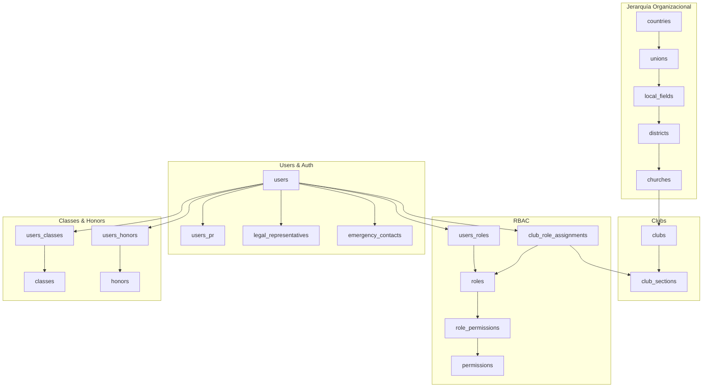

# Schema Reference - SACDIA Database

**Estado**: ACTIVE

<!-- Sincronizado contra schema.prisma 2026-03-18. club_sections consolidation applied (3 tables → 1). Drift corregido en: users (field names), users_pr (PK + campos faltantes). Este documento cubre ~25 de 72 modelos; schema.prisma es fuente de verdad para los modelos no cubiertos aquí. -->

Referencia completa del schema de base de datos PostgreSQL de SACDIA.

---

## Diagrama ER Principal



---

## Tablas Principales

### 📦 Módulo: Users & Authentication

#### Tabla: `users`
**Descripción**: Tabla principal de usuarios del sistema

**Campos** (sincronizado con schema.prisma 2026-03-18):
| Campo | Tipo | Descripción | Constraints |
|-------|------|-------------|-------------|
| `user_id` | UUID | ID único (mismo que Supabase Auth, `auth.uid()`) | PK |
| `email` | VARCHAR(100) | Email del usuario | UNIQUE, NOT NULL |
| `name` | VARCHAR(50) | Nombre | NULL |
| `paternal_last_name` | VARCHAR(50) | Apellido paterno | NULL |
| `maternal_last_name` | VARCHAR(50) | Apellido materno | NULL |
| `approval_status` | ENUM(user_approval_status) | Estado administrativo de aprobación (`pending`, `approved`, `rejected`) | DEFAULT `pending`, NOT NULL |
| `rejection_reason` | TEXT | Motivo del rechazo administrativo cuando aplica | NULL |
| `gender` | VARCHAR | Género | - |
| `birthday` | DATE | Fecha de nacimiento | - |
| `baptism` | BOOLEAN | ¿Está bautizado? | DEFAULT false |
| `baptism_date` | DATE | Fecha de bautismo | - |
| `blood` | ENUM(blood_type) | Tipo de sangre | - |
| `country_id` | INT | País | FK → countries, NULL |
| `union_id` | INT | Unión | FK → unions, NULL |
| `local_field_id` | INT | Campo local | FK → local_fields, NULL |
| `user_image` | TEXT | URL de foto de perfil | NULL |
| `apple_connected` | BOOLEAN | OAuth Apple vinculado | DEFAULT false |
| `google_connected` | BOOLEAN | OAuth Google vinculado | DEFAULT false |
| `access_app` | BOOLEAN | Acceso a app móvil | DEFAULT true |
| `access_panel` | BOOLEAN | Acceso a panel admin | DEFAULT false |
| `active` | BOOLEAN | Usuario activo | DEFAULT true |
| `created_at` | TIMESTAMPTZ | Fecha de creación | DEFAULT NOW() |
| `modified_at` | TIMESTAMPTZ | Última actualización | DEFAULT NOW(), @updatedAt |

**Relaciones**:
- One-to-One: `users_pr`, `legal_representatives`
- One-to-Many: `emergency_contacts`, `club_role_assignments`, `users_classes`, `users_honors`
- Many-to-Many: `roles` (via `users_roles`), `allergies` (via `users_allergies`), `diseases` (via `users_diseases`), `medicines` (via `users_medicines`)

**Naming Convention**: ✅ Cumple - Nombres descriptivos (`paternal_last_name` vs `p_lastname`)

---

#### Tabla: `users_pr`
**Descripción**: Tracking de post-registro (onboarding) y contexto activo de club

**Campos** (sincronizado con schema.prisma 2026-03-14):
| Campo | Tipo | Descripción |
|-------|------|-------------|
| `user_pr_id` | INT | PK técnico (autoincrement) |
| `user_id` | UUID | Usuario | UNIQUE, FK → users |
| `complete` | BOOLEAN | Post-registro completo | DEFAULT false |
| `profile_picture_complete` | BOOLEAN | Paso 1: Foto | DEFAULT false |
| `personal_info_complete` | BOOLEAN | Paso 2: Info personal | DEFAULT false |
| `club_selection_complete` | BOOLEAN | Paso 3: Club | DEFAULT false |
| `active_club_assignment_id` | UUID | Asignación activa de club para contexto de sesión | NULL |
| `date_completed` | TIMESTAMPTZ | Fecha de completado del post-registro | NULL |
| `created_at` | TIMESTAMPTZ | Fecha creación | DEFAULT NOW() |
| `modified_at` | TIMESTAMPTZ | Última actualización | DEFAULT NOW(), @updatedAt |

**Flujo**:
1. Registro → Crea registro con todo en `false`
2. Paso 1 → `profile_picture_complete = true`
3. Paso 2 → `personal_info_complete = true`
4. Paso 3 → `club_selection_complete = true` AND `complete = true`

**Nota**: `active_club_assignment_id` es persistido por `PATCH /auth/me/context` y leído por el backend para resolver autorización efectiva por sesión.

---

#### Tabla: `legal_representatives`
**Descripción**: Representantes legales para menores de 18 años

**Campos**:
| Campo | Tipo | Descripción | Constraints |
|-------|------|-------------|-------------|
| `id` | UUID | ID único | PK |
| `user_id` | UUID | Usuario menor | FK → users, UNIQUE |
| `representative_user_id` | UUID | Usuario representante (si está registrado) | FK → users, NULL |
| `name` | VARCHAR(100) | Nombre (si no es usuario) | NULL |
| `paternal_last_name` | VARCHAR(100) | Apellido paterno | NULL |
| `maternal_last_name` | VARCHAR(100) | Apellido materno | NULL |
| `phone` | VARCHAR(20) | Teléfono | NULL |
| `relationship_type_id` | UUID | Tipo de relación | FK → relationship_types |

**Constraint CHECK**:
```sql
-- Debe tener O un usuario registrado O datos manuales
(representative_user_id IS NOT NULL) OR 
(name IS NOT NULL AND paternal_last_name IS NOT NULL AND phone IS NOT NULL)
```

---

#### Tabla: `emergency_contacts`
**Descripción**: Contactos de emergencia (máximo 5 por usuario)

**Campos**:
| Campo | Tipo | Descripción |
|-------|------|-------------|
| `id` | UUID | ID único | PK |
| `user_id` | UUID | Usuario | FK → users |
| `name` | VARCHAR(100) | Nombre del contacto | NOT NULL |
| `phone` | VARCHAR(20) | Teléfono | NOT NULL |
| `relationship_type_id` | UUID | Relación (padre, madre, etc.) | FK → relationship_types |

**Validación**: Trigger limita a máximo 5 contactos por usuario

---

### 🌍 Módulo: Jerarquía Organizacional

La jerarquía geográfica sigue este patrón:

```
Country → Union → Local Field → District → Church → Club
```

#### Tabla: `countries`
**Campos**: `id` (UUID), `name`, `abbreviation`, `active`, timestamps

#### Tabla: `unions`
**Campos**: `id` (UUID), `country_id` (FK), `name`, `abbreviation`, `active`, timestamps  
**Relación**: Many-to-One con `countries`

#### Tabla: `local_fields`
**Campos**: `id` (UUID), `union_id` (FK), `name`, `abbreviation`, `active`, timestamps  
**Relación**: Many-to-One con `unions`

#### Tabla: `districts`
**Campos**: `id` (UUID), `local_field_id` (FK), `name`, `active`, timestamps  
**Relación**: Many-to-One con `local_fields`

#### Tabla: `churches`
**Campos**: `id` (UUID), `district_id` (FK), `name`, `address`, `active`, timestamps  
**Relación**: Many-to-One con `districts`

---

### 🏕️ Módulo: Clubs

#### Tabla: `clubs`
**Descripción**: Club contenedor (una iglesia tiene 1 club principal)

**Campos**:
| Campo | Tipo | Descripción |
|-------|------|-------------|
| `id` | UUID | ID único | PK |
| `church_id` | UUID | Iglesia | FK → churches |
| `name` | VARCHAR(100) | Nombre del club | NOT NULL |
| `active` | BOOLEAN | Club activo | DEFAULT true |

**Relación**: Un club puede tener múltiples secciones por tipo

---

#### Tabla: `club_sections`
**Descripción**: Secciones de club (unidades operativas por tipo: Aventureros, Conquistadores, Guías Mayores)

**Campos**:
| Campo | Tipo | Descripción | Constraints |
|-------|------|-------------|-------------|
| `club_section_id` | SERIAL | ID único | PK |
| `active` | BOOLEAN | Sección activa | DEFAULT false |
| `souls_target` | INT | Meta de almas | DEFAULT 1 |
| `fee` | INT | Cuota | DEFAULT 1 |
| `meeting_day` | JSON[] | Días de reunión | |
| `meeting_time` | JSON[] | Horarios de reunión | |
| `club_type_id` | INT | Tipo de club | NOT NULL, FK → club_types |
| `main_club_id` | INT | Club contenedor | NULL, FK → clubs ON DELETE CASCADE |
| `created_at` | TIMESTAMPTZ | Fecha de creación | DEFAULT NOW() |
| `modified_at` | TIMESTAMPTZ | Última actualización | DEFAULT NOW() |

**Unique**: `(main_club_id, club_type_id)`

**Nota**: Consolidación de las anteriores `club_adventurers`, `club_pathfinders`, `club_master_guilds` (2026-03-17, Decisión 10)

---

#### Tabla: `club_role_assignments`
**Descripción**: Asignación de roles a usuarios en secciones de club

**Campos**:
| Campo | Tipo | Descripción | Constraints |
|-------|------|-------------|-------------|
| `id` | UUID | ID único | PK |
| `user_id` | UUID | Usuario | FK → users |
| `role_id` | UUID | Rol (debe ser `role_category = 'CLUB'`) | FK → roles |
| `club_section_id` | INT | Sección de club | FK → club_sections, NOT NULL |
| `ecclesiastical_year_id` | INT | Año eclesiástico | FK → ecclesiastical_years |
| `start_date` | DATE | Fecha inicio | DEFAULT CURRENT_DATE |
| `end_date` | DATE | Fecha fin | NULL |
| `active` | BOOLEAN | Asignación activa | DEFAULT true |
| `status` | VARCHAR(20) | Estado (pending/active/inactive) | CHECK |

**Constraint UNIQUE**:
```sql
UNIQUE (user_id, role_id, club_section_id, ecclesiastical_year_id)
```

---

### 🔐 Módulo: RBAC (Roles y Permisos)

#### Tabla: `roles`
**Descripción**: Roles del sistema (globales y de club)

**Campos**:
| Campo | Tipo | Descripción | Valores |
|-------|------|-------------|----------|
| `id` | UUID | ID único | PK |
| `role_name` | VARCHAR(50) | Nombre del rol | UNIQUE |
| `role_category` | VARCHAR(10) | Categoría | 'GLOBAL' o 'CLUB' |
| `description` | TEXT | Descripción | - |
| `active` | BOOLEAN | Rol activo | DEFAULT true |

**Roles Globales** (`role_category = 'GLOBAL'`):
- `super_admin`, `admin`, `assistant_admin`, `coordinator`, `user`

**Roles de Club** (`role_category = 'CLUB'`):
- `director`, `subdirector`, `secretary`, `treasurer`, `counselor`, `member`

---

#### Tabla: `permissions`
**Campos**: `id` (UUID), `permission_name` (ej: `users:read_detail`, `health:read`), `description`, `active`

**Convención vigente**:

- formato `resource:action` en minúsculas;
- recursos sensibles agregados por `rbac-sensitive-subresources`: `health`, `emergency_contacts`, `legal_representative`, `post_registration`;
- coexisten con permisos legacy de la familia `users:*` (`users:read_detail`, `users:update`) para compatibilidad transicional.

#### Tabla: `role_permissions`
**Descripción**: Tabla pivote Many-to-Many entre `roles` y `permissions`

**Seed relevante**:

- `docs/03-DATABASE/migrations/script_06_admin_permissions.sql` inserta el catálogo `resource:action` y ya incluye los permisos finos `health:*`, `emergency_contacts:*`, `legal_representative:*` y `post_registration:*`.
- El mismo seed asigna esos permisos a `super_admin`, `admin` y, en lectura, a `coordinator`.

#### Tabla: `users_roles`
**Descripción**: Asignación de roles GLOBALES a usuarios  
**Campos**: `id`, `user_id`, `role_id`, `assigned_at`

---

### 📚 Módulo: Classes & Honors

#### Tabla: `classes`
**Descripción**: Clases progresivas (Amigo, Compañero, Explorador, etc.)

**Campos**: `id` (UUID), `name`, `club_type_id`, `order`, `active`

#### Tabla: `honors`
**Descripción**: Especialidades

**Campos**: `id` (UUID), `name`, `honors_category_id`, `club_type_id`, `difficulty`, `active`

#### Tabla: `users_classes`
**Descripción**: Trayectoria consolidada por clase y proyección legacy de compatibilidad (`current_class`), no verdad operativa anual primaria

**Campos**:
| Campo | Tipo | Descripción |
|-------|------|-------------|
| `id` | UUID | ID único |
| `user_id` | UUID | Usuario |
| `class_id` | UUID | Clase |
| `current_class` | BOOLEAN | ¿Es su clase actual? |
| `investiture` | BOOLEAN | Investido |
| `date_investiture` | DATE | Fecha de investidura |
| `certificate` | TEXT | URL del certificado |

**Nota runtime (FS-02)**:
- La inscripción operativa anual se resuelve en `enrollments`.
- `users_classes` se sincroniza temporalmente para consumidores legacy mientras se completa la migración de lecturas.

#### Tabla: `enrollments`
**Descripción**: Intento anual operativo de cursado por usuario, clase y año eclesiástico; owner primario del progreso formativo

**Campos relevantes**:
| Campo | Tipo | Descripción |
|-------|------|-------------|
| `enrollment_id` | INT | Identidad de la inscripción anual |
| `user_id` | UUID | Usuario dueño del intento |
| `class_id` | INT | Clase cursada |
| `ecclesiastical_year_id` | INT | Año eclesiástico del intento |
| `active` | BOOLEAN | Estado operativo de la inscripción |

**Regla de identidad**:
- `UNIQUE (user_id, class_id, ecclesiastical_year_id)` evita duplicar el mismo intento anual.

#### Tabla: `class_section_progress`
**Descripción**: Fuente operativa del avance por sección; desde FS-03 pertenece a una inscripción anual vía `enrollment_id`

**Campos relevantes**:
| Campo | Tipo | Descripción |
|-------|------|-------------|
| `section_progress_id` | INT | ID del registro |
| `enrollment_id` | INT NULL | Owner anual del progreso |
| `user_id` | UUID | Huella legacy transicional |
| `class_id` | INT | Huella legacy transicional |
| `module_id` | INT | Módulo de la sección |
| `section_id` | INT | Sección evaluada |
| `score` | FLOAT | Puntaje registrado |
| `evidences` | JSON | Evidencias adjuntas |

**Regla de unicidad FS-03**:
- `UNIQUE (enrollment_id, module_id, section_id)` cuando `enrollment_id` no es nulo.

#### Tabla: `class_module_progress`
**Descripción**: Proyección sincronizada por módulo; resume el avance de secciones para la misma inscripción anual

**Campos relevantes**:
| Campo | Tipo | Descripción |
|-------|------|-------------|
| `module_progress_id` | INT | ID del registro |
| `enrollment_id` | INT NULL | Owner anual del progreso |
| `user_id` | UUID | Huella legacy transicional |
| `class_id` | INT | Huella legacy transicional |
| `module_id` | INT | Módulo resumido |
| `score` | FLOAT | Puntaje agregado del módulo |

**Regla de unicidad FS-03**:
- `UNIQUE (enrollment_id, module_id)` cuando `enrollment_id` no es nulo.

**Política de backfill acotado**:
- Solo se backfillean filas legacy cuyo `user_id + class_id` mapee de forma determinística a una sola inscripción en `enrollments`.
- Filas ambiguas o sin match quedan con `enrollment_id = NULL` para revisión/manual follow-up; FS-03 no inventa historia perfecta.

---

### 🛡️ Módulo: Insurance

#### Tabla: `member_insurances`
**Descripción**: Seguro institucional por miembro, usado por la app móvil y por validaciones de camporee.

**Campos relevantes**:
| Campo | Tipo | Descripción |
|-------|------|-------------|
| `insurance_id` | INT | Identidad del seguro |
| `user_id` | UUID | Usuario asegurado |
| `insurance_type` | ENUM(`insurance_type_enum`) | Tipo de cobertura |
| `policy_number` | VARCHAR(100) | Número de póliza |
| `provider` | VARCHAR(255) | Aseguradora |
| `start_date` | DATE | Inicio de vigencia |
| `end_date` | DATE | Fin de vigencia |
| `coverage_amount` | DECIMAL(10,2) | Monto asegurado |
| `active` | BOOLEAN | Seguro activo |
| `evidence_file_url` | VARCHAR(500) | URL de evidencia adjunta |
| `evidence_file_name` | VARCHAR(255) | Nombre original del archivo |
| `created_by_id` | UUID | Usuario creador |
| `modified_by_id` | UUID | Usuario que actualizó por última vez |

**Relaciones**:
- `users` vía `user_id`
- `users` vía `created_by_id` y `modified_by_id` para auditoría
- `camporee_members` vía `insurance_id`

**Notas**:
- La evidencia se sube al bucket R2 `INSURANCE_EVIDENCE`.
- El backend expone listado por sección, detalle por miembro y CRUD multipart para el seguro.

---

## Convenciones de Naming

### ✅ Estándares Aplicados

#### Tablas
- **Plural**: `users`, `clubs`, `classes`, `permissions`
- **Snake case**: `emergency_contacts`, `club_role_assignments`
- **Descriptivo**: `legal_representatives` (no `legal_reps`)

#### Campos
- **Snake case**: `paternal_last_name`, `created_at`
- **Descriptivo**: `paternal_last_name` (no `p_lastname`)
- **IDs explícitos**: `user_id`, `club_type_id` (no `uid`, `ct_id`)

#### IDs
- **Tablas principales**: `{tabla}_id` UUID
- **Tablas pivote**: `id` UUID como PK, FKs descriptivos
- **Secciones de club**: INT (`club_section_id`)

---

### ⚠️ Inconsistencias Detectadas (Pendientes)

| Tabla/Campo | Actual | Debería ser | Prioridad |
|-------------|--------|-------------|-----------|
| `ecclesiastical_year` | Singular | `ecclesiastical_years` | ALTA |
| `club_master_guild` | Singular | `club_master_guilds` | RESUELTA (consolidado en `club_sections` — 2026-03-17) |
| `club_types.ct_id` | Abreviado | `club_type_id` | ALTA |
| `inventory_categories.inventory_categoty_id` | Typo | `inventory_category_id` | ALTA |

**Ver detalles completos**: Ver documentos originales en carpeta raíz de database/

---

## Queries Útiles

### Obtener roles de un usuario (globales y de club)

```sql
-- Roles globales
SELECT r.role_name, r.role_category
FROM users_roles ur
JOIN roles r ON r.id = ur.role_id
WHERE ur.user_id = 'uuid-del-usuario';

-- Roles de club
SELECT
  r.role_name,
  ct.name AS club_type,
  ey.name AS year
FROM club_role_assignments cra
JOIN roles r ON r.id = cra.role_id
JOIN club_sections cs ON cs.club_section_id = cra.club_section_id
JOIN club_types ct ON ct.id = cs.club_type_id
JOIN ecclesiastical_years ey ON ey.id = cra.ecclesiastical_year_id
WHERE cra.user_id = 'uuid-del-usuario'
  AND cra.active = true;
```

### Obtener miembros activos de una sección de club

```sql
SELECT
  u.name,
  u.paternal_last_name,
  u.maternal_last_name,
  r.role_name,
  cra.start_date
FROM club_role_assignments cra
JOIN users u ON u.id = cra.user_id
JOIN roles r ON r.id = cra.role_id
WHERE cra.club_section_id = 123  -- ID de sección
  AND cra.active = true
ORDER BY
  CASE r.role_name
    WHEN 'director' THEN 1
    WHEN 'subdirector' THEN 2
    WHEN 'secretary' THEN 3
    ELSE 4
  END;
```

### Verificar año eclesiástico actual

```sql
SELECT id, name, start_date, end_date
FROM ecclesiastical_years
WHERE start_date <= CURRENT_DATE
  AND end_date >= CURRENT_DATE;
```

### Contar usuarios por tipo de club

```sql
SELECT
  ct.name AS club_type,
  COUNT(DISTINCT cra.user_id) AS member_count
FROM club_role_assignments cra
JOIN club_sections cs ON cs.club_section_id = cra.club_section_id
JOIN club_types ct ON ct.id = cs.club_type_id
WHERE cra.active = true
GROUP BY ct.name;
```

---

## Índices Recomendados

```sql
-- Performance en búsquedas de usuarios
CREATE INDEX idx_users_email ON users(email) WHERE active = true;
CREATE INDEX idx_users_location ON users(country_id, union_id, local_field_id);

-- Performance en club_role_assignments
CREATE INDEX idx_cra_user ON club_role_assignments(user_id) WHERE active = true;
CREATE INDEX idx_cra_section ON club_role_assignments(club_section_id);
CREATE INDEX idx_cra_year ON club_role_assignments(ecclesiastical_year_id);

-- Performance en jerarquía organizacional
CREATE INDEX idx_unions_country ON unions(country_id) WHERE active = true;
CREATE INDEX idx_lf_union ON local_fields(union_id) WHERE active = true;
CREATE INDEX idx_districts_lf ON districts(local_field_id) WHERE active = true;
CREATE INDEX idx_churches_district ON churches(district_id) WHERE active = true;
```

---

## Ver También

- [schema.prisma](schema.prisma) - Schema Prisma definitivo
- [migrations/](migrations/) - Scripts SQL de migración  
- [README.md](README.md) - Guía de base de datos
- [../02-API/API-SPECIFICATION.md](../02-API/API-SPECIFICATION.md) - Cómo la API usa estos modelos

---

**Última actualización**: 2026-03-18 (club_sections consolidation applied — 3 tables → 1, 3 FK nullables → 1 FK directa)
**Fuentes**: `schema.prisma` (fuente de verdad), `relations.md`, `auditoria-naming-bd.md`, `verificacion-schema-prisma.md`
