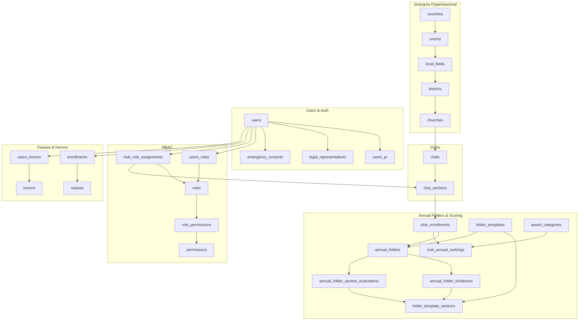

# Schema Reference - SACDIA Database

**Estado**: ACTIVE

<!-- Sincronizado contra schema.prisma 2026-03-25. Cobertura completa: 78 modelos + 8 enums documentados. Añadidos en 2026-03-25: annual_folder_section_evaluations, award_categories, club_annual_rankings (Annual Folders Scoring) + campos de scoring en folder_template_sections, folder_templates, annual_folders. Añadidos en 2026-03-26: resource_categories, resources (ResourcesModule). Wave 3 (2026-03-22): email_verified añadido a users, apple_connected/google_connected removidos, tablas BA (sessions, accounts, verifications) añadidas. -->

Referencia completa del schema de base de datos PostgreSQL de SACDIA.

---

## Diagrama ER Principal



---

## Tablas Principales

### 📦 Módulo: Users & Authentication

#### Tabla: `users`
**Descripción**: Tabla principal de usuarios del sistema

**Campos** (sincronizado con schema.prisma 2026-03-18):
| Campo | Tipo | Descripción | Constraints |
|-------|------|-------------|-------------|
| `user_id` | UUID | ID único (PK, referenciado por Better Auth `accounts.userId`) | PK |
| `email` | VARCHAR(100) | Email del usuario | UNIQUE, NOT NULL |
| `name` | VARCHAR(50) | Nombre | NULL |
| `paternal_last_name` | VARCHAR(50) | Apellido paterno | NULL |
| `maternal_last_name` | VARCHAR(50) | Apellido materno | NULL |
| `approval_status` | ENUM(user_approval_status) | Estado administrativo de aprobación (`pending`, `approved`, `rejected`) | DEFAULT `pending`, NOT NULL |
| `rejection_reason` | TEXT | Motivo del rechazo administrativo cuando aplica | NULL |
| `gender` | VARCHAR | Género | - |
| `birthday` | DATE | Fecha de nacimiento | - |
| `baptism` | BOOLEAN | ¿Está bautizado? | DEFAULT false |
| `baptism_date` | DATE | Fecha de bautismo | - |
| `blood` | ENUM(blood_type) | Tipo de sangre | - |
| `country_id` | INT | País | FK → countries, NULL |
| `union_id` | INT | Unión | FK → unions, NULL |
| `local_field_id` | INT | Campo local | FK → local_fields, NULL |
| `user_image` | TEXT | URL de foto de perfil | NULL |
| `email_verified` | BOOLEAN | Email verificado (gestionado por Better Auth) | DEFAULT false |
| `access_app` | BOOLEAN | Acceso a app móvil | DEFAULT true |
| `access_panel` | BOOLEAN | Acceso a panel admin | DEFAULT false |
| `active` | BOOLEAN | Usuario activo | DEFAULT true |
| `created_at` | TIMESTAMPTZ | Fecha de creación | DEFAULT NOW() |
| `modified_at` | TIMESTAMPTZ | Última actualización | DEFAULT NOW(), @updatedAt |

**Relaciones**:
- One-to-One: `users_pr`, `legal_representatives`
- One-to-Many: `emergency_contacts`, `club_role_assignments`, `users_honors`
- Many-to-Many: `roles` (via `users_roles`), `allergies` (via `users_allergies`), `diseases` (via `users_diseases`), `medicines` (via `users_medicines`)

**Nota histórica**: La relación `users_classes` fue deprecada y la tabla se archivó como `users_classes_archive`. El histórico consolidado se resuelve ahora desde `enrollments`.
Los campos `apple_connected` y `google_connected` fueron removidos en Wave 3 — el estado de OAuth ahora se resuelve desde la tabla `accounts` de Better Auth.

**Naming Convention**: ✅ Cumple - Nombres descriptivos (`paternal_last_name` vs `p_lastname`)

---

#### Tabla: `sessions` (Better Auth)
**Descripción**: Sesiones activas gestionadas por Better Auth

**Campos**:
| Campo | Tipo | Descripción | Constraints |
|-------|------|-------------|-------------|
| `id` | TEXT | ID único de sesión | PK |
| `expiresAt` | TIMESTAMPTZ | Expiración de la sesión | NOT NULL |
| `token` | TEXT | Token opaco de sesión | UNIQUE, NOT NULL |
| `createdAt` | TIMESTAMPTZ | Fecha de creación | NOT NULL |
| `updatedAt` | TIMESTAMPTZ | Última actualización | NOT NULL |
| `ipAddress` | TEXT | IP de origen | NULL |
| `userAgent` | TEXT | User-Agent del cliente | NULL |
| `userId` | TEXT | Usuario propietario | FK → users.user_id, NOT NULL |

---

#### Tabla: `accounts` (Better Auth)
**Descripción**: Cuentas de proveedor (email/password, Google, Apple) vinculadas a un usuario

**Campos**:
| Campo | Tipo | Descripción | Constraints |
|-------|------|-------------|-------------|
| `id` | TEXT | ID único | PK |
| `accountId` | TEXT | ID en el proveedor externo | NOT NULL |
| `providerId` | TEXT | Identificador del proveedor (ej: "google", "credential") | NOT NULL |
| `userId` | TEXT | Usuario SACDIA vinculado | FK → users.user_id, NOT NULL |
| `accessToken` | TEXT | Access token del proveedor | NULL |
| `refreshToken` | TEXT | Refresh token del proveedor | NULL |
| `idToken` | TEXT | ID token del proveedor | NULL |
| `accessTokenExpiresAt` | TIMESTAMPTZ | Expiración del access token | NULL |
| `refreshTokenExpiresAt` | TIMESTAMPTZ | Expiración del refresh token | NULL |
| `scope` | TEXT | Scopes otorgados | NULL |
| `password` | TEXT | Hash de contraseña (solo credential provider) | NULL |
| `createdAt` | TIMESTAMPTZ | Fecha de creación | NOT NULL |
| `updatedAt` | TIMESTAMPTZ | Última actualización | NOT NULL |

---

#### Tabla: `verifications` (Better Auth)
**Descripción**: Tokens temporales para verificación de email y flujos similares

**Campos**:
| Campo | Tipo | Descripción | Constraints |
|-------|------|-------------|-------------|
| `id` | TEXT | ID único | PK |
| `identifier` | TEXT | Identificador (ej: email) | NOT NULL |
| `value` | TEXT | Valor/token de verificación | NOT NULL |
| `expiresAt` | TIMESTAMPTZ | Expiración | NOT NULL |
| `createdAt` | TIMESTAMPTZ | Fecha de creación | NULL |
| `updatedAt` | TIMESTAMPTZ | Última actualización | NULL |

---

#### Tabla: `users_pr`
**Descripción**: Tracking de post-registro (onboarding) y contexto activo de club

**Campos** (sincronizado con schema.prisma 2026-03-14):
| Campo | Tipo | Descripción |
|-------|------|-------------|
| `user_pr_id` | INT | PK técnico (autoincrement) |
| `user_id` | UUID | Usuario | UNIQUE, FK → users |
| `complete` | BOOLEAN | Post-registro completo | DEFAULT false |
| `profile_picture_complete` | BOOLEAN | Paso 1: Foto | DEFAULT false |
| `personal_info_complete` | BOOLEAN | Paso 2: Info personal | DEFAULT false |
| `club_selection_complete` | BOOLEAN | Paso 3: Club | DEFAULT false |
| `active_club_assignment_id` | UUID | Asignación activa de club para contexto de sesión | NULL |
| `date_completed` | TIMESTAMPTZ | Fecha de completado del post-registro | NULL |
| `created_at` | TIMESTAMPTZ | Fecha creación | DEFAULT NOW() |
| `modified_at` | TIMESTAMPTZ | Última actualización | DEFAULT NOW(), @updatedAt |

**Flujo**:
1. Registro → Crea registro con todo en `false`
2. Paso 1 → `profile_picture_complete = true`
3. Paso 2 → `personal_info_complete = true`
4. Paso 3 → `club_selection_complete = true` AND `complete = true`

**Nota**: `active_club_assignment_id` es persistido por `PATCH /auth/me/context` y leído por el backend para resolver autorización efectiva por sesión.

---

#### Tabla: `legal_representatives`
**Descripción**: Representantes legales para menores de 18 años

**Campos**:
| Campo | Tipo | Descripción | Constraints |
|-------|------|-------------|-------------|
| `id` | UUID | ID único | PK |
| `user_id` | UUID | Usuario menor | FK → users, UNIQUE |
| `representative_user_id` | UUID | Usuario representante (si está registrado) | FK → users, NULL |
| `name` | VARCHAR(100) | Nombre (si no es usuario) | NULL |
| `paternal_last_name` | VARCHAR(100) | Apellido paterno | NULL |
| `maternal_last_name` | VARCHAR(100) | Apellido materno | NULL |
| `phone` | VARCHAR(20) | Teléfono | NULL |
| `relationship_type_id` | UUID | Tipo de relación | FK → relationship_types |

**Constraint CHECK**:
```sql
-- Debe tener O un usuario registrado O datos manuales
(representative_user_id IS NOT NULL) OR 
(name IS NOT NULL AND paternal_last_name IS NOT NULL AND phone IS NOT NULL)
```

---

#### Tabla: `emergency_contacts`
**Descripción**: Contactos de emergencia (máximo 5 por usuario)

**Campos**:
| Campo | Tipo | Descripción |
|-------|------|-------------|
| `id` | UUID | ID único | PK |
| `user_id` | UUID | Usuario | FK → users |
| `name` | VARCHAR(100) | Nombre del contacto | NOT NULL |
| `phone` | VARCHAR(20) | Teléfono | NOT NULL |
| `relationship_type_id` | UUID | Relación (padre, madre, etc.) | FK → relationship_types |

**Validación**: Trigger limita a máximo 5 contactos por usuario

---

### 🌍 Módulo: Jerarquía Organizacional

La jerarquía geográfica sigue este patrón:

```
Country → Union → Local Field → District → Church → Club
```

#### Tabla: `countries`
**Descripción**: Países disponibles en el sistema (catálogo geográfico de nivel superior)

**Campos**:
| Campo | Tipo | Descripción | Constraints |
|-------|------|-------------|-------------|
| `country_id` | INT | ID único | PK, autoincrement |
| `name` | VARCHAR(50) | Nombre del país | UNIQUE, NOT NULL |
| `abbreviation` | VARCHAR(8) | Abreviatura del país | UNIQUE, NOT NULL |
| `active` | BOOLEAN | País activo | DEFAULT false |
| `created_at` | TIMESTAMPTZ | Fecha de creación | DEFAULT NOW() |
| `modified_at` | TIMESTAMPTZ | Última actualización | DEFAULT NOW() |

**Índices**: `idx_countries_active` sobre `(active)`

**Relaciones**:
- One-to-Many: `unions`, `users`

---

#### Tabla: `unions`
**Descripción**: Uniones eclesiásticas (nivel regional, agrupan campos locales)

**Campos**:
| Campo | Tipo | Descripción | Constraints |
|-------|------|-------------|-------------|
| `union_id` | INT | ID único | PK, autoincrement |
| `name` | VARCHAR(50) | Nombre de la unión | UNIQUE, NOT NULL |
| `abbreviation` | VARCHAR(8) | Abreviatura de la unión | UNIQUE, NOT NULL |
| `active` | BOOLEAN | Unión activa | DEFAULT false |
| `country_id` | INT | País al que pertenece | FK → countries, NOT NULL |
| `created_at` | TIMESTAMPTZ | Fecha de creación | DEFAULT NOW() |
| `modified_at` | TIMESTAMPTZ | Última actualización | DEFAULT NOW() |

**Relaciones**:
- Many-to-One: `countries`
- One-to-Many: `local_fields`, `union_camporees`, `users`

---

#### Tabla: `local_fields`
**Descripción**: Campos locales (nivel de asociación local, agrupa distritos y clubes)

**Campos**:
| Campo | Tipo | Descripción | Constraints |
|-------|------|-------------|-------------|
| `local_field_id` | INT | ID único | PK, autoincrement |
| `name` | VARCHAR(50) | Nombre del campo local | UNIQUE, NOT NULL |
| `abbreviation` | VARCHAR(8) | Abreviatura del campo local | UNIQUE, NOT NULL |
| `active` | BOOLEAN | Campo local activo | DEFAULT false |
| `union_id` | INT | Unión a la que pertenece | FK → unions, NOT NULL |
| `created_at` | TIMESTAMPTZ | Fecha de creación | DEFAULT NOW() |
| `modified_at` | TIMESTAMPTZ | Última actualización | DEFAULT NOW() |

**Relaciones**:
- Many-to-One: `unions`
- One-to-Many: `camporee_clubs`, `camporee_members`, `clubs`, `districts`, `investiture_configs`, `local_camporees`, `union_camporee_local_fields`, `users`

---

#### Tabla: `districts`
**Descripción**: Distritos eclesiásticos dentro de un campo local (agrupan iglesias)

**Campos**:
| Campo | Tipo | Descripción | Constraints |
|-------|------|-------------|-------------|
| `districlub_type_id` | INT | ID único | PK, autoincrement |
| `name` | VARCHAR(50) | Nombre del distrito | NOT NULL |
| `active` | BOOLEAN | Distrito activo | DEFAULT false |
| `local_field_id` | INT | Campo local al que pertenece | FK → local_fields, NOT NULL |
| `created_at` | TIMESTAMPTZ | Fecha de creación | DEFAULT NOW() |
| `modified_at` | TIMESTAMPTZ | Última actualización | DEFAULT NOW() |

**Nota**: El PK se llama `districlub_type_id` por razones históricas (fue renombrado pero el nombre quedó así en la BD).

**Relaciones**:
- Many-to-One: `local_fields`
- One-to-Many: `churches`, `clubs`

---

#### Tabla: `churches`
**Descripción**: Iglesias locales dentro de un distrito (cada iglesia puede tener un club)

**Campos**:
| Campo | Tipo | Descripción | Constraints |
|-------|------|-------------|-------------|
| `church_id` | INT | ID único | PK, autoincrement |
| `name` | VARCHAR(50) | Nombre de la iglesia | NOT NULL |
| `active` | BOOLEAN | Iglesia activa | DEFAULT false |
| `districlub_type_id` | INT | Distrito al que pertenece | FK → districts, NOT NULL |
| `created_at` | TIMESTAMPTZ | Fecha de creación | DEFAULT NOW() |
| `modified_at` | TIMESTAMPTZ | Última actualización | DEFAULT NOW() |

**Relaciones**:
- Many-to-One: `districts`
- One-to-Many: `clubs`

---

### 🏕️ Módulo: Clubs

#### Tabla: `clubs`
**Descripción**: Club contenedor (una iglesia tiene 1 club principal por tipo)

**Campos**:
| Campo | Tipo | Descripción | Constraints |
|-------|------|-------------|-------------|
| `club_id` | INT | ID único | PK, autoincrement |
| `name` | VARCHAR(50) | Nombre del club | NOT NULL |
| `description` | STRING | Descripción del club | NULL |
| `active` | BOOLEAN | Club activo | DEFAULT false |
| `local_field_id` | INT | Campo local al que pertenece | FK → local_fields, NOT NULL |
| `address` | STRING | Dirección del club | NULL |
| `church_id` | INT | Iglesia a la que pertenece | FK → churches, NOT NULL |
| `coordinates` | JSON | Coordenadas geográficas | NOT NULL |
| `districlub_type_id` | INT | Distrito al que pertenece | FK → districts, NOT NULL |
| `created_at` | TIMESTAMPTZ | Fecha de creación | DEFAULT NOW() |
| `modified_at` | TIMESTAMPTZ | Última actualización | DEFAULT NOW() |

**Relaciones**:
- Many-to-One: `churches`, `districts`, `local_fields`
- One-to-Many: `club_sections`

---

#### Tabla: `club_sections`
**Descripción**: Secciones de club (unidades operativas por tipo: Aventureros, Conquistadores, Guías Mayores)

**Campos**:
| Campo | Tipo | Descripción | Constraints |
|-------|------|-------------|-------------|
| `club_section_id` | SERIAL | ID único | PK |
| `active` | BOOLEAN | Sección activa | DEFAULT false |
| `souls_target` | INT | Meta de almas | DEFAULT 1 |
| `fee` | INT | Cuota | DEFAULT 1 |
| `meeting_day` | JSON[] | Días de reunión | |
| `meeting_time` | JSON[] | Horarios de reunión | |
| `club_type_id` | INT | Tipo de club | NOT NULL, FK → club_types |
| `main_club_id` | INT | Club contenedor | NULL, FK → clubs ON DELETE CASCADE |
| `created_at` | TIMESTAMPTZ | Fecha de creación | DEFAULT NOW() |
| `modified_at` | TIMESTAMPTZ | Última actualización | DEFAULT NOW() |

**Unique**: `(main_club_id, club_type_id)`

**Nota**: Consolidación de las anteriores `club_adventurers`, `club_pathfinders`, `club_master_guilds` (2026-03-17, Decisión 10)

---

#### Tabla: `club_role_assignments`
**Descripción**: Asignación de roles a usuarios en secciones de club

**Campos**:
| Campo | Tipo | Descripción | Constraints |
|-------|------|-------------|-------------|
| `id` | UUID | ID único | PK |
| `user_id` | UUID | Usuario | FK → users |
| `role_id` | UUID | Rol (debe ser `role_category = 'CLUB'`) | FK → roles |
| `club_section_id` | INT | Sección de club | FK → club_sections, NOT NULL |
| `ecclesiastical_year_id` | INT | Año eclesiástico | FK → ecclesiastical_years |
| `start_date` | DATE | Fecha inicio | DEFAULT CURRENT_DATE |
| `end_date` | DATE | Fecha fin | NULL |
| `active` | BOOLEAN | Asignación activa | DEFAULT true |
| `status` | VARCHAR(20) | Estado (pending/active/inactive) | CHECK |

**Constraint UNIQUE**:
```sql
UNIQUE (user_id, role_id, club_section_id, ecclesiastical_year_id)
```

---

### 🔐 Módulo: RBAC (Roles y Permisos)

#### Tabla: `roles`
**Descripción**: Roles del sistema (globales y de club)

**Campos**:
| Campo | Tipo | Descripción | Valores |
|-------|------|-------------|----------|
| `id` | UUID | ID único | PK |
| `role_name` | VARCHAR(50) | Nombre del rol | UNIQUE |
| `role_category` | VARCHAR(10) | Categoría | 'GLOBAL' o 'CLUB' |
| `description` | TEXT | Descripción | - |
| `active` | BOOLEAN | Rol activo | DEFAULT true |

**Roles Globales** (`role_category = 'GLOBAL'`):
- `super_admin`, `admin`, `assistant_admin`, `coordinator`, `user`

**Roles de Club** (`role_category = 'CLUB'`):
- `director`, `subdirector`, `secretary`, `treasurer`, `counselor`, `member`

---

#### Tabla: `permissions`
**Campos**: `id` (UUID), `permission_name` (ej: `users:read_detail`, `health:read`), `description`, `active`

**Convención vigente**:

- formato `resource:action` en minúsculas;
- recursos sensibles agregados por `rbac-sensitive-subresources`: `health`, `emergency_contacts`, `legal_representative`, `post_registration`;
- coexisten con permisos legacy de la familia `users:*` (`users:read_detail`, `users:update`) para compatibilidad transicional.

#### Tabla: `role_permissions`
**Descripción**: Tabla pivote Many-to-Many entre `roles` y `permissions`

**Seed relevante**:

- `docs/03-DATABASE/migrations/script_06_admin_permissions.sql` inserta el catálogo `resource:action` y ya incluye los permisos finos `health:*`, `emergency_contacts:*`, `legal_representative:*` y `post_registration:*`.
- El mismo seed asigna esos permisos a `super_admin`, `admin` y, en lectura, a `coordinator`.

#### Tabla: `users_roles`
**Descripción**: Asignación de roles GLOBALES a usuarios  
**Campos**: `id`, `user_id`, `role_id`, `assigned_at`

---

### 📚 Módulo: Classes & Honors

#### Tabla: `classes`
**Descripción**: Clases progresivas por tipo de club (Amigo, Compañero, Explorador, etc.)

**Campos**:
| Campo | Tipo | Descripción | Constraints |
|-------|------|-------------|-------------|
| `class_id` | INT | ID único | PK, autoincrement |
| `name` | VARCHAR(255) | Nombre de la clase | UNIQUE, NOT NULL |
| `description` | STRING | Descripción de la clase | NULL |
| `active` | BOOLEAN | Clase activa | NOT NULL |
| `club_type_id` | INT | Tipo de club al que pertenece | FK → club_types, NOT NULL |
| `minimum_age` | INT | Edad mínima requerida | NOT NULL |
| `requires_invested_gm` | BOOLEAN | Requiere Guía Mayor investido | DEFAULT false |
| `material_url` | VARCHAR | URL del material de estudio | NULL |
| `created_at` | TIMESTAMPTZ | Fecha de creación | DEFAULT NOW() |
| `modified_at` | TIMESTAMPTZ | Última actualización | DEFAULT NOW() |

**Relaciones**:
- Many-to-One: `club_types`
- One-to-Many: `class_module_progress`, `class_modules`, `class_section_progress`, `enrollments`

**Nota histórica**: La relación `users_classes` fue deprecada. El histórico consolidado se resuelve desde `enrollments`.

---

#### Tabla: `honors`
**Descripción**: Especialidades (logros y habilidades que los miembros pueden obtener)

**Campos**:
| Campo | Tipo | Descripción | Constraints |
|-------|------|-------------|-------------|
| `honor_id` | INT | ID único | PK, autoincrement |
| `name` | VARCHAR(100) | Nombre de la especialidad | UNIQUE, NOT NULL |
| `description` | STRING | Descripción | NULL |
| `honor_image` | STRING | URL de imagen de la especialidad | NOT NULL |
| `honors_category_id` | INT | Categoría de la especialidad | FK → honors_categories, NOT NULL |
| `master_honors_id` | INT | Especialidad maestra asociada | FK → master_honors, NULL |
| `material_url` | VARCHAR | URL del material de estudio | NOT NULL |
| `club_type_id` | INT | Tipo de club al que pertenece | FK → club_types, NOT NULL |
| `active` | BOOLEAN | Especialidad activa | DEFAULT true |
| `approval` | INT | Nivel de aprobación | DEFAULT 1 |
| `skill_level` | INT | Nivel de habilidad | DEFAULT 1 |
| `year` | VARCHAR | Año de la especialidad | NULL |
| `created_at` | TIMESTAMPTZ | Fecha de creación | DEFAULT NOW() |
| `modified_at` | TIMESTAMPTZ | Última actualización | DEFAULT NOW() |

**Relaciones**:
- Many-to-One: `club_types`, `honors_categories`, `master_honors`
- One-to-Many: `users_honors`

#### Tabla: `users_classes` [DEPRECADA]

**Estado**: ❌ **ARCHIVADA Y ELIMINADA**

Fue archivada como `users_classes_archive` en la migración del 2026-03-20. El histórico consolidado se resuelve completamente desde `enrollments` y sus proyecciones (`class_module_progress`, `class_section_progress`).

**Motivo**: La separación entre "trayectoria consolidada" (legacy) y "inscripción operativa anual" (authority) se resolvió completamente hacia `enrollments` como única fuente de verdad. Los consumidores que necesitaban el histórico consolidado deben consultar directamente `enrollments` con filtros históricos.

#### Tabla: `enrollments`
**Descripción**: Intento anual operativo de cursado por usuario, clase y año eclesiástico; owner primario del progreso formativo

**Campos relevantes**:
| Campo | Tipo | Descripción |
|-------|------|-------------|
| `enrollment_id` | INT | Identidad de la inscripción anual |
| `user_id` | UUID | Usuario dueño del intento |
| `class_id` | INT | Clase cursada |
| `ecclesiastical_year_id` | INT | Año eclesiástico del intento |
| `active` | BOOLEAN | Estado operativo de la inscripción |

**Regla de identidad**:
- `UNIQUE (user_id, class_id, ecclesiastical_year_id)` evita duplicar el mismo intento anual.

#### Tabla: `class_section_progress`
**Descripción**: Fuente operativa del avance por sección; desde FS-03 pertenece a una inscripción anual vía `enrollment_id`

**Campos relevantes**:
| Campo | Tipo | Descripción |
|-------|------|-------------|
| `section_progress_id` | INT | ID del registro |
| `enrollment_id` | INT NULL | Owner anual del progreso |
| `user_id` | UUID | Huella legacy transicional |
| `class_id` | INT | Huella legacy transicional |
| `module_id` | INT | Módulo de la sección |
| `section_id` | INT | Sección evaluada |
| `score` | FLOAT | Puntaje registrado |
| `evidences` | JSON | Evidencias adjuntas |

**Regla de unicidad FS-03**:
- `UNIQUE (enrollment_id, module_id, section_id)` cuando `enrollment_id` no es nulo.

#### Tabla: `class_module_progress`
**Descripción**: Proyección sincronizada por módulo; resume el avance de secciones para la misma inscripción anual

**Campos relevantes**:
| Campo | Tipo | Descripción |
|-------|------|-------------|
| `module_progress_id` | INT | ID del registro |
| `enrollment_id` | INT NULL | Owner anual del progreso |
| `user_id` | UUID | Huella legacy transicional |
| `class_id` | INT | Huella legacy transicional |
| `module_id` | INT | Módulo resumido |
| `score` | FLOAT | Puntaje agregado del módulo |

**Regla de unicidad FS-03**:
- `UNIQUE (enrollment_id, module_id)` cuando `enrollment_id` no es nulo.

**Política de backfill acotado**:
- Solo se backfillean filas legacy cuyo `user_id + class_id` mapee de forma determinística a una sola inscripción en `enrollments`.
- Filas ambiguas o sin match quedan con `enrollment_id = NULL` para revisión/manual follow-up; FS-03 no inventa historia perfecta.

---

### 🛡️ Módulo: Insurance

#### Tabla: `member_insurances`
**Descripción**: Seguro institucional por miembro, usado por la app móvil y por validaciones de camporee.

**Campos relevantes**:
| Campo | Tipo | Descripción |
|-------|------|-------------|
| `insurance_id` | INT | Identidad del seguro |
| `user_id` | UUID | Usuario asegurado |
| `insurance_type` | ENUM(`insurance_type_enum`) | Tipo de cobertura |
| `policy_number` | VARCHAR(100) | Número de póliza |
| `provider` | VARCHAR(255) | Aseguradora |
| `start_date` | DATE | Inicio de vigencia |
| `end_date` | DATE | Fin de vigencia |
| `coverage_amount` | DECIMAL(10,2) | Monto asegurado |
| `active` | BOOLEAN | Seguro activo |
| `evidence_file_url` | VARCHAR(500) | URL de evidencia adjunta |
| `evidence_file_name` | VARCHAR(255) | Nombre original del archivo |
| `created_by_id` | UUID | Usuario creador |
| `modified_by_id` | UUID | Usuario que actualizó por última vez |

**Relaciones**:
- `users` vía `user_id`
- `users` vía `created_by_id` y `modified_by_id` para auditoría
- `camporee_members` vía `insurance_id`

**Notas**:
- La evidencia se sube al bucket R2 `INSURANCE_EVIDENCE`.
- El backend expone listado por sección, detalle por miembro y CRUD multipart para el seguro.

---

### 💊 Módulo: Health / Catálogos Médicos

#### Tabla: `diseases`
**Descripción**: Catálogo de enfermedades/padecimientos que pueden asociarse a usuarios

**Campos**:
| Campo | Tipo | Descripción | Constraints |
|-------|------|-------------|-------------|
| `disease_id` | INT | ID único | PK, autoincrement |
| `name` | STRING | Nombre de la enfermedad | UNIQUE, NOT NULL |
| `description` | STRING | Descripción detallada | NULL |
| `created_at` | TIMESTAMPTZ | Fecha de creación | DEFAULT NOW() |
| `modified_at` | TIMESTAMPTZ | Última actualización | DEFAULT NOW(), @updatedAt |
| `active` | BOOLEAN | Registro activo | DEFAULT true |

**Relaciones**:
- One-to-Many: `users_diseases`

---

#### Tabla: `allergies`
**Descripción**: Catálogo de alergias que pueden asociarse a usuarios

**Campos**:
| Campo | Tipo | Descripción | Constraints |
|-------|------|-------------|-------------|
| `allergy_id` | INT | ID único | PK, autoincrement |
| `name` | STRING | Nombre de la alergia | UNIQUE, NOT NULL |
| `description` | STRING | Descripción detallada | NULL |
| `created_at` | TIMESTAMPTZ | Fecha de creación | DEFAULT NOW() |
| `modified_at` | TIMESTAMPTZ | Última actualización | DEFAULT NOW(), @updatedAt |
| `active` | BOOLEAN | Registro activo | DEFAULT true |

**Relaciones**:
- One-to-Many: `users_allergies`

---

#### Tabla: `medicines`
**Descripción**: Catálogo de medicamentos que pueden asociarse a usuarios

**Campos**:
| Campo | Tipo | Descripción | Constraints |
|-------|------|-------------|-------------|
| `medicine_id` | INT | ID único | PK, autoincrement |
| `name` | VARCHAR | Nombre del medicamento | NOT NULL |
| `description` | VARCHAR | Descripción detallada | NULL |
| `active` | BOOLEAN | Registro activo | DEFAULT true |
| `created_at` | TIMESTAMPTZ | Fecha de creación | DEFAULT NOW() |
| `modified_at` | TIMESTAMPTZ | Última actualización | DEFAULT NOW(), @updatedAt |

**Relaciones**:
- One-to-Many: `users_medicines`

---

#### Tabla: `users_allergies`
**Descripción**: Tabla pivote Many-to-Many entre `users` y `allergies`

**Campos**:
| Campo | Tipo | Descripción | Constraints |
|-------|------|-------------|-------------|
| `user_allergies_id` | INT | ID único | PK, autoincrement |
| `user_id` | UUID | Usuario | FK → users, NOT NULL |
| `allergy_id` | INT | Alergia | FK → allergies, NULL |
| `created_at` | TIMESTAMPTZ | Fecha de creación | DEFAULT NOW() |
| `modified_at` | TIMESTAMPTZ | Última actualización | DEFAULT NOW() |
| `active` | BOOLEAN | Registro activo | DEFAULT true |

**Constraint UNIQUE**: `(user_id, allergy_id)`

**Relaciones**:
- Many-to-One: `users`, `allergies`

---

#### Tabla: `users_diseases`
**Descripción**: Tabla pivote Many-to-Many entre `users` y `diseases`

**Campos**:
| Campo | Tipo | Descripción | Constraints |
|-------|------|-------------|-------------|
| `user_disease_id` | INT | ID único | PK, autoincrement |
| `user_id` | UUID | Usuario | FK → users, NOT NULL |
| `disease_id` | INT | Enfermedad | FK → diseases, NOT NULL |
| `created_at` | TIMESTAMPTZ | Fecha de creación | DEFAULT NOW() |
| `modified_at` | TIMESTAMPTZ | Última actualización | DEFAULT NOW() |
| `active` | BOOLEAN | Registro activo | DEFAULT true |

**Constraint UNIQUE**: `(user_id, disease_id)`

**Relaciones**:
- Many-to-One: `users`, `diseases`

---

#### Tabla: `users_medicines`
**Descripción**: Tabla pivote Many-to-Many entre `users` y `medicines`

**Campos**:
| Campo | Tipo | Descripción | Constraints |
|-------|------|-------------|-------------|
| `user_medicine_id` | INT | ID único | PK, autoincrement |
| `user_id` | UUID | Usuario | FK → users, NOT NULL |
| `medicine_id` | INT | Medicamento | FK → medicines, NOT NULL |
| `created_at` | TIMESTAMPTZ | Fecha de creación | DEFAULT NOW() |
| `modified_at` | TIMESTAMPTZ | Última actualización | DEFAULT NOW() |
| `active` | BOOLEAN | Registro activo | DEFAULT true |

**Constraint UNIQUE**: `(user_id, medicine_id)`

**Índices**: `idx_users_medicines_medicine_id`, `idx_users_medicines_user_id`

**Relaciones**:
- Many-to-One: `users`, `medicines`

---

### 📦 Módulo: Inventory

#### Tabla: `inventory_categories`
**Descripción**: Catálogo de categorías para clasificar ítems del inventario de club

**Campos**:
| Campo | Tipo | Descripción | Constraints |
|-------|------|-------------|-------------|
| `inventory_category_id` | INT | ID único | PK, autoincrement |
| `name` | VARCHAR(100) | Nombre de la categoría | NOT NULL |
| `icon` | INT | Índice de ícono | NULL, DEFAULT 0 |
| `active` | BOOLEAN | Categoría activa | DEFAULT false |
| `created_at` | TIMESTAMPTZ | Fecha de creación | DEFAULT NOW() |
| `modified_at` | TIMESTAMPTZ | Última actualización | DEFAULT NOW() |

**Relaciones**:
- One-to-Many: `club_inventory`

**Nota de inconsistencia**: El PK en la base real tiene un typo (`inventory_categoty_id`); en schema.prisma se mapea como `inventory_category_id`.

---

#### Tabla: `club_inventory`
**Descripción**: Ítems del inventario de una sección de club

**Campos**:
| Campo | Tipo | Descripción | Constraints |
|-------|------|-------------|-------------|
| `club_inventory_id` | INT | ID único | PK, autoincrement |
| `name` | VARCHAR(100) | Nombre del ítem | NOT NULL |
| `description` | STRING | Descripción del ítem | NULL |
| `inventory_category_id` | INT | Categoría | FK → inventory_categories, NULL |
| `amount` | INT | Cantidad en inventario | NULL, DEFAULT 0 |
| `active` | BOOLEAN | Ítem activo | DEFAULT false |
| `created_at` | TIMESTAMPTZ | Fecha de creación | DEFAULT NOW() |
| `modified_at` | TIMESTAMPTZ | Última actualización | DEFAULT NOW() |
| `club_section_id` | INT | Sección de club dueña | FK → club_sections, NULL |

**Índices**: `idx_club_inventory_club_section_id`

**Relaciones**:
- Many-to-One: `club_sections`, `inventory_categories`
- One-to-Many: `inventory_history`

---

#### Tabla: `inventory_history`
**Descripción**: Log de auditoría de cambios en ítems de inventario de club

**Campos**:
| Campo | Tipo | Descripción | Constraints |
|-------|------|-------------|-------------|
| `history_id` | INT | ID único | PK, autoincrement |
| `inventory_id` | INT | Ítem de inventario afectado | FK → club_inventory (ON DELETE CASCADE), NOT NULL |
| `action` | VARCHAR(20) | Acción realizada (ej: `UPDATE`, `DELETE`) | NOT NULL |
| `field_changed` | VARCHAR(100) | Campo que fue modificado | NULL |
| `old_value` | STRING | Valor anterior del campo | NULL |
| `new_value` | STRING | Valor nuevo del campo | NULL |
| `performed_by` | UUID | Usuario que realizó la acción | FK → users, NOT NULL |
| `created_at` | TIMESTAMPTZ | Fecha del cambio | DEFAULT NOW() |

**Índices**: `idx_inventory_history_inventory`, `idx_inventory_history_performer`

**Relaciones**:
- Many-to-One: `club_inventory` (ON DELETE CASCADE), `users` (relation "inventory_history_performer")

---

### 💰 Módulo: Finances

#### Tabla: `finances_categories`
**Descripción**: Catálogo de categorías financieras (ingresos/egresos)

**Campos**:
| Campo | Tipo | Descripción | Constraints |
|-------|------|-------------|-------------|
| `finance_category_id` | INT | ID único | PK, autoincrement |
| `name` | VARCHAR(100) | Nombre de la categoría | NOT NULL |
| `description` | STRING | Descripción | NULL |
| `icon` | INT | Índice de ícono | NULL, DEFAULT 0 |
| `type` | INT | Tipo (ingreso/egreso) | NOT NULL |
| `active` | BOOLEAN | Categoría activa | DEFAULT false |
| `created_at` | TIMESTAMPTZ | Fecha de creación | DEFAULT NOW() |
| `modified_at` | TIMESTAMPTZ | Última actualización | DEFAULT NOW() |

**Constraint UNIQUE**: `(name, type)` (map: `unique_name_type`)

**Relaciones**:
- One-to-Many: `finances`

---

#### Tabla: `finances`
**Descripción**: Registros financieros (ingresos y egresos) de un club

**Campos**:
| Campo | Tipo | Descripción | Constraints |
|-------|------|-------------|-------------|
| `finance_id` | INT | ID único | PK, autoincrement |
| `year` | INT | Año del registro | NOT NULL |
| `month` | INT | Mes del registro | NOT NULL |
| `amount` | INT | Monto | NOT NULL |
| `description` | STRING | Descripción del movimiento | NULL |
| `club_type_id` | INT | Tipo de club | FK → club_types, NOT NULL |
| `finance_category_id` | INT | Categoría financiera | FK → finances_categories, NOT NULL |
| `finance_date` | DATE | Fecha del movimiento | NOT NULL |
| `active` | BOOLEAN | Registro activo | DEFAULT false |
| `created_by` | UUID | Usuario creador | FK → users, NOT NULL |
| `modified_by_id` | UUID | Usuario que modificó | FK → users, NULL |
| `created_at` | TIMESTAMPTZ | Fecha de creación | DEFAULT NOW() |
| `modified_at` | TIMESTAMPTZ | Última actualización | DEFAULT NOW() |
| `club_section_id` | INT | Sección de club | FK → club_sections, NULL |

**Índices**: `idx_finances_club_section_id`

**Relaciones**:
- Many-to-One: `club_sections`, `club_types`, `users`, `finances_categories`, `users` (via modified_by_id, relation "finances_modified_by")

---

### 🔐 Módulo: Auth Pivots (Adicionales)

#### Tabla: `users_permissions`
**Descripción**: Asignación directa de permisos a usuarios (bypass de roles)

**Campos**:
| Campo | Tipo | Descripción | Constraints |
|-------|------|-------------|-------------|
| `user_permission_id` | UUID | ID único | PK, DEFAULT uuid_generate_v4() |
| `user_id` | UUID | Usuario | FK → users, NOT NULL |
| `permission_id` | UUID | Permiso | FK → permissions, NOT NULL |
| `created_at` | TIMESTAMPTZ | Fecha de creación | DEFAULT NOW() |
| `modified_at` | TIMESTAMPTZ | Última actualización | DEFAULT NOW() |
| `active` | BOOLEAN | Asignación activa | DEFAULT true |

**Constraint UNIQUE**: `(user_id, permission_id)`

**Relaciones**:
- Many-to-One: `users` (ON DELETE CASCADE), `permissions` (ON DELETE CASCADE)

---

#### Tabla: `relationship_types`
**Descripción**: Catálogo de tipos de relación (padre, madre, tutor, etc.) para contactos de emergencia y representantes legales

**Campos**:
| Campo | Tipo | Descripción | Constraints |
|-------|------|-------------|-------------|
| `relationship_type_id` | UUID | ID único | PK, DEFAULT uuid_generate_v4() |
| `name` | VARCHAR(50) | Nombre del tipo de relación | UNIQUE, NOT NULL |
| `description` | STRING | Descripción | NULL |
| `active` | BOOLEAN | Tipo activo | DEFAULT true |
| `created_at` | TIMESTAMPTZ | Fecha de creación | DEFAULT NOW() |
| `modified_at` | TIMESTAMPTZ | Última actualización | DEFAULT NOW(), @updatedAt |

**Índices**: `idx_relationship_types_name`

**Relaciones**:
- One-to-Many: `emergency_contacts`, `legal_representatives`

---

### 🏕️ Módulo: Clubs (Auxiliares)

#### Tabla: `club_types`
**Descripción**: Catálogo de tipos de club (Aventureros, Conquistadores, Guías Mayores)

**Campos**:
| Campo | Tipo | Descripción | Constraints |
|-------|------|-------------|-------------|
| `club_type_id` | INT | ID único | PK, autoincrement |
| `name` | VARCHAR(50) | Nombre del tipo | UNIQUE, NOT NULL |
| `active` | BOOLEAN | Tipo activo | DEFAULT false |
| `created_at` | TIMESTAMPTZ | Fecha de creación | DEFAULT NOW() |
| `modified_at` | TIMESTAMPTZ | Última actualización | DEFAULT NOW() |

**Relaciones**:
- One-to-Many: `activities`, `classes`, `club_ideals`, `club_sections`, `finances`, `folders`, `honors`, `units`

---

#### Tabla: `ecclesiastical_years`
**Descripción**: Años eclesiásticos (períodos administrativos anuales de la iglesia)

**Campos**:
| Campo | Tipo | Descripción | Constraints |
|-------|------|-------------|-------------|
| `year_id` | INT | ID único | PK, autoincrement |
| `start_date` | DATE | Fecha de inicio del año eclesiástico | NOT NULL |
| `end_date` | DATE | Fecha de fin del año eclesiástico | NOT NULL |
| `active` | BOOLEAN | Año activo | DEFAULT false |
| `created_at` | TIMESTAMPTZ | Fecha de creación | DEFAULT NOW() |
| `modified_at` | TIMESTAMPTZ | Última actualización | DEFAULT NOW() |

**Relaciones**:
- One-to-Many: `club_role_assignments`, `enrollments`, `folders`, `investiture_configs`, `local_camporees`, `union_camporees`

---

#### Tabla: `units`
**Descripción**: Unidades dentro de una sección de club (agrupaciones de miembros con capitán, secretario y consejero)

**Campos**:
| Campo | Tipo | Descripción | Constraints |
|-------|------|-------------|-------------|
| `unit_id` | INT | ID único | PK, autoincrement |
| `name` | VARCHAR(255) | Nombre de la unidad | NOT NULL |
| `captain_id` | UUID | Capitán de la unidad | FK → users, NOT NULL |
| `secretary_id` | UUID | Secretario de la unidad | FK → users, NOT NULL |
| `advisor_id` | UUID | Consejero de la unidad | FK → users, NOT NULL |
| `substitute_advisor_id` | UUID | Consejero suplente | FK → users, NULL |
| `club_type_id` | INT | Tipo de club | FK → club_types, NOT NULL |
| `active` | BOOLEAN | Unidad activa | NOT NULL |
| `created_at` | TIMESTAMPTZ | Fecha de creación | DEFAULT NOW() |
| `modified_at` | TIMESTAMPTZ | Última actualización | DEFAULT NOW() |
| `club_section_id` | INT | Sección de club | FK → club_sections, NULL |

**Índices**: `idx_units_club_section_id`

**Relaciones**:
- Many-to-One: `users` (advisor_id), `users` (captain_id), `club_sections`, `club_types`, `users` (secretary_id), `users` (substitute_advisor_id)
- One-to-Many: `unit_members`

---

#### Tabla: `unit_members`
**Descripción**: Membresía de usuarios en unidades de club

**Campos**:
| Campo | Tipo | Descripción | Constraints |
|-------|------|-------------|-------------|
| `unit_member_id` | INT | ID único | PK, autoincrement |
| `unit_id` | INT | Unidad | FK → units, NOT NULL |
| `user_id` | UUID | Usuario miembro | UNIQUE, FK → users, NOT NULL |
| `created_at` | TIMESTAMPTZ | Fecha de creación | DEFAULT NOW() |
| `modified_at` | TIMESTAMPTZ | Última actualización | DEFAULT NOW() |
| `active` | BOOLEAN | Membresía activa | DEFAULT true |

**Relaciones**:
- Many-to-One: `units`, `users`

**Nota**: `user_id` es UNIQUE — un usuario solo puede pertenecer a una unidad.

---

#### Tabla: `club_ideals`
**Descripción**: Ideales del club por tipo (himno, lema, voto, ley, etc.)

**Campos**:
| Campo | Tipo | Descripción | Constraints |
|-------|------|-------------|-------------|
| `club_ideal_id` | INT | ID único | PK, autoincrement |
| `name` | VARCHAR(50) | Nombre del ideal (ej: "Himno", "Lema") | NOT NULL |
| `ideal_order` | INT | Orden de presentación | NOT NULL |
| `club_type_id` | INT | Tipo de club | FK → club_types, NOT NULL |
| `active` | BOOLEAN | Ideal activo | DEFAULT false |
| `created_at` | TIMESTAMPTZ | Fecha de creación | DEFAULT NOW() |
| `modified_at` | TIMESTAMPTZ | Última actualización | DEFAULT NOW() |
| `ideal` | STRING | Contenido/texto del ideal | NULL |

**Relaciones**:
- Many-to-One: `club_types`

---

### 📅 Módulo: Activities

#### Tabla: `activity_types`
**Descripción**: Catálogo de tipos de actividad (campamento, excursión, reunión, etc.)

**Campos**:
| Campo | Tipo | Descripción | Constraints |
|-------|------|-------------|-------------|
| `activity_type_id` | INT | ID único | PK, autoincrement |
| `code` | VARCHAR(50) | Código único de tipo | UNIQUE, NOT NULL |
| `name` | VARCHAR(100) | Nombre del tipo | UNIQUE, NOT NULL |
| `description` | STRING | Descripción | NULL |
| `active` | BOOLEAN | Tipo activo | DEFAULT true |
| `created_at` | TIMESTAMPTZ | Fecha de creación | DEFAULT NOW() |
| `modified_at` | TIMESTAMPTZ | Última actualización | DEFAULT NOW() |

**Relaciones**:
- One-to-Many: `activities`

---

#### Tabla: `activities`
**Descripción**: Actividades programadas de un club (campamentos, excursiones, reuniones)

**Campos**:
| Campo | Tipo | Descripción | Constraints |
|-------|------|-------------|-------------|
| `activity_id` | INT | ID único | PK, autoincrement |
| `name` | VARCHAR(80) | Nombre de la actividad | NOT NULL |
| `description` | STRING | Descripción | NULL |
| `club_type_id` | INT | Tipo de club | FK → club_types, NOT NULL |
| `active` | BOOLEAN | Actividad activa | DEFAULT false |
| `lat` | FLOAT | Latitud de ubicación | NOT NULL |
| `long` | FLOAT | Longitud de ubicación | NOT NULL |
| `activity_time` | VARCHAR(10) | Hora de la actividad | DEFAULT "09:00" |
| `activity_place` | STRING | Lugar de la actividad | DEFAULT "place" |
| `image` | STRING | URL de imagen | NOT NULL |
| `platform` | INT | Plataforma (0=presencial) | DEFAULT 0 |
| `link_meet` | STRING | Link de videollamada | NULL |
| `additional_data` | STRING | Datos adicionales | NULL |
| `attendees` | JSON | Lista de asistentes | NULL |
| `classes` | JSON | Clases asociadas | NULL |
| `created_by` | UUID | Usuario creador | FK → users, NOT NULL |
| `created_at` | TIMESTAMPTZ | Fecha de creación | NULL |
| `modified_at` | TIMESTAMPTZ | Última actualización | NULL |
| `activity_type_id` | INT | Tipo de actividad | FK → activity_types, NOT NULL |
| `club_section_id` | INT | Sección de club | FK → club_sections, NULL |

**Índices**: `idx_activities_activity_type_id`, `idx_activities_club_section_id`

**Relaciones**:
- Many-to-One: `activity_types`, `club_sections`, `club_types`, `users`
- One-to-Many: `activity_instances`

---

#### Tabla: `activity_instances`
**Descripción**: Instancias de una actividad por sección de club (permite reutilizar una actividad en múltiples secciones)

**Campos**:
| Campo | Tipo | Descripción | Constraints |
|-------|------|-------------|-------------|
| `activity_instance_id` | INT | ID único | PK, autoincrement |
| `activity_id` | INT | Actividad base | FK → activities (ON DELETE CASCADE), NOT NULL |
| `active` | BOOLEAN | Instancia activa | DEFAULT true |
| `created_at` | TIMESTAMPTZ | Fecha de creación | DEFAULT NOW() |
| `modified_at` | TIMESTAMPTZ | Última actualización | DEFAULT NOW(), @updatedAt |
| `club_section_id` | INT | Sección de club | FK → club_sections, NULL |

**Constraint UNIQUE**: `(activity_id, club_section_id)` (map: `activity_instances_unique_instance_per_activity`)

**Índices**: `idx_activity_instances_activity`, `idx_activity_instances_club_section_id`

**Relaciones**:
- Many-to-One: `activities`, `club_sections`

---

### 🏅 Módulo: Honors (Auxiliares)

#### Tabla: `honors_categories`
**Descripción**: Catálogo de categorías de especialidades (Naturaleza, Manualidades, etc.)

**Campos**:
| Campo | Tipo | Descripción | Constraints |
|-------|------|-------------|-------------|
| `honor_category_id` | INT | ID único | PK, autoincrement |
| `name` | VARCHAR(100) | Nombre de la categoría | UNIQUE, NOT NULL |
| `description` | STRING | Descripción | NULL |
| `icon` | INT | Índice de ícono | NULL |
| `active` | BOOLEAN | Categoría activa | DEFAULT false |
| `created_at` | TIMESTAMPTZ | Fecha de creación | DEFAULT NOW() |
| `modified_at` | TIMESTAMPTZ | Última actualización | DEFAULT NOW() |

**Relaciones**:
- One-to-Many: `honors`

---

#### Tabla: `master_honors`
**Descripción**: Especialidades maestras (agrupan especialidades regulares para el programa de Guía Mayor)

**Campos**:
| Campo | Tipo | Descripción | Constraints |
|-------|------|-------------|-------------|
| `master_honor_id` | INT | ID único | PK, autoincrement |
| `name` | VARCHAR(100) | Nombre de la especialidad maestra | UNIQUE, NOT NULL |
| `master_image` | STRING | URL de imagen | NULL |
| `active` | BOOLEAN | Registro activo | DEFAULT false |
| `created_at` | TIMESTAMPTZ | Fecha de creación | DEFAULT NOW() |
| `modified_at` | TIMESTAMPTZ | Última actualización | DEFAULT NOW() |

**Relaciones**:
- One-to-Many: `honors`

---

#### Tabla: `users_honors`
**Descripción**: Especialidades obtenidas por usuarios

**Campos**:
| Campo | Tipo | Descripción | Constraints |
|-------|------|-------------|-------------|
| `user_honor_id` | INT | ID único | PK, autoincrement |
| `user_id` | UUID | Usuario | FK → users, NOT NULL |
| `honor_id` | INT | Especialidad | FK → honors, NOT NULL |
| `active` | BOOLEAN | Registro activo | DEFAULT true |
| `validate` | BOOLEAN | Validada por instructor | DEFAULT false |
| `certificate` | VARCHAR | URL del certificado | NOT NULL |
| `images` | JSON | Imágenes de evidencia | DEFAULT "[]" |
| `document` | VARCHAR | URL de documento adjunto | NULL |
| `date` | DATE | Fecha de obtención | NOT NULL |
| `created_at` | TIMESTAMPTZ | Fecha de creación | DEFAULT NOW() |
| `modified_at` | TIMESTAMPTZ | Última actualización | DEFAULT NOW() |

**Constraint UNIQUE**: `(user_id, honor_id)`

**Índices**: `idx_users_honors_user_id`

**Relaciones**:
- Many-to-One: `users`, `honors`

---

### 📚 Módulo: Classes (Auxiliares)

#### Tabla: `class_modules`
**Descripción**: Módulos que componen una clase progresiva

**Campos**:
| Campo | Tipo | Descripción | Constraints |
|-------|------|-------------|-------------|
| `module_id` | INT | ID único | PK, autoincrement |
| `name` | VARCHAR(255) | Nombre del módulo | NOT NULL |
| `description` | STRING | Descripción | NULL |
| `class_id` | INT | Clase a la que pertenece | FK → classes, NOT NULL |
| `active` | BOOLEAN | Módulo activo | NOT NULL |
| `created_at` | TIMESTAMPTZ | Fecha de creación | DEFAULT NOW() |
| `modified_at` | TIMESTAMPTZ | Última actualización | DEFAULT NOW() |

**Constraint UNIQUE**: `(name, class_id)`

**Relaciones**:
- Many-to-One: `classes`
- One-to-Many: `class_sections`

---

#### Tabla: `class_sections`
**Descripción**: Secciones dentro de un módulo de clase (unidades evaluables)

**Campos**:
| Campo | Tipo | Descripción | Constraints |
|-------|------|-------------|-------------|
| `section_id` | INT | ID único | PK, autoincrement |
| `name` | VARCHAR(255) | Nombre de la sección | NOT NULL |
| `description` | STRING | Descripción | NULL |
| `module_id` | INT | Módulo al que pertenece | FK → class_modules, NOT NULL |
| `active` | BOOLEAN | Sección activa | NOT NULL |
| `created_at` | TIMESTAMPTZ | Fecha de creación | DEFAULT NOW() |
| `modified_at` | TIMESTAMPTZ | Última actualización | DEFAULT NOW() |

**Constraint UNIQUE**: `(name, module_id)`

**Relaciones**:
- Many-to-One: `class_modules`

---

### 🎓 Módulo: Certifications

#### Tabla: `certifications`
**Descripción**: Catálogo de certificaciones (programas formativos adicionales más allá de clases progresivas)

**Campos**:
| Campo | Tipo | Descripción | Constraints |
|-------|------|-------------|-------------|
| `certification_id` | INT | ID único | PK, autoincrement |
| `name` | VARCHAR(255) | Nombre de la certificación | UNIQUE, NOT NULL |
| `description` | STRING | Descripción | NULL |
| `material_url` | VARCHAR | URL del material de estudio | NULL |
| `active` | BOOLEAN | Certificación activa | DEFAULT true |
| `created_at` | TIMESTAMPTZ | Fecha de creación | DEFAULT NOW() |
| `modified_at` | TIMESTAMPTZ | Última actualización | DEFAULT NOW(), @updatedAt |
| `duration_hours` | INT | Duración estimada en horas | NULL |

**Relaciones**:
- One-to-Many: `certification_module_progress`, `certification_modules`, `certification_section_progress`, `users_certifications`

---

#### Tabla: `certification_modules`
**Descripción**: Módulos que componen una certificación

**Campos**:
| Campo | Tipo | Descripción | Constraints |
|-------|------|-------------|-------------|
| `module_id` | INT | ID único | PK, autoincrement |
| `name` | VARCHAR(255) | Nombre del módulo | NOT NULL |
| `description` | STRING | Descripción | NULL |
| `certification_id` | INT | Certificación a la que pertenece | FK → certifications, NOT NULL |
| `active` | BOOLEAN | Módulo activo | DEFAULT true |
| `created_at` | TIMESTAMPTZ | Fecha de creación | DEFAULT NOW() |
| `modified_at` | TIMESTAMPTZ | Última actualización | DEFAULT NOW(), @updatedAt |

**Constraint UNIQUE**: `(name, certification_id)`

**Relaciones**:
- Many-to-One: `certifications`
- One-to-Many: `certification_sections`

---

#### Tabla: `certification_sections`
**Descripción**: Secciones dentro de un módulo de certificación (unidades evaluables)

**Campos**:
| Campo | Tipo | Descripción | Constraints |
|-------|------|-------------|-------------|
| `section_id` | INT | ID único | PK, autoincrement |
| `name` | VARCHAR(255) | Nombre de la sección | NOT NULL |
| `description` | STRING | Descripción | NULL |
| `module_id` | INT | Módulo al que pertenece | FK → certification_modules, NOT NULL |
| `active` | BOOLEAN | Sección activa | DEFAULT true |
| `created_at` | TIMESTAMPTZ | Fecha de creación | DEFAULT NOW() |
| `modified_at` | TIMESTAMPTZ | Última actualización | DEFAULT NOW(), @updatedAt |

**Constraint UNIQUE**: `(name, module_id)`

**Relaciones**:
- Many-to-One: `certification_modules`

---

#### Tabla: `users_certifications`
**Descripción**: Inscripciones de usuarios a certificaciones y su estado de completado

**Campos**:
| Campo | Tipo | Descripción | Constraints |
|-------|------|-------------|-------------|
| `enrollment_id` | INT | ID único | PK, autoincrement |
| `user_id` | UUID | Usuario inscrito | FK → users, NOT NULL |
| `certification_id` | INT | Certificación | FK → certifications, NOT NULL |
| `enrollment_date` | TIMESTAMPTZ | Fecha de inscripción | DEFAULT NOW() |
| `completion_status` | BOOLEAN | ¿Certificación completada? | DEFAULT false |
| `completion_date` | TIMESTAMPTZ | Fecha de completado | NULL |
| `certificate_url` | VARCHAR | URL del certificado emitido | NULL |
| `active` | BOOLEAN | Inscripción activa | DEFAULT true |
| `created_at` | TIMESTAMPTZ | Fecha de creación | DEFAULT NOW() |
| `modified_at` | TIMESTAMPTZ | Última actualización | DEFAULT NOW(), @updatedAt |

**Índices**: `idx_users_certifications_completion` sobre `(user_id, completion_status)`

**Relaciones**:
- Many-to-One: `certifications`, `users`

---

#### Tabla: `certification_module_progress`
**Descripción**: Progreso de un usuario por módulo de certificación

**Campos**:
| Campo | Tipo | Descripción | Constraints |
|-------|------|-------------|-------------|
| `progress_id` | INT | ID único | PK, autoincrement |
| `user_id` | UUID | Usuario | FK → users, NOT NULL |
| `certification_id` | INT | Certificación | FK → certifications, NOT NULL |
| `module_id` | INT | Módulo | NOT NULL |
| `score` | FLOAT | Puntaje obtenido | NOT NULL |
| `active` | BOOLEAN | Registro activo | DEFAULT true |
| `created_at` | TIMESTAMPTZ | Fecha de creación | DEFAULT NOW() |
| `modified_at` | TIMESTAMPTZ | Última actualización | DEFAULT NOW(), @updatedAt |
| `completed` | BOOLEAN | ¿Módulo completado? | DEFAULT false |
| `completion_date` | TIMESTAMPTZ | Fecha de completado | NULL |

**Constraint UNIQUE**: `(user_id, certification_id, module_id)`

**Relaciones**:
- Many-to-One: `certifications`, `users`

---

#### Tabla: `certification_section_progress`
**Descripción**: Progreso de un usuario por sección de certificación

**Campos**:
| Campo | Tipo | Descripción | Constraints |
|-------|------|-------------|-------------|
| `progress_id` | INT | ID único | PK, autoincrement |
| `user_id` | UUID | Usuario | FK → users, NOT NULL |
| `certification_id` | INT | Certificación | FK → certifications, NOT NULL |
| `module_id` | INT | Módulo | NOT NULL |
| `section_id` | INT | Sección | NOT NULL |
| `score` | FLOAT | Puntaje obtenido | NOT NULL |
| `evidences` | JSON | Evidencias adjuntas | NULL |
| `active` | BOOLEAN | Registro activo | DEFAULT true |
| `created_at` | TIMESTAMPTZ | Fecha de creación | DEFAULT NOW() |
| `modified_at` | TIMESTAMPTZ | Última actualización | DEFAULT NOW(), @updatedAt |
| `completed` | BOOLEAN | ¿Sección completada? | DEFAULT false |
| `completion_date` | TIMESTAMPTZ | Fecha de completado | NULL |

**Constraint UNIQUE**: `(user_id, certification_id, module_id, section_id)`

**Relaciones**:
- Many-to-One: `certifications`, `users`

---

### 🏕️ Módulo: Camporees

#### Tabla: `local_camporees`
**Descripción**: Camporees a nivel de campo local (eventos presenciales de competencia entre clubes)

**Campos**:
| Campo | Tipo | Descripción | Constraints |
|-------|------|-------------|-------------|
| `local_camporee_id` | INT | ID único | PK, autoincrement |
| `name` | VARCHAR(255) | Nombre del camporee | NOT NULL |
| `description` | STRING | Descripción | NULL |
| `start_date` | DATE | Fecha de inicio | NOT NULL |
| `end_date` | DATE | Fecha de fin | NOT NULL |
| `local_field_id` | INT | Campo local organizador | FK → local_fields, NOT NULL |
| `includes_adventurers` | BOOLEAN | Incluye Aventureros | DEFAULT false, NULL |
| `includes_pathfinders` | BOOLEAN | Incluye Conquistadores | DEFAULT false, NULL |
| `includes_master_guides` | BOOLEAN | Incluye Guías Mayores | DEFAULT false, NULL |
| `local_camporee_place` | STRING | Lugar del camporee | DEFAULT "Lugar" |
| `registration_cost` | DECIMAL(10,2) | Costo de inscripción | NULL |
| `ecclesiastical_year` | INT | Año eclesiástico | FK → ecclesiastical_years, NOT NULL |
| `active` | BOOLEAN | Camporee activo | DEFAULT true |
| `created_at` | TIMESTAMPTZ | Fecha de creación | DEFAULT NOW() |
| `modified_at` | TIMESTAMPTZ | Última actualización | DEFAULT NOW() |

**Relaciones**:
- Many-to-One: `ecclesiastical_years`, `local_fields`
- One-to-Many: `camporee_clubs`, `camporee_members`

---

#### Tabla: `union_camporees`
**Descripción**: Camporees a nivel de unión (eventos regionales de mayor escala)

**Campos**:
| Campo | Tipo | Descripción | Constraints |
|-------|------|-------------|-------------|
| `union_camporee_id` | INT | ID único | PK, autoincrement |
| `name` | VARCHAR(255) | Nombre del camporee | NOT NULL |
| `description` | STRING | Descripción | NULL |
| `start_date` | DATE | Fecha de inicio | NOT NULL |
| `end_date` | DATE | Fecha de fin | NOT NULL |
| `union_id` | INT | Unión organizadora | FK → unions, NOT NULL |
| `includes_adventurers` | BOOLEAN | Incluye Aventureros | DEFAULT false, NULL |
| `includes_pathfinders` | BOOLEAN | Incluye Conquistadores | DEFAULT false, NULL |
| `includes_master_guides` | BOOLEAN | Incluye Guías Mayores | DEFAULT false, NULL |
| `union_camporee_place` | STRING | Lugar del camporee | DEFAULT "Lugar" |
| `registration_cost` | DECIMAL(10,2) | Costo de inscripción | NULL |
| `ecclesiastical_year` | INT | Año eclesiástico | FK → ecclesiastical_years, NOT NULL |
| `active` | BOOLEAN | Camporee activo | DEFAULT true |
| `created_at` | TIMESTAMPTZ | Fecha de creación | DEFAULT NOW() |
| `modified_at` | TIMESTAMPTZ | Última actualización | DEFAULT NOW() |

**Relaciones**:
- Many-to-One: `ecclesiastical_years`, `unions`
- One-to-Many: `union_camporee_local_fields`

---

#### Tabla: `union_camporee_local_fields`
**Descripción**: Tabla pivote entre camporees de unión y campos locales participantes

**Campos**:
| Campo | Tipo | Descripción | Constraints |
|-------|------|-------------|-------------|
| `union_camporee_lf_id` | INT | ID del camporee de unión | PK (compuesto), FK → union_camporees (ON DELETE CASCADE) |
| `local_field_id` | INT | Campo local participante | PK (compuesto), FK → local_fields (ON DELETE CASCADE) |
| `created_at` | TIMESTAMPTZ | Fecha de creación | DEFAULT NOW() |
| `modified_at` | TIMESTAMPTZ | Última actualización | DEFAULT NOW() |
| `active` | BOOLEAN | Relación activa | DEFAULT true |

**PK compuesta**: `(union_camporee_lf_id, local_field_id)`

**Relaciones**:
- Many-to-One: `local_fields`, `union_camporees`

---

#### Tabla: `camporee_clubs`
**Descripción**: Clubes inscritos en un camporee local

**Campos**:
| Campo | Tipo | Descripción | Constraints |
|-------|------|-------------|-------------|
| `camporee_club_id` | INT | ID único | PK, autoincrement |
| `camporee_id` | INT | Camporee | FK → local_camporees (ON DELETE CASCADE), NOT NULL |
| `camporee_type` | VARCHAR(50) | Tipo de camporee | NOT NULL |
| `club_id` | INT | Club (legacy) | NULL |
| `local_field_id` | INT | Campo local | FK → local_fields (ON DELETE CASCADE), NULL |
| `active` | BOOLEAN | Inscripción activa | DEFAULT true |
| `created_at` | TIMESTAMPTZ | Fecha de creación | DEFAULT NOW() |
| `modified_at` | TIMESTAMPTZ | Última actualización | DEFAULT NOW() |
| `club_section_id` | INT | Sección de club | FK → club_sections, NULL |

**Índices**: `idx_camporee_clubs_club_section_id`

**Relaciones**:
- Many-to-One: `local_camporees`, `club_sections`, `local_fields`

---

#### Tabla: `camporee_members`
**Descripción**: Miembros individuales inscritos en un camporee local

**Campos**:
| Campo | Tipo | Descripción | Constraints |
|-------|------|-------------|-------------|
| `camporee_member_id` | INT | ID único | PK, autoincrement |
| `camporee_id` | INT | Camporee | FK → local_camporees (ON DELETE CASCADE), NOT NULL |
| `camporee_type` | VARCHAR(50) | Tipo de camporee | NOT NULL |
| `user_id` | UUID | Usuario miembro | FK → users, NOT NULL |
| `club_name` | VARCHAR(255) | Nombre del club (desnormalizado) | NULL |
| `local_field_id` | INT | Campo local | FK → local_fields (ON DELETE CASCADE), NULL |
| `insurance_verified` | BOOLEAN | Seguro verificado | DEFAULT false |
| `insurance_id` | INT | Seguro del miembro | FK → member_insurances, NULL |
| `active` | BOOLEAN | Inscripción activa | DEFAULT true |
| `created_at` | TIMESTAMPTZ | Fecha de creación | DEFAULT NOW() |
| `modified_at` | TIMESTAMPTZ | Última actualización | DEFAULT NOW() |

**Relaciones**:
- Many-to-One: `local_camporees`, `member_insurances`, `local_fields`, `users`

---

### 🎖️ Módulo: Investiture

#### Tabla: `investiture_validation_history`
**Descripción**: Historial de acciones de validación del proceso de investidura

**Campos**:
| Campo | Tipo | Descripción | Constraints |
|-------|------|-------------|-------------|
| `history_id` | INT | ID único | PK, autoincrement |
| `enrollment_id` | INT | Inscripción | FK → enrollments (ON DELETE CASCADE), NOT NULL |
| `action` | ENUM(investiture_action_enum) | Acción realizada (`SUBMITTED`, `APPROVED`, `REJECTED`, `REINVESTITURE_REQUESTED`) | NOT NULL |
| `performed_by` | UUID | Usuario que realizó la acción | FK → users, NOT NULL |
| `comments` | STRING | Comentarios opcionales | NULL |
| `created_at` | TIMESTAMPTZ | Fecha de la acción | DEFAULT NOW() |

**Índices**: `idx_investiture_history_enrollment`

**Relaciones**:
- Many-to-One: `enrollments`, `users`

---

#### Tabla: `investiture_config`
**Descripción**: Configuración de investidura por campo local y año eclesiástico (fechas límite)

**Campos**:
| Campo | Tipo | Descripción | Constraints |
|-------|------|-------------|-------------|
| `config_id` | INT | ID único | PK, autoincrement |
| `local_field_id` | INT | Campo local | FK → local_fields (ON DELETE CASCADE), NOT NULL |
| `ecclesiastical_year_id` | INT | Año eclesiástico | FK → ecclesiastical_years (ON DELETE CASCADE), NOT NULL |
| `submission_deadline` | DATE | Fecha límite de envío | NOT NULL |
| `investiture_date` | DATE | Fecha de investidura programada | NOT NULL |
| `active` | BOOLEAN | Configuración activa | DEFAULT true |
| `created_at` | TIMESTAMPTZ | Fecha de creación | DEFAULT NOW() |
| `modified_at` | TIMESTAMPTZ | Última actualización | DEFAULT NOW(), @updatedAt |

**Constraint UNIQUE**: `(local_field_id, ecclesiastical_year_id)`

**Relaciones**:
- Many-to-One: `ecclesiastical_years`, `local_fields`

---

### 📁 Módulo: Folders (Carpetas de Evaluación)

#### Tabla: `folders`
**Descripción**: Carpetas de evaluación del club por año eclesiástico (contienen módulos y secciones calificables)

**Campos**:
| Campo | Tipo | Descripción | Constraints |
|-------|------|-------------|-------------|
| `folder_id` | INT | ID único | PK, autoincrement |
| `name` | VARCHAR(255) | Nombre de la carpeta | UNIQUE, NOT NULL |
| `description` | STRING | Descripción | NULL |
| `active` | BOOLEAN | Carpeta activa | DEFAULT false |
| `created_at` | TIMESTAMPTZ | Fecha de creación | DEFAULT NOW() |
| `modified_at` | TIMESTAMPTZ | Última actualización | DEFAULT NOW() |
| `club_type` | INT | Tipo de club | FK → club_types, NULL |
| `ecclesiastical_year_id` | INT | Año eclesiástico | FK → ecclesiastical_years, NULL |
| `status` | VARCHAR(50) | Estado de la carpeta | DEFAULT "incompleto" |
| `total_points` | INT | Puntos acumulados | DEFAULT 0 |
| `max_points` | INT | Puntaje máximo posible | DEFAULT 0 |
| `minimum_points` | INT | Puntaje mínimo requerido | DEFAULT 0 |

**Relaciones**:
- Many-to-One: `club_types`, `ecclesiastical_years`
- One-to-Many: `folder_assignments`, `folders_modules`, `folders_modules_records`, `folders_section_records`

---

#### Tabla: `folders_modules`
**Descripción**: Módulos dentro de una carpeta de evaluación

**Campos**:
| Campo | Tipo | Descripción | Constraints |
|-------|------|-------------|-------------|
| `folder_module_id` | INT | ID único | PK, autoincrement |
| `name` | VARCHAR(255) | Nombre del módulo | NOT NULL |
| `description` | STRING | Descripción | NULL |
| `folder_id` | INT | Carpeta a la que pertenece | FK → folders, NULL |
| `total_points` | INT | Puntos acumulados | DEFAULT 0 |
| `max_points` | INT | Puntaje máximo posible | DEFAULT 0 |
| `minimum_points` | INT | Puntaje mínimo requerido | DEFAULT 0 |
| `active` | BOOLEAN | Módulo activo | DEFAULT true |
| `created_at` | TIMESTAMPTZ | Fecha de creación | DEFAULT NOW() |
| `modified_at` | TIMESTAMPTZ | Última actualización | DEFAULT NOW() |

**Relaciones**:
- Many-to-One: `folders`
- One-to-Many: `folders_modules_records`, `folders_section_records`, `folders_sections`

---

#### Tabla: `folders_sections`
**Descripción**: Secciones dentro de un módulo de carpeta (unidades evaluables individuales)

**Campos**:
| Campo | Tipo | Descripción | Constraints |
|-------|------|-------------|-------------|
| `folder_section_id` | INT | ID único | PK, autoincrement |
| `name` | VARCHAR(255) | Nombre de la sección | NOT NULL |
| `description` | STRING | Descripción | NULL |
| `module_id` | INT | Módulo al que pertenece | FK → folders_modules, NULL |
| `created_at` | TIMESTAMPTZ | Fecha de creación | DEFAULT NOW() |
| `modified_at` | TIMESTAMPTZ | Última actualización | DEFAULT NOW() |
| `total_points` | INT | Puntos acumulados | DEFAULT 0 |
| `max_points` | INT | Puntaje máximo posible | DEFAULT 0 |
| `minimum_points` | INT | Puntaje mínimo requerido | DEFAULT 0 |
| `active` | BOOLEAN | Sección activa | DEFAULT true |

**Relaciones**:
- Many-to-One: `folders_modules`
- One-to-Many: `folders_section_records`

---

#### Tabla: `folder_assignments`
**Descripción**: Asignación de carpetas a usuarios miembros para seguimiento individual

**Campos**:
| Campo | Tipo | Descripción | Constraints |
|-------|------|-------------|-------------|
| `folder_assignment_id` | INT | ID único | PK, autoincrement |
| `folder_id` | INT | Carpeta asignada | FK → folders, NULL |
| `active` | BOOLEAN | Asignación activa | DEFAULT true |
| `assignment_date` | TIMESTAMPTZ | Fecha de asignación | DEFAULT NOW() |
| `created_at` | TIMESTAMPTZ | Fecha de creación | DEFAULT NOW() |
| `modified_at` | TIMESTAMPTZ | Última actualización | DEFAULT NOW() |
| `user_id` | UUID | Usuario asignado | FK → users, NULL |
| `completion_date` | TIMESTAMPTZ | Fecha de completado | NULL |
| `progress_percentage` | FLOAT | Porcentaje de avance | DEFAULT 0 |
| `status` | STRING | Estado de la asignación | DEFAULT "IN_PROGRESS" |
| `total_points` | INT | Puntos acumulados | DEFAULT 0 |
| `club_section_id` | INT | Sección de club | FK → club_sections, NULL |

**Índices**: `idx_folder_assignments_club_section_id`

**Relaciones**:
- Many-to-One: `users`, `club_sections`, `folders`

---

#### Tabla: `folders_modules_records`
**Descripción**: Registros de puntaje por módulo de carpeta por sección de club

**Campos**:
| Campo | Tipo | Descripción | Constraints |
|-------|------|-------------|-------------|
| `folder_module_record_id` | INT | ID único | PK, autoincrement |
| `folder_id` | INT | Carpeta | FK → folders, NULL |
| `module_id` | INT | Módulo de carpeta | FK → folders_modules, NULL |
| `points` | INT | Puntos obtenidos | DEFAULT 0 |
| `created_at` | TIMESTAMPTZ | Fecha de creación | DEFAULT NOW() |
| `modified_at` | TIMESTAMPTZ | Última actualización | DEFAULT NOW() |
| `active` | BOOLEAN | Registro activo | DEFAULT true |
| `club_section_id` | INT | Sección de club | FK → club_sections, NULL |

**Índices**: `idx_folders_modules_records_club_section_id`

**Relaciones**:
- Many-to-One: `club_sections`, `folders`, `folders_modules`

---

#### Tabla: `folders_section_records`
**Descripción**: Registros de puntaje por sección de carpeta, con evidencias y flujo de validación

**Campos**:
| Campo | Tipo | Descripción | Constraints |
|-------|------|-------------|-------------|
| `folder_section_record_id` | INT | ID único | PK, autoincrement |
| `folder_id` | INT | Carpeta | FK → folders, NULL |
| `module_id` | INT | Módulo de carpeta | FK → folders_modules, NULL |
| `section_id` | INT | Sección de carpeta | FK → folders_sections, NULL |
| `points` | INT | Puntos obtenidos | DEFAULT 0 |
| `pdf_file` | VARCHAR(255) | URL del archivo PDF adjunto | NULL |
| `created_at` | TIMESTAMPTZ | Fecha de creación | DEFAULT NOW() |
| `modified_at` | TIMESTAMPTZ | Última actualización | DEFAULT NOW() |
| `evidences` | JSON | Evidencias adjuntas (legacy) | NULL |
| `active` | BOOLEAN | Registro activo | DEFAULT true |
| `club_section_id` | INT | Sección de club | FK → club_sections, NULL |
| `status` | VARCHAR(20) | Estado de validación | DEFAULT "pendiente" |
| `submitted_by_id` | UUID | Usuario que envió | FK → users, NULL |
| `submitted_at` | TIMESTAMPTZ | Fecha de envío | NULL |
| `validated_by_id` | UUID | Usuario que validó | FK → users, NULL |
| `validated_at` | TIMESTAMPTZ | Fecha de validación | NULL |
| `earned_points` | INT | Puntos efectivamente ganados | DEFAULT 0 |
| `rejection_reason` | VARCHAR | Motivo de rechazo de la validación | NULL |

**Índices**: `idx_folders_section_records_club_section_id`

**Relaciones**:
- Many-to-One: `club_sections`, `folders`, `folders_modules`, `folders_sections`, `users` (submitted_by), `users` (validated_by)
- One-to-Many: `evidence_files`

---

#### Tabla: `evidence_files`
**Descripción**: Archivos de evidencia asociados a registros de sección de carpeta o honores de usuario

**Campos**:
| Campo | Tipo | Descripción | Constraints |
|-------|------|-------------|-------------|
| `evidence_file_id` | INT | ID único | PK, autoincrement |
| `section_record_id` | INT | Registro de sección | FK → folders_section_records (ON DELETE CASCADE), NULL |
| `user_honor_id` | INT | Honor de usuario | FK → users_honors(user_honor_id), NULL |
| `file_url` | VARCHAR(500) | URL del archivo en R2/storage | NOT NULL |
| `file_name` | VARCHAR(255) | Nombre original del archivo | NOT NULL |
| `file_type` | VARCHAR(50) | Tipo MIME del archivo | NOT NULL |
| `uploaded_by_id` | UUID | Usuario que subió el archivo | FK → users, NOT NULL |
| `uploaded_at` | TIMESTAMPTZ | Fecha de subida | DEFAULT NOW() |
| `active` | BOOLEAN | Archivo activo | DEFAULT true |

**Índices**: `idx_evidence_files_section_record`, `idx_evidence_files_uploaded_by`, `idx_evidence_files_user_honor`

**Relaciones**:
- Many-to-One: `folders_section_records`, `users`, `users_honors`

---

### 🏆 Módulo: Annual Folders Scoring (Calificación de Carpetas Anuales)

#### Tabla: `annual_folder_section_evaluations`
**Descripción**: Evaluaciones de secciones de carpetas anuales realizadas por el campo local

**Campos**:
| Campo | Tipo | Descripción | Constraints |
|-------|------|-------------|-------------|
| `id` | UUID | ID único | PK, DEFAULT gen_random_uuid() |
| `folder_id` | UUID | Carpeta anual evaluada | FK → annual_folders (ON DELETE CASCADE), NOT NULL |
| `section_id` | UUID | Sección del template evaluada | FK → folder_template_sections, NOT NULL |
| `earned_points` | INT | Puntos otorgados por el evaluador | NOT NULL |
| `max_points` | INT | Puntaje máximo posible de la sección | NOT NULL |
| `notes` | TEXT | Notas/comentarios del evaluador | NULL |
| `evaluated_by_id` | UUID | Usuario evaluador | FK → users, NOT NULL |
| `created_at` | TIMESTAMPTZ | Fecha de creación | DEFAULT NOW() |
| `updated_at` | TIMESTAMPTZ | Última actualización | DEFAULT NOW() |

**Índices**: UNIQUE(`folder_id`, `section_id`)

**Relaciones**:
- Many-to-One: `annual_folders` (cascade delete), `folder_template_sections`, `users` (evaluated_by)

---

#### Tabla: `award_categories`
**Descripción**: Catálogo de categorías de premios para la premiación de fin de año (reutilizable entre años)

**Campos**:
| Campo | Tipo | Descripción | Constraints |
|-------|------|-------------|-------------|
| `id` | UUID | ID único | PK, DEFAULT gen_random_uuid() |
| `name` | VARCHAR(255) | Nombre de la categoría | NOT NULL |
| `description` | TEXT | Descripción de la categoría | NULL |
| `club_type_id` | INT | Tipo de club (nullable = aplica a todos) | FK → club_types, NULL |
| `min_points` | INT | Puntaje mínimo para calificar | NOT NULL |
| `max_points` | INT | Puntaje máximo del rango | NOT NULL |
| `icon` | VARCHAR(100) | Icono representativo | NULL |
| `order` | INT | Orden de visualización | DEFAULT 0 |
| `active` | BOOLEAN | Activa (soft-delete) | DEFAULT true |
| `created_at` | TIMESTAMPTZ | Fecha de creación | DEFAULT NOW() |
| `updated_at` | TIMESTAMPTZ | Última actualización | DEFAULT NOW() |

**Relaciones**:
- Many-to-One: `club_types` (opcional)
- One-to-Many: `club_annual_rankings`

---

#### Tabla: `club_annual_rankings`
**Descripción**: Rankings pre-calculados de clubes por año eclesiástico y categoría de premio

**Campos**:
| Campo | Tipo | Descripción | Constraints |
|-------|------|-------------|-------------|
| `id` | UUID | ID único | PK, DEFAULT gen_random_uuid() |
| `club_enrollment_id` | UUID | Inscripción del club | FK → club_enrollments, NOT NULL |
| `club_type_id` | INT | Tipo de club | FK → club_types, NOT NULL |
| `ecclesiastical_year_id` | INT | Año eclesiástico | FK → ecclesiastical_years, NOT NULL |
| `award_category_id` | UUID | Categoría de premio (sentinel UUID `00000000-...` para ranking general) | FK → award_categories, NOT NULL |
| `total_earned_points` | INT | Puntos totales obtenidos | DEFAULT 0 |
| `total_max_points` | INT | Puntaje máximo posible | DEFAULT 0 |
| `progress_percentage` | FLOAT | Porcentaje de avance | DEFAULT 0 |
| `rank_position` | INT | Posición en el ranking (dense ranking) | NOT NULL |
| `created_at` | TIMESTAMPTZ | Fecha de creación | DEFAULT NOW() |
| `updated_at` | TIMESTAMPTZ | Última actualización | DEFAULT NOW() |

**Índices**: UNIQUE(`club_enrollment_id`, `ecclesiastical_year_id`, `award_category_id`)

**Relaciones**:
- Many-to-One: `club_enrollments`, `club_types`, `ecclesiastical_years`, `award_categories`

**Notas**:
- Se usa sentinel UUID (`00000000-0000-0000-0000-000000000000`) para el ranking general (sin categoría específica) evitando nullable en unique constraint
- Rankings calculados con dense ranking: empates obtienen el mismo número (1,1,2,3)
- Cron nocturno a las 2 AM recalcula idempotentemente

---

#### Campos añadidos a tablas existentes

**`folder_template_sections`** (campos nuevos):
| Campo | Tipo | Descripción | Constraints |
|-------|------|-------------|-------------|
| `max_points` | INT | Puntaje máximo asignable a la sección | DEFAULT 0 |
| `minimum_points` | INT | Puntaje mínimo requerido | DEFAULT 0 |

**`folder_templates`** (campos nuevos):
| Campo | Tipo | Descripción | Constraints |
|-------|------|-------------|-------------|
| `minimum_points` | INT | Puntaje mínimo requerido para el template | DEFAULT 0 |
| `closing_date` | TIMESTAMPTZ | Fecha límite para submissions (no bloquea evaluación) | NULL |

**`annual_folders`** (campos nuevos):
| Campo | Tipo | Descripción | Constraints |
|-------|------|-------------|-------------|
| `total_earned_points` | INT | Puntos totales obtenidos | DEFAULT 0 |
| `total_max_points` | INT | Puntaje máximo posible | DEFAULT 0 |
| `progress_percentage` | FLOAT | Porcentaje de avance | DEFAULT 0 |
| `evaluated_at` | TIMESTAMPTZ | Fecha de última evaluación | NULL |

---

### ⚙️ Módulo: System / Notifications

#### Tabla: `error_logs`
**Descripción**: Logs de errores de procedimientos almacenados y procesos del sistema

**Campos**:
| Campo | Tipo | Descripción | Constraints |
|-------|------|-------------|-------------|
| `log_id` | INT | ID único | PK, autoincrement |
| `procedure_name` | VARCHAR(100) | Nombre del procedimiento que falló | NOT NULL |
| `error_message` | STRING | Mensaje de error | NOT NULL |
| `additional_details` | STRING | Detalles adicionales de contexto | NOT NULL |
| `created_at` | TIMESTAMPTZ | Fecha del error | DEFAULT NOW() |

---

#### Tabla: `user_fcm_tokens`
**Descripción**: Tokens Firebase Cloud Messaging para push notifications por dispositivo

**Campos**:
| Campo | Tipo | Descripción | Constraints |
|-------|------|-------------|-------------|
| `fcm_token_id` | UUID | ID único | PK, DEFAULT uuid_generate_v4() |
| `user_id` | UUID | Usuario dueño del token | FK → users (ON DELETE CASCADE), NOT NULL |
| `token` | VARCHAR(255) | Token FCM del dispositivo | UNIQUE, NOT NULL |
| `device_type` | VARCHAR(50) | Tipo de dispositivo (ios/android) | NULL |
| `device_name` | VARCHAR(100) | Nombre del dispositivo | NULL |
| `active` | BOOLEAN | Token activo | DEFAULT true |
| `last_used` | TIMESTAMPTZ | Última vez que se usó | DEFAULT NOW() |
| `created_at` | TIMESTAMPTZ | Fecha de creación | DEFAULT NOW() |
| `modified_at` | TIMESTAMPTZ | Última actualización | DEFAULT NOW(), @updatedAt |

**Índices**: `idx_user_fcm_tokens_active`, `idx_user_fcm_tokens_user_id`

**Relaciones**:
- Many-to-One: `users`

---

#### Tabla: `notification_logs`
**Descripción**: Log de notificaciones push enviadas (historial de broadcasts y envíos directos)

**Campos**:
| Campo | Tipo | Descripción | Constraints |
|-------|------|-------------|-------------|
| `log_id` | INT | ID único | PK, autoincrement |
| `title` | VARCHAR(255) | Título de la notificación enviada | NOT NULL |
| `body` | STRING | Cuerpo del mensaje | NOT NULL |
| `type` | VARCHAR(50) | Tipo de notificación (ej: `broadcast`, `club`) | NOT NULL |
| `target_type` | VARCHAR(50) | Tipo de destino (ej: `section`, `user`) | NOT NULL |
| `target_id` | VARCHAR(255) | ID del destino (sección, usuario, etc.) | NULL |
| `sent_by` | UUID | Usuario que disparó el envío | FK → users, NOT NULL |
| `tokens_sent` | INT | Cantidad de tokens a los que se envió | DEFAULT 0 |
| `tokens_failed` | INT | Cantidad de tokens con error de entrega | DEFAULT 0 |
| `created_at` | TIMESTAMPTZ | Fecha del envío | DEFAULT NOW() |

**Índices**: `idx_notification_logs_sender`, `idx_notification_logs_created`

**Relaciones**:
- Many-to-One: `users` (relation "notification_logs_sender")

---

#### Tabla: `weekly_records`
**Descripción**: Registros semanales de asistencia, puntualidad y puntos por miembro

**Campos**:
| Campo | Tipo | Descripción | Constraints |
|-------|------|-------------|-------------|
| `record_id` | INT | ID único | PK, autoincrement |
| `user_id` | UUID | Usuario miembro | FK → users, NOT NULL |
| `week` | INT | Número de semana | NOT NULL |
| `attendance` | INT | Puntos de asistencia | NOT NULL |
| `punctuality` | INT | Puntos de puntualidad | NOT NULL |
| `points` | INT | Puntos totales de la semana | NOT NULL |
| `created_at` | TIMESTAMPTZ | Fecha de creación | DEFAULT NOW() |
| `modified_at` | TIMESTAMPTZ | Última actualización | DEFAULT NOW() |
| `active` | BOOLEAN | Registro activo | DEFAULT true |

**Constraint UNIQUE**: `(user_id, week)`

**Relaciones**:
- Many-to-One: `users`

---

### 🔖 Módulo: Enums

#### Enum: `blood_type`
**Valores**: `A+`, `A-`, `B+`, `B-`, `AB+`, `AB-`, `O+`, `O-`

#### Enum: `gender`
**Valores**: `Masculino`, `Femenino`

#### Enum: `role_category`
**Valores**: `GLOBAL`, `CLUB`

#### Enum: `user_approval_status`
**Valores**: `pending`, `approved`, `rejected`

#### Enum: `investiture_status_enum`
**Valores**: `IN_PROGRESS`, `SUBMITTED_FOR_VALIDATION`, `APPROVED`, `REJECTED`, `INVESTIDO`

#### Enum: `investiture_action_enum`
**Valores**: `SUBMITTED`, `APPROVED`, `REJECTED`, `REINVESTITURE_REQUESTED`

#### Enum: `insurance_type_enum`
**Valores**: `GENERAL_ACTIVITIES`, `CAMPOREE`, `HIGH_RISK`

#### Enum: `evidence_validation_enum`
**Valores**: `PENDING`, `VALIDATED`, `REJECTED`

---

### 📁 Módulo: Resources

#### Tabla: `resource_categories`
**Descripción**: Catálogo de categorías para clasificar recursos (Devocionales, Materiales de Estudio, etc.)

**Campos**:
| Campo | Tipo | Descripción | Constraints |
|-------|------|-------------|-------------|
| `resource_category_id` | INT | ID único | PK, autoincrement |
| `name` | VARCHAR(100) | Nombre de la categoría | UNIQUE, NOT NULL |
| `description` | STRING | Descripción | NULL |
| `active` | BOOLEAN | Categoría activa | DEFAULT true |
| `created_at` | TIMESTAMPTZ | Fecha de creación | DEFAULT NOW() |
| `modified_at` | TIMESTAMPTZ | Última actualización | DEFAULT NOW(), @updatedAt |

**Índices**: `idx_resource_categories_active`

**Relaciones**:
- One-to-Many: `resources`

---

#### Tabla: `resources`
**Descripción**: Recursos digitales compartidos en el sistema (documentos, audios, imágenes, videos, textos) con visibilidad escalonada por scope

**Campos**:
| Campo | Tipo | Descripción | Constraints |
|-------|------|-------------|-------------|
| `resource_id` | UUID | ID único | PK, gen_random_uuid() |
| `title` | VARCHAR(255) | Título del recurso | NOT NULL |
| `description` | STRING | Descripción del recurso | NULL |
| `resource_type` | VARCHAR(20) | Tipo: `document`, `audio`, `image`, `video_link`, `text` | NOT NULL |
| `resource_category_id` | INT | Categoría del recurso | FK → resource_categories (SET NULL), NULL |
| `club_type_id` | INT | Tipo de club al que aplica | FK → club_types (SET NULL), NULL |
| `scope_level` | VARCHAR(20) | Visibilidad: `system`, `union`, `local_field` | NOT NULL |
| `scope_id` | INT | ID de la entidad del scope (union_id o local_field_id según scope_level) | NULL |
| `file_key` | VARCHAR(500) | Clave del archivo en R2 (bucket RESOURCES_FILES) | NULL |
| `file_name` | VARCHAR(255) | Nombre original del archivo | NULL |
| `file_size` | INT | Tamaño del archivo en bytes | NULL |
| `file_mime_type` | VARCHAR(100) | MIME type del archivo | NULL |
| `content` | STRING | Contenido de texto para tipo `text` | NULL |
| `external_url` | VARCHAR(1000) | URL externa para tipo `video_link` | NULL |
| `uploaded_by` | UUID | Usuario que subió el recurso | FK → users (CASCADE), NOT NULL |
| `active` | BOOLEAN | Recurso activo (soft delete) | DEFAULT true |
| `created_at` | TIMESTAMPTZ | Fecha de creación | DEFAULT NOW() |
| `modified_at` | TIMESTAMPTZ | Última actualización | DEFAULT NOW(), @updatedAt |

**Índices**: `idx_resources_active`, `idx_resources_scope (scope_level, scope_id)`, `idx_resources_club_type`, `idx_resources_category`, `idx_resources_type`

**Relaciones**:
- Many-to-One: `resource_categories`, `club_types`, `users`

**Notas de diseño**:
- Scope `system` (DIA) es visible para todos los usuarios.
- Scope `union` es visible para usuarios de esa unión y niveles inferiores.
- Scope `local_field` es visible solo para usuarios del campo local específico.
- Archivos almacenados en el bucket `RESOURCES_FILES` de Cloudflare R2; URLs firmadas con TTL de 1 hora.
- Para tipos `video_link` y `text`, el campo `file_key` es opcional.

---

## Convenciones de Naming

### ✅ Estándares Aplicados

#### Tablas
- **Plural**: `users`, `clubs`, `classes`, `permissions`
- **Snake case**: `emergency_contacts`, `club_role_assignments`
- **Descriptivo**: `legal_representatives` (no `legal_reps`)

#### Campos
- **Snake case**: `paternal_last_name`, `created_at`
- **Descriptivo**: `paternal_last_name` (no `p_lastname`)
- **IDs explícitos**: `user_id`, `club_type_id` (no `uid`, `ct_id`)

#### IDs
- **Tablas principales**: `{tabla}_id` UUID
- **Tablas pivote**: `id` UUID como PK, FKs descriptivos
- **Secciones de club**: INT (`club_section_id`)

---

### ⚠️ Inconsistencias Detectadas (Pendientes)

| Tabla/Campo | Actual | Debería ser | Prioridad |
|-------------|--------|-------------|-----------|
| `ecclesiastical_year` | Singular | `ecclesiastical_years` | ALTA |
| `club_master_guild` | Singular | `club_master_guilds` | RESUELTA (consolidado en `club_sections` — 2026-03-17) |
| `club_types.ct_id` | Abreviado | `club_type_id` | ALTA |
| `inventory_categories.inventory_categoty_id` | Typo | `inventory_category_id` | ALTA |

**Ver detalles completos**: Ver documentos originales en carpeta raíz de database/

---

## Queries Útiles

### Obtener roles de un usuario (globales y de club)

```sql
-- Roles globales
SELECT r.role_name, r.role_category
FROM users_roles ur
JOIN roles r ON r.id = ur.role_id
WHERE ur.user_id = 'uuid-del-usuario';

-- Roles de club
SELECT
  r.role_name,
  ct.name AS club_type,
  ey.name AS year
FROM club_role_assignments cra
JOIN roles r ON r.id = cra.role_id
JOIN club_sections cs ON cs.club_section_id = cra.club_section_id
JOIN club_types ct ON ct.id = cs.club_type_id
JOIN ecclesiastical_years ey ON ey.id = cra.ecclesiastical_year_id
WHERE cra.user_id = 'uuid-del-usuario'
  AND cra.active = true;
```

### Obtener miembros activos de una sección de club

```sql
SELECT
  u.name,
  u.paternal_last_name,
  u.maternal_last_name,
  r.role_name,
  cra.start_date
FROM club_role_assignments cra
JOIN users u ON u.id = cra.user_id
JOIN roles r ON r.id = cra.role_id
WHERE cra.club_section_id = 123  -- ID de sección
  AND cra.active = true
ORDER BY
  CASE r.role_name
    WHEN 'director' THEN 1
    WHEN 'subdirector' THEN 2
    WHEN 'secretary' THEN 3
    ELSE 4
  END;
```

### Verificar año eclesiástico actual

```sql
SELECT id, name, start_date, end_date
FROM ecclesiastical_years
WHERE start_date <= CURRENT_DATE
  AND end_date >= CURRENT_DATE;
```

### Contar usuarios por tipo de club

```sql
SELECT
  ct.name AS club_type,
  COUNT(DISTINCT cra.user_id) AS member_count
FROM club_role_assignments cra
JOIN club_sections cs ON cs.club_section_id = cra.club_section_id
JOIN club_types ct ON ct.id = cs.club_type_id
WHERE cra.active = true
GROUP BY ct.name;
```

---

## Índices Recomendados

```sql
-- Performance en búsquedas de usuarios
CREATE INDEX idx_users_email ON users(email) WHERE active = true;
CREATE INDEX idx_users_location ON users(country_id, union_id, local_field_id);

-- Performance en club_role_assignments
CREATE INDEX idx_cra_user ON club_role_assignments(user_id) WHERE active = true;
CREATE INDEX idx_cra_section ON club_role_assignments(club_section_id);
CREATE INDEX idx_cra_year ON club_role_assignments(ecclesiastical_year_id);

-- Performance en jerarquía organizacional
CREATE INDEX idx_unions_country ON unions(country_id) WHERE active = true;
CREATE INDEX idx_lf_union ON local_fields(union_id) WHERE active = true;
CREATE INDEX idx_districts_lf ON districts(local_field_id) WHERE active = true;
CREATE INDEX idx_churches_district ON churches(district_id) WHERE active = true;
```

---

## Ver También

- [schema.prisma](schema.prisma) - Schema Prisma definitivo
- [migrations/](migrations/) - Scripts SQL de migración  
- [README.md](README.md) - Guía de base de datos
- [../02-API/API-SPECIFICATION.md](../02-API/API-SPECIFICATION.md) - Cómo la API usa estos modelos

---

**Última actualización**: 2026-03-25 (Evidence Review — rejection_reason en folders_section_records, user_honor_id FK en evidence_files; 78 modelos + 8 enums documentados)
**Fuentes**: `schema.prisma` (fuente de verdad), `relations.md`, `auditoria-naming-bd.md`, `verificacion-schema-prisma.md`
