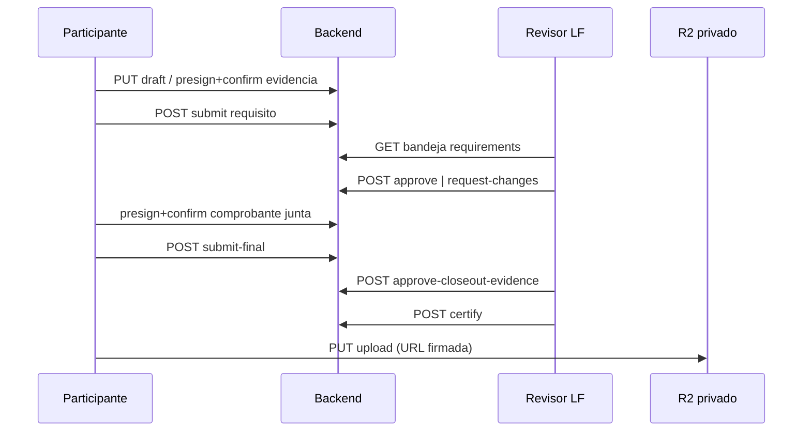

# Certificaciones GM — Flujo de revisión y cierre

**Estado**: ACTIVE (runtime backend verificado en `feat/configurable-certifications`)  
**Relacionado:** [`certificaciones-guias-mayores.md`](certificaciones-guias-mayores.md), ADR #8 en `docs/api/ARCHITECTURE-DECISIONS.md`

---

## 1. Actores y permisos

| Actor | Permisos | Superficie |
| --- | --- | --- |
| Participante (o delegado con ownership) | `user_certifications:manage` | Borrador, evidencias, envío, cierre |
| Lector delegado | `user_certifications:read` | Progreso y detalle de requisito |
| Configurador LF | `certifications:configure`, `certifications:publish` | `/admin/certifications/*` |
| Revisor LF | `certifications:review` | Bandejas `/certifications/reviews/*` |
| Certificador LF | `certifications:certify` | `POST .../reviews/final/:enrollmentId/certify` |

Scope de revisión: mismo `local_field_id` que el participante, o acceso global (`admin`/`super-admin` sin campo local asignado). El participante **no** puede revisar su propio expediente.

---

## 2. Estados

### Inscripción (`users_certifications.status`)

```text
ENROLLED → IN_PROGRESS → READY_FOR_CLOSEOUT → SUBMITTED_FOR_FINAL_REVIEW
                                              → APPROVED → CERTIFIED

Desde no terminales: WITHDRAWN | EXPIRED
Desde revisión final: CHANGES_REQUESTED → IN_PROGRESS (corrección)
```

### Requisito (`certification_section_progress.status`)

```text
DRAFT → SUBMITTED → APPROVED
                  → CHANGES_REQUESTED → SUBMITTED (re-envío)
```

Edición y evidencias bloqueadas en `SUBMITTED` y `APPROVED` (`CERT_REQUIREMENT_LOCKED`).

---

## 3. Flujo del participante (por requisito)

1. **Leer requisito:** `GET /certifications/users/:userId/certification-enrollments/:enrollmentId/requirements/:requirementId`
2. **Guardar borrador:** `PATCH .../requirements/:requirementId/draft` con `responses[]` por `component_id`.
3. **Evidencia de archivo (si aplica):**
   - `POST .../evidences/presign` → subir a R2 → `POST .../evidences/confirm`
   - Eliminar: `DELETE .../evidences/:evidenceId` (solo en estados editables)
4. **Enviar:** `POST .../requirements/:requirementId/submit` con `{ lock_version }`
5. Repetir para cada sección obligatoria hasta que todas estén `APPROVED`.

Errores frecuentes: `CERT_REQUIREMENT_INCOMPLETE`, `CERT_EVIDENCE_INVALID_TYPE`, `CERT_EVIDENCE_TOO_LARGE`, `CERT_CONCURRENT_UPDATE`.

---

## 4. Flujo del revisor (por requisito)

1. **Bandeja:** `GET /certifications/reviews/requirements?status=SUBMITTED` (u otro filtro)
2. **Detalle:** `GET /certifications/reviews/requirements/:progressId` (metadata de respuestas/evidencias/historial; sin URLs firmadas embebidas)
3. **Descarga de evidencia:** `GET /certifications/reviews/requirements/:progressId/evidences/:evidenceId/download` — URL firmada on-demand (TTL 15 min); solo evidencias activas `CONFIRMED` dentro de scope
4. **Decisión:**
   - Aprobar: `POST .../approve` con `{ lock_version, comment? }`
   - Devolver: `POST .../request-changes` con `{ lock_version, comment }` (**obligatorio**)

Cada decisión registra evento en `certification_review_events`. Fuera de scope → `403 CERT_REVIEW_SCOPE_FORBIDDEN`.

---

## 5. Flujo de cierre (comprobante de junta + certificación)

### Participante

1. Verificar que todos los requisitos **obligatorios** están `APPROVED` (inscripción avanza a `READY_FOR_CLOSEOUT`).
2. **Comprobante de junta:**
   - `POST .../closeout-evidence/presign`
   - Subir archivo → `POST .../closeout-evidence/confirm`
3. **Solicitar revisión final:** `POST .../submit-final` (sin body)

### Revisor

1. **Bandeja de cierres:** `GET /certifications/reviews/final` (incluye `SUBMITTED_FOR_FINAL_REVIEW` y `APPROVED` para habilitar Certificar)
2. **Ver comprobante:** `GET /certifications/reviews/final/:enrollmentId/closeout-evidence/download` (URL firmada on-demand, TTL 15 min)
3. **Aprobar comprobante:** `POST /certifications/reviews/final/:enrollmentId/approve-closeout-evidence` → inscripción `APPROVED`
4. **Devolver cierre:** `POST .../request-changes` con comentario → inscripción `CHANGES_REQUESTED`; participante corrige y reinicia desde requisitos/cierre según corresponda

### Certificador

- `POST /certifications/reviews/final/:enrollmentId/certify` — revalida requisitos obligatorios `APPROVED` y comprobante `APPROVED`; transiciona a `CERTIFIED` (idempotente).

Errores de cierre: `CERT_CLOSEOUT_INCOMPLETE`, `CERT_INVALID_TRANSITION`.

---

## 5.1 UI de revisión en admin

Ruta: `/dashboard/certifications/reviews` (tabs **Requisitos** / **Cierres**).

- Visibilidad: `certifications:review`. Botón **Certificar** además requiere `certifications:certify`.
- Cliente API: `sacdia-admin/src/lib/api/certification-reviews.ts`.
- Requisitos: filtro default `SUBMITTED`; detalle en Sheet; “Ver” pide URL firmada al click (no se cachea); devolver exige comentario no vacío.
- Cierres: aprobar/devolver comprobante; certificar con diálogo de confirmación sobre filas `APPROVED`.
- Sin paginación en esta fase (bandejas cortas).

---

## 6. Diagrama resumido



---

## 7. Diferencias vs. clases/honores

| Aspecto | Certificaciones | Clases / honores |
| --- | --- | --- |
| Bandeja | `/certifications/reviews/*` | `/evidence-review/*` |
| Aprobación | `APPROVED` | `VALIDATED` |
| Devolución | `CHANGES_REQUESTED` | `REJECTED` |
| Unidad de revisión | Requisito compuesto (componentes) | Evidencia/sección simple |

No mapear estados automáticamente entre dominios sin ADR explícito.

---

## 8. Gaps documentados

- No hay endpoint de historial dedicado por requisito en path de participante; el historial se expone en detalle de revisión (`GET .../reviews/requirements/:progressId`).
- La app móvil del participante aún no implementa bandeja de revisión (fuera de alcance de la fase admin 2026-08-12).
- Paginación/filtros avanzados de bandejas admin: extensión futura.
