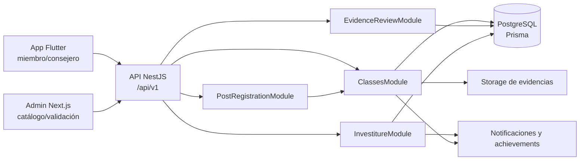
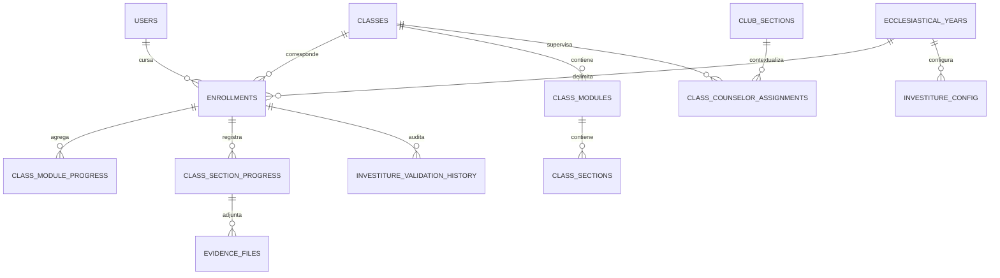
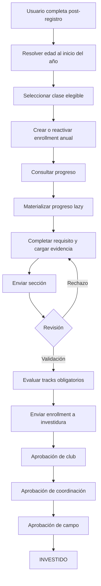
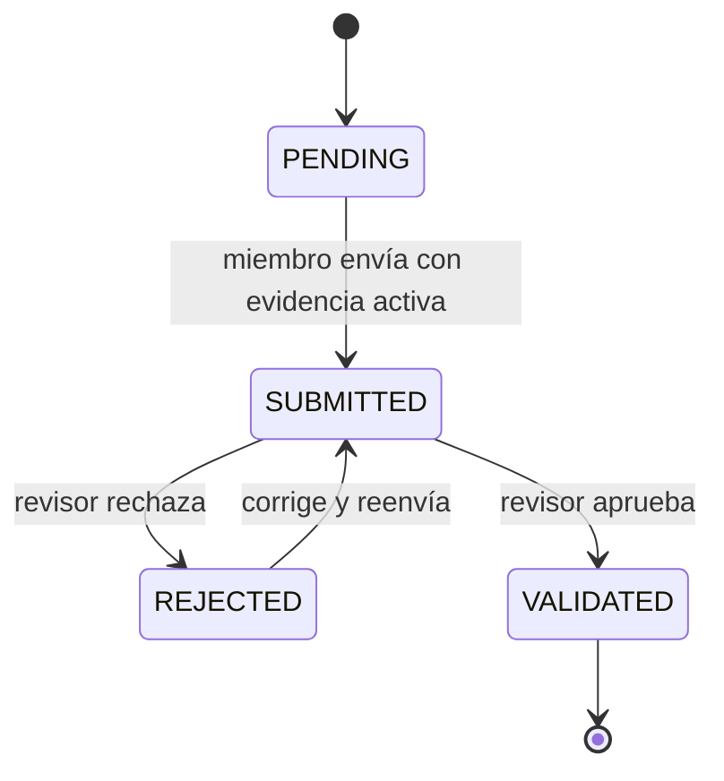
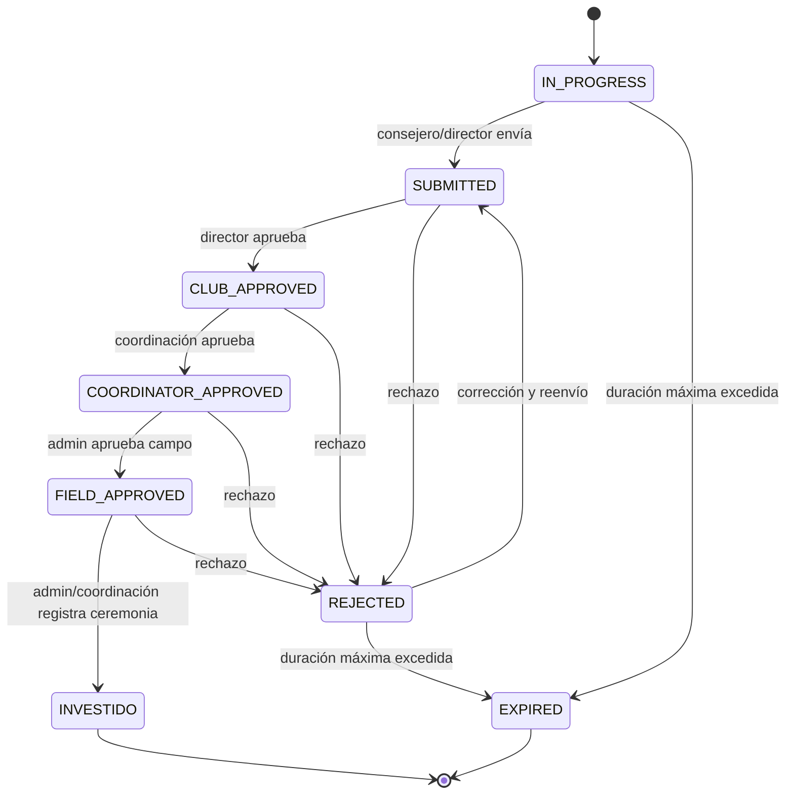

# Clases progresivas — análisis técnico y funcional integral

> **Estado:** análisis verificado del runtime actual
> **Fecha de corte:** 2026-08-11
> **Alcance:** backend NestJS, PostgreSQL/Prisma, app Flutter, panel Next.js y documentación vigente
> **Naturaleza:** documento de diagnóstico; no reemplaza los contratos canónicos

## 1. Resumen ejecutivo

El módulo de clases progresivas administra la trayectoria formativa anual de un miembro: asignación de clase, inscripción, cumplimiento de requisitos, carga y revisión de evidencias, supervisión pedagógica y validación institucional hasta la investidura.

La autoridad operativa e histórica es `enrollments`. Cada inscripción vincula usuario, clase y año eclesiástico; el progreso de módulos y secciones se crea de forma perezosa a medida que se consulta o actualiza. El runtime ya soporta requisitos por tracks `BASIC`, `EXTRA` y `ADVANCED`, asignaciones de consejeros, revisión de evidencias y un pipeline de investidura con historial auditable.

La base funcional existe, pero hay divergencias que impiden tratar el módulo como cerrado:

1. **Integridad crítica de progreso:** `PATCH /users/:userId/classes/:classId/progress` acepta combinaciones de clase, módulo y sección sin comprobar su relación y no respeta el bloqueo de validación ni estados terminales.
2. **Elegibilidad incorrecta:** una sección con `score >= 70` se considera completada incluso si su evidencia está `REJECTED`.
3. **Invariante anual contradictoria:** el servicio permite hasta dos clases activas de Guías Mayores, pero la base de datos solo permite una inscripción activa por usuario y año.
4. **Deriva de índices de progreso:** Prisma conserva unicidad legacy por usuario/clase, mientras las migraciones intentan introducir unicidad por inscripción; una eliminación usa un nombre que no coincide con el índice real.
5. **Clientes incompletos:** la corrección de evidencia rechazada en mobile contiene un selector de archivos no implementado; admin usa una URL inválida para un historial y no expone toda la configuración curricular ni la expiración manual.

### 1.1 Semáforo de riesgo

| Área | Estado | Motivo principal |
|---|---|---|
| Modelo anual | Ámbar | `enrollments` está consolidado, pero la unicidad DB contradice el límite de Guías Mayores |
| Progreso | Rojo | actualización sin validación relacional ni bloqueo de estado |
| Evidencias | Rojo | un rechazo puede seguir computando como cumplimiento |
| Investidura | Ámbar | pipeline robusto; depende de una elegibilidad que hoy puede ser incorrecta |
| Mobile | Ámbar | consulta y operación principal presentes; corrección de archivo rota |
| Admin | Ámbar | CRUD y pipeline parciales; faltan controles curriculares y de expiración |
| Documentación | Ámbar | hay diferencias de autenticación, UI y modelo respecto del runtime |

## 2. Alcance y criterio de verdad

### 2.1 Incluido

- catálogo de clases, módulos y secciones;
- asignación por edad durante post-registro;
- inscripción anual y progresión entre clases;
- materialización y cálculo de progreso;
- tracks de requisitos y elegibilidad;
- evidencias y su revisión;
- asignación y alcance de consejeros;
- validación e investidura;
- duración y expiración;
- contratos HTTP y autorización;
- comportamiento efectivo de mobile y admin;
- cobertura de pruebas existente;
- diferencias entre documentación y runtime.

### 2.2 Excluido

- rediseño funcional del programa institucional de clases;
- cambios de código, schema, endpoints o UX;
- ejecución de builds, pruebas o migraciones;
- certificaciones, honores y carpetas salvo cuando participan del flujo de clases.

### 2.3 Precedencia aplicada

Para resolver contradicciones se utilizó esta jerarquía:

1. decisiones canónicas de dominio;
2. código runtime y guards efectivos;
3. schema Prisma y migraciones SQL efectivamente versionadas;
4. pruebas automatizadas como evidencia de intención;
5. documentos de feature y referencias API;
6. clientes mobile/admin como consumidores, no como autoridad contractual.

`docs/canon/decisiones-clave.md` establece que `enrollments` es la fuente única tanto del ciclo anual operativo como de la trayectoria histórica. Cualquier referencia a `users_classes` es legacy.

## 3. Propósito de negocio

El módulo responde cinco preguntas institucionales:

1. **¿Qué clase debe cursar un miembro este año?**
   Se resuelve por edad, tipo de club, disponibilidad anual y trayectoria previa.
2. **¿Qué debe completar?**
   La clase organiza módulos y secciones; cada sección pertenece a un track y puede ser obligatoria para investidura.
3. **¿Quién acompaña y supervisa?**
   Consejeros y secretarios pueden recibir asignaciones pedagógicas; directivos tienen alcance sobre su sección.
4. **¿Qué evidencia demuestra el cumplimiento?**
   El miembro carga archivos, envía la sección y un actor autorizado valida o rechaza.
5. **¿Cuándo se reconoce institucionalmente la clase?**
   Cuando la inscripción cumple requisitos y atraviesa el pipeline hasta `INVESTIDO`.

## 4. Glosario operativo

| Término | Significado efectivo |
|---|---|
| Clase progresiva | Nivel formativo asociado a tipo de club, edad mínima, orden y ventana de años |
| Módulo | Agrupador curricular dentro de una clase |
| Sección/requisito | Unidad evaluable dentro de un módulo |
| Enrollment/inscripción | Autoridad anual que vincula usuario, clase y año eclesiástico |
| Progreso de módulo | Agregado de puntajes/completitud de sus secciones |
| Progreso de sección | Estado y puntaje individual de un requisito |
| Evidencia | Archivo vinculado al progreso de una sección |
| Track | Clasificación curricular: `BASIC`, `EXTRA` o `ADVANCED` |
| Investidura | Reconocimiento institucional posterior a validaciones escalonadas |
| Año eclesiástico | Periodo operativo usado para inscripción, disponibilidad y alcance |
| Scope de progreso | Clases y miembros que un actor puede supervisar según su rol/asignación |

## 5. Actores, roles y responsabilidades

| Actor | Responsabilidad real | Límites relevantes |
|---|---|---|
| Miembro | Consulta clases/progreso, carga, elimina y envía evidencias propias | Requiere permisos y control de ownership; mobile bloquea visualmente expirados |
| Consejero | Supervisa clases asignadas y puede enviar a validación de investidura | Para scope pedagógico ve solo clases asignadas; requiere rol elegible |
| Secretario | Puede recibir asignación pedagógica y ver la sección según acceso | La asignación exige rol local permitido |
| Director / subdirector / secretaría de club | Ve progreso de toda su sección; director aprueba etapa club | El recurso debe corresponder a club/sección |
| Coordinador | Revisa evidencias, aprueba etapa de coordinación, rechaza y puede investir | Rol global; participa en operaciones masivas |
| Admin / super-admin | Administra catálogos, revisa evidencias y opera pipeline | Algunas rutas restringen específicamente a `admin`, no a `super-admin` |
| Campo local | Representado por la etapa `FIELD_APPROVED` y configuración | La aprobación de campo exige rol global `admin` en el runtime |

## 6. Arquitectura de extremo a extremo

### 6.1 Responsabilidad por componente

| Componente | Responsabilidad |
|---|---|
| `ClassesController` / `ClassesService` | catálogo público, inscripción, progreso y evidencias del miembro |
| `ClassAssignmentResolverService` | clase elegible por edad durante post-registro |
| `ClassRequirementEligibilityService` | aplicación de tracks y elegibilidad para investidura/avanzada |
| `ClassCounselorAssignmentsService` | asignación anual de responsables pedagógicos |
| `ClassProgressScopeService` | visibilidad de clases y miembros según rol/contexto |
| `EvidenceReviewService` | cola, aprobación, rechazo e historial de requisitos |
| `InvestitureService` | estados, validaciones, duración, expiración e historial institucional |
| Admin Phase E | CRUD de clases, módulos y secciones |
| App Flutter | experiencia del miembro y supervisión pedagógica |
| Admin Next.js | mantenimiento parcial del catálogo y operación del pipeline |

## 7. Modelo de datos

### 7.1 Entidades principales

| Entidad | Función | Campos/invariantes clave |
|---|---|---|
| `classes` | catálogo de niveles | `club_type_id`, `minimum_age`, `display_order`, `requires_previous_gm_investiture`, `advanced_enabled`, `available_from_year_id`, `available_until_year_id`, `min_duration_years`, `max_duration_years`, `active` |
| `class_modules` | estructura curricular | clase propietaria, orden, activación y traducciones |
| `class_sections` | requisito evaluable | módulo, track, obligatoriedad, owner de `EXTRA`, disponibilidad anual, orden y estado activo |
| `enrollments` | autoridad anual/formativa | usuario, clase, año, estado de investidura, flags de envío/bloqueo/actividad, elegibilidad avanzada y fechas |
| `class_module_progress` | agregado por módulo | inscripción opcional en Prisma, puntaje y completitud |
| `class_section_progress` | estado por requisito | inscripción opcional, módulo/sección por ID, puntaje, evidencias JSON y estado de revisión |
| `evidence_files` | archivo de evidencia | referencia a progreso de sección, metadatos y activación |
| `class_counselor_assignments` | responsabilidad pedagógica | club, sección, clase, año, usuario, tipo de responsabilidad, excepción y vigencia |
| `investiture_validation_history` | auditoría de transiciones | inscripción, actor, acción, estado anterior/nuevo y comentarios |
| `investiture_config` | ventana institucional | campo local, año, fecha límite, fecha de ceremonia y activación |

### 7.2 Invariantes pretendidas y efectivas

- La tupla `(user_id, class_id, ecclesiastical_year_id)` identifica una inscripción anual de una clase.
- Una inscripción activa debería ser el contexto inequívoco para leer o escribir progreso.
- Los nuevos índices parciales pretenden que el progreso sea único por `enrollment_id + module_id (+ section_id)`.
- `BASIC` y `ADVANCED` no tienen owner institucional; `EXTRA` debe tener exactamente un owner.
- Una sección `ADVANCED` no puede ser obligatoria para investidura.
- Las clases tienen `min_duration_years <= max_duration_years` cuando ambos valores existen.

### 7.3 Deriva schema–migraciones

El estado versionado no expresa un único modelo consistente:

- Prisma conserva `@@unique([user_id, class_id, module_id])` y `@@unique([user_id, class_id, module_id, section_id])`.
- La migración FS-03 agrega índices parciales por `enrollment_id` para soportar ciclos anuales.
- La migración intenta eliminar reglas legacy con nombres que no coinciden completamente con los índices creados en el baseline; el índice de sección usa un nombre truncado por PostgreSQL/Prisma.
- Una migración posterior agrega un índice parcial único para una sola inscripción activa por `(user_id, ecclesiastical_year_id)`, restricción que Prisma no puede modelar directamente.

Consecuencia: la aplicación puede encontrar conflictos de unicidad no representados por el cliente Prisma y el progreso de una clase repetida en otro año puede chocar con datos legacy.

## 8. Flujo funcional completo

### 8.1 Asignación inicial por edad y post-registro

1. Se busca el año eclesiástico activo.
2. Se obtiene la fecha de nacimiento del usuario.
3. La edad se calcula en UTC a la fecha inicial del año eclesiástico, no con la fecha actual.
4. Se filtran clases por tipo de club y disponibilidad anual.
5. Se elige la clase de mayor `minimum_age` que no exceda la edad.
6. Si el cliente envía una clase explícita, debe coincidir exactamente con la resuelta; de lo contrario se devuelve `POST_REG_CLASS_NOT_ELIGIBLE`.
7. Post-registro crea la membresía y crea, reutiliza o reactiva la inscripción anual.
8. Antes de activar la nueva inscripción, desactiva otras inscripciones activas del mismo usuario/año.

**Importante:** esta validación de edad y tipo de club vive en post-registro. La inscripción directa `POST /users/:userId/classes/enroll` no reutiliza el resolver y no valida edad mínima ni correspondencia con el tipo de club del usuario.

### 8.2 Inscripción anual y progresión

El alta directa recibe `class_id` y `ecclesiastical_year_id`.

El servicio valida:

- existencia y actividad de la clase;
- existencia del año y disponibilidad de la clase para ese periodo;
- prerrequisito de investidura previa para clases de Guías Mayores que lo exigen;
- orden progresivo respecto de la trayectoria previa;
- límites de inscripciones activas por familia de club;
- existencia previa de la misma tupla anual para crear, rechazar o reactivar.

La progresión calculada usa la clase investida de mayor orden y propone la siguiente. Si no existe investidura previa, utiliza la clase base; para un año posterior puede avanzar el orden según la trayectoria.

### 8.3 Resolución de la inscripción operativa

Los endpoints de progreso aceptan opcionalmente `enrollment_id`:

- si se proporciona, debe pertenecer al usuario y clase de la ruta;
- si no se proporciona, se busca la inscripción activa del año eclesiástico actual;
- cero coincidencias produce `CLASS_ENROLLMENT_NOT_FOUND`;
- más de una coincidencia produce `CLASS_ENROLLMENT_AMBIGUOUS`.

Esta resolución evita mezclar años en la capa de servicio, siempre que la base de datos y los índices de progreso también respeten `enrollment_id`.

### 8.4 Progreso perezoso

Al consultar progreso:

1. se resuelve la inscripción operativa;
2. se cargan módulos y secciones activos y disponibles para el año;
3. se cargan registros de progreso existentes para esa inscripción;
4. los faltantes se presentan con valores iniciales sin requerir una creación masiva previa;
5. se calcula avance por módulo, track y clase;
6. se devuelve también elegibilidad básica/extra/avanzada y metadatos de expiración.

La actualización de progreso crea o actualiza `class_section_progress` y recalcula el promedio de `class_module_progress`.

### 8.5 Evidencias

El flujo esperado por requisito es:

1. crear o resolver progreso de sección;
2. cargar uno o más archivos admitidos;
3. enviar el requisito;
4. revisar desde la cola de evidencias;
5. aprobar o rechazar con motivo;
6. si se rechaza, corregir y volver a enviar.

Los archivos aceptados por el controlador incluyen imágenes y documentos conforme a la validación multipart configurada. El archivo queda asociado al progreso de sección, no directamente a la inscripción.

El servicio de envío restringe el origen a `PENDING` o `REJECTED`. La aprobación exige `SUBMITTED`. El historial de revisión de secciones se registra en `validation_logs`; no es el mismo historial que la investidura.

### 8.6 Supervisión pedagógica

Las asignaciones se crean por club, sección, clase y año. Reglas verificadas:

- roles asignables: consejero o secretario;
- máximo de tres responsables por clase;
- máximo de dos clases por usuario;
- una segunda asignación requiere marcarla como excepcional y explicar el motivo;
- solo puede existir un responsable primario activo por contexto;
- ciertas clases de Guías Mayores exigen que el responsable cumpla el criterio correspondiente;
- instructores no forman parte de los roles asignables de este flujo.

El alcance de lectura se resuelve así:

- usuario propietario: su propio progreso;
- roles globales autorizados: alcance amplio;
- director, subdirector, secretario o secretario-tesorero: toda su sección;
- consejero asignado: únicamente sus clases asignadas;
- el miembro objetivo debe pertenecer a la misma sección, año y tipo aplicable.

### 8.7 Tracks `BASIC`, `EXTRA` y `ADVANCED`

| Track | Aplicación | Obligatorio para investidura | Regla de owner |
|---|---|---|---|
| `BASIC` | Siempre | Según `required_for_investiture` | Sin owner |
| `EXTRA` | Solo si su owner coincide con el contexto institucional resuelto | Puede serlo | Exactamente uno: división, unión o campo local |
| `ADVANCED` | Solo cuando `classes.advanced_enabled = true` | Nunca | Sin owner |

La respuesta de progreso separa los totales/completados por track y expone:

- elegibilidad de requisitos obligatorios para investidura;
- elegibilidad avanzada, si el track está habilitado y completo;
- razones de bloqueo, por ejemplo ausencia de contexto institucional para un requisito `EXTRA`.

**Defecto actual:** tanto el cálculo general como el servicio de elegibilidad consideran completada una sección cuando `status === VALIDATED` **o** `score >= 70`. Por ello un requisito `REJECTED` con puntaje previo suficiente puede seguir habilitando la investidura.

### 8.8 Envío, validación e investidura

Antes de enviar una inscripción, el servicio comprueba:

- estado `IN_PROGRESS` o `REJECTED`;
- inscripción activa;
- duración mínima y máxima;
- requisitos obligatorios completos según tracks;
- configuración de investidura activa para campo local y año.

La fecha límite de envío genera advertencia blanda; no bloquea el envío. Al enviar se activa `locked_for_validation`, se registra historial y se notifica.

Las aprobaciones usan actualización condicional sobre el estado esperado para reducir carreras concurrentes. El acto de investidura utiliza la fecha de ceremonia configurada, escribe historial, notifica y puede emitir achievements.

### 8.9 Rechazo y corrección

Un rechazo institucional:

- exige motivo;
- cambia la inscripción a `REJECTED`;
- libera `locked_for_validation`;
- permite corregir requisitos y reenviar;
- queda auditado con actor, estado previo/nuevo y comentario.

El backend pretende bloquear modificaciones durante validación mediante `locked_for_validation`, pero los endpoints de actualización, carga y eliminación de evidencia de clase no aplican de forma uniforme ese estado. El bloqueo es, por tanto, incompleto.

### 8.10 Duración y expiración

La duración se evalúa por años eclesiásticos de forma inclusiva. Si el tiempo transcurrido supera `max_duration_years`, una inscripción `IN_PROGRESS` o `REJECTED` puede pasar a `EXPIRED`.

Hay dos puntos de control:

1. al intentar enviar a validación: puede devolver `INVESTITURE_DURATION_MIN_NOT_MET` o expirar y devolver `INVESTITURE_DURATION_EXPIRED`;
2. operación administrativa `POST /admin/classes/enrollments/expire-overdue`, con `dry_run` opcional.

No se localizó un job automático dentro del alcance revisado; la ruta administrativa es la operación explícita disponible.

## 9. Contratos HTTP efectivos

Todas las rutas de esta sección se entienden bajo el prefijo `/api/v1`.

### 9.1 Catálogo de consulta

| Método y ruta | Auth efectiva | Uso |
|---|---|---|
| `GET /classes` | `OptionalJwtAuthGuard` | listar clases activas y disponibles; filtros/paginación |
| `GET /classes/:classId` | `OptionalJwtAuthGuard` | detalle de clase |
| `GET /classes/:classId/modules` | `OptionalJwtAuthGuard` | módulos y secciones |

La documentación Live Reference marca estas rutas como JWT, pero el runtime admite consumo anónimo. Además, listado filtra actividad/disponibilidad con mayor rigor que algunas consultas por ID.

### 9.2 Inscripción, progreso y evidencia del usuario

Todas usan `JwtAuthGuard`, `PermissionsGuard` y controles de recurso/ownership.

| Método y ruta | Permiso | Entrada relevante |
|---|---|---|
| `GET /users/:userId/classes` | `classes:read` | historial/inscripciones del usuario |
| `POST /users/:userId/classes/enroll` | `classes:submit_progress` | `class_id`, `ecclesiastical_year_id` |
| `GET /users/:userId/classes/:classId/progress` | `classes:read` | query `enrollment_id?` |
| `PATCH /users/:userId/classes/:classId/progress` | `classes:submit_progress` | `module_id`, `section_id`, `score`, `evidences?`, `enrollment_id?` |
| `POST /users/:userId/classes/:classId/sections/:sectionId/submit` | `classes:submit_progress` | `enrollment_id?` |
| `POST /users/:userId/classes/:classId/sections/:sectionId/files` | `classes:submit_progress` | multipart + `enrollment_id?` |
| `DELETE /users/:userId/classes/:classId/sections/:sectionId/files/:fileId` | `classes:submit_progress` | `enrollment_id?` |

### 9.3 Asignaciones y scope

| Método y ruta | Permiso | Nota |
|---|---|---|
| `GET /clubs/:clubId/sections/:sectionId/class-counselor-assignments` | `club_roles:read` | filtros `yearId`, `classId`, `active` |
| `POST /clubs/:clubId/sections/:sectionId/class-counselor-assignments` | `club_roles:assign` | crea asignación anual |
| `PATCH /class-counselor-assignments/:assignmentId` | `club_roles:assign` | modifica responsabilidad/excepción/vigencia |
| `DELETE /class-counselor-assignments/:assignmentId` | `club_roles:revoke` | revoca asignación |
| `GET /clubs/:clubId/sections/:sectionId/classes/progress-scope` | `classes:read` | clases visibles para el actor |
| `GET /clubs/:clubId/sections/:sectionId/classes/:classId/members-progress` | `classes:read` | resumen por miembros dentro del scope |

### 9.4 Revisión de evidencias

Requiere JWT y rol global `admin`, `super-admin` o `coordinator`.

| Método y ruta | Uso |
|---|---|
| `GET /evidence-review/pending` | cola unificada; filtrar por tipo |
| `GET /evidence-review/:type/:id` | detalle de registro |
| `POST /evidence-review/:type/:id/approve` | aprobar evidencia |
| `POST /evidence-review/:type/:id/reject` | rechazar con motivo |
| `GET /evidence-review/:type/:id/history` | historial de validación |
| `POST /evidence-review/bulk-approve` | aprobación masiva |
| `POST /evidence-review/bulk-reject` | rechazo masivo |

Para clases, `type` selecciona el adaptador de progreso de sección. La aprobación exige `SUBMITTED`; el rechazo impide estados ya `REJECTED` o `VALIDATED`, pero la operación individual no exige explícitamente `SUBMITTED`, por lo que un ID `PENDING` alcanzable podría ser rechazado.

### 9.5 Pipeline de investidura

| Método y ruta | Actor/permiso efectivo | Transición |
|---|---|---|
| `POST /investiture/enrollments/:id/submit` | director/consejero + `investiture:submit` | `IN_PROGRESS/REJECTED → SUBMITTED` |
| `POST /investiture/enrollments/:id/club-approve` | director + `investiture:validate` | `SUBMITTED → CLUB_APPROVED` |
| `POST /investiture/enrollments/:id/coordinator-approve` | admin/coordinator + `investiture:validate` | `CLUB_APPROVED → COORDINATOR_APPROVED` |
| `POST /investiture/enrollments/:id/field-approve` | admin + `investiture:validate` | `COORDINATOR_APPROVED → FIELD_APPROVED` |
| `POST /investiture/enrollments/:id/invest` | admin/coordinator + `investiture:mark_invested` | `FIELD_APPROVED → INVESTIDO` |
| `POST /investiture/enrollments/:id/reject` | admin/coordinator + `investiture:validate` | etapa revisable `→ REJECTED` |
| `POST /investiture/enrollments/bulk-approve` | admin/coordinator | coordinación, campo o investidura; máximo 200 |
| `POST /investiture/enrollments/bulk-reject` | admin/coordinator | rechazo masivo; máximo 200 |
| `GET /investiture/pending` | admin/coordinator | cola por estado/filtros |
| `GET /investiture/enrollments/:id/history` | JWT + autorización en servicio | historial canónico |

Compatibilidad legacy aún expuesta:

- `POST /enrollments/:id/submit-for-validation`;
- `POST /enrollments/:id/validate`;
- `POST /enrollments/:id/investiture`;
- `GET /enrollments/:id/investiture-history`.

### 9.6 Configuración y expiración

| Método y ruta | Uso |
|---|---|
| `GET /admin/investiture/config` | listar configuraciones |
| `GET /admin/investiture/config/:configId` | detalle |
| `POST /admin/investiture/config` | crear por campo/año |
| `PATCH /admin/investiture/config/:configId` | fechas/actividad |
| `DELETE /admin/investiture/config/:configId` | eliminar |
| `POST /admin/classes/enrollments/expire-overdue` | admin + `catalogs:update`; `ecclesiastical_year_id?`, `dry_run?` |

### 9.7 Catálogo administrativo

Requiere JWT, autorización administrativa y permisos `catalogs:read|create|update|delete`.

| Recurso | Rutas |
|---|---|
| Clases | `GET/POST /admin/classes`, `PATCH/DELETE /admin/classes/:id` |
| Módulos | `GET/POST /admin/class-modules`, `PATCH/DELETE /admin/class-modules/:id` |
| Secciones | `GET/POST /admin/class-sections`, `PATCH/DELETE /admin/class-sections/:id` |

El backend administrativo sí acepta `advanced_enabled` y la configuración completa de tracks/owners/disponibilidad en secciones.

## 10. Comportamiento real de la app Flutter

### 10.1 Capacidades presentes

- consulta catálogo, detalle y módulos;
- lista inscripciones del usuario;
- consulta progreso por `enrollmentId`;
- muestra tracks por separado y elegibilidad;
- carga, elimina y envía archivos de evidencia;
- muestra estados de requisito y datos de expiración;
- bloquea acciones en UI cuando la inscripción está expirada;
- expone scope de clases y progreso de miembros para consejeros;
- incluye navegación a pendientes e historial de investidura;
- permite consultar/inscribir trayectoria previa mediante la integración existente.

### 10.2 Flujo de requisito

La vista de detalle deriva `canModify` desde el estado de expiración. En el camino normal utiliza `EvidenceStagingManager` para seleccionar, preparar y cargar archivos. Para requisitos observados/rechazados renderiza una experiencia de corrección específica.

### 10.3 Defecto confirmado de corrección

El callback `_triggerFilePicker` usado por la experiencia de corrección es un placeholder que no abre selector ni agrega archivos. El usuario puede reenviar archivos ya existentes, pero no adjuntar una versión corregida desde esa acción. Esto rompe el ciclo esperado `REJECTED → corregir → SUBMITTED`.

### 10.4 Límite de confianza en el cliente

El bloqueo visual de expirados es correcto como UX, pero no es control de seguridad. El backend debe rechazar igualmente mutaciones bloqueadas o terminales; hoy no lo hace de manera uniforme.

## 11. Comportamiento real del panel administrativo

### 11.1 Capacidades presentes

- CRUD de clases, módulos y secciones mediante catálogos Phase E;
- mantenimiento de disponibilidad y duración de clases;
- asignaciones de consejero desde la gestión de roles del club;
- cola/pipeline de investidura;
- configuración de fechas de investidura;
- diálogos de historial y operaciones masivas;
- cliente API para expiración manual.

### 11.2 Límites efectivos

1. Los tipos y formularios de catálogo no exponen `advanced_enabled`.
2. Las secciones no exponen `requirement_track`, `required_for_investiture`, owners institucionales ni disponibilidad anual, aunque el backend los soporta.
3. Existe `expireOverdueClassEnrollments`, pero no se encontró un caller o UI operativa.
4. Una función de historial del pipeline llama `/investiture/enrollments/:id/investiture-history`; esa ruta no existe. Las rutas válidas son la canónica `/investiture/enrollments/:id/history` y la legacy `/enrollments/:id/investiture-history`.
5. Los tipos de estado del cliente no representan consistentemente `EXPIRED`.

Consecuencia: admin no puede administrar por completo el currículo avanzado/extra y algunas vistas pueden fallar o representar mal inscripciones vencidas.

## 12. Estados y errores relevantes

### 12.1 Estados de evidencia

`PENDING`, `SUBMITTED`, `VALIDATED`, `REJECTED`.

### 12.2 Estados de investidura

`IN_PROGRESS`, `SUBMITTED`, `CLUB_APPROVED`, `COORDINATOR_APPROVED`, `FIELD_APPROVED`, `INVESTIDO`, `REJECTED`, `EXPIRED`.

### 12.3 Códigos de error del dominio

| Grupo | Códigos principales |
|---|---|
| Inscripción/progreso | `CLASS_ENROLLMENT_NOT_FOUND`, `CLASS_ACTIVE_YEAR_NOT_FOUND`, `CLASS_ENROLLMENT_AMBIGUOUS`, `CLASS_NOT_FOUND`, `CLASS_ALREADY_ENROLLED`, `CLASS_LEVEL_TOO_HIGH`, `CLASS_NOT_AVAILABLE_FOR_YEAR` |
| Límites/prerrequisitos | `CLASS_GM_INVESTITURE_REQUIRED`, `CLASS_MAX_AVENTU_CONQUIS_ACTIVE`, `CLASS_MAX_GM_ACTIVE` |
| Evidencia de clase | `CLASS_FILE_REQUIRED`, `CLASS_FILE_INVALID_TYPE`, `CLASS_SECTION_NOT_FOUND`, `CLASS_SECTION_PROGRESS_NOT_FOUND`, `CLASS_SECTION_ALREADY_SUBMITTED`, `CLASS_SECTION_NO_EVIDENCE`, `CLASS_EVIDENCE_FILE_NOT_FOUND` |
| Consejeros | `CLASS_COUNSELOR_*`, incluyendo asignación inexistente, rol inválido, duplicado, límites, excepción requerida y requisito de Guía Mayor |
| Revisión | `EVIDENCE_REVIEW_TYPE_INVALID`, `EVIDENCE_REVIEW_CLASS_RECORD_NOT_FOUND`, `EVIDENCE_REVIEW_RECORD_NOT_PENDING`, `EVIDENCE_REVIEW_RECORD_ALREADY_REJECTED`, `EVIDENCE_REVIEW_RECORD_ALREADY_VALIDATED` |
| Investidura | `INVESTITURE_ENROLLMENT_NOT_FOUND`, `INVESTITURE_INVALID_STATE_TRANSITION`, `INVESTITURE_ALREADY_INVESTIDO`, `INVESTITURE_REJECT_COMMENTS_REQUIRED`, `INVESTITURE_ACCESS_DENIED`, `INVESTITURE_CONCURRENT_UPDATE`, `INVESTITURE_DURATION_MIN_NOT_MET`, `INVESTITURE_DURATION_EXPIRED`, `INVESTITURE_REQUIREMENTS_INCOMPLETE` |
| Catálogo | `ADMIN_CLASS_*`, `ADMIN_CLASS_MODULE_*`, `ADMIN_CLASS_SECTION_*`, `ADMIN_CLASS_SECTION_TRACK_CONFIG_INVALID` |
| Post-registro | `POST_REG_CLASS_NOT_ELIGIBLE` y errores contextuales de clase/membresía |

## 13. Pruebas existentes

> Inventario estático verificado. No se ejecutaron pruebas para producir este documento.

### 13.1 Backend

La suite cubre, entre otros:

- controladores y servicio de clases;
- resolución anual explícita/implícita y ambigüedad;
- ownership y permisos;
- inscripción, límites, disponibilidad y prerrequisitos;
- carga, envío, aprobación y rechazo de evidencias;
- asignaciones de consejeros y sus límites;
- scope por sección/asignación;
- aplicación de tracks y elegibilidad;
- resolver de clase por edad y post-registro;
- pipeline completo de investidura, concurrencia, historial, operaciones masivas;
- duración mínima/máxima y expiración.

Archivos principales:

- `sacdia-backend/src/classes/classes.service.spec.ts`;
- `sacdia-backend/src/classes/classes.controller.spec.ts`;
- `sacdia-backend/src/classes/class-counselor-assignments.service.spec.ts`;
- `sacdia-backend/src/classes/class-progress-access.service.spec.ts`;
- `sacdia-backend/src/classes/class-progress-scope.service.spec.ts`;
- `sacdia-backend/src/classes/class-requirement-eligibility.service.spec.ts`;
- `sacdia-backend/src/evidence-review/evidence-review.service.spec.ts`;
- `sacdia-backend/src/investiture/investiture.service.spec.ts`;
- pruebas de post-registro y `ClassAssignmentResolverService`.

### 13.2 Mobile

Hay pruebas de:

- modelos de clase;
- datasource remoto;
- permisos de acciones del requisito;
- representación de tracks;
- mapeo de roadmap;
- estados e historial de investidura.

No se encontró una prueba que demuestre selección/carga de un archivo corregido desde el CTA específico de rechazo.

### 13.3 Admin

Hay pruebas de configuración, eliminación, historial del pipeline y componentes de catálogo/display. La cobertura observada no protege de forma integral:

- URL canónica del historial del pipeline;
- operación manual de expiración desde UI;
- edición de tracks/owners/disponibilidad;
- representación de `EXPIRED` en todos los consumidores.

## 14. Divergencias y riesgos verificados

Esta sección describe hechos del estado actual. Las soluciones propuestas están separadas en la sección 15.

| Severidad | Hallazgo | Evidencia | Impacto | Estado |
|---|---|---|---|---|
| **Crítica** | PATCH de progreso no valida que módulo y sección pertenezcan entre sí ni a la clase; tampoco aplica `locked_for_validation`/estado terminal | `classes.controller.ts`; `classes.service.ts` en actualización de progreso; ausencia de FK curricular en progreso | corrupción lógica, modificación posterior a validación, elegibilidad falsa | **RESUELTO** (plan 2026-08-11: `assertProgressMutable` + validación jerárquica; `CLASS_PROGRESS_LOCKED`) |
| **Alta** | `score >= 70` cuenta como completado aunque el estado sea `REJECTED` | `classes.service.ts`; `class-requirement-eligibility.service.ts` | una inscripción puede enviarse/investirse con evidencia rechazada | **RESUELTO** (`status !== REJECTED` en completitud) |
| **Alta** | Servicio permite dos Guías Mayores activas, DB permite una inscripción activa total por usuario/año | `classes.service.ts`; migración `20260512000000_unique_active_enrollment_per_user_year` | segunda inscripción falla por unicidad fuera del error de dominio esperado | **RESUELTO** (límite GM = 1; alineado a índice DB) |
| **Alta** | Inscripción directa omite validación de edad/tipo de club que sí usa post-registro | `classes.service.ts`; `class-assignment-resolver.service.ts`; `post-registration.service.ts` | inscripción en clase no elegible por rutas alternativas | Abierto (fuera de alcance del plan 2026-08-11) |
| **Alta** | Índices de progreso legacy y anuales pueden coexistir; nombre de eliminación de sección no coincide | Prisma; baseline; migración FS-03 | progreso anual repetido puede chocar; deriva Prisma/DB | Abierto |
| **Alta** | Corrección mobile no abre selector de archivos | `requirement_detail_view.dart`, `_triggerFilePicker` | miembro no puede cargar la corrección desde ese flujo | Abierto |
| **Media** | Admin mezcla ruta canónica y legacy en historial | `sacdia-admin/src/lib/api/investiture.ts` | 404 en historial del pipeline | Abierto |
| **Media** | Admin no expone expiración aunque existe cliente API | `sacdia-admin/src/lib/api/classes.ts`; ausencia de caller | vencimientos dependen de operación externa/manual no visible | Abierto |
| **Media** | Admin no administra `ADVANCED`/`EXTRA` ni owners/disponibilidad de secciones | tipos/payloads de Phase E frente a DTO backend | currículo configurable solo por API/DB | Abierto |
| **Media** | Live Reference marca catálogo como JWT; runtime usa Optional JWT | `ENDPOINTS-LIVE-REFERENCE.md`; `classes.controller.ts` | consumidores y seguridad documental inconsistentes | Parcial (honors endpoint documentado como Optional JWT) |
| **Media** | Rechazo individual de evidencia no exige explícitamente `SUBMITTED` | `evidence-review.service.ts` | posible transición `PENDING → REJECTED` por ID directo | **RESUELTO** (`rejectClass` exige `SUBMITTED`) |
| **Media** | UI/types admin no cubren consistentemente `EXPIRED` | tipos de investidura admin frente al enum backend | filtros, badges o acciones incorrectas | Abierto |
| **Baja** | Consulta de clase por ID no aplica exactamente los filtros del listado | `classes.service.ts` | una clase inactiva/no disponible puede seguir siendo consultable por ID | Abierto |
| **Baja** | Feature doc afirma capacidades admin que no están conectadas en UI | `docs/features/clases-progresivas.md` frente a admin | falsa percepción de completitud operativa | Parcial (honors/prerequisites UI agregada) |

## 15. Recomendaciones priorizadas

> Las siguientes son propuestas, no comportamiento vigente.

### P0 — proteger integridad antes de ampliar funcionalidad

1. **Cerrar mutaciones de progreso por estado.** ~~Rechazar PATCH, upload y delete cuando `locked_for_validation = true` o el enrollment esté `SUBMITTED`, aprobado, `INVESTIDO` o `EXPIRED`; definir explícitamente qué se permite en `REJECTED`.~~ **IMPLEMENTADO** (`CLASS_PROGRESS_LOCKED`; `IN_PROGRESS`/`REJECTED` mutables).
2. **Validar la jerarquía curricular en el backend.** ~~Resolver sección por ID y comprobar `section.module_id`, `module.class_id`, actividad y disponibilidad anual antes de escribir.~~ **IMPLEMENTADO** (validación en `updateSectionProgress`).
3. **Unificar la semántica de completitud.** ~~Para requisitos con evidencia, solo `VALIDATED` debe completar; si existen requisitos de puntaje sin revisión, modelarlos explícitamente en lugar de usar `score >= 70` como atajo global.~~ **PARCIAL / IMPLEMENTADO según plan:** `REJECTED` nunca completa; se conserva `VALIDATED || score >= 70` para no-rechazados (sin rediseñar el modelo de puntaje).
4. **Resolver la invariante anual.** ~~Elegir una única regla: una inscripción activa total o múltiples para Guías Mayores. Alinear servicio, post-registro, migración, errores, pruebas y documentación.~~ **IMPLEMENTADO** (1 activa por usuario/año; servicio GM alineado).

### P1 — estabilizar datos y flujos de usuario

5. **Auditar y reparar índices en entornos reales.** Detectar nombres efectivos, eliminar unicidad legacy, consolidar índices por `enrollment_id` y reflejar la intención posible en Prisma/documentación.
6. **Reutilizar el resolver de elegibilidad en inscripción directa.** Edad, tipo de club, disponibilidad y progresión deben compartir una política única; si admin necesita bypass, hacerlo explícito y auditable.
7. **Implementar corrección de archivos en mobile** y agregar una prueba de widget/integración que cubra seleccionar, cargar y reenviar tras rechazo.
8. **Corregir la URL de historial admin** usando exclusivamente la ruta canónica y agregar prueba de contrato.
9. **Restringir rechazo de evidencia a `SUBMITTED`** ~~o documentar formalmente otra transición si es intencional.~~ **IMPLEMENTADO**.

Adicionalmente (plan 2026-08-11): `class_honors` expuesto en runtime/admin/app (informativo) y `class_prerequisites` aditivo con enforcement en inscripción + UI admin/app.

### P2 — completar operación y contrato

10. Exponer en admin `advanced_enabled`, tracks, obligatoriedad, owner y disponibilidad anual.
11. Agregar UI segura para expiración: primero `dry_run`, confirmación y luego ejecución, con resultado auditable.
12. Incorporar `EXPIRED` en todos los tipos, filtros, badges y acciones de admin/mobile.
13. Decidir si detalle/módulos públicos deben ocultar clases inactivas/no disponibles, y alinear las tres consultas.
14. Actualizar `ENDPOINTS-LIVE-REFERENCE.md` y el documento de feature después de resolver las decisiones anteriores.
15. Añadir pruebas de invariantes negativas: IDs cruzados, mutación bloqueada, `REJECTED + score 70`, segundo enrollment GM y progreso de la misma clase en años distintos.

## 16. Criterios de cierre sugeridos

El módulo podría considerarse estabilizado cuando:

- [ ] ninguna mutación acepta IDs curriculares cruzados;
- [ ] estados bloqueados o terminales son inmutables desde todos los endpoints;
- [ ] un requisito rechazado nunca computa como completo;
- [ ] servicio y DB comparten la misma regla de inscripción activa anual;
- [ ] índices de progreso reales fueron auditados y normalizados;
- [ ] inscripción directa y post-registro aplican una política común de elegibilidad;
- [ ] mobile permite corrección completa de evidencia;
- [ ] admin usa la ruta canónica de historial;
- [ ] expiración y configuración de tracks son operables o se documenta quién las ejecuta;
- [ ] contratos API, docs de feature, DTOs y clientes reflejan el mismo estado;
- [ ] las pruebas negativas protegen todos los invariantes anteriores.

## 17. Fuentes verificadas y rutas de mantenimiento

### 17.1 Canon y documentación

- `docs/canon/source-of-truth.md` — precedencia documental.
- `docs/canon/decisiones-clave.md` — decisiones 1, 6 y 9; `enrollments` como autoridad.
- `docs/features/clases-progresivas.md` — alcance funcional declarado.
- `docs/features/validacion-investiduras.md` — flujo institucional declarado.
- `docs/api/ENDPOINTS-LIVE-REFERENCE.md` — inventario contractual publicado.
- `docs/api/SECURITY-GUIDE.md` — modelo de guards/permisos.
- `docs/api/TESTING-GUIDE.md` — convenciones de pruebas.
- `docs/database/SCHEMA-REFERENCE.md` — espejo documental del modelo.

### 17.2 Backend y datos

- `sacdia-backend/src/classes/classes.controller.ts` — rutas y guards de catálogo/progreso.
- `sacdia-backend/src/classes/classes.service.ts` — inscripción, progreso y evidencias.
- `sacdia-backend/src/classes/dto/classes.dto.ts` — entradas de inscripción/progreso.
- `sacdia-backend/src/classes/class-assignment-resolver.service.ts` — asignación por edad.
- `sacdia-backend/src/post-registration/post-registration.service.ts` — alta anual inicial.
- `sacdia-backend/src/classes/class-requirement-eligibility.service.ts` — tracks y elegibilidad.
- `sacdia-backend/src/classes/class-counselor-assignments.controller.ts` y servicio — responsables pedagógicos.
- `sacdia-backend/src/classes/class-progress-access.service.ts` — autorización contextual.
- `sacdia-backend/src/classes/class-progress-scope.controller.ts` y servicio — supervisión.
- `sacdia-backend/src/evidence-review/evidence-review.controller.ts` y servicio — revisión.
- `sacdia-backend/src/investiture/investiture.controller.ts` y servicio — pipeline/expiración.
- `sacdia-backend/src/admin/admin-phase-e-catalogs.controller.ts` y servicio — CRUD curricular.
- `sacdia-backend/src/common/errors/error-codes.ts` — códigos de error.
- `sacdia-backend/prisma/schema.prisma` — modelo Prisma.
- `sacdia-backend/prisma/migrations/20260313000000_fs03_enrollment_aware_progress/migration.sql` — unicidad por inscripción.
- `sacdia-backend/prisma/migrations/20260512000000_unique_active_enrollment_per_user_year/migration.sql` — unicidad activa anual.

### 17.3 Mobile

- `sacdia-app/lib/features/classes/data/datasources/classes_remote_data_source.dart` — integración HTTP.
- `sacdia-app/lib/features/classes/domain/entities/class_with_progress.dart` — tracks/elegibilidad/expiración.
- `sacdia-app/lib/features/classes/domain/entities/class_requirement.dart` — acciones por estado.
- `sacdia-app/lib/features/classes/presentation/views/requirement_detail_view.dart` — carga, envío y corrección.
- `sacdia-app/lib/features/classes/presentation/views/teaching_scope_view.dart` — supervisión pedagógica.

### 17.4 Admin

- `sacdia-admin/src/lib/api/classes.ts` — consumo de clases y expiración.
- `sacdia-admin/src/lib/api/phase-e-catalogs.ts` — tipos/payloads de catálogo.
- `sacdia-admin/src/lib/api/investiture.ts` — pipeline e historial.
- `sacdia-admin/src/lib/api/clubs.ts` — asignaciones de responsables.
- componentes de catálogo, investidura y `roles-tab.tsx` — superficies operativas.

## 18. Regla de actualización de este documento

Actualizar este análisis en el mismo cambio cuando se modifique cualquiera de estos contratos:

- estados o transiciones de evidencia/investidura;
- regla anual de inscripción;
- cálculo de elegibilidad o tracks;
- estructura de progreso e índices;
- autenticación/permisos de rutas;
- configuración de duración/expiración;
- capacidades efectivas de mobile o admin.

Los hechos deben volver a verificarse contra runtime y migraciones; no se debe promover una recomendación de la sección 15 a contrato vigente hasta que código, datos, pruebas y documentación canónica estén alineados.
