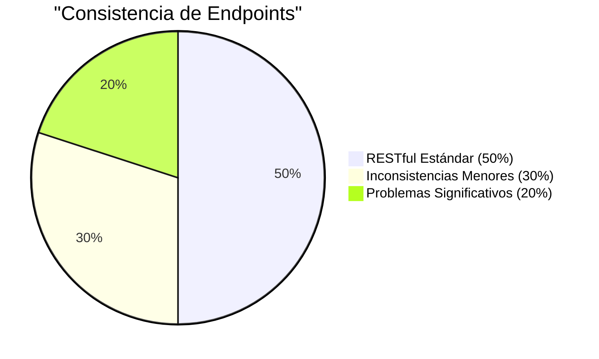
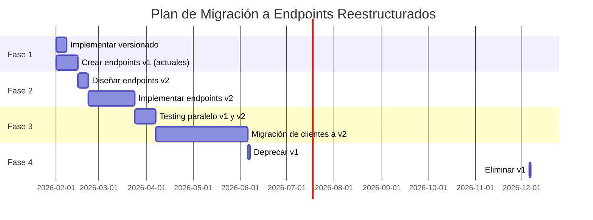

# 🔄 Reestructuración de Endpoints y Versionado API - SACDIA

**Fecha**: 28 de enero de 2026  
**Objetivo**: Proponer una reestructuración de endpoints para mejorar consistencia, agilidad y mantenibilidad, e implementar versionado de API.

---

## 📋 Tabla de Contenidos

- [Análisis de la Situación Actual](#análisis-de-la-situación-actual)
- [Problemas Identificados](#problemas-identificados)
- [Propuesta de Reestructuración](#propuesta-de-reestructuración)
- [Estrategia de Versionado](#estrategia-de-versionado)
- [Implementación en NestJS](#implementación-en-nestjs)
- [Comparativa Antes/Después](#comparativa-antesdespués)
- [Plan de Migración](#plan-de-migración)

---

## Análisis de la Situación Actual

### Estructura Actual de Endpoints

| Categoría | Ejemplo de Endpoint | Problemas |
|-----------|---------------------|-----------|
| **Auth** | `/auth/signup` | ✅ Bien estructurado |
| **Users** | `/users/:id` | ✅ RESTful estándar |
| **Users Sub-recursos** | `/users/allergies/by-user/:userId` | ⚠️ Anidamiento inconsistente |
| **Emergency Contacts** | `/users/emergency-contacts/all?userId=` | ⚠️ `all` innecesario, debería ser query param |
| **Clubs** | `/clubs/assign-member` | ⚠️ No RESTful, debería ser POST a sub-recurso |
| **Catalogs** | `/catalogs/roles` | ✅ Bien agrupado |
| **Catalogs (Algunos)** | `/c/lf` | ❌ Abreviación confusa |
| **Club Roles** | `/clubs/club-role-assignments` | ⚠️ Debería estar en `/catalogs` o `/users` |
| **File Upload** | `/fu/pp/:userId` | ❌ Abreviaciones no claras |
| **Users Honors** | `/users/users-honors` | ❌ Redundancia en nombre |
| **Classes** | `/classes` | ✅ Bien estructurado |

### Estadísticas de Inconsistencias



---

## Problemas Identificados

### 🔴 Problemas Críticos

#### 1. **Falta de Versionado**

**Problema**: No hay versionado en la API, lo que dificulta futuras actualizaciones.

```
Actual:   /users/:id
Problema: ¿Cómo introducir cambios sin romper clientes existentes?
```

**Impacto**: Breaking changes afectan todos los clientes.

---

#### 2. **Abreviaciones No Claras**

**Problema**: Uso de abreviaciones que reducen legibilidad.

| Actual | Significado | Problema |
|--------|-------------|----------|
| `/fu/pp/:userId` | File Upload / Profile Picture | Muy críptico |
| `/c/lf` | Catalogs / Local Fields | Confuso |
| `/auth/pr-check` | Profile Registration Check | PR no es obvio |

**Impacto**: Curva de aprendizaje alta para nuevos desarrolladores.

---

#### 3. **Redundancia en Nombres**

**Problema**: Nombres redundantes en paths.

```
❌ /users/users-honors
❌ /users/users-allergies
❌ /users/users-diseases
❌ /users/users-classes
```

**Solución**: El contexto `/users` ya indica que es de usuarios.

```
✅ /users/:userId/honors
✅ /users/:userId/allergies
✅ /users/:userId/diseases
✅ /users/:userId/classes
```

---

#### 4. **Verbos en URLs**

**Problema**: Uso de verbos en lugar de sustantivos (anti-pattern REST).

| Actual | Problema | Mejor Opción |
|--------|----------|--------------|
| `/users/allergies/assign-allergies` | Verbo en URL | `POST /users/:userId/allergies` |
| `/clubs/assign-member` | Verbo en URL | `POST /clubs/:clubId/members` |
| `/clubs/assign-role` | Verbo en URL | `POST /clubs/:clubId/members/:memberId/roles` |
| `/catalogs/permissions/assign-to-roles` | Verbo en URL | `POST /catalogs/roles/:roleId/permissions` |

---

#### 5. **Inconsistencia en Anidamiento**

**Problema**: Algunos recursos usan query params, otros usan paths.

```
Inconsistente:
GET /users/allergies/by-user/:userId     (path param)
GET /users/emergency-contacts/all?userId= (query param)

Consistente:
GET /users/:userId/allergies
GET /users/:userId/emergency-contacts
```

---

### 🟡 Problemas Medios

#### 6. **Agrupación Confusa de Endpoints**

**Problema**: `/clubs/club-role-assignments` debería estar más claramente organizado.

```
Actual:   /clubs/club-role-assignments
¿Es sobre clubes o sobre asignaciones de roles?

Opciones:
- /users/:userId/club-roles
- /clubs/:clubId/role-assignments
- /catalogs/club-role-assignments (si es configuración global)
```

---

#### 7. **Endpoints con `/many`**

**Problema**: El sufijo `/many` es innecesario; el body determina si es múltiple.

```
❌ POST /catalogs/roles/many
   Body: [{ role_name: "admin" }, ...]

✅ POST /catalogs/roles
   Body: [{ role_name: "admin" }, ...]  ← El array lo indica
```

**Nota**: NestJS puede detectar arrays automáticamente en el DTO.

---

#### 8. **Paths de Catálogos No Uniformes**

**Problema**: Mayoría usa `/catalogs/{resource}` pero hay excepciones.

```
✅ /catalogs/roles
✅ /catalogs/permissions
❌ /c/lf (local-fields)  ← Inconsistente
```

---

## Propuesta de Reestructuración

### Principios de Diseño

1. **RESTful puro**: Usar sustantivos, no verbos
2. **Recursos anidados**: Reflejar relaciones jerárquicas
3. **Consistencia**: Mismo patrón para recursos similares
4. **Legibilidad**: Nombres completos, no abreviaciones
5. **Versionado**: Preparado para evolución

---

### Nueva Estructura de Endpoints

## **Nivel 1: Versionado**

```
/api/v1/{resource}
```

Todos los endpoints iniciarán con `/api/v1`.

---

## **Módulo 1: Authentication**

### Base: `/api/v1/auth`

| Método | Endpoint Actual | Endpoint Propuesto | Cambios |
|--------|-----------------|-------------------|---------|
| POST | `/auth/signup` | `/api/v1/auth/register` | Nombre más estándar |
| POST | `/auth/signin` | `/api/v1/auth/login` | Nombre más estándar |
| POST | `/auth/signout` | `/api/v1/auth/logout` | Nombre más estándar |
| POST | `/auth/request-password-reset` | `/api/v1/auth/password/reset-request` | Mejor organización |
| POST | `/auth/password-reset` | `/api/v1/auth/password/reset` | Más claro |
| POST | `/auth/pr-check` | `/api/v1/auth/profile/completion-status` | Sin abreviaciones |
| POST | `/auth/pr-complete` | `/api/v1/auth/profile/complete` | Más claro |
| GET | `/auth/profile` | `/api/v1/auth/me` | Estándar de la industria |

**Justificación**:
- `register/login/logout`: Terminología universal
- `/auth/me`: Estándar adoptado por Google, GitHub, etc.
- `/password/*`: Agrupa operaciones relacionadas

---

## **Módulo 2: Users**

### Base: `/api/v1/users`

#### 2.1 CRUD Principal

| Método | Endpoint Actual | Endpoint Propuesto |
|--------|-----------------|-------------------|
| GET | `/users` | `/api/v1/users` |
| GET | `/users/:id` | `/api/v1/users/:userId` |
| POST | - | `/api/v1/users` |
| PATCH | `/users/:id` | `/api/v1/users/:userId` |
| DELETE | `/users/:id` | `/api/v1/users/:userId` |

**Mejora**: `:userId` en lugar de `:id` para claridad.

---

#### 2.2 Emergency Contacts

| Método | Endpoint Actual | Endpoint Propuesto |
|--------|-----------------|-------------------|
| POST | `/users/emergency-contacts` | `/api/v1/users/:userId/emergency-contacts` |
| GET | `/users/emergency-contacts` | `/api/v1/emergency-contacts` (admin) |
| GET | `/users/emergency-contacts/all?userId=` | `/api/v1/users/:userId/emergency-contacts` |
| GET | `/users/emergency-contacts/:id` | `/api/v1/emergency-contacts/:contactId` |
| PATCH | `/users/emergency-contacts/:id` | `/api/v1/emergency-contacts/:contactId` |
| DELETE | `/users/emergency-contacts/:id` | `/api/v1/emergency-contacts/:contactId` |

**Cambios clave**:
- Anidar bajo `/users/:userId` cuando sea específico del usuario
- Endpoint global para administradores
- Eliminar `/all` innecesario

---

#### 2.3 Allergies

| Método | Endpoint Actual | Endpoint Propuesto |
|--------|-----------------|-------------------|
| POST | `/users/allergies` | `/api/v1/users/:userId/allergies` |
| POST | `/users/allergies/many` | *(Mismo endpoint, body determina)* |
| POST | `/users/allergies/assign-allergies` | *(Eliminado, usar el anterior)* |
| GET | `/users/allergies` | `/api/v1/allergies` (admin) |
| GET | `/users/allergies/:id` | `/api/v1/allergies/:allergyAssignmentId` |
| GET | `/users/allergies/by-user/:userId` | `/api/v1/users/:userId/allergies` |
| GET | `/users/allergies/by-allergy/:allergyId` | `/api/v1/catalogs/allergies/:allergyId/users` |
| PATCH | `/users/allergies/:id` | `/api/v1/allergies/:allergyAssignmentId` |
| DELETE | `/users/allergies/:id` | `/api/v1/allergies/:allergyAssignmentId` |
| DELETE | `/users/allergies/by-user/:userId` | `/api/v1/users/:userId/allergies` (DELETE all) |
| DELETE | `/users/allergies/by-user-allergy/:userId/:allergyId` | `/api/v1/users/:userId/allergies/:allergyId` |

**Simplificación**:
- Endpoints anidados bajo usuario
- Operación inversa (`by-allergy`) movida a catálogo
- Sin redundancia `/users/users-allergies` → `/users/:userId/allergies`

---

#### 2.4 Diseases (Mismo patrón que Allergies)

```
POST   /api/v1/users/:userId/diseases
GET    /api/v1/users/:userId/diseases
DELETE /api/v1/users/:userId/diseases (all)
DELETE /api/v1/users/:userId/diseases/:diseaseId
```

---

#### 2.5 Honors

| Método | Endpoint Actual | Endpoint Propuesto |
|--------|-----------------|-------------------|
| POST | `/users/users-honors` | `/api/v1/users/:userId/honors` |
| GET | `/users/users-honors` | `/api/v1/honors` (admin) |
| GET | `/users/users-honors/:id` | `/api/v1/honors/:honorAssignmentId` |
| GET | `/users/users-honors/:userId/by-category` | `/api/v1/users/:userId/honors?groupBy=category` |
| PATCH | `/users/users-honors/:id` | `/api/v1/honors/:honorAssignmentId` |
| DELETE | `/users/users-honors/:id` | `/api/v1/honors/:honorAssignmentId` |

**Mejora**: Usar query param `?groupBy=category` en lugar de `/by-category`.

---

#### 2.6 Classes (Enrollments)

| Método | Endpoint Actual | Endpoint Propuesto |
|--------|-----------------|-------------------|
| POST | `/users/users-classes/add` | `/api/v1/users/:userId/classes` |
| GET | `/users/users-classes` | `/api/v1/class-enrollments` (admin) |
| GET | `/users/users-classes/:id` | `/api/v1/class-enrollments/:enrollmentId` |
| GET | `/users/users-classes/by-user/:userId` | `/api/v1/users/:userId/classes` |
| GET | `/users/users-classes/by-class/:classId` | `/api/v1/classes/:classId/students` |
| PATCH | `/users/users-classes/:id` | `/api/v1/class-enrollments/:enrollmentId` |
| DELETE | `/users/users-classes/:id` | `/api/v1/class-enrollments/:enrollmentId` |

**Mejoras**:
- Eliminar `/add`, es redundante con POST
- Cambiar `/users-classes` a `/class-enrollments` (más claro)
- Endpoint inverso en `/classes/:classId/students`

---

## **Módulo 3: Clubs**

### Base: `/api/v1/clubs`

| Método | Endpoint Actual | Endpoint Propuesto |
|--------|-----------------|-------------------|
| POST | `/clubs` | `/api/v1/clubs` |
| POST | `/clubs/many` | *(Mismo endpoint)* |
| GET | `/clubs` | `/api/v1/clubs` |
| GET | `/clubs/:id` | `/api/v1/clubs/:clubId` |
| GET | `/clubs/by-district/:districtId` | `/api/v1/districts/:districtId/clubs` |
| GET | `/clubs/by-local-field/:localFieldId` | `/api/v1/local-fields/:localFieldId/clubs` |
| GET | `/clubs/by-church/:churchId` | `/api/v1/churches/:churchId/clubs` |
| GET | `/clubs/search?term=` | `/api/v1/clubs?search=term` |
| PATCH | `/clubs/:id` | `/api/v1/clubs/:clubId` |
| DELETE | `/clubs/:id` | `/api/v1/clubs/:clubId` |

**Mejoras**:
- Filtros por jerarquía reflejados en endpoints anidados
- `/search?term=` → `?search=` (más estándar)

---

### Instancias de Club

| Método | Endpoint Actual | Endpoint Propuesto |
|--------|-----------------|-------------------|
| POST | `/clubs/:mainClubId/adventurers` | `/api/v1/clubs/:clubId/instances/adventurers` |
| POST | `/clubs/:mainClubId/pathfinders` | `/api/v1/clubs/:clubId/instances/pathfinders` |
| POST | `/clubs/:mainClubId/master-guides` | `/api/v1/clubs/:clubId/instances/master-guides` |
| GET | `/clubs/:id/types` | `/api/v1/clubs/:clubId/instances` |

**Mejora**: Agrupar bajo `/instances` para claridad.

---

### Miembros y Roles en Clubs

| Método | Endpoint Actual | Endpoint Propuesto |
|--------|-----------------|-------------------|
| POST | `/clubs/assign-member` | `/api/v1/clubs/:clubId/members` |
| POST | `/clubs/assign-role` | `/api/v1/clubs/:clubId/members/:userId/roles` |
| GET | - | `/api/v1/clubs/:clubId/members` |
| GET | - | `/api/v1/clubs/:clubId/members/:userId` |
| DELETE | - | `/api/v1/clubs/:clubId/members/:userId` |

**Mejoras**:
- Eliminar verbos (`assign-member`, `assign-role`)
- Estructura anidada clara: `clubs → members → roles`
- CRUD completo de miembros

---

## **Módulo 4: Classes (Progressive Classes)**

### Base: `/api/v1/classes`

| Método | Endpoint Actual | Endpoint Propuesto |
|--------|-----------------|-------------------|
| POST | `/classes` | `/api/v1/classes` |
| GET | `/classes` | `/api/v1/classes` |
| GET | `/classes/:id` | `/api/v1/classes/:classId` |
| GET | - | `/api/v1/classes/:classId/students` |
| PATCH | `/classes/:id` | `/api/v1/classes/:classId` |
| DELETE | `/classes/:id` | `/api/v1/classes/:classId` |

**Mejora**: Agregar endpoint para ver estudiantes de una clase.

---

## **Módulo 5: Catalogs**

### Base: `/api/v1/catalogs`

Todos los catálogos deben seguir la misma estructura:

```
POST   /api/v1/catalogs/{resource}
GET    /api/v1/catalogs/{resource}
GET    /api/v1/catalogs/{resource}/:id
GET    /api/v1/catalogs/{resource}?search=term
PATCH  /api/v1/catalogs/{resource}/:id
DELETE /api/v1/catalogs/{resource}/:id
```

---

### 5.1 Roles y Permisos

| Endpoint Actual | Endpoint Propuesto |
|-----------------|-------------------|
| `/catalogs/roles` | `/api/v1/catalogs/roles` |
| `/catalogs/permissions` | `/api/v1/catalogs/permissions` |
| `/catalogs/role-permissions` | `/api/v1/catalogs/roles/:roleId/permissions` |
| `/catalogs/users-roles` | `/api/v1/users/:userId/roles` |
| `/clubs/club-role-assignments` | `/api/v1/users/:userId/club-roles` |

**Cambios importantes**:
- `/role-permissions` → Anidar bajo `/roles/:roleId/permissions`
- `/users-roles` → Mover a `/users/:userId/roles` (rol global del usuario)
- `/club-role-assignments` → `/users/:userId/club-roles` (roles de club del usuario)

**Alternativa para admin**:
```
GET /api/v1/catalogs/role-permissions      # Ver todas las asignaciones
GET /api/v1/catalogs/user-role-assignments # Ver todas las asignaciones de usuarios
```

---

### 5.2 Geographical Hierarchy

| Endpoint Actual | Endpoint Propuesto |
|-----------------|-------------------|
| `/catalogs/countries` | `/api/v1/catalogs/countries` |
| `/catalogs/countries/:id` | `/api/v1/catalogs/countries/:countryId` |
| `/catalogs/unions` | `/api/v1/catalogs/unions` |
| `/catalogs/unions/by-country/:countryId` | `/api/v1/catalogs/countries/:countryId/unions` |
| `/c/lf` | `/api/v1/catalogs/local-fields` ✅ |
| `/catalogs/districts` | `/api/v1/catalogs/districts` |
| `/catalogs/districts/by-local-field/:localFieldId` | `/api/v1/catalogs/local-fields/:localFieldId/districts` |
| `/catalogs/churches` | `/api/v1/catalogs/churches` |

**Mejora crítica**: Reemplazar `/c/lf` por `/catalogs/local-fields`.

---

### 5.3 Health & Honors

| Recurso | Endpoint Propuesto |
|---------|--------------------|
| Allergies | `/api/v1/catalogs/allergies` |
| Diseases | `/api/v1/catalogs/diseases` |
| Honors | `/api/v1/catalogs/honors` |
| Honors Categories | `/api/v1/catalogs/honors/categories` |
| Master Honors | `/api/v1/catalogs/master-honors` |

**Mejora**: Anidar `honors-categories` bajo `/honors/categories`.

---

### 5.4 Club & Relationship Types

| Recurso | Endpoint Propuesto |
|---------|--------------------|
| Club Types | `/api/v1/catalogs/club-types` |
| Relationship Types | `/api/v1/catalogs/relationship-types` |

*(Sin cambios)*

---

## **Módulo 6: File Upload**

### Base: `/api/v1/files`

| Endpoint Actual | Endpoint Propuesto |
|-----------------|-------------------|
| `/fu/pp/:userId` | `/api/v1/users/:userId/profile-picture` |

**Futuras extensiones**:
```
POST   /api/v1/users/:userId/profile-picture
DELETE /api/v1/users/:userId/profile-picture
POST   /api/v1/clubs/:clubId/logo
POST   /api/v1/honors/:honorId/badge
```

**Mejora**: Eliminar abreviaciones, usar nombres descriptivos.

---

## Estrategia de Versionado

### Tipos de Versionado Disponibles

| Estrategia | Ejemplo | Pros | Contras |
|------------|---------|------|---------|
| **URI Versioning** | `/api/v1/users` | ✅ Visible, simple | URL diferente por versión |
| **Header Versioning** | `Accept: application/vnd.sacdia.v1+json` | URLs limpias | Menos visible |
| **Query Param** | `/api/users?version=1` | Flexible | Fácil de olvidar |
| **Media Type** | `Content-Type: application/vnd.sacdia.v1+json` | RESTful puro | Complejo |

---

### Estrategia Recomendada: **URI Versioning**

**Justificación**:
1. ✅ **Simplicidad**: Fácil de entender e implementar
2. ✅ **Visibilidad**: Versión clara en la URL
3. ✅ **Cacheable**: Diferentes versiones = diferentes cachés
4. ✅ **Testing**: Fácil probar ambas versiones simultáneamente
5. ✅ **Documentación**: Swagger puede documentar versiones por separado

**Estructura**:
```
/api/v1/...   # Versión 1 (actual)
/api/v2/...   # Versión 2 (futura)
```

**Políticas**:
- **Versión default**: Si no se especifica, usar v1
- **Deprecación**: Avisar con 6 meses de anticipación
- **Soporte**: Mantener máximo 2 versiones mayores simultáneamente
- **Breaking Changes**: Solo en nuevas versiones mayores

---

### Versionado Semántico para API

```
v{MAJOR}.{MINOR}.{PATCH}
```

- **MAJOR** (`v1`, `v2`): Cambios incompatibles (breaking changes)
- **MINOR**: Nuevas funcionalidades retrocompatibles
- **PATCH**: Bug fixes retrocompatibles

**Ejemplos**:
- `v1` → `v2`: Cambio de estructura de response
- `v1.1`: Nuevo endpoint agregado
- `v1.1.1`: Fix de bug

**Para URI**: Solo usar MAJOR version (`/api/v1`, `/api/v2`)
**En Headers**: Retornar versión completa:
```
X-API-Version: 1.2.5
```

---

## Implementación en NestJS

### Paso 1: Configurar Versionado Global

```typescript
// main.ts
import { VersioningType } from '@nestjs/common';

async function bootstrap() {
  const app = await NestFactory.create(AppModule);

  // Habilitar versionado
  app.enableVersioning({
    type: VersioningType.URI,
    prefix: 'api/v',
    defaultVersion: '1',
  });

  app.setGlobalPrefix('api'); // Opcional si ya está en el versioning prefix
  
  await app.listen(3000);
}
```

---

### Paso 2: Aplicar Versiones a Controladores

**Opción A: Versión a nivel de controlador**

```typescript
import { Controller, Get, Version } from '@nestjs/common';

@Controller('users')
export class UsersController {
  
  // Endpoint en v1
  @Get()
  @Version('1')
  findAllV1() {
    return { version: 'v1', users: [...] };
  }

  // Endpoint en v2 con cambios
  @Get()
  @Version('2')
  findAllV2() {
    return { 
      version: 'v2', 
      data: [...],  // Nueva estructura
      meta: { ... }
    };
  }
}
```

**Opción B: Controladores separados por versión**

```typescript
// users.controller.v1.ts
@Controller({ path: 'users', version: '1' })
export class UsersControllerV1 {
  @Get()
  findAll() {
    return { users: [...] };
  }
}

// users.controller.v2.ts
@Controller({ path: 'users', version: '2' })
export class UsersControllerV2 {
  @Get()
  findAll() {
    return { data: [...], meta: {} };
  }
}
```

---

### Paso 3: Actualizar Decoradores Personalizados

```typescript
// common/decorators/catalog-controller.decorator.ts
export function CatalogController(resource: string, version: string = '1') {
  return applyDecorators(
    Controller({ path: `catalogs/${resource}`, version }),
    UseGuards(SupabaseGuard, PermissionsGuard),
    ApiTags('Catalogs'),
  );
}

// Uso
@CatalogController('roles', '1')
export class RolesController { ... }
```

---

### Paso 4: Swagger Multi-Version

```typescript
// main.ts
const configV1 = new DocumentBuilder()
  .setTitle('SACDIA API v1')
  .setVersion('1.0')
  .addBearerAuth()
  .build();

const configV2 = new DocumentBuilder()
  .setTitle('SACDIA API v2')
  .setVersion('2.0')
  .addBearerAuth()
  .build();

const documentV1 = SwaggerModule.createDocument(app, configV1, {
  include: [UsersModuleV1, AuthModuleV1, ...],
});

const documentV2 = SwaggerModule.createDocument(app, configV2, {
  include: [UsersModuleV2, AuthModuleV2, ...],
});

SwaggerModule.setup('docs/v1', app, documentV1);
SwaggerModule.setup('docs/v2', app, documentV2);
```

**URLs de Documentación**:
- `http://localhost:3000/docs/v1` → Documentación V1
- `http://localhost:3000/docs/v2` → Documentación V2

---

### Paso 5: Header de Versión en Responses

```typescript
// common/interceptors/version.interceptor.ts
@Injectable()
export class VersionInterceptor implements NestInterceptor {
  intercept(context: ExecutionContext, next: CallHandler): Observable<any> {
    const response = context.switchToHttp().getResponse();
    const request = context.switchToHttp().getRequest();
    
    // Extraer versión de la URL
    const version = request.url.match(/\/api\/v(\d+)\//)?.[1] || '1';
    
    response.setHeader('X-API-Version', `${version}.0.0`);
    
    return next.handle();
  }
}

// Aplicar globalmente
app.useGlobalInterceptors(new VersionInterceptor());
```

---

## Comparativa Antes/Después

### Ejemplo 1: Alergias de Usuario

**Antes**:
```
GET /users/allergies/by-user/123e4567-e89b-12d3-a456-426614174000
DELETE /users/allergies/by-user-allergy/123e.../456
POST /users/allergies/assign-allergies
Body: { userId: "123e...", allergyIds: [1, 2, 3] }
```

**Después**:
```
GET /api/v1/users/123e4567-e89b-12d3-a456-426614174000/allergies
DELETE /api/v1/users/123e.../allergies/456
POST /api/v1/users/123e.../allergies
Body: [{ allergyId: 1 }, { allergyId: 2 }, { allergyId: 3 }]
```

**Mejoras**:
- ✅ Jerarquía clara: usuario → alergias
- ✅ Sin verbos (`assign-allergies`)
- ✅ RESTful estándar

---

### Ejemplo 2: Miembros de Club

**Antes**:
```
POST /clubs/assign-member
Body: {
  userId: "123e...",
  clubAdventurersId: 456
}

POST /clubs/assign-role
Body: {
  userId: "123e...",
  roleId: 789,
  clubPathfindersId: 456
}
```

**Después**:
```
POST /api/v1/clubs/456/members
Body: {
  userId: "123e...",
  roleId: "member"  // Default role
}

POST /api/v1/clubs/456/members/123e.../roles
Body: {
  roleId: 789,
  startDate: "2026-01-01"
}
```

**Mejoras**:
- ✅ Sin verbos
- ✅ Jerarquía: club → miembro → rol
- ✅ Dos operaciones separadas (agregar miembro vs asignar rol)

---

### Ejemplo 3: File Upload

**Antes**:
```
POST /fu/pp/123e4567-e89b-12d3-a456-426614174000
```

**Después**:
```
POST /api/v1/users/123e4567-e89b-12d3-a456-426614174000/profile-picture
```

**Mejoras**:
- ✅ Sin abreviaciones confusas
- ✅ Auto-documentado
- ✅ Consistente con otros endpoints de users

---

### Ejemplo 4: Campos Locales

**Antes**:
```
GET /c/lf
GET /c/lf/123
```

**Después**:
```
GET /api/v1/catalogs/local-fields
GET /api/v1/catalogs/local-fields/123
```

**Mejoras**:
- ✅ Nombre completo y claro
- ✅ Consistente con otros catálogos

---

## Plan de Migración

### Estrategia: Dual-Mode (Soporte de Ambas Versiones)



---

### Fase 1: Preparación (2 semanas)

**Objetivo**: Configurar versionado sin romper nada.

**Tareas**:
1. Configurar `VersioningType.URI` en main.ts
2. Agregar version `'1'` a TODOS los controladores existentes
3. Actualizar tests para incluir `/api/v1/`
4. Actualizar Swagger para multi-version
5. Crear middleware para redireccionar `/users` → `/api/v1/users`

**Código de Redirección**:
```typescript
// Middleware para backward compatibility
@Injectable()
export class LegacyRedirectMiddleware implements NestMiddleware {
  use(req: Request, res: Response, next: NextFunction) {
    // Si la URL no tiene /api/v1, redirigir
    if (!req.url.startsWith('/api/v')) {
      return res.redirect(301, `/api/v1${req.url}`);
    }
    next();
  }
}
```

**Resultado**: 
- Endpoints existentes funcionan en `/api/v1/users` (nuevo)
- Legacy endpoints en `/users` redirigen a `/api/v1/users`

---

### Fase 2: Implementación v2 (6 semanas)

**Objetivo**: Crear nuevos endpoints reestructurados.

**Tareas**:
1. Crear DTOs específicos para v2
2. Implementar controladores v2 con nueva estructura
3. Reutilizar servicios existentes (capa de servicio no cambia)
4. Documentar diferencias v1 vs v2

**Ejemplo**:
```typescript
// users.controller.v2.ts
@Controller({ path: 'users', version: '2' })
export class UsersControllerV2 {
  constructor(private usersService: UsersService) {} // Mismo servicio

  @Get(':userId/allergies')
  async getUserAllergies(@Param('userId') userId: string) {
    // Servicio existente
    return this.usersService.findUserAllergies(userId);
  }
}

// users.controller.v1.ts (mantenido)
@Controller({ path: 'users/allergies', version: '1' })
export class UsersAllergiesControllerV1 {
  constructor(private usersService: UsersService) {}

  @Get('by-user/:userId')
  async getUserAllergies(@Param('userId') userId: string) {
    return this.usersService.findUserAllergies(userId);
  }
}
```

**Priorización**:
1. Authentication (crítico para todos)
2. Users y sub-recursos
3. Clubs
4. Catalogs
5. File Upload

---

### Fase 3: Testing y Migración Gradual (10 semanas)

**Objetivo**: Validar v2 y migrar clientes.

**Tareas**:
1. **Testing Automatizado**:
   ```typescript
   // tests/e2e/api-v2.spec.ts
   describe('API v2 - Users Allergies', () => {
     it('GET /api/v2/users/:userId/allergies', async () => {
       const response = await request(app.getHttpServer())
         .get('/api/v2/users/123e.../allergies')
         .expect(200);
       
       expect(response.body).toHaveProperty('data');
     });
   });
   ```

2. **Feature Flags** (opcional):
   ```typescript
   @Get(':userId/allergies')
   @Version('2')
   async getUserAllergies(
     @Param('userId') userId: string,
     @Headers('x-enable-v2') enableV2: string
   ) {
     if (enableV2 === 'true') {
       // Nuevo comportamiento
     } else {
       // Legacy (para rollback)
     }
   }
   ```

3. **Monitoreo de Uso**:
   ```typescript
   // Logging interceptor
   this.logger.log(`API v${version} called: ${endpoint}`);
   ```

4. **Documentación de Migración**:
   - Guía de migración v1 → v2
   - Changelog detallado
   - Ejemplos de código

5. **Programa de Early Adopters**:
   - Migrar primero a apps internas/staging
   - Recoger feedback
   - Iterar

---

### Fase 4: Deprecación y Cleanup (6 meses después)

**Tareas**:
1. **Anuncio de Deprecación** (6 meses antes):
   ```
   ⚠️ API v1 será eliminada el 2026-12-06
   Por favor migrar a /api/v2
   ```

2. **Warning Headers**:
   ```typescript
   // En v1 controllers
   response.setHeader('X-API-Deprecated', 'true');
   response.setHeader('X-API-Sunset', '2026-12-06');
   response.setHeader('Link', '</api/v2/users>; rel="successor-version"');
   ```

3. **Eliminar v1**:
   - Después de 6 meses sin uso significativo (<1% de tráfico)
   - Eliminar controladores v1
   - Limpiar código legacy

---

## Checklist de Implementación

### ✅ Preparación

- [ ] Revisar y aprobar propuesta de reestructuración
- [ ] Definir timeline de migración
- [ ] Configurar environment para multi-versioning
- [ ] Documentar decisiones de arquitectura

### ✅ Fase 1: Versionado

- [ ] Instalar `@nestjs/versioning` (ya incluido en @nestjs/common)
- [ ] Configurar `app.enableVersioning()` en main.ts
- [ ] Agregar `@Version('1')` a todos los controladores existentes
- [ ] Crear middleware de redirección legacy
- [ ] Actualizar tests E2E
- [ ] Actualizar Swagger para multi-version
- [ ] Deploy a staging
- [ ] Validar que nada se rompa

### ✅ Fase 2: Endpoints v2

- [ ] Crear módulo `users.v2`
  - [ ] Endpoint `/api/v2/users/:userId`
  - [ ] Endpoint `/api/v2/users/:userId/allergies`
  - [ ] Endpoint `/api/v2/users/:userId/diseases`
  - [ ] Endpoint `/api/v2/users/:userId/honors`
  - [ ] Endpoint `/api/v2/users/:userId/classes`
  - [ ] Endpoint `/api/v2/users/:userId/emergency-contacts`
  - [ ] Endpoint `/api/v2/users/:userId/profile-picture`

- [ ] Crear módulo `auth.v2`
  - [ ] `/api/v2/auth/register`, `/login`, `/logout`
  - [ ] `/api/v2/auth/me`
  - [ ] `/api/v2/auth/password/reset-request`

- [ ] Crear módulo `clubs.v2`
  - [ ] `/api/v2/clubs/:clubId`
  - [ ] `/api/v2/clubs/:clubId/members`
  - [ ] `/api/v2/clubs/:clubId/instances`

- [ ] Crear módulo `catalogs.v2`
  - [ ] Unificar todos bajo `/api/v2/catalogs/{resource}`
  - [ ] Actualizar `/c/lf` a `/catalogs/local-fields`

- [ ] Crear DTOs específicos para v2
- [ ] Documentar Swagger v2

### ✅ Fase 3: Testing

- [ ] Tests E2E para v2
- [ ] Load testing en v2
- [ ] Validar feature parity v1 ↔ v2
- [ ] Performance testing
- [ ] Security scanning

### ✅ Fase 4: Migración

- [ ] Documentación de migración
- [ ] Migrar frontend a v2
- [ ] Migrar mobile app a v2
- [ ] Deprecar v1
- [ ] Eliminar v1 (después de 6 meses)

---

## Consideraciones Finales

### Principios para Futuros Endpoints

1. **RESTful Puro**: Sustantivos, no verbos
2. **Jerarquía Clara**: Reflejar relaciones en la URL
3. **Nombres Completos**: No abreviaciones
4. **Consistencia**: Mismo patrón para recursos similares
5. **Versionado**: Cambios breaking solo en nuevas versiones

### Estándares de Naming

| Elemento | Convención | Ejemplo |
|----------|------------|---------|
| **Recursos** | Plural, kebab-case | `/users`, `/club-types` |
| **IDs** | Descriptivo + Id | `:userId`, `:clubId` |
| **Query Params** | camelCase | `?groupBy=category` |
| **Sub-recursos** | Anidados naturalmente | `/users/:userId/allergies` |
| **Acciones** | Verbos HTTP, no en URL | POST `/members` (no `/assign-member`) |

### Recursos y Referencias

- [Microsoft REST API Guidelines](https://github.com/microsoft/api-guidelines)
- [Google API Design Guide](https://cloud.google.com/apis/design)
- [NestJS Versioning](https://docs.nestjs.com/techniques/versioning)
- [RESTful API Best Practices](https://restfulapi.net/)

---

**Generado por**: Análisis de Arquitectura  
**Fecha**: 2026-01-28  
**Próxima Revisión**: Pre-Implementación v2
