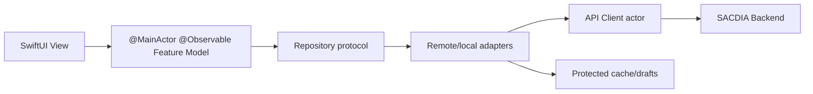

# Sacdia Admin iOS — Diseño aprobado

Este documento define cómo construir **Sacdia Admin**, una aplicación nativa para iPhone y iPad que preserve todas las capacidades productivas del panel administrativo sin copiar sus layouts de escritorio. La implementación será contract-first, SwiftUI-only y medirá paridad mediante la cadena `capacidad → permiso → endpoint → UX nativa → prueba`.

## Decisión ejecutiva

| Tema | Decisión aprobada |
|---|---|
| Producto | `Sacdia Admin` |
| Bundle ID | `com.zarzaroja.sacdiadmin` |
| Repositorio | Runtime independiente `sacdia-admin-ios/` dentro del workspace SACDIA |
| Plataforma | iPhone + iPad, deployment target iOS 17.4 |
| Toolchain | Xcode 26.3, SDK iOS 26, Swift 6.2 con strict concurrency |
| UI | SwiftUI exclusivamente |
| Arquitectura | Monolito modular feature-first, una app y targets de pruebas |
| Navegación | `NavigationSplitView` adaptativa; stack colapsado en iPhone y sidebar en iPad |
| Auth | Fachada aditiva `/auth/admin/*` sobre servicios compartidos |
| OAuth | `ASWebAuthenticationSession`, Universal Link HTTPS, PKCE S256 y código de un uso |
| Sesión | Access token en memoria; refresh token en Keychain device-only |
| Persistencia | Cache de lectura y drafts aprobados por feature; mutaciones críticas online |
| Diseño | Identidad SACDIA nativa; Liquid Glass progresivo en iOS 26 |
| Ejecución | TDD, vertical slices y work-unit commits; chained PRs por defecto |

## Ruta rápida de revisión

1. Revisar alcance y baseline en **Paridad verificable**.
2. Validar los boundaries en **Arquitectura**, **Autenticación** y **Datos**.
3. Confirmar traducción nativa en **Navegación** y **Design system**.
4. Usar **Gates de avance** y **Criterios de aceptación** para aprobar cada slice.

## Objetivo

Replicar el funcionamiento productivo del panel `sacdia-admin` en una app nativa, incluyendo:

- acceso administrativo, MFA, sesiones y cambio de contexto;
- dashboard, usuarios, clubes, unidades y membresías;
- actividades, finanzas, inventario, seguros y materiales;
- clases, certificaciones, honores, evidencias e investiduras;
- carpetas anuales, rankings, reportes y miembro del mes;
- camporees, eventos, pagos y scoring;
- catálogos, geografía, coordinación, RBAC y settings;
- recursos, notificaciones, soporte, SLA, jobs y cierre anual.

La app no se considera completa porque “tenga pantallas”. Se considera completa cuando cada capacidad esté trazada y validada contra el backend efectivo.

## Principios

1. **Contrato antes que interfaz.** No se implementa una acción sin DTO, respuesta, permisos y errores verificables.
2. **Capacidad antes que geometría.** Se preserva el trabajo que el usuario puede realizar, no la tabla o dialog web.
3. **Backend como autoridad.** La UI mejora descubribilidad, pero nunca sustituye autorización y scope del servidor.
4. **Estado local estrecho.** Dependencias compartidas por Environment; estado de feature explícito y testeable.
5. **Seguridad deny-by-default.** Una ambigüedad de sesión, contexto o permisos falla cerrado.
6. **Accesibilidad estructural.** Dynamic Type, VoiceOver y preferencias de movimiento/transparencia no son polish posterior.
7. **Entrega revisable.** Cada commit contiene un comportamiento, sus pruebas y la documentación asociada.

## Paridad verificable

La auditoría del snapshot `sacdia-admin` commit `4ebe30d` produjo esta línea base:

| Evidencia | Resultado |
|---|---:|
| Páginas Next.js | 141 |
| Pantallas administrativas | 139 |
| Rutas visibles en navegación primaria | 73 |
| Operaciones normalizadas | 489 |
| Operaciones sin drift observado | 425 |
| Operaciones con drift | 58 |
| Operaciones sin runtime | 6 |
| Response shapes no verificables | 281 |
| Pantallas enlazadas a operaciones | 135 |
| Operaciones únicas enlazadas a pantallas | 396 |
| Dominios funcionales | 39 |
| Dominios con contrato local completo | 8 |

### Regla de paridad

Cada capability del manifiesto debe registrar:

```text
screen/capability
  → effective permission + scope
  → method/path + request DTO + response DTO + errors
  → iPhone UX + iPad UX
  → unit/contract/UI test
  → verification evidence
```

El primer work unit persistirá en el nuevo repositorio los manifests compactos derivados de la auditoría. Las rutas legacy se conservan solo como aliases de deep link. La pantalla web interna `/dashboard/design-system` no es un destino productivo.

## Alcance y no alcance

### En alcance

- Todas las capacidades productivas comprobadas en las 141 rutas.
- Rutas ocultas necesarias para drill-down, edición, bulk operations o configuración.
- Estados loading, empty, no-results, forbidden, offline, rate-limited y partial failure.
- iPhone y iPad con layouts adaptativos, teclado y multitarea.
- Light/dark, cuatro idiomas y accesibilidad completa.
- Carga, preview, descarga y exportación de archivos soportados por cada contrato.
- Deep links, restauración de navegación y cambio seguro de contexto.

### Fuera de alcance inicial

- Copiar presets visuales web (`brutalist`, `soft-pop`, `tangerine`).
- Convertir SACDIA en offline-first o encolar mutaciones sin idempotencia/versionado.
- Generar el cliente Swift desde el OpenAPI actual incompleto.
- Añadir capacidades que no existen en web/backend sin un contrato de producto aprobado.
- Considerar la pantalla interna design-system como feature productiva.

## Plataforma y compatibilidad

iOS 17.4 es el mínimo porque permite `ASWebAuthenticationSession.Callback.https(host:path:)` y su initializer con callback exacto. La app usa APIs modernas disponibles en esa base y adopta iOS 26 mediante availability gates.

| Capability | iOS 17.4–18 | iOS 26 |
|---|---|---|
| Navegación | `NavigationSplitView` / `NavigationStack` | Mismo modelo |
| Estado | Observation (`@Observable`) | Mismo modelo |
| Chrome | Materiales y superficies semánticas | Liquid Glass nativo |
| Acciones | Button styles nativos | `.glass` / `.glassProminent` cuando aplique |
| Motion | Transiciones/springs del sistema | Glass morphing solo con continuidad real |

La funcionalidad nunca depende de la versión; solo cambia su tratamiento visual.

## Arquitectura

Se adopta un **monolito modular feature-first**. Evita paquetes prematuros, conserva boundaries claros y permite extraer módulos solo cuando exista presión real.



### Árbol propuesto

```text
sacdia-admin-ios/
├── SacdiaAdmin.xcodeproj
├── Config/
│   ├── Base.xcconfig
│   ├── Debug.xcconfig
│   └── Release.xcconfig
├── Documentation/
│   ├── parity-manifest.json
│   └── contract-baseline.json
├── SacdiaAdmin/
│   ├── App/
│   │   ├── AppContainer.swift
│   │   ├── AppSession.swift
│   │   ├── AppRoute.swift
│   │   └── RootScene.swift
│   ├── Core/
│   │   ├── API/
│   │   ├── Auth/
│   │   ├── Persistence/
│   │   ├── Security/
│   │   ├── Diagnostics/
│   │   ├── Localization/
│   │   └── DesignSystem/
│   ├── Shared/
│   │   ├── Models/
│   │   ├── Components/
│   │   └── Utilities/
│   └── Features/
│       └── <Feature>/{Domain,Data,Presentation,Navigation}/
├── SacdiaAdminTests/
└── SacdiaAdminUITests/
```

### Dependencias

- Views no hacen networking ni contienen reglas de negocio.
- Feature models son `@MainActor` y reciben protocolos explícitos.
- Transporte, refresh y cache coordinado viven en actors.
- DTOs remotos permanecen separados de entidades de dominio.
- Use cases se crean cuando existe lógica real; no por ceremonia.
- Servicios globales: sesión, API, routing, clock, locale y diagnostics.

## Navegación nativa

El panel tiene demasiados destinos para una tab bar.

### iPhone

- `NavigationSplitView` colapsada a stack.
- Dashboard orientado a tareas y catálogo de módulos searchable.
- Flujo estándar: lista → detalle → editor.
- Filtros complejos en sheet; sorting en `Menu`.
- Formularios extensos como destinos completos.
- Bulk actions mediante modo selección y toolbar inferior.
- Ninguna operación depende solo de swipe o long press.

### iPad

- Sidebar persistente filtrada por permisos efectivos.
- Dos columnas para módulos simples; tres para list/detail/inspector.
- `Table` solo cuando comparar columnas sea la tarea principal.
- Filtros en inspector/popover; formularios con ancho de lectura controlado.
- Matriz RBAC completa solo en ancho suficiente; en iPhone se agrupa por rol.

### Routing

- Destinos raíz y rutas propias por feature; no un enum global con 120 casos.
- Deep links transportan identificadores, nunca instancias de View.
- Logout o cambio de contexto limpia paths, selección y cache scopeado.
- Rutas legacy redirigen al destino nativo canónico.

## Módulos

Los 39 dominios se agrupan para navegación y entrega, no para borrar boundaries:

| Grupo | Dominios principales |
|---|---|
| Foundation | auth, entry, dashboard |
| People | users, RBAC, requests |
| Clubs | clubs, units, coordination, enrollments |
| Operations | activities, finances, inventory, insurance |
| Formation | classes, certifications, certificate imports, honors, achievements |
| Validation | evidence review, validation, investiture |
| Annual | annual folders, ranking weights, member/section rankings, member of month |
| Camporees | camporees, events, venues, payments, scoring |
| Resources | materials, resources, notifications |
| Administration | catalogs, settings, year-end |
| Observability | reports, SLA, support, system jobs |

El orden de implementación sigue readiness contractual, no el orden visual del sidebar.

## Autenticación administrativa

Se crea una fachada aditiva `/api/v1/auth/admin/*` sobre servicios compartidos. Los endpoints `/auth/*` actuales continúan intactos para web y Flutter durante la migración.

### Máquina de estados

```text
restoring → signedOut | refreshing
signedOut → authenticating
authenticating → needsMFA | signedIn | denied
needsMFA → verifyingMFA → signedIn | needsMFA
signedIn → switchingContext | refreshing | signingOut
switchingContext/refreshing → signedIn | expired
any authenticated state → signingOut → signedOut
```

### Invariantes

- Usuario activo, `access_panel=true` y grant/asignación administrativa activa.
- Si TOTP está enrolado, password/OAuth produce pre-auth efímero, no sesión/refresh.
- Session + token set se crean después de MFA.
- Access JWT corto en memoria; refresh opaco en Keychain `WhenUnlockedThisDeviceOnly`.
- Refresh single-flight; cada request original se reintenta una vez.
- `403` nunca dispara refresh.
- Logout limpia localmente aunque falle red; no afirma revocación remota sin confirmación.
- El backend valida `sid`, surface, estado de sesión, permiso y scope.

### OAuth

```text
POST /auth/admin/oauth/authorize
  → ASWebAuthenticationSession
  → provider + Better Auth callback server-side
  → Universal Link con authorization code de un uso
POST /auth/admin/oauth/exchange + PKCE verifier
  → pre-auth MFA o sesión administrativa
```

- Universal Link HTTPS exacto asociado a `com.zarzaroja.sacdiadmin`.
- PKCE S256 obligatorio; no downgrade a `plain`.
- Redirect fijo por client registrado; sin open redirect.
- Nunca access, refresh o session token en URL.
- `code`, `state` y verifier redactados de logs, Sentry y métricas.

## Autorización y contexto

`GET /auth/admin/me` devuelve identidad mínima, sesión y:

```text
authorization.revision
authorization.active_assignment
authorization.effective.permissions
authorization.effective.scope
authorization.grants
```

La app usa este snapshot para navegación y affordances. El backend conserva la decisión final por acción.

El contexto activo será session-scoped. `PATCH /auth/admin/context` invalida antes de renderizar:

- navegación y selección;
- caches y búsquedas;
- drafts ligados al scope anterior;
- tareas async y uploads activos.

Una sesión en iPhone no cambia el contexto de web o iPad.

## API y datos

### APIClient

- Actor basado en `URLSession` y async/await.
- Request descriptors tipados por endpoint.
- Decoders por contrato; no envelope universal ficticio.
- Error estable por `statusCode + code + requestId`.
- Paginación por endpoint.
- Uploads con MIME/tamaño verificados, progreso y cancelación.
- Conversión HEIC antes de flujos que no lo aceptan.
- `Accept-Language` para `es`, `en`, `fr`, `pt-BR`.

### OpenAPI

El spec actual no es fuente suficiente. Swift OpenAPI Generator se considera únicamente después de:

1. regenerar el spec desde runtime;
2. reconciliarlo con la referencia live;
3. obtener cero drift en `{method,path,auth}`;
4. validar DTOs/fixtures de los endpoints incluidos.

El código generado, si se adopta, queda detrás de adapters de dominio.

## Persistencia, offline y PII

SACDIA es **online-first con cache e invalidación**, no offline-first.

| Datos | Política |
|---|---|
| Access token | Solo memoria |
| Refresh token | Keychain device-only |
| Listados/catálogos | Snapshot stale-while-revalidate cuando el feature lo apruebe |
| Drafts | Opt-in por feature, cifrados/protegidos y scopeados |
| Mutaciones críticas | Online; sin queue automática |
| Archivos temporales | File protection, no backup y borrado al terminar |

Finanzas, salud, evidencias, RBAC, investiduras, scoring e inventario requieren:

- política explícita de TTL;
- aislamiento por user/session/assignment;
- exclusión de backups;
- purge en logout, revocación y cambio de contexto;
- migraciones y pruebas de borrado.

No se encolan mutaciones hasta que el endpoint tenga idempotencia y versionado/conflict policy documentados.

## Design system nativo

### Identidad verificada

| Token | Color |
|---|---|
| Coral | `#F06151` |
| Verde | `#4FBF9F` |
| Amarillo | `#FBBD5E` |
| Navy | `#183651` |

Los colores viven como assets semánticos light/dark. Views no consumen hex directamente.

### Reglas

- SF Pro mediante Dynamic Type; SF Symbols para iconografía funcional.
- Touch targets mínimos 44×44 pt.
- Spacing base 4/8/12/16/24/32 pt.
- `List`/`Section` para datos homogéneos; cards solo para KPIs o grupos reales.
- Status siempre combina símbolo, texto y color.
- Contraste WCAG AA en combinaciones reales.
- Sistema/Light/Dark; no forzar dark por defecto.

### Mapeo web → SwiftUI

| Web | SwiftUI |
|---|---|
| PageHeader/breadcrumbs | navigation title, back stack y toolbar |
| Sidebar | `NavigationSplitView` |
| DataTable | `List` iPhone / `Table` iPad cuando corresponde |
| Dialog | alert, sheet o full-screen según complejidad |
| Dropdown | Picker/Menu/popover |
| Recharts | Swift Charts + resumen/tabular accesible |
| Upload/preview | PhotosPicker, fileImporter, Quick Look/PDFKit |
| Toast | Estado inline/banner con anuncio VoiceOver |

## Motion, haptics y Liquid Glass

- Navegación y sheets usan transiciones del sistema.
- Cambios locales: 150–250 ms; reorganización: 250–350 ms.
- Matched geometry solo para el mismo objeto entre representaciones.
- Haptics tras confirmación remota o cambios discretos relevantes.
- No stagger de filas grandes ni animación decorativa constante.
- Reduce Motion cambia slide/scale/morph por crossfade o transición inmediata.

En iOS 26, Liquid Glass se limita a navigation chrome, toolbar contextual, selector de contexto y bulk actions. En iOS 17.4–18 se usan materiales/superficies equivalentes. Reduce Transparency fuerza superficies opacas. Nunca se aplica vidrio a rows, formularios, charts o fondos completos.

## Accesibilidad y localización

- Dynamic Type hasta tamaños Accessibility sin alturas fijas.
- VoiceOver labels/values/hints, headings y foco posterior a error/navegación.
- Reduce Motion, Reduce Transparency, Increase Contrast y Differentiate Without Color.
- Gestos con alternativa visible.
- Charts con descriptor y representación textual/tabular.
- String Catalog: `es`, `en`, `fr`, `pt-BR`.
- Foundation para fechas, moneda, números y porcentajes.
- Layout preparado para expansión de texto ≥30% y leading/trailing.

## Testing

### Swift Testing

- DTO mapping, validaciones y errores.
- Auth state machine, PKCE, refresh single-flight y router.
- Permission/scope matrices parametrizadas.
- Cache policy, context switch y purge.
- SwiftData/in-memory stores cuando un feature use persistencia.

### Contract/integration

- Transporte falso determinista y fixtures versionadas.
- 401→refresh→retry; 403 sin refresh; 409/422/429/5xx/offline.
- DTOs contra payloads reales y límites de archivos.
- Backend contract tests por `{method,path,auth,permission,response}`.

### XCUITest

- Login, MFA, logout y cambio de contexto.
- Navegación permission-aware.
- CRUD/bulk/upload/deep links por slice.
- iPhone compacto, iPhone grande e iPad.
- Background, kill/restore y reconexión.
- Dynamic Type, Reduce Motion y journeys accesibles.

La compilación y Simulator se ejecutarán solo tras una solicitud explícita posterior, conforme al contrato operativo del workspace.

## Estrategia de entrega

El cambio supera ampliamente el presupuesto de 400 líneas. Se usan chained slices y work-unit commits.

1. **Docs/parity baseline.** Diseño, manifests compactos y roadmap.
2. **Backend admin auth foundation.** Gate, pre-auth MFA y sesión.
3. **Backend OAuth/context.** Universal Link, PKCE y contexto por sesión.
4. **iOS scaffold/core.** Proyecto, config, API, Keychain, session y design tokens.
5. **Auth vertical slice.** Login/MFA/restore/logout/context.
6. **Shell/navigation.** Dashboard, módulos, permission-aware routes.
7. **Domain slices.** Uno o más dominios listos por cadena revisable.
8. **Parity hardening.** Gaps, uploads, offline policy y contract drift.
9. **Release verification.** Accesibilidad, seguridad, performance y Simulator.

Cada slice debe:

- empezar con un test RED;
- terminar con tests y docs del comportamiento;
- quedar por debajo de ~400 líneas cuando sea razonable;
- no mezclar backend, app y docs sin una dependencia contractual clara;
- poder revertirse sin eliminar trabajo ajeno.

## Gates de avance

| Gate | Bloqueo | Condición de cierre |
|---|---|---|
| B1 | OAuth nativo incompleto | callback real, Universal Link, code exchange PKCE y E2E |
| B2 | MFA/`access_panel` no autoritativos | pre-auth sin refresh, AAL correcto y deny tests |
| B3 | llamadas sin runtime/path incorrecto | cero `missing-runtime` en manifest regenerado |
| B4 | vocabulario RBAC divergente | controllers, seeds, clients y docs alineados |
| B5 | referencia runtime/auth drift | parity check `{method,path,auth}` en CI |
| B6 | response/pagination/upload incompletos | DTO + fixture por operación incluida |

B1–B3 bloquean los flujos afectados. B4–B6 pueden cerrarse por slice, pero bloquean la declaración de paridad total.

## Riesgos y mitigaciones

| Riesgo | Mitigación |
|---|---|
| El panel sigue evolucionando | Re-generar manifests y parity diff en cada slice |
| OpenAPI incompleto | Adapters manuales hasta cerrar B5/B6 |
| Persistencia de PII | Opt-in, protección, TTL y purge testeado |
| Scope cruzado | Contexto session-scoped y backend BOLA tests |
| Gigante AppRoute | Rutas por feature y destinos raíz |
| Boilerplate de capas | Use cases solo para lógica real |
| Liquid Glass excesivo | Solo chrome/acciones, fallback y accessibility gates |
| PRs inmanejables | Work-unit commits y chained PRs |
| Cambios ajenos en workspace | Worktrees/repos aislados; nunca reset/clean del árbol actual |

## Criterios de aceptación

### Por capability

- [ ] Existe una fila trazable capability→permission→endpoint→UX→test.
- [ ] DTOs y error codes están verificados con fixtures.
- [ ] Backend valida permiso y scope; UI refleja effective permissions.
- [ ] iPhone e iPad preservan la capacidad sin copiar desktop.
- [ ] Loading/error/empty/forbidden/offline están cubiertos.
- [ ] Accesibilidad y localización están verificadas.
- [ ] Pruebas del slice pasan y documentación está sincronizada.

### Para paridad total

- [ ] Las 140 pantallas productivas/aliases del baseline tienen estado cerrado; design-system interno está excluido.
- [ ] Los 39 dominios están implementados o documentados como aliases internos.
- [ ] B1–B6 están cerrados.
- [ ] Cero operaciones incluidas con `response_shape` desconocido.
- [ ] Cero rutas incluidas con drift o missing-runtime.
- [ ] Login/MFA/OAuth/contexto funcionan con seguridad deny-by-default.
- [ ] Todos los uploads/descargas respetan MIME, tamaño y protección local.
- [ ] Auditoría de VoiceOver, Dynamic Type, contrast, motion y transparency aprobada.
- [ ] Verificación fresh en Simulator/dispositivo demuestra journeys críticos.

## Fuentes canónicas

- `AGENTS.md`
- `docs/canon/source-of-truth.md`
- `docs/steering/tech.md`
- `docs/steering/coding-standards.md`
- `docs/steering/data-guidelines.md`
- `docs/steering/agent-ownership.md`
- `docs/api/ENDPOINTS-LIVE-REFERENCE.md`
- `docs/api/FRONTEND-INTEGRATION-GUIDE.md`
- `docs/api/SECURITY-GUIDE.md`
- `docs/api/TESTING-GUIDE.md`
- `docs/database/schema.prisma`
- `sacdia-admin/src/app/**/page.tsx`
- `sacdia-admin/src/components/layout/nav-config.ts`
- `sacdia-admin/src/app/globals.css`
- `sacdia-backend/src/**/*controller.ts`
- `sacdia-backend/src/auth/**`
- RFC 8252 y RFC 7636
- Apple SwiftUI, AuthenticationServices y Human Interface Guidelines

## Próximo paso

Crear el plan de implementación TDD con paths exactos, work units y criterios RED/GREEN/REFACTOR; después ejecutar la primera cadena contract-first sin compilar hasta autorización posterior.
