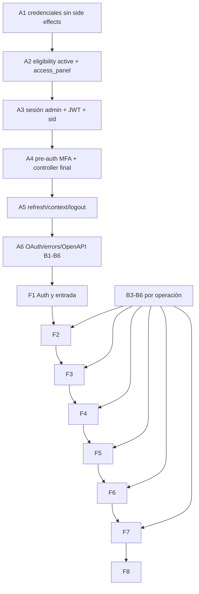

# Sacdia Admin iOS Implementation Plan

> **For Claude:** REQUIRED SUB-SKILL: Use superpowers:executing-plans to implement this plan task-by-task.

**Goal:** Crear `Sacdia Admin` (`com.zarzaroja.sacdiadmin`) como app nativa SwiftUI para iPhone+iPad con paridad funcional verificable del panel administrativo.

**Architecture:** Repo independiente `sacdia-admin-ios/`, modular monolith feature-first, cliente Swift generado desde OpenAPI validado y backend como autoridad de auth/RBAC/scope. La paridad se cierra por cadena `capacidad → permiso → endpoint → UX → test`; la fachada `/api/v1/auth/admin/*` es aditiva y no altera `/auth/*` legacy.

**Tech Stack:** iOS 17.4+, SDK iOS 26, Swift 6.2 strict concurrency, SwiftUI, Observation, async/await, URLSession + Swift OpenAPI Generator, SwiftData solo para caches/drafts permitidos, Keychain device-only, Swift Testing/XCTest/XCUITest.

---

## Reglas de ejecución

- **PROHIBIDO compilar o ejecutar tests Swift hasta autorización explícita posterior.** Por TDD estricto, las tareas iOS quedan detenidas antes del primer RED ejecutable: no se escribe producción Swift de comportamiento hasta observar el fallo correcto con autorización. Solo se permiten antes del gate inventarios, documentación y configuración reproducible validable sin compilar.
- Backend usa TDD estricto con Jest enfocado bajo `src/`; no ejecutar build.
- Eligibility de sesión admin: `users.active === true && users.access_panel === true`. No usar allowlist local de roles.
- Después del login, **cada operación** exige permission + scope backend; la navegación iOS es solo una proyección UX.
- Access token solo memoria; refresh token Keychain `WhenUnlockedThisDeviceOnly`; nunca tokens en SwiftData/UserDefaults/logs.
- Cache/drafts pertenecen a cada feature; logout o cambio de contexto purga el scope anterior. Mutaciones críticas son online-only.
- Cada PR/work unit apunta a ≤400 líneas; generado, migraciones grandes o assets se aíslan.
- Nunca `Co-Authored-By` ni atribución de IA. Commits convencionales.

## Baseline y definición de cierre

| Dimensión | Baseline verificable | Release |
|---|---:|---:|
| Dominios | 39 | 39 con disposición |
| Rutas web | 141 | 135 destinos + 5 aliases + 1 interna |
| Operaciones | 489 | 489 con disposición |
| Drift | 19 docs/runtime + 39 admin/runtime | 0 no arbitrado |
| Missing runtime | 6 | 0 |
| Response shapes desconocidos | 281 | 0 en operaciones incluidas |
| Destino interno | `/dashboard/design-system` | `internal-excluded`, sin pantalla productiva |

Gates: B1 OAuth nativo; B2 eligibility/MFA; B3 paths inválidos; B4 vocabulario RBAC; B5 docs/runtime/OpenAPI; B6 DTOs/paginación/uploads.

## DAG

## 14 vertical slices

| Slice | Fase | Dominios | Rutas | Ops | Gates |
|---:|---|---|---:|---:|---|
| S01 | F1 | auth, entry | 2 | 10 | B1, B2, B6 |
| S02 | F2 | dashboard, rbac, users, settings, coordination | 15 | 59 | B2, B5, B6 |
| S03 | F3 | notifications, sla, support, system-jobs | 6 | 12 | B2, B6 |
| S04 | F3 | clubs, enrollments, insurance | 11 | 39 | B2, B6 |
| S05 | F4 | activities, camporees | 12 | 68 | B2, B3, B6 |
| S06 | F4 | materials, inventory, resources | 11 | 39 | B2, B3, B5, B6 |
| S07 | F5 | annual-folders, evidence-review | 10 | 47 | B2, B6 |
| S08 | F5 | certificate-bulk-imports, investiture, validation, requests | 9 | 40 | B2, B6 |
| S09 | F6 | catalogs | 36 | 102 | B2, B3, B4, B5, B6 |
| S10 | F6 | classes, certifications, honors, achievements | 14 | 35 | B2, B3, B5, B6 |
| S11 | F7 | finances, member-of-month | 2 | 12 | B2, B6 |
| S12 | F7 | member-ranking-weights, member-rankings | 5 | 7 | B2, B6 |
| S13 | F7 | ranking-weights, section-rankings, reports, year-end | 7 | 19 | B2, B3, B6 |
| S14 | F8 | design-system | 1 | 0 | exclusión interna |
| **Total** |  | **39 dominios** | **141** | **489** | B1–B6 |

Cada slice usa la cadena: backend contract → OpenAPI/fixtures → repository/cache → SwiftUI iPhone/iPad → tests/parity. Si supera 400 líneas, dividir por read path, mutations y verification.

## Task 1: Backend A1 — credenciales sin sesión

**Files:**
- Modify: `sacdia-backend/src/better-auth/better-auth.service.ts`
- Modify: `sacdia-backend/src/better-auth/better-auth.service.spec.ts`

**RED:** agregar `validateCredentials` y demostrar que usuario/account/password inválidos devuelven `AUTH_INVALID_CREDENTIALS`; session/JWT/TOTP no se invocan.  
**Fallo esperado:** método ausente.

**GREEN:** extraer `validateCredentials(email,password): Promise<BaUser>`; `signInWithPassword` legacy delega y luego conserva TOTP, una session y su respuesta vigente.

**Verify:** `pnpm exec jest src/better-auth/better-auth.service.spec.ts --runInBand`; `git diff --check`.  
**Commit:** `feat(auth): separate credential validation from session creation`

## Task 2: Backend A2 — eligibility administrativa

**Files:**
- Create: `sacdia-backend/src/auth/admin/admin-eligibility.service.ts`
- Create: `sacdia-backend/src/auth/admin/admin-eligibility.service.spec.ts`
- Modify: `sacdia-backend/src/auth/auth.module.ts`
- Modify: `sacdia-backend/src/common/errors/error-codes.ts`
- Modify: `sacdia-backend/src/i18n/{es,en,fr,pt-BR}/errors.json`
- Modify: `docs/features/auth.md`, `docs/api/ARCHITECTURE-DECISIONS.md`

**RED:** missing/inactive/`access_panel=false|null` niega; `active=true && access_panel=true` permite continuar; fallo DB nunca permite.  
**Fallo esperado:** service y `AUTH_PANEL_ACCESS_DENIED` ausentes.

**GREEN:** query autoritativa, sin authorization snapshot cacheado; `assertEligible(userId)` aplica solo flags y lanza 403. RBAC/scope se verifica por operación después de autenticar.

**Verify:** Jest del service + locales completos + `git diff --check`.  
**Commit:** `feat(auth): enforce administrative login eligibility`

## Task 3: Backend A3 — sesión admin antes del controller

**Files:**
- Create: `sacdia-backend/src/auth/admin/admin-session.{service,repository}.ts`
- Create: specs pares bajo `src/auth/admin/`
- Create: `sacdia-backend/prisma/migrations/*_admin_auth_sessions/migration.sql`
- Modify: `sacdia-backend/prisma/schema.prisma`
- Modify: `sacdia-backend/src/auth/strategies/jwt.strategy.ts` y spec
- Modify: docs DB/security pareadas

**RED:** JWT admin exige `aud`, `surface`, `sid`, `jti`, `aal`, exp 15m; sid revocado/ausente falla en el siguiente request; legacy sigue válido.  
**Fallo esperado:** metadata/session model ausente.

**GREEN:** sesión admin + metadata `surface/client_type/aal/absolute_expiry/revocation`; crear/revocar sin ruta pública todavía.

**Verify:** Jest admin-session/JWT + `prisma validate` + `git diff --check`; no build.  
**Commit:** `feat(auth): add revocable administrative sessions`

## Task 4: Backend A4 — pre-auth MFA y controller final

**Files:**
- Create: `sacdia-backend/src/auth/admin/admin-pre-auth.service.ts` y spec
- Create: `sacdia-backend/src/auth/admin/guards/admin-pre-auth.guard.ts` y spec
- Create: `sacdia-backend/src/auth/admin/admin-auth.{controller,service}.ts` y specs
- Create: `sacdia-backend/src/auth/admin/dto/*.ts` y DTO spec
- Create: migration/schema `admin_auth_challenges`
- Modify: `sacdia-backend/src/auth/auth.module.ts`, MFA service/spec, docs

**RED:** TOTP devuelve pre-auth 5m sin session/refresh; challenge inválido/usado/expirado/concurrente falla; non-MFA devuelve sesión A3.  
**Fallo esperado:** challenge/guard/controller ausentes.

**GREEN:** challenge hash-only single-use; registrar `POST /api/v1/auth/admin/login` y `/mfa/verify` solo cuando ambos outcomes sean finales. DTO pipe rechaza campos extra.

**Verify:** Jest enfocado; metadata route/method; `prisma validate`; `git diff --check`.  
**Commit:** `feat(auth): add pre-auth mfa administrative login`

## Task 5: Backend A5 — refresh, contexto y logout

**Files:**
- Create: admin refresh/context DTOs y specs
- Modify: admin session/service/controller y specs
- Modify: schema/migration para hash, family, generation, assignment/revision
- Modify: authorization context, JWT strategy y docs relevantes

**RED:** refresh rota hash-only; reuse revoca familia; logout invalida sid; context es por session y dos devices no se contaminan.  
**Fallo esperado:** rotation/context metadata ausentes.

**GREEN:** transacciones atómicas, idle 7d/absolute 30d, context revision conflict y purge signal; endpoints admin aditivos.

**Verify:** Jest concurrency/context + Prisma validate + `git diff --check`.  
**Commit:** `feat(auth): rotate and scope administrative sessions`

## Task 6: Backend A6 — OAuth, errores y contrato B1–B6

**Files:**
- Create: OAuth flow/code models, services, guards, DTOs y specs bajo `src/auth/admin/`
- Modify: Better Auth handler/bootstrap, exception filters y logging
- Modify: OpenAPI/live reference/security/testing/auth/database docs
- Create: verifier contract-first B1–B6

**RED:** fixed client redirect, state+PKCE S256, callback code single-use, secrets ausentes de URL/logs; manifests detectan drift/missing/unknown shapes.  
**Fallo esperado:** authorize/exchange/verifier ausentes.

**GREEN:** Universal Link callback backend, exchange atómico, redacción y DTOs completos; cerrar B1–B6 antes del slice afectado.

**Verify:** Jest unit/contract; E2E OAuth queda diferido a sandbox/dispositivo autorizado; `git diff --check`.  
**Commit:** `feat(auth): complete native oauth administrative contract`

## Task 7: iOS F1 — foundation, S01 auth y entry

**Files:**
- Create: `sacdia-admin-ios/SacdiaAdmin.xcodeproj`
- Create: `sacdia-admin-ios/Packages/SacdiaKit/{Package.swift,Sources/{SacdiaCore,SacdiaAPI,SacdiaAuth,SacdiaDesignSystem}}`
- Create: app shell, `Contracts/openapi.yaml`, auth tests, `Parity/ledger.json`

**RED:** tras autorización, tests describen cold start, password, MFA, OAuth cancel/error, refresh single-flight, Keychain policy y deep link auth-aware; ejecutar el test enfocado y observar el fallo por comportamiento ausente.  
**Fallo esperado:** modules/types ausentes. Antes de autorización, registrar la tarea como `blocked-before-red`, no implementar el GREEN.

**GREEN:** SwiftUI app state machine, AuthSessionActor, generated client, semantic tokens, iPhone/iPad shell; no token persistido fuera de Keychain.

**Verify:** static parity S01 + secret scan + `git diff --check`; después de autorización, RED observado, GREEN Swift enfocado y regresión.  
**Commit:** `feat(ios): add native authentication foundation`

## Task 8: iOS F2 — S02 shell y autoridad

**Files:**
- Create: `FeatureDashboard`, `FeatureRBAC`, `FeatureUsers`, `FeatureSettings`, `FeatureCoordination`
- Create: repository/cache/tests por feature y rutas permission-aware

**RED:** 15 destinos, 59 ops, context switch y 403 backend; navegación oculta no sustituye autorización.  
**Fallo esperado:** feature routes/repositories ausentes.

**GREEN:** NavigationSplitView adaptativo, dashboard, usuarios, RBAC, settings y coordinación; invalidación por assignment/revision.

**Verify:** ledger S02 completo + B2/B5/B6 cerrados + `git diff --check`; Swift diferido.  
**Commit:** `feat(ios): add administrative shell and authority features`

## Task 9: iOS F3 — S03 sistema y S04 institucional

**Files:**
- Create: features Notifications, SLA, Support, SystemJobs, Clubs, Enrollments, Insurance
- Create: fixtures/contract tests y caches scopeados

**RED:** 17 destinos/51 ops; loading/empty/offline/forbidden/rate-limit; clubs context no cruza sessions.  
**Fallo esperado:** adapters y views ausentes.

**GREEN:** listas/detalles/formularios nativos; mutaciones online y read cache stale claramente marcado.

**Verify:** ledger S03/S04 + contract fixtures + `git diff --check`; Swift diferido.  
**Commit:** `feat(ios): add system and institutional operations`

## Task 10: iOS F4 — S05 operaciones y S06 activos

**Files:**
- Create: features Activities, Camporees, Materials, Inventory, Resources
- Create: upload/file preview adapters y tests

**RED:** 23 destinos/107 ops; attendance/staff/web gaps bloqueados; MIME/size/413/415 y partial upload.  
**Fallo esperado:** B3/B5/B6 o features ausentes.

**GREEN:** List/Table adaptativas, formularios, archivos, Quick Look y progreso; no inventar flujos para gaps web.

**Verify:** missing-runtime 0 para slice, fixtures completos, ledger y `git diff --check`; Swift diferido.  
**Commit:** `feat(ios): add operational and asset workflows`

## Task 11: iOS F5 — S07 evidencia y S08 revisión

**Files:**
- Create: features AnnualFolders, EvidenceReview, CertificateBulkImports, Investiture, Validation, Requests
- Create: bulk-action, draft y result-partial tests

**RED:** 19 destinos/87 ops; confirmaciones, motivo requerido, concurrencia, partial results y drafts seguros.  
**Fallo esperado:** queues/workflows ausentes.

**GREEN:** workflows verticales, selection mode explícito, online critical mutations y resultados accionables.

**Verify:** ledger S07/S08 + contract/a11y matrix + `git diff --check`; Swift diferido.  
**Commit:** `feat(ios): add evidence and review workflows`

## Task 12: iOS F6 — S09 catálogos y S10 formación

**Files:**
- Create: FeatureCatalogs por familia; Features Classes, Certifications, Honors, Achievements
- Create: search/form/translation tests

**RED:** 50 destinos/137 ops; B3/B4/B5/B6, 36 familias catálogo y certification detail gap.  
**Fallo esperado:** contratos normalizados/features ausentes.

**GREEN:** CRUD reutilizable sin perder permisos por operación; formación/progresión con DTOs reales y cuatro locales.

**Verify:** RBAC drift 0, response shapes conocidos, ledger S09/S10, `git diff --check`; Swift diferido.  
**Commit:** `feat(ios): add catalogs and formation features`

## Task 13: iOS F7 — S11–S13 finanzas, rankings y reportes

**Files:**
- Create: features Finances, MemberOfMonth, MemberRankingWeights, MemberRankings, RankingWeights, SectionRankings, Reports, YearEnd
- Create: Swift Charts, export y accessible-summary tests

**RED:** 14 destinos/38 ops; report contract gap, ranking weights, charts con alternativa textual y exports.  
**Fallo esperado:** B3/B6 o analytics features ausentes.

**GREEN:** dashboards adaptativos, tablas iPad/listas iPhone, charts accesibles y archivos temporales protegidos.

**Verify:** ledger S11–S13 + DTO/fixture/export checks + `git diff --check`; Swift diferido.  
**Commit:** `feat(ios): add finance ranking and reporting features`

## Task 14: iOS F8 — aliases, accesibilidad, parity y release

**Files:**
- Create: 5 deep-link aliases, `scripts/verify_parity.py`, final parity report
- Modify: String Catalogs `es/en/fr/pt-BR`, design system and all feature ledgers
- Exclude: `/dashboard/design-system` as `internal-excluded`

**RED:** verifier falla si no reconcilia 39 dominios, 141 rutas, 489 ops, 135 destinos, 5 aliases y 1 interna.  
**Fallo esperado:** filas/cadenas o tests faltantes.

**GREEN:** cerrar cada cadena capacidad→permiso→endpoint→UX→test; Liquid Glass solo chrome/acciones con fallback 17.4; VoiceOver, Dynamic Type, Reduce Motion/Transparency.

**Verify:** static verifier + secret scan + `git diff --check`. **Solo tras autorización:** build/test iPhone+iPad, XCUITest y OAuth/AASA en dispositivo real.  
**Commit:** `chore(ios): verify complete administrative parity`

## Chained PR y rollback

- Backend chain: A1 → A2 → A3 → A4 → A5 → A6; controller público aparece en A4, nunca antes.
- iOS chain: F1 → F8; cada F se divide por slices S01–S14 y por contract/data/UI/verification.
- PR declara base, dependencia, gates, comandos realmente ejecutados y estado: `implemented-uncompiled`, `compiled`, `tested` o `parity-verified`.
- Backend rollback: `/auth/admin/*` aditivo, `/auth/*` intacto; migraciones expand/contract y revocación de sid/family.
- iOS rollback: feature no entra a navegación hasta ledger completo; caches descartables por feature/scope, drafts con migración explícita.
- App Store: rollout progresivo; ante incidente de auth, negar nuevas sesiones iOS y revocar sesiones existentes.
- Nunca afirmar “funciona” antes de build/tests autorizados y evidencia adjunta.

## Final acceptance

- [ ] 39/39 dominios y 141/141 rutas con disposición.
- [ ] 135 destinos productivos, 5 aliases canónicos y 1 interna excluida.
- [ ] 489/489 operaciones con disposición; 0 missing/drift no arbitrado.
- [ ] Eligibility exacta `active && access_panel`; permission+scope backend por operación.
- [ ] MFA sin session/refresh pre-auth; OAuth Universal Link+PKCE; refresh/revoke/context seguros.
- [ ] 0 response shape desconocido para operaciones incluidas.
- [ ] iPhone+iPad, cuatro locales y accesibilidad completa.
- [ ] Critical mutations online-only; tokens/PII cumplen persistencia definida.
- [ ] Parity verifier verde.
- [ ] Build/test/device evidence únicamente después de autorización explícita.
