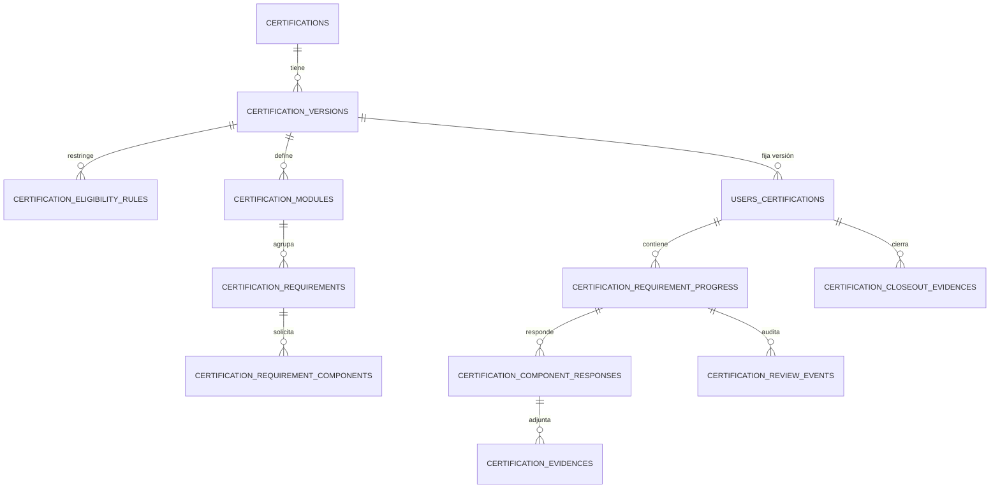

# Configurable Certifications Engine Implementation Plan

> **For Claude:** REQUIRED SUB-SKILL: Use superpowers:executing-plans to implement this plan task-by-task.

**Goal:** Convertir el módulo parcial de certificaciones de SACDIA en un motor configurable, versionado y auditable que permita cursar en la app la certificación “Capacitación básica para el personal del Club de Conquistadores”, cargando cada requisito por separado y permitiendo evidencias de imagen o PDF.

**Architecture:** Mantener certificaciones como dominio separado de clases progresivas, pero reutilizar sus patrones de árbol, evidencias y honores. El backend será la autoridad de elegibilidad, estados y revisión; cada inscripción quedará fijada a una versión publicada e inmutable. Los requisitos se compondrán de entregables tipados, se enviarán y revisarán uno por uno, y el cierre exigirá todos los requisitos aprobados más el comprobante de aprobación de junta cargado por el participante.

**Tech Stack:** PostgreSQL, Prisma 7, NestJS 11, TypeScript 6, Jest/Supertest, Cloudflare R2, Flutter/Riverpod/Dio/Hive/flutter_test, Next.js 16/Vitest para el panel de configuración.

---

## Fuente de verdad y alcance

- Documento funcional analizado: `/Users/abner/Downloads/document_compress-2.pdf`.
- Feature actual: `docs/features/certificaciones-guias-mayores.md`.
- Canon de permisos: `docs/canon/runtime-user-certifications.md` — invariante: no colapsar `certifications:read` (browse de catálogo) con `user_certifications:*` (progresión). Los permisos nuevos de este plan deben respetar esa separación.
- API runtime: `docs/api/ENDPOINTS-LIVE-REFERENCE.md`.
- Schema efectivo: `sacdia-backend/prisma/schema.prisma`.
- Módulo backend existente: `sacdia-backend/src/certifications/`.
- Módulo móvil existente: `sacdia-app/lib/features/certifications/`.
- Catálogo administrativo existente: `sacdia-admin/src/app/(dashboard)/dashboard/catalogs/certifications/`.
- Las certificaciones NO se integran dentro de clases progresivas. Comparten infraestructura, no ciclo de vida.
- El participante carga y envía sus propios entregables.
- Cada requisito se revisa individualmente.
- El comprobante de aprobación de junta admite `image/jpeg`, `image/png`, `image/webp` o `application/pdf`.
- No se ejecutarán builds. La verificación se hará con tests, lint dirigido, Prisma validate, typecheck y Flutter analyze.

## Brechas verificadas

> Re-verificadas contra `development` el 2026-08-11: las 9 se confirman. Matiz de la #1: `certification_section_progress.evidences Json?` ya existe en schema pero sin uso en el módulo. Bug adicional al #7: el toggle de la vista de progreso invalida el provider con `certificationId` (línea ~459) mientras el resto usa `enrollmentId`.

1. El backend actual solo registra `completed: boolean`; no modela evidencia, envío, devolución, aprobación ni historial.
2. El progreso está identificado por usuario/certificación/módulo/sección, no por `enrollment_id`; una reinscripción puede heredar progreso anterior.
3. `completion_status` solo se activa y no representa un flujo institucional reversible.
4. La elegibilidad depende del texto exacto `classes.name = 'Guía Mayor'`, en vez de una regla referencial configurable.
5. El catálogo usa una definición mutable; editar módulos o secciones afectaría inscripciones de uno o dos años ya iniciadas.
6. El catálogo y detalle son públicos mediante `OptionalJwtAuthGuard`, aunque el acceso solicitado debe reservarse al participante elegible y a revisores autorizados.
7. La app muestra checks manuales y contiene un error de identidad: `CertificationProgressView` consulta el provider con `enrollmentId` aunque este espera `certificationId`.
8. El admin consume un contrato de solo lectura y declara campos que no coinciden completamente con la respuesta backend (`title` frente a `name`).
9. El PDF exige 8 módulos, entregables heterogéneos, aprobación requisito por requisito y un cierre documental que el modelo actual no puede expresar.

## Invariantes de dominio

1. Una versión `PUBLISHED` es inmutable. Para cambiarla se clona a una nueva versión `DRAFT`.
2. Cada inscripción referencia exactamente una versión publicada.
3. El backend vuelve a evaluar la elegibilidad al inscribir; la visibilidad de la app es solo UX.
4. El acceso como participante exige cumplir la regla `INVESTED_CLASS` de Guía Mayor. Los revisores acceden por permisos y alcance institucional, no por elegibilidad de participante.
5. Un requisito puede contener uno o más entregables tipados y se envía como una sola unidad de revisión.
6. Los estados de requisito son `DRAFT`, `SUBMITTED`, `CHANGES_REQUESTED` y `APPROVED`.
7. No se puede editar una respuesta mientras esté `SUBMITTED` o `APPROVED`.
8. Toda transición de revisión genera historial append-only con actor, acción, comentario y fecha.
9. Una certificación solo puede pasar a revisión final cuando todos sus requisitos obligatorios estén `APPROVED` y el comprobante de junta esté cargado y aprobado.
10. Subir el comprobante de junta no equivale a aprobar el cierre.
11. Los objetos en R2 son privados; la API entrega URLs firmadas de corta duración después de verificar ownership o scope del revisor.
12. No se aceptan planillas libres con datos de menores. El requisito de “base de datos de miembros y padres” se resuelve mediante una constancia/formato controlado que referencia datos protegidos de SACDIA, sin duplicarlos en un archivo descargable.
13. El porcentaje de avance se deriva de requisitos aprobados; no se acepta un porcentaje enviado por el cliente.
14. Envíos y decisiones usan transacción y control de concurrencia para evitar doble aprobación o edición posterior.

## Modelo objetivo



### Definiciones configurables

- `certifications`: identidad estable, nombre, descripción y activación global.
- `certification_versions`: número de versión, estado `DRAFT|PUBLISHED|RETIRED`, duración mínima/máxima, fechas y metadatos de publicación.
- `certification_eligibility_rules`: reglas `MIN_AGE`, `BAPTIZED`, `INVESTED_CLASS`, `ACTIVE_CLUB_TYPE` y `ACTIVE_ROLE`, con `configuration` JSON validado por tipo.
- `certification_modules`: pasa a pertenecer a una versión e incorpora `sort_order`.
- `certification_sections`: se conserva físicamente durante la migración, pero representa un requisito y agrega `sort_order`, `required`, `instructions` y `active`.
- `certification_requirement_components`: entregables `TEXT_RESPONSE`, `FILE_EVIDENCE`, `LINKED_HONOR`, `LINKED_ACTIVITY`, `ATTESTATION` y `AUTO_VALIDATION`.

`configuration` solo guarda parámetros variables del tipo: longitud mínima, cantidad de archivos, MIME permitidos, honor requerido, plantilla de constancia o regla automática. Los IDs con relación real deben conservar FK cuando exista.

### Ejecución y revisión

- `users_certifications`: agrega `certification_version_id`, estado de inscripción, fechas de inicio/envío/aprobación/certificación/expiración y `lock_version`.
- `certification_section_progress`: migra a progreso por `enrollment_id + section_id`; agrega estado, fechas y última devolución.
- `certification_component_responses`: valores de texto, confirmación, vínculo a honor cursado o actividad, según el tipo del componente.
- `certification_evidences`: metadatos R2 por respuesta, checksum, MIME, tamaño, estado de carga y soft delete.
- `certification_review_events`: historial append-only de envío, devolución, reenvío y aprobación.
- `certification_closeout_evidences`: comprobante de junta separado de los requisitos ordinarios.
- `certification_module_progress`: deja de ser fuente de verdad; durante compatibilidad se actualiza como proyección o se deriva al leer. Se elimina en una migración posterior, no en la primera entrega.

## Estados

### Inscripción

```text
ENROLLED -> IN_PROGRESS -> READY_FOR_CLOSEOUT
         -> SUBMITTED_FOR_FINAL_REVIEW
         -> APPROVED -> CERTIFIED

Desde estados no terminales: WITHDRAWN o EXPIRED
Desde revisión final: CHANGES_REQUESTED -> IN_PROGRESS
```

### Requisito

```text
DRAFT -> SUBMITTED -> APPROVED
                    -> CHANGES_REQUESTED -> SUBMITTED
```

## Contrato API objetivo

Todas las rutas viven bajo `/api/v1` y mantienen temporalmente los siete endpoints actuales como adaptadores de compatibilidad documentados como deprecated.

### Participante

| Método | Ruta | Uso |
|---|---|---|
| `GET` | `/certifications/eligibility` | Elegibilidad del usuario autenticado y razones por regla |
| `GET` | `/certifications/certifications` | Catálogo visible para participantes elegibles |
| `GET` | `/certifications/certifications/:certificationId` | Versión publicada, módulos y requisitos |
| `POST` | `/certifications/users/:userId/certifications/enroll` | Crear inscripción fijada a la versión publicada |
| `GET` | `/certifications/users/:userId/certifications` | Resumen de inscripciones |
| `GET` | `/certifications/users/:userId/certification-enrollments/:enrollmentId` | Árbol de ejecución y estados |
| `PATCH` | `/certifications/users/:userId/certification-enrollments/:enrollmentId/requirements/:requirementId/draft` | Guardar respuestas editables |
| `POST` | `/certifications/users/:userId/certification-enrollments/:enrollmentId/requirements/:requirementId/evidences/presign` | Crear URL privada de carga |
| `POST` | `/certifications/users/:userId/certification-enrollments/:enrollmentId/requirements/:requirementId/evidences/confirm` | Confirmar objeto cargado |
| `DELETE` | `/certifications/users/:userId/certification-enrollments/:enrollmentId/evidences/:evidenceId` | Eliminar evidencia en estado editable |
| `POST` | `/certifications/users/:userId/certification-enrollments/:enrollmentId/requirements/:requirementId/submit` | Enviar un requisito |
| `GET` | `/certifications/users/:userId/certification-enrollments/:enrollmentId/requirements/:requirementId/history` | Ver devoluciones y decisiones |
| `POST` | `/certifications/users/:userId/certification-enrollments/:enrollmentId/closeout-evidence/presign` | Preparar comprobante de junta |
| `POST` | `/certifications/users/:userId/certification-enrollments/:enrollmentId/closeout-evidence/confirm` | Confirmar imagen/PDF de junta |
| `POST` | `/certifications/users/:userId/certification-enrollments/:enrollmentId/submit-final` | Solicitar revisión final |

### Revisor institucional

> **Decisión explícita (2026-08-11):** las certificaciones usan bandeja de revisión propia (`/certifications/reviews/*`) en lugar de un adaptador en la cola unificada `evidence-review` (que hoy cubre clases y honores). Motivo: la revisión es por requisito con componentes tipados y estados distintos (`CHANGES_REQUESTED` en vez de `REJECTED`). Costo asumido: los revisores institucionales tendrán una bandeja adicional. Registrar esta decisión en `docs/api/ARCHITECTURE-DECISIONS.md` durante PR 7, junto con la divergencia de vocabulario de estados respecto de clases/honores (`APPROVED/CHANGES_REQUESTED` vs `VALIDATED/REJECTED`), para que no se "unifique" por error después.

| Método | Ruta | Uso |
|---|---|---|
| `GET` | `/certifications/reviews/requirements` | Bandeja filtrada por scope y estado |
| `GET` | `/certifications/reviews/requirements/:progressId` | Respuestas, evidencias e historial |
| `POST` | `/certifications/reviews/requirements/:progressId/approve` | Aprobar requisito |
| `POST` | `/certifications/reviews/requirements/:progressId/request-changes` | Devolver con comentario obligatorio |
| `GET` | `/certifications/reviews/final` | Bandeja de cierres |
| `POST` | `/certifications/reviews/final/:enrollmentId/approve-closeout-evidence` | Aprobar comprobante de junta |
| `POST` | `/certifications/reviews/final/:enrollmentId/request-changes` | Devolver cierre |
| `POST` | `/certifications/reviews/final/:enrollmentId/certify` | Certificar una inscripción válida |

### Configuración administrativa

| Método | Ruta | Uso |
|---|---|---|
| `POST` | `/admin/certifications` | Crear identidad de certificación |
| `POST` | `/admin/certifications/:id/versions` | Crear borrador |
| `POST` | `/admin/certifications/:id/versions/:versionId/clone` | Clonar versión publicada |
| `PATCH` | `/admin/certifications/:id/versions/:versionId` | Editar metadatos de borrador |
| `PUT` | `/admin/certifications/:id/versions/:versionId/eligibility-rules` | Reemplazar reglas del borrador |
| `POST/PATCH/DELETE` | `/admin/certifications/:id/versions/:versionId/modules/...` | Configurar módulos, requisitos y componentes |
| `POST` | `/admin/certifications/:id/versions/:versionId/publish` | Validar y publicar |
| `POST` | `/admin/certifications/:id/versions/:versionId/retire` | Retirar de nuevas inscripciones |

Errores nuevos mínimos: `CERT_VERSION_NOT_PUBLISHED`, `CERT_VERSION_IMMUTABLE`, `CERT_REQUIREMENT_LOCKED`, `CERT_REQUIREMENT_INCOMPLETE`, `CERT_INVALID_TRANSITION`, `CERT_EVIDENCE_INVALID_TYPE`, `CERT_EVIDENCE_TOO_LARGE`, `CERT_REVIEW_SCOPE_FORBIDDEN`, `CERT_CLOSEOUT_INCOMPLETE` y `CERT_CONCURRENT_UPDATE`.

## Estrategia de entrega

**Review Workload Forecast:** cambio cross-repo, más de 400 líneas y con migración de datos. **Chained PRs recommended: Yes. 400-line budget risk: High. Decision needed before apply: Yes.**

No implementar todo en un PR. Usar ramas/worktrees limpios desde `origin/development` y esta cadena:

1. **PR 1 — Definición versionada y migración segura.**
2. **PR 2 — Elegibilidad, inscripción y ejecución por requisito.**
3. **PR 3 — Evidencias, revisión y cierre institucional.**
4. **PR 4 — Datos iniciales de la certificación del PDF.**
5. **PR 5 — App móvil del participante.**
6. **PR 6 — Panel administrativo**, mediante handoff contract-first a Cursor Composer.
7. **PR 7 — Integración, compatibilidad y documentación final.**

Cada PR actualiza los documentos canónicos que modifica. No mezclar cambios locales ajenos existentes en backend, app, admin o `docs/`.

---

## PR 1 — Definición versionada y migración segura

### Task 1: Congelar el dominio con pruebas puras

**Files:**
- Create: `sacdia-backend/src/certifications/domain/certification-definition.types.ts`
- Create: `sacdia-backend/src/certifications/domain/certification-state-machine.ts`
- Test: `sacdia-backend/src/certifications/domain/certification-state-machine.spec.ts`
- Modify: `sacdia-backend/src/common/errors/error-codes.ts`

**Step 1: Escribir tests RED**

Cubrir versiones inmutables, transiciones de inscripción, transiciones de requisito, bloqueo de edición y cálculo de progreso solo con requisitos obligatorios aprobados.

**Step 2: Ejecutar RED**

```bash
cd sacdia-backend
pnpm test -- --runInBand src/certifications/domain/certification-state-machine.spec.ts
```

Expected: FAIL porque los tipos y la máquina de estados no existen.

**Step 3: Implementar la política mínima sin Prisma**

Usar funciones puras. Ningún controller decide transiciones.

**Step 4: Ejecutar GREEN**

Run el mismo comando. Expected: PASS.

**Step 5: Commit**

```bash
git add src/certifications/domain src/common/errors/error-codes.ts
git commit -m "test(certifications): define version and review invariants"
```

### Task 2: Expandir el schema sin perder inscripciones actuales

**Files:**
- Modify: `sacdia-backend/prisma/schema.prisma`
- Create: `sacdia-backend/prisma/migrations/20260805120000_configurable_certifications_engine/migration.sql`
- Create: `sacdia-backend/src/certifications/certifications.schema.spec.ts`
- Create: `sacdia-backend/scripts/verify-certifications-migration.ts`
- Test: `sacdia-backend/scripts/verify-certifications-migration.spec.ts`
- Modify: `docs/database/schema.prisma`
- Modify: `docs/database/SCHEMA-REFERENCE.md`
- Modify: `docs/database/migrations/README.md`

**Step 1: Escribir prueba estructural RED**

Exigir tablas, enums, FKs a inscripción/versión, uniques por inscripción, índices de bandeja, restricciones de versión publicada y ausencia de borrado cascada sobre historial de revisión.

```bash
cd sacdia-backend
pnpm test -- --runInBand src/certifications/certifications.schema.spec.ts
```

Expected: FAIL.

**Step 2: Implementar migración expand/backfill**

- Crear una versión `1` publicada por cada certificación existente.
- Asociar módulos actuales a esa versión.
- Fijar cada `users_certifications` a la versión creada.
- Agregar `enrollment_id` nullable a progreso, rellenarlo solo cuando la relación sea inequívoca.
- Si existen varias inscripciones históricas, asociar progreso a la inscripción activa más reciente y registrar el caso en el reporte de verificación.
- No eliminar todavía columnas legacy ni endpoints actuales.
- Crear uniques parciales para una sola inscripción activa por usuario, certificación y versión.

**Step 3: Probar verificador**

El script debe abortar ante progreso huérfano, inscripción sin versión, definición publicada editable, requisito sin componente o evidencia sin propietario.

```bash
cd sacdia-backend
pnpm test -- --runInBand scripts/verify-certifications-migration.spec.ts
pnpm exec prisma validate
```

Expected: PASS.

**Step 4: Commit**

```bash
git add prisma src/certifications/certifications.schema.spec.ts scripts/verify-certifications-migration.ts scripts/verify-certifications-migration.spec.ts
git commit -m "feat(certifications): add versioned certification schema"
```

### Task 3: Implementar CRUD de borradores y publicación

**Files:**
- Create: `sacdia-backend/src/certifications/definitions/certification-definitions.service.ts`
- Test: `sacdia-backend/src/certifications/definitions/certification-definitions.service.spec.ts`
- Create: `sacdia-backend/src/certifications/controllers/admin-certifications.controller.ts`
- Test: `sacdia-backend/src/certifications/controllers/admin-certifications.controller.spec.ts`
- Create: `sacdia-backend/src/certifications/dto/admin/create-certification.dto.ts`
- Create: `sacdia-backend/src/certifications/dto/admin/upsert-certification-version.dto.ts`
- Create: `sacdia-backend/src/certifications/dto/admin/upsert-certification-tree.dto.ts`
- Modify: `sacdia-backend/src/certifications/certifications.module.ts`
- Modify: `sacdia-backend/prisma/seeds/permissions.seed.sql`
- Modify: `sacdia-backend/prisma/seeds/role-permissions.seed.sql`

**Step 1: Escribir tests RED**

Casos: crear borrador, editar árbol, clonar publicación, impedir mutar publicado, impedir publicar sin reglas/módulos/requisitos/componentes y publicar todo dentro de una transacción.

```bash
cd sacdia-backend
pnpm test -- --runInBand src/certifications/definitions/certification-definitions.service.spec.ts src/certifications/controllers/admin-certifications.controller.spec.ts
```

Expected: FAIL.

**Step 2: Implementar permisos**

Agregar permisos granulares `certifications:configure`, `certifications:publish`, `certifications:review` y `certifications:certify`. No usar únicamente rol global como sustituto de scope. Respetar la invariante de `docs/canon/runtime-user-certifications.md`: los permisos nuevos son del dominio de configuración/revisión y no reemplazan ni se mezclan con `user_certifications:*` (progresión del participante) ni con `certifications:read` (browse).

**Step 3: Implementar validación tipada de `configuration`**

Cada tipo de regla o componente debe tener parser propio. Rechazar claves desconocidas y configuraciones contradictorias.

**Step 4: Ejecutar GREEN y commit**

```bash
cd sacdia-backend
pnpm test -- --runInBand src/certifications/definitions/certification-definitions.service.spec.ts src/certifications/controllers/admin-certifications.controller.spec.ts
git add src/certifications prisma/seeds
git commit -m "feat(certifications): add draft and publish workflow"
```

---

## PR 2 — Elegibilidad, inscripción y ejecución por requisito

### Task 4: Reemplazar la elegibilidad por texto con reglas configurables

**Files:**
- Create: `sacdia-backend/src/certifications/eligibility/certification-eligibility.service.ts`
- Test: `sacdia-backend/src/certifications/eligibility/certification-eligibility.service.spec.ts`
- Create: `sacdia-backend/src/certifications/eligibility/eligibility-rule-handlers.ts`
- Modify: `sacdia-backend/src/certifications/certifications.service.ts`
- Modify: `sacdia-backend/src/certifications/certifications.controller.ts`
- Modify: `sacdia-backend/src/certifications/certifications.service.spec.ts`

**Step 1: Escribir tests RED**

Cubrir edad desde `users.birthday`, bautismo desde `users.baptism`, investidura por FK de clase y `enrollments.investiture_status = INVESTIDO`, pertenencia activa y combinación `ALL` de reglas.

Incluir usuario sin cumpleaños, datos incompletos, clase con nombre traducido y reintento de inscripción concurrente.

```bash
cd sacdia-backend
pnpm test -- --runInBand src/certifications/eligibility/certification-eligibility.service.spec.ts src/certifications/certifications.service.spec.ts
```

Expected: FAIL.

**Step 2: Implementar evaluación explicable**

Respuesta mínima:

```json
{
  "eligible": false,
  "rules": [
    { "type": "INVESTED_CLASS", "satisfied": true },
    { "type": "MIN_AGE", "satisfied": false, "reason_code": "AGE_TOO_LOW" }
  ]
}
```

No exponer detalles sensibles de otro usuario. El endpoint personal usa el JWT y rechaza consultar elegibilidad arbitraria.

**Step 3: Fijar la versión al inscribir**

Resolver la única versión publicada vigente dentro de la misma transacción que crea la inscripción.

**Step 4: Ejecutar GREEN y commit**

```bash
git add src/certifications
git commit -m "feat(certifications): enforce configurable eligibility"
```

### Task 5: Crear borradores y envíos por requisito

**Files:**
- Create: `sacdia-backend/src/certifications/requirements/certification-requirements.service.ts`
- Test: `sacdia-backend/src/certifications/requirements/certification-requirements.service.spec.ts`
- Create: `sacdia-backend/src/certifications/controllers/user-certification-requirements.controller.ts`
- Test: `sacdia-backend/src/certifications/controllers/user-certification-requirements.controller.spec.ts`
- Create: `sacdia-backend/src/certifications/dto/save-requirement-draft.dto.ts`
- Create: `sacdia-backend/src/certifications/dto/submit-requirement.dto.ts`
- Modify: `sacdia-backend/src/certifications/certifications.service.ts`
- Modify: `sacdia-backend/src/certifications/certifications.module.ts`

**Step 1: Escribir tests RED**

Casos:

- respuestas pertenecen al `enrollment_id` autenticado;
- todos los componentes obligatorios deben estar completos;
- honor vinculado pertenece al usuario y está aprobado/completado (reutilizar el patrón de consulta `users_honors.validation_status` ya implementado en `ClassesService.getClassHonors`, `sacdia-backend/src/classes/classes.service.ts`);
- actividad vinculada pertenece al contexto admitido;
- `SUBMITTED` y `APPROVED` no son editables;
- reenvío solo desde `CHANGES_REQUESTED`;
- enviar dos veces no duplica evento;
- cálculo de módulo/total ignora requisitos opcionales.

```bash
cd sacdia-backend
pnpm test -- --runInBand src/certifications/requirements/certification-requirements.service.spec.ts
```

Expected: FAIL.

**Step 2: Implementar con transacciones**

Guardar el borrador con upsert por `enrollment_id + requirement_id`. Al enviar, bloquear la fila, validar componentes y aumentar `lock_version`.

**Step 3: Adaptar lectura legacy**

Los endpoints actuales de progreso pueden proyectar `completed = status == APPROVED`, pero nunca deben permitir que el PATCH legacy apruebe evidencia nueva. Para versiones configurables, responder `410` o error deprecado en el PATCH de checkbox.

**Step 4: Ejecutar GREEN y commit**

```bash
git add src/certifications
git commit -m "feat(certifications): submit requirements individually"
```

---

## PR 3 — Evidencias, revisión y cierre institucional

### Task 6: Agregar cargas privadas a R2

**Files:**
- Create: `sacdia-backend/src/certifications/evidence/certification-evidence.service.ts`
- Test: `sacdia-backend/src/certifications/evidence/certification-evidence.service.spec.ts`
- Create: `sacdia-backend/src/certifications/dto/presign-certification-evidence.dto.ts`
- Create: `sacdia-backend/src/certifications/dto/confirm-certification-evidence.dto.ts`
- Modify: `sacdia-backend/src/certifications/controllers/user-certification-requirements.controller.ts`
- Reuse: `sacdia-backend/src/common/services/file-storage.service.ts` (`getSignedUploadUrl`, `getObjectInfo`)
- Reuse: `sacdia-backend/src/common/services/r2-file-storage.service.ts`
- Reference (patrón upload presign + confirm): `sacdia-backend/src/resources/resources.controller.ts` (~L120–143, `generateUploadUrl` + `POST from-uploaded`) y `resources.service.ts` (~L191–306). Nota: el spec de `annual-folders` presigna URLs de **descarga**, no sirve como referencia del flujo de carga.

**Step 1: Escribir tests RED de seguridad**

Cubrir ownership antes de presign, máximo configurable de archivos, MIME y tamaño verificados en solicitud y confirmación, key bajo namespace de inscripción, URL firmada solo al leer y eliminación bloqueada tras envío.

```bash
cd sacdia-backend
pnpm test -- --runInBand src/certifications/evidence/certification-evidence.service.spec.ts
```

Expected: FAIL.

**Step 2: Implementar estado `PENDING_UPLOAD -> CONFIRMED`**

No aceptar una URL enviada por el cliente. La API genera el object key y confirma metadata contra el storage.

**Step 3: Ejecutar GREEN y commit**

```bash
git add src/certifications/evidence src/certifications/dto src/certifications/controllers
git commit -m "feat(certifications): add private requirement evidence uploads"
```

### Task 7: Implementar bandeja y revisión uno por uno

**Files:**
- Create: `sacdia-backend/src/certifications/review/certification-review.service.ts`
- Test: `sacdia-backend/src/certifications/review/certification-review.service.spec.ts`
- Create: `sacdia-backend/src/certifications/controllers/certification-review.controller.ts`
- Test: `sacdia-backend/src/certifications/controllers/certification-review.controller.spec.ts`
- Create: `sacdia-backend/src/certifications/dto/review-certification-requirement.dto.ts`
- Modify: `sacdia-backend/src/certifications/certifications.module.ts`

**Step 1: Escribir tests RED**

Cubrir scope institucional, permiso sin scope insuficiente, comentario obligatorio al devolver, aprobación solo desde `SUBMITTED`, historial append-only, revisor distinto al participante y carreras con `lock_version`.

```bash
cd sacdia-backend
pnpm test -- --runInBand src/certifications/review/certification-review.service.spec.ts src/certifications/controllers/certification-review.controller.spec.ts
```

Expected: FAIL.

**Step 2: Implementar lectura segura**

Resolver las evidencias a URLs firmadas después de autorizar. No persistir URLs temporales.

**Step 3: Ejecutar GREEN y commit**

```bash
git add src/certifications
git commit -m "feat(certifications): add per-requirement review workflow"
```

### Task 8: Implementar comprobante de junta y cierre final

**Files:**
- Create: `sacdia-backend/src/certifications/closeout/certification-closeout.service.ts`
- Test: `sacdia-backend/src/certifications/closeout/certification-closeout.service.spec.ts`
- Create: `sacdia-backend/src/certifications/controllers/certification-closeout.controller.ts`
- Test: `sacdia-backend/src/certifications/controllers/certification-closeout.controller.spec.ts`
- Create: `sacdia-backend/src/certifications/dto/review-certification-closeout.dto.ts`
- Modify: `sacdia-backend/src/certifications/certifications.module.ts`

**Step 1: Escribir tests RED**

Casos: imagen/PDF válido, tipo inválido, reemplazo antes de enviar, todos los requisitos aprobados, comprobante aprobado, devolución final, certificado idempotente y bloqueo de certificación si falta una condición.

```bash
cd sacdia-backend
pnpm test -- --runInBand src/certifications/closeout/certification-closeout.service.spec.ts
```

Expected: FAIL.

**Step 2: Implementar cierre transaccional**

`certify` vuelve a comprobar todo dentro de la transacción. No confiar en `READY_FOR_CLOSEOUT` almacenado si los datos relacionados cambiaron.

**Step 3: Crear e2e de autorización y happy path**

**Files:**
- Create: `sacdia-backend/test/certifications.e2e-spec.ts`

```bash
cd sacdia-backend
pnpm test:e2e -- --runInBand test/certifications.e2e-spec.ts
```

Expected: PASS para participante, revisor autorizado, revisor fuera de scope y cierre completo.

**Step 4: Commit**

```bash
git add src/certifications test/certifications.e2e-spec.ts
git commit -m "feat(certifications): add board proof and final certification"
```

---

## PR 4 — Datos iniciales de la certificación del PDF

### Task 9: Crear un seed idempotente y verificable

**Files:**
- Create: `sacdia-backend/prisma/seeds/certifications/basic-pathfinder-staff-training.seed.ts`
- Test: `sacdia-backend/prisma/seeds/certifications/basic-pathfinder-staff-training.seed.spec.ts`
- Modify: `sacdia-backend/prisma/seeds/core.ts`

**Step 1: Escribir test RED del árbol**

El fixture debe exigir:

- una certificación y una versión publicada;
- reglas de 18 años, bautismo y Guía Mayor investido;
- duración mínima de 1 año y máxima de 2;
- 8 módulos en orden;
- 19 requisitos principales;
- componentes de texto, archivo, honor, actividad y constancia donde corresponda;
- MIME de archivos restringido a imagen/PDF;
- ejecución repetida sin duplicados.

```bash
cd sacdia-backend
pnpm test -- --runInBand prisma/seeds/certifications/basic-pathfinder-staff-training.seed.spec.ts
```

Expected: FAIL.

**Step 2: Mapear el PDF**

1. Estilos de enseñanza: cuadro comparativo y honor relacionado.
2. Estilos de aprendizaje: evaluación escrita.
3. Necesidades especiales: honor, plan adaptado e informe de entrevista.
4. Valores cristianos: análisis y dos actividades.
5. Objetivos de investidura: ensayo y tres métodos.
6. Aplicaciones prácticas: plan anual, presentación/evidencia y honor de Contabilidad.
7. Enseñanza de honores: síntesis y enseñanza de un honor nuevo.
8. Disciplina: honor Anti-bullying I, plan de comportamiento, diez reglas y constancia/formato controlado de miembros/padres.

Los requisitos generales de curso, conducta y participación se representan como requisitos verificables, no como texto suelto. La recomendación de junta usada para el cierre permanece en `certification_closeout_evidences`.

**Step 3: Ejecutar GREEN y seed en entorno de desarrollo autorizado**

```bash
cd sacdia-backend
pnpm test -- --runInBand prisma/seeds/certifications/basic-pathfinder-staff-training.seed.spec.ts
pnpm prisma:seed:core
```

Expected: PASS y segunda ejecución sin duplicados.

**Step 4: Commit**

```bash
git add prisma/seeds
git commit -m "feat(certifications): seed basic pathfinder staff training"
```

---

## PR 5 — App móvil del participante

### Task 10: Actualizar contratos, entidades y navegación

**Files:**
- Modify: `sacdia-app/lib/features/certifications/domain/entities/certification_detail.dart`
- Modify: `sacdia-app/lib/features/certifications/domain/entities/certification_progress.dart`
- Modify: `sacdia-app/lib/features/certifications/domain/repositories/certifications_repository.dart`
- Create: `sacdia-app/lib/features/certifications/domain/entities/certification_requirement.dart`
- Create: `sacdia-app/lib/features/certifications/domain/entities/certification_requirement_component.dart`
- Create: `sacdia-app/lib/features/certifications/domain/entities/certification_review_event.dart`
- Create: `sacdia-app/lib/features/certifications/data/models/certification_requirement_model.dart`
- Modify: `sacdia-app/lib/features/certifications/data/datasources/certifications_remote_data_source.dart`
- Modify: `sacdia-app/lib/features/certifications/data/repositories/certifications_repository_impl.dart`
- Modify: `sacdia-app/lib/features/certifications/presentation/providers/certifications_providers.dart`
- Modify: `sacdia-app/lib/core/config/route_names.dart`
- Modify: `sacdia-app/lib/core/config/router.dart`
- Test: `sacdia-app/test/features/certifications/certifications_remote_data_source_test.dart`
- Test: `sacdia-app/test/features/certifications/certification_models_test.dart`

**Step 1: Escribir tests RED**

Validar envelopes de API, estados nuevos, componentes tipados, errores de elegibilidad y que la ruta/proveedor use `enrollmentId` de forma consistente.

```bash
cd sacdia-app
flutter test test/features/certifications/certifications_remote_data_source_test.dart test/features/certifications/certification_models_test.dart
```

Expected: FAIL.

**Step 2: Corregir identidad**

Cambiar el provider de ejecución para recibir `enrollmentId`; conservar `certificationId` solo para catálogo y enrolamiento.

**Step 3: Ejecutar GREEN y commit**

```bash
dart format lib/features/certifications lib/core/config test/features/certifications
flutter test test/features/certifications/certifications_remote_data_source_test.dart test/features/certifications/certification_models_test.dart
git add lib test
git commit -m "feat(certifications): consume enrollment requirement contract"
```

### Task 11: Construir la ejecución de requisitos y evidencias

**Files:**
- Create: `sacdia-app/lib/features/certifications/presentation/views/certification_requirement_detail_view.dart`
- Create: `sacdia-app/lib/features/certifications/presentation/widgets/requirement_component_field.dart`
- Create: `sacdia-app/lib/features/certifications/presentation/widgets/requirement_status_badge.dart`
- Modify: `sacdia-app/lib/features/certifications/presentation/views/certification_progress_view.dart`
- Modify: `sacdia-app/lib/features/certifications/presentation/providers/certifications_providers.dart`
- Reuse: `sacdia-app/lib/core/widgets/evidence_staging/evidence_staging_manager.dart`
- Reference: `sacdia-app/lib/features/classes/presentation/views/requirement_detail_view.dart`
- Test: `sacdia-app/test/features/certifications/certification_requirement_detail_view_test.dart`
- Test: `sacdia-app/test/features/certifications/certification_progress_view_test.dart`

**Step 1: Escribir widget tests RED**

Cubrir texto, honor vinculado, actividad, constancia, imagen/PDF, límite de archivos, estados bloqueados, devolución con comentario y botón “Enviar requisito”.

```bash
cd sacdia-app
flutter test test/features/certifications/certification_requirement_detail_view_test.dart test/features/certifications/certification_progress_view_test.dart
```

Expected: FAIL.

**Step 2: Implementar UI por componentes, no por certificación**

La pantalla interpreta `component.type`; no debe contener condicionales por nombre o ID de la certificación del PDF.

**Step 3: Ejecutar GREEN y commit**

```bash
dart format lib/features/certifications test/features/certifications
flutter test test/features/certifications/certification_requirement_detail_view_test.dart test/features/certifications/certification_progress_view_test.dart
git add lib/features/certifications test/features/certifications
git commit -m "feat(certifications): add requirement submission experience"
```

### Task 12: Persistir borradores locales y completar el cierre

**Files:**
- Create: `sacdia-app/lib/features/certifications/data/datasources/certification_drafts_local_data_source.dart`
- Test: `sacdia-app/test/features/certifications/certification_drafts_local_data_source_test.dart`
- Create: `sacdia-app/lib/features/certifications/presentation/views/certification_closeout_view.dart`
- Test: `sacdia-app/test/features/certifications/certification_closeout_view_test.dart`
- Modify: `sacdia-app/lib/features/certifications/presentation/providers/certifications_providers.dart`
- Modify: `sacdia-app/lib/core/config/router.dart`
- Modify: `sacdia-app/assets/translations/es.json`
- Modify: `sacdia-app/assets/translations/en.json`
- Modify: `sacdia-app/assets/translations/fr.json`
- Modify: `sacdia-app/assets/translations/pt-BR.json`

**Step 1: Escribir tests RED**

Cubrir borrador por `enrollmentId + requirementId`, restauración tras reinicio, limpieza tras envío, copia segura de archivos temporales al directorio de la app, reintento manual de upload y cierre con imagen/PDF.

No prometer envío offline: se permite editar y conservar borradores sin red; enviar/revisar requiere conexión.

```bash
cd sacdia-app
flutter test test/features/certifications/certification_drafts_local_data_source_test.dart test/features/certifications/certification_closeout_view_test.dart
```

Expected: FAIL.

**Step 2: Implementar y verificar el módulo completo**

```bash
dart format lib/features/certifications test/features/certifications
flutter test test/features/certifications
flutter analyze
```

Expected: PASS sin build.

**Step 3: Commit**

```bash
git add lib assets/translations test
git commit -m "feat(certifications): persist drafts and submit board proof"
```

---

## PR 6 — Panel administrativo contract-first

### Task 13: Preparar el handoff y configurar versiones

El ownership vigente asigna el diseño visual de `sacdia-admin/` a Cursor Composer. Codex entrega primero el contrato backend estable y este handoff implementable.

**Files:**
- Create: `docs/plans/handoffs/configurable-certifications-admin-handoff.md`
- Modify: `sacdia-admin/src/lib/api/certifications.ts`
- Modify: `sacdia-admin/src/lib/certifications/catalog-normalize.ts`
- Create: `sacdia-admin/src/lib/certifications/certification-schema.ts`
- Modify: `sacdia-admin/src/app/(dashboard)/dashboard/catalogs/certifications/page.tsx`
- Modify: `sacdia-admin/src/app/(dashboard)/dashboard/catalogs/certifications/[certificationId]/page.tsx`
- Create: `sacdia-admin/src/components/certifications/certification-version-editor.tsx`
- Create: `sacdia-admin/src/components/certifications/requirement-component-editor.tsx`
- Create: `sacdia-admin/src/components/certifications/eligibility-rules-editor.tsx`
- Create: `sacdia-admin/src/components/certifications/certification-publish-dialog.tsx`
- Test: `sacdia-admin/src/components/certifications/certification-version-editor.test.tsx`
- Modify: `sacdia-admin/messages/es.json`
- Modify: `sacdia-admin/messages/en.json`
- Modify: `sacdia-admin/messages/fr.json`
- Modify: `sacdia-admin/messages/pt-BR.json`
- Modify: `sacdia-admin/src/i18n/messages.d.ts`

**Step 1: Escribir handoff**

Debe incluir objetivo, endpoints/DTOs reales, permisos, errores, estados UI, criterio de publicación, validaciones y la regla de no editar versiones publicadas.

**Step 2: Escribir tests RED del editor**

Cubrir borrador, orden de módulos/requisitos, componentes múltiples, errores de validación, clonado y confirmación de publicación.

```bash
cd sacdia-admin
pnpm test -- src/components/certifications/certification-version-editor.test.tsx
```

Expected: FAIL.

**Step 3: Cursor implementa UI sobre el contrato**

No modificar backend desde `sacdia-admin`. Mantener `PageHeader`, tokens semánticos, shadcn/ui e i18n completo.

**Step 4: Verificar sin build**

```bash
cd sacdia-admin
pnpm test -- src/components/certifications
pnpm typecheck
pnpm lint src/components/certifications src/lib/certifications src/lib/api/certifications.ts
pnpm audit:design-system --strict
```

Expected: PASS.

**Step 5: Commit**

```bash
git add src/app src/components/certifications src/lib messages
git commit -m "feat(certifications): add configurable certification editor"
```

---

## PR 7 — Integración, compatibilidad y documentación

### Task 14: Actualizar contratos canónicos y probar el recorrido completo

**Files:**
- Modify: `docs/features/certificaciones-guias-mayores.md`
- Modify: `docs/api/ENDPOINTS-LIVE-REFERENCE.md`
- Modify: `docs/api/FRONTEND-INTEGRATION-GUIDE.md`
- Modify: `docs/api/SECURITY-GUIDE.md`
- Modify: `docs/api/ARCHITECTURE-DECISIONS.md`
- Modify: `docs/database/SCHEMA-REFERENCE.md`
- Modify: `docs/database/schema.prisma`
- Create: `docs/features/certificaciones-guias-mayores-revision-workflow.md`
- Modify: `sacdia-backend/test/certifications.e2e-spec.ts`
- Create: `sacdia-app/integration_test/certifications_flow_test.dart`

**Step 1: Documentar el contrato efectivo**

Marcar endpoints legacy, fecha de deprecación y reglas de compatibilidad. Documentar estados, permisos, MIME/tamaños, envelopes, errores y ejemplos de cada tipo de componente.

**Step 2: Probar la matriz mínima**

1. No investido: catálogo de participante denegado e inscripción `403`.
2. Investido: inscripción fijada a versión publicada.
3. Participante: guarda borrador, carga imagen/PDF y envía requisito.
4. Revisor fuera de scope: `403` sin URL firmada.
5. Revisor válido: devuelve con comentario; participante corrige y reenvía.
6. Todos los requisitos aprobados, sin junta: cierre bloqueado.
7. Junta cargada pero no aprobada: certificación bloqueada.
8. Junta aprobada y requisitos aprobados: certificación idempotente.
9. Nueva versión publicada: inscripción vieja mantiene definición anterior.
10. Reinscripción: no hereda progreso de la inscripción previa.

```bash
cd sacdia-backend
pnpm test -- --runInBand src/certifications
pnpm test:e2e -- --runInBand test/certifications.e2e-spec.ts
pnpm exec prisma validate

cd ../sacdia-app
flutter test test/features/certifications
flutter test integration_test/certifications_flow_test.dart
flutter analyze

cd ../sacdia-admin
pnpm test -- src/components/certifications
pnpm typecheck
```

Expected: todo PASS; no build.

**Step 3: Ejecutar verificación de migración en dry-run**

```bash
cd sacdia-backend
pnpm exec tsx scripts/verify-certifications-migration.ts --dry-run
```

Expected: cero inscripciones sin versión, cero progresos huérfanos y cero versiones publicadas inválidas.

**Step 4: Commit documental**

```bash
cd ..
git add docs/features docs/api docs/database
git commit -m "docs(certifications): document configurable certification workflow"
```

## Criterios de aceptación finales

- Solo un usuario que cumple la regla configurable de Guía Mayor investido puede inscribirse y cursar como participante.
- La certificación del PDF existe como datos configurados, no como código especial.
- El participante resuelve los 8 módulos y envía cada requisito de forma independiente.
- Cada requisito conserva respuestas, evidencias, estado e historial de revisión propios.
- Las evidencias y el comprobante de junta aceptan imagen/PDF con almacenamiento privado.
- Un revisor solo ve y decide expedientes dentro de su permiso y scope.
- Ningún cierre ocurre sin requisitos aprobados y comprobante de junta aprobado.
- Las versiones publicadas no cambian durante una inscripción activa.
- Reinscribirse no recupera progreso anterior.
- App, admin, API y documentación usan el mismo contrato.
- Tests dirigidos, e2e, Prisma validate, typecheck y analyze pasan sin ejecutar builds.

## Fuera de alcance inicial

- OCR o validación automática del contenido de documentos.
- Firma digital criptográfica de la junta.
- Sincronización offline de envíos y revisiones; solo borradores locales.
- Generador visual arbitrario de formularios fuera de los tipos de componente definidos.
- Unificar certificaciones con clases progresivas, honores o carpeta anual.

